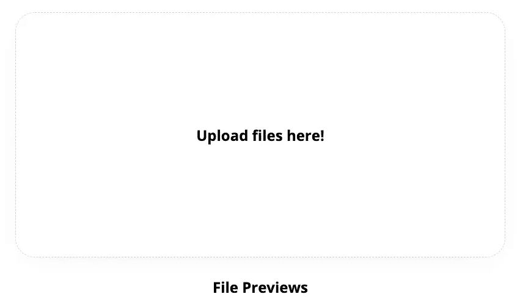
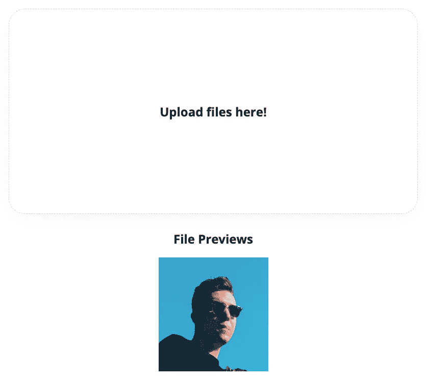

# 使用 React 创建带有预览的拖放上传程序

> 原文：<https://javascript.plainenglish.io/creating-a-drag-and-drop-uploader-with-previews-using-react-aa794972c43e?source=collection_archive---------3----------------------->


an illustration header because every good medium article has one

## 并在这个过程中编写你的第一个定制钩子

有很多图书馆可以为你做这些。为什么你会傻到去重新发明轮子？嗯，第一个原因是你会学到新的东西。第二个原因是，也许你的应用程序有目前的库中没有的特殊需求。也许你需要隐藏的输入，因为性能的原因，你的整个应用依赖于表单而不是有状态的输入。

我们要做 ***定制挂钩。*** 学新东西？大概？嗯，我们将学习一些关于文件列表、文件和上传的新知识。

## 结构和先决条件

你需要知道的只是一些基本的 React、Javascript 和钩子(但是不要担心，我们也可以用类来做这个，钩子只是现在才出现)。

为了创建它，我们需要弄清楚**文件**和**文件列表**是什么。什么是**斑点**以及如何缓存图像以作为预览的斑点。我们需要熟悉 onDrop 和类似的活动。

## 引用自 MDN

> `**File**`接口提供关于文件的信息，并允许网页中的 JavaScript 访问它们的内容。— [MDN](https://developer.mozilla.org/en/docs/Web/API/File)
> 
> 这种类型的对象由 HTML `[<input>](https://developer.mozilla.org/en-US/docs/Web/HTML/Element/input)`元素的`files`属性返回；这允许您访问用`<input type="file">`元素选择的文件列表。它还用于在使用拖放 API 时放入 web 内容的文件列表；关于这个用法的详细信息，请参见`[DataTransfer](https://developer.mozilla.org/en-US/docs/DragDrop/DataTransfer)`对象。— [MDN](https://developer.mozilla.org/en-US/docs/Web/API/FileList)
> 
> 静态方法`**URL.createObjectURL()**`创建一个包含 URL 的`[DOMString](https://developer.mozilla.org/en-US/docs/Web/API/DOMString)`,该 URL 表示参数中给定的对象。URL 的生命周期依赖于创建它的窗口中的`[document](https://developer.mozilla.org/en-US/docs/Web/API/Document)`。新的对象 URL 代表指定的`[File](https://developer.mozilla.org/en-US/docs/Web/API/File)`对象或`[Blob](https://developer.mozilla.org/en-US/docs/Web/API/Blob)`对象。— [MDN](https://developer.mozilla.org/en-US/docs/Web/API/URL/createObjectURL)

专业提示:阅读文档

那不碍事。我们走吧。

# 样式和 DOM 节点

对于样式，我们将使用 scss，我们将制作一个简单的容器，它有一个不透明的绝对背景图像。upload-container 类之上的 over 类，这样我们就可以在用户在容器上放置文件时触发(我们将使用**状态**和 **onDrop** 事件来管理这一点)。

The style at the start of the project

对于 dom，我们需要两个容器。一个用于显示图像，另一个用于用户拖放图像

The dom at the start of the project



this is how it looks like

# 状态和事件:惩罚

这东西要做的是:

1.  确保用户可以点击容器并打开一个对话框
2.  根据道具限制文件最大数量
3.  在图片上传为 blobs 之前查看图片
4.  将文件添加到状态，使用效果将文件传递到道具

## 点击时的输入对话框

这可以说是最容易做到的事情。添加 display: none 文件输入，并在用户单击容器时单击它。将文件添加到 state，但是首先我们必须将文件列表转换为数组。别担心，超级简单。毁掉它。我们需要担心的事件是:

1.  onDrop —文件已被删除(覆盖已完成)
2.  onDragOver —文件正在被丢弃(正在发生覆盖)
3.  onDragLeave —文件消失了(结束了(？))

我们相应地调整状态。

最重要的是，我们防止默认事件动作，因为我们想自己管理整个事情。我们通过调用

```
e.preventDefault()
```

pretty easy, right?

## 斑点预览和*自定义挂钩:推算*

just trust me

定制钩子听起来令人生畏，但实际上很简单。您只需扩展已经建立的 useState 挂钩。我们要做的基本上是，获取文件，并使用 Object.assign 或 mapping 将它们添加到文件中。我将使用 map 方法，因为如果您一直在使用 React，这应该是您的第二天性。

我在做什么？我采用 useState 公开的 setstate 方法并扩展它。我正在获取文件，对它们进行析构，并添加一个预览属性来公开本地 blob 预览。在判断出空值是否是图像后，从数组中删除空值。我也从上传的东西中移除了析构，因为我们正在析构我们的 useBlobs ***自定义钩子*** 中的文件列表。

现在我们的上传组件看起来像这样:

custom hooks. told you so

## onDrop 事件和处理大量文件:报复

现在，对于 onDrop 道具，我们将把它与一个效果混合起来，这个效果将调用道具(如果它存在的话)。对于最大数量的文件，我们将传递一个 prop，但默认为 1。如果 maxFiles 属性大于 1，则将多个属性添加到输入中。

```
<input multiple={maxFiles > 1} />
```

我们的函数声明和 useFiles 挂钩将如下所示:

```
function Upload({ onDrop, maxFiles = 1 });function useFiles({ initialState = [], maxFiles });const [files, setfiles] = useFiles([], maxFiles);
```

让我们创建一个快速函数来删除数组的最后 N 项。

并使用计算的差异属性将其调用到我们的 useFiles 挂钩中。差异是丢弃的文件数量减去最大文件数量。为了方便起见，将析构后的文件列表放入一个新变量中，计算差值，然后使用 URL Blob 魔术。

在我们的 Upload function 函数中，让我们添加一个效果钩子，这样我们就可以调用作为道具传下来的 onDrop 事件(并且 ***总是*** 检查它是否存在)。

我们完事了。

## 图像预览

这将是迄今为止我们要做的最简单的事情！只需映射出文件，添加一个图像节点，并将其源设置为 file.preview 属性。



whos that handsome fella?

# 结论

希望在这整个代码和荣誉的惨败之后，你已经设法弄清楚如何创建定制挂钩，更好地处理事件，并成为一个更好的球员和程序员(**附加提示:不要总是追求三个**)。

check it out for yourself (you have to open the sandbox for it work because of blobs and permissions)

## 外卖:

1.  如果您正在修改事件，请始终阻止事件的默认操作
2.  事情并不像看起来那么难
3.  永远学习
4.  钩子非常简单，编写定制的钩子只能缩短你必须编写的代码，硬拉是困难的


# 社交——跟踪我

我是一名全栈开发者。我举重。我看动漫。我写 JavaScript，我没有斯德哥尔摩综合症。

🔗[网站](https://alekangelov.com)

🔒[领英](https://www.linkedin.com/in/alekangelov/)

🦜 [推特](https://twitter.com/39strife)

图片致谢:[免费赠送](https://freepik.com)