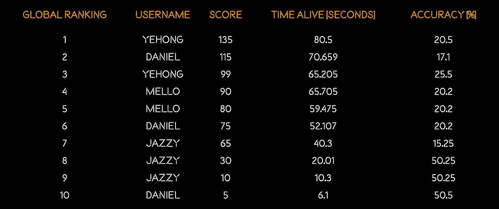
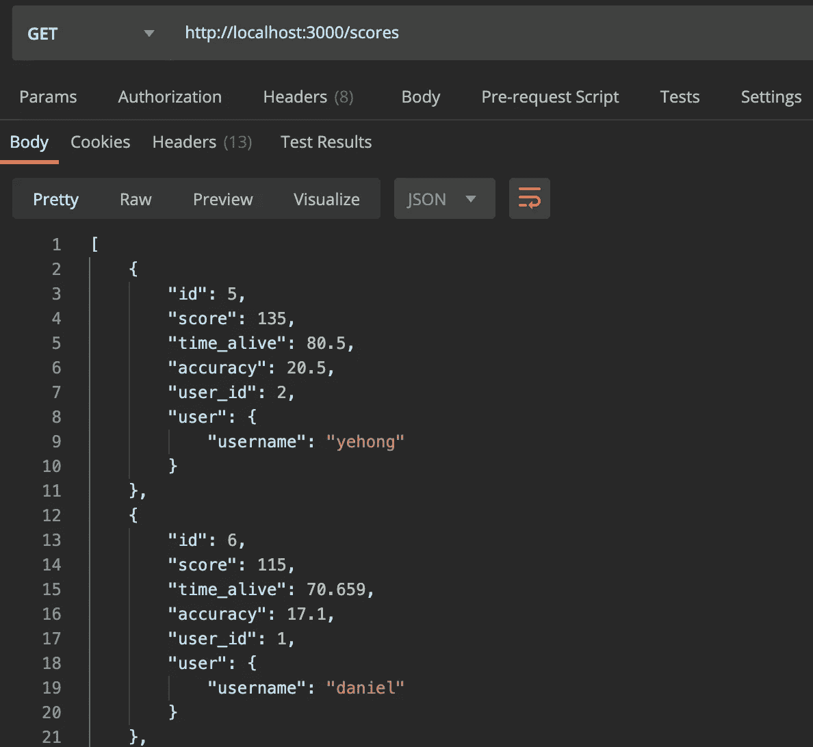
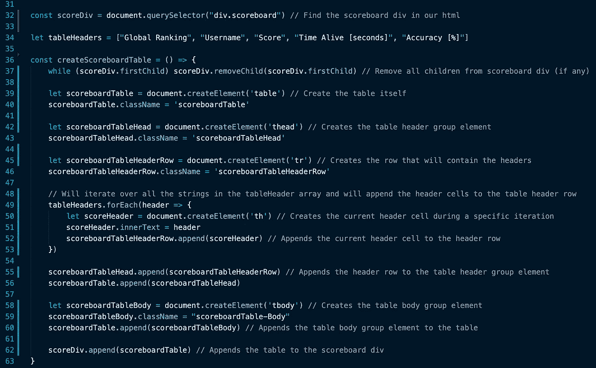
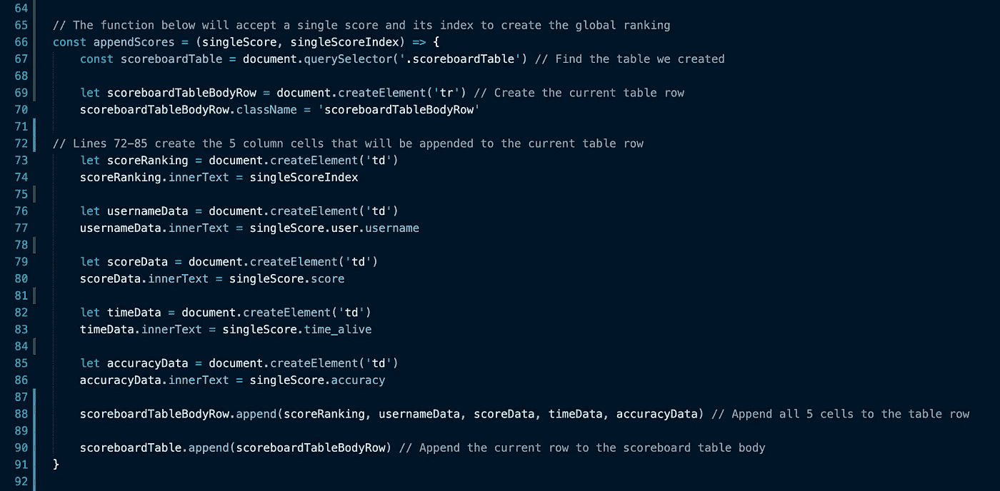
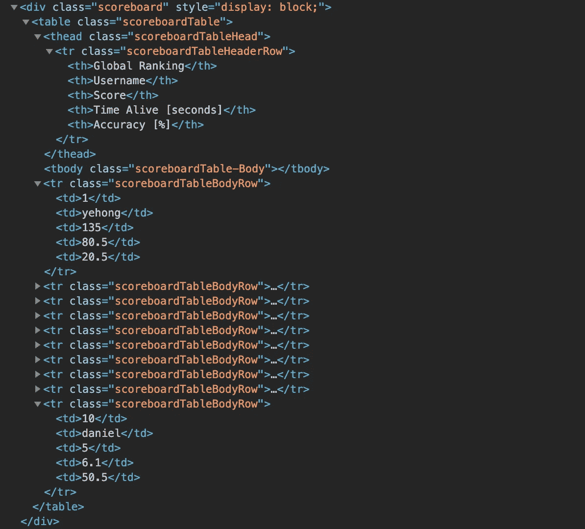
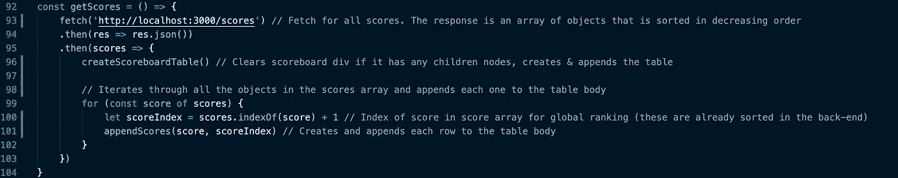

# 用 JavaScript 创建动态 HTML 表格

> 原文：<https://javascript.plainenglish.io/creating-a-dynamic-html-table-through-javascript-f554fba376cf?source=collection_archive---------0----------------------->



本教程将教你如何通过使用 Javascript 和文档对象模型(DOM)操作来创建一个动态 HTML 表格。表格行数和单元格内容将因数据而异。

在本教程中，我将为一个 Javascript 视频游戏创建一个记分牌，数据将来自一个获取请求。您的应用程序的数据源可能不同，但逻辑应该仍然适用。本教程将包括代码截图，网站渲染，以及教程中每一步的完整 HTML。

复制粘贴友好的代码在最后。🔥

这个 HTML 表的数据来自 SQLite 数据库表。行数将根据分数表中记录的数量而变化。



This is an example of the data we will be working with.

**HTML 表格标签:**

一个 HTML 表格由一个`<table>`元素和一个或多个 [< tr >](https://www.w3schools.com/tags/tag_tr.asp) 、 [< th >](https://www.w3schools.com/tags/tag_th.asp) 和 [< td >](https://www.w3schools.com/tags/tag_td.asp) 元素组成。

这个 HTML 表格还将包括可选的 [< thead >](https://www.w3schools.com/tags/tag_thead.asp) 和 [< tbody >](https://www.w3schools.com/tags/tag_tbody.asp) 元素，用于附加的样式选项。

**标签定义:**

标签定义了一个 HTML 表格。

标签`<tr>`定义了一个 HTML 表格中的一行。

标签定义了一个 HTML 表格中的标题单元格。

标签`<td>`定义了一个 HTML 表格中的标准数据单元格。

`<thead>`标签用于对 HTML 表格中的标题内容进行分组。

标签用于将 HTML 表格中的主体内容分组。

我们将通过文档方法[*document . createelement(tagName)*](https://developer.mozilla.org/en-US/docs/Web/API/Document/createElement)创建上面定义的所有标签，并将它们附加到 html 文件中的< div >标签。

您将在代码中看到的大多数“类名”都是出于样式目的，完全是可选的。

CSS 样式将不会被讨论，但它将可供您自己参考和测试。

# **教程:**

将包含我们的表的 [< div >](https://www.w3schools.com/tags/tag_div.asp#:~:text=The%20tag%20defines%20a,inside%20the%20tag!) 如下所示:

```
<div class='scoreboard'></div>
```

**创建表格的步骤:**

*   使用文档方法 [*document.querySelector(选择器)*](https://developer.mozilla.org/en-US/docs/Web/API/Document/querySelector) *找到“记分板”div。*
*   创建一个字符串数组，用于保存您有兴趣显示的数据的标题值。我相信这些更能代表我将要展示的数据，它允许我在括号中包含单位。(这是一个可选步骤，因为您可以使用对象关键字作为标题)

```
let tableHeaders = [“Global Ranking”, “Username”, “Score”, “Time Alive [seconds]”, “Accuracy [%]”]
```

*   创建。

*   创建并将元素追加到表中。此包含第一个元素，上面显示的“tableHeaders”变量中的所有 5 个字符串是各个单元格元素中的值。
*   创建并将元素追加到表中。这将允许我们稍后在分数表中添加对应于每个分数记录的标签。
*   将追加到“记分牌”上。



The function that achieves the steps outlined above.


The rendering of the table (at this point).


HTML for the ‘Scoreboard’ div and the dynamic HTML Table (at this point).

*   用文档方法[*document . query selector(选择器)*](https://developer.mozilla.org/en-US/docs/Web/API/Document/querySelector) *找到我们上面创建的 HTML 表格。*
*   创建代表每个高分的所有表体行。这些将是标签，为表中的每一列保存一个标签。当给定一个 score 对象时，下面的函数将创建一个新行。

传递给下一个函数的 singleScore 对象的示例:

```
singleScore = { "id": 6, "score": 115, "time_alive": 70.659, "accuracy": 17.1, "user_id": 1, "user": { "username": "daniel" }}
```



The function that achieves the steps above.


Rendering of the full table.



Complete HTML for the ‘Scoreboard’ div and the dynamic HTML Table.

最后，我提到这个示例表依赖于获取来接收数据。下面是为“appendScores”函数提供所有单个分数的获取代码:



我希望这篇教程对你有所帮助。如果你有任何问题，请在下面提问。

[下面是我为这个特定表格创建的应用程序的简短视频！](https://youtu.be/d8_MSbqHMVU?t=230)

**代码片段中的所有代码:**

```
const scoreDiv = document.querySelector("div.scoreboard") // Find the scoreboard div in our htmllet tableHeaders = ["Global Ranking", "Username", "Score", "Time Alive [seconds]", "Accuracy [%]"]const createScoreboardTable = () => {while (scoreDiv.firstChild) scoreDiv.removeChild(scoreDiv.firstChild) // Remove all children from scoreboard div (if any)let scoreboardTable = document.createElement('table') // Create the table itselfscoreboardTable.className = 'scoreboardTable'let scoreboardTableHead = document.createElement('thead') // Creates the table header group elementscoreboardTableHead.className = 'scoreboardTableHead'let scoreboardTableHeaderRow = document.createElement('tr') // Creates the row that will contain the headersscoreboardTableHeaderRow.className = 'scoreboardTableHeaderRow'// Will iterate over all the strings in the tableHeader array and will append the header cells to the table header rowtableHeaders.forEach(header => {let scoreHeader = document.createElement('th') // Creates the current header cell during a specific iterationscoreHeader.innerText = headerscoreboardTableHeaderRow.append(scoreHeader) // Appends the current header cell to the header row})scoreboardTableHead.append(scoreboardTableHeaderRow) // Appends the header row to the table header group elementscoreboardTable.append(scoreboardTableHead)let scoreboardTableBody = document.createElement('tbody') // Creates the table body group elementscoreboardTableBody.className = "scoreboardTable-Body"scoreboardTable.append(scoreboardTableBody) // Appends the table body group element to the tablescoreDiv.append(scoreboardTable) // Appends the table to the scoreboard div}// The function below will accept a single score and its index to create the global rankingconst appendScores = (singleScore, singleScoreIndex) => {const scoreboardTable = document.querySelector('.scoreboardTable') // Find the table we createdlet scoreboardTableBodyRow = document.createElement('tr') // Create the current table rowscoreboardTableBodyRow.className = 'scoreboardTableBodyRow'// Lines 72-85 create the 5 column cells that will be appended to the current table rowlet scoreRanking = document.createElement('td')scoreRanking.innerText = singleScoreIndexlet usernameData = document.createElement('td')usernameData.innerText = singleScore.user.usernamelet scoreData = document.createElement('td')scoreData.innerText = singleScore.scorelet timeData = document.createElement('td')timeData.innerText = singleScore.time_alivelet accuracyData = document.createElement('td')accuracyData.innerText = singleScore.accuracyscoreboardTableBodyRow.append(scoreRanking, usernameData, scoreData, timeData, accuracyData) // Append all 5 cells to the table rowscoreboardTable.append(scoreboardTableBodyRow) // Append the current row to the scoreboard table body}const getScores = () => {fetch('http://localhost:3000/scores') // Fetch for all scores. The response is an array of objects that is sorted in decreasing order.then(res => res.json()).then(scores => {createScoreboardTable() // Clears scoreboard div if it has any children nodes, creates & appends the table// Iterates through all the objects in the scores array and appends each one to the table bodyfor (const score of scores) {let scoreIndex = scores.indexOf(score) + 1 // Index of score in score array for global ranking (these are already sorted in the back-end)appendScores(score, scoreIndex) // Creates and appends each row to the table body}})}
```

**本教程中表格的所有 CSS 样式:**

```
.scoreboardTable {padding: 0;margin: auto;border-collapse: collapse;width: 80%;text-align: center;color: whitesmoke;}.scoreboardTableHeaderRow {color: darkorange;font-weight: bold;height: 50px;}.scoreboardTableBodyRow:nth-child(odd){background-color: rgba(128, 128, 128, 0.050);}#latestUserScore {background-color: crimson;}.scoreboardTableBodyRow:hover{background-color: darkorange;}.scoreboardTable tr td {height: 25px;}
```