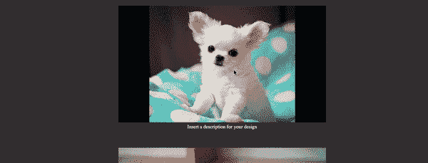
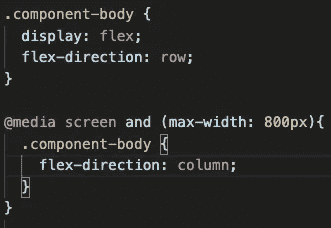
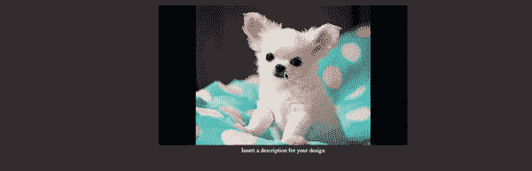
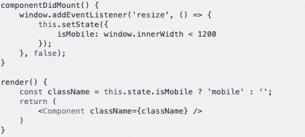

# 使用 React 创建动态响应布局

> 原文：<https://javascript.plainenglish.io/creating-a-dynamic-responsive-layout-with-react-e941ac9c7f2b?source=collection_archive---------0----------------------->

Photo by [Domenico Loia](https://unsplash.com/@domenicoloia?utm_source=unsplash&utm_medium=referral&utm_content=creditCopyText) on [Unsplash](https://unsplash.com/s/photos/responsive-design?utm_source=unsplash&utm_medium=referral&utm_content=creditCopyText)

响应式设计通常用于创建桌面和移动友好的网站(以及介于两者之间的任何东西！)，这也是我很久以来一直想学的 web 开发的一个方面，但是一直没有机会去学。我最近发现自己有机会第一次尝试它，我想我应该分享一下结果。

在继续之前，我想解释一下我所说的“动态响应布局”是什么意思。我将在本文中描述的设计是一个动态的响应式设计，它使用额外的 JavaScript 逻辑根据屏幕大小有条件地呈现不同的 HTML 结构，然后*和*使用响应式设计来改变该结构的 CSS 属性。其结果是一个容易扩展的，额外的设计自由度，让你的网站布局更有创意，而不牺牲移动用户所需的简洁设计。

This is my finished layout test

因此，事实证明，响应式设计的基础非常简单，我的项目简化版只花了大约 30 秒，这要归功于[这篇简单易懂的文章](https://internetingishard.com/html-and-css/responsive-design/)。我想要实现的最终版本只是稍微复杂了一点，但是要想出一个我满意的解决方案需要更多的思考和创造力。因此，首先我将进入我的工作，和我的设计的简单版本。

在我的项目中，我有一个保存状态对象数组的组件。每个对象都有一个图像、描述和一个唯一的 id。当呈现组件时，它将这些对象映射到另一个组件，我显式地创建该组件来显示它们的信息。点击这些图像中的任何一个，就会在图像旁边弹出描述，就像这样:

I used chihuahuas and gibberish to test my code, because why not?

我知道，我还应该在让文本出现和消失时添加一个过渡，但这还不是我的重点！我所关注的是，让描述出现在大屏幕上的图片旁边，就像这样，然后当网站在小屏幕上被浏览时，出现在图片下面。

为了实现这一点，我使用了一个名为“媒体查询”的 CSS 特性，根据所用屏幕的大小，有条件地改变应用于图像的 CSS。使用媒体查询非常简单，如下所示:

`@media screen and (max-width: 800px){ *your new CSS code here* }`

这到底是怎么回事？在我的 CSS 文件中的一个新行上，我使用关键字“@media”后跟“screen”来调用查询，以指定我正在使用的“媒体类型”(更多关于媒体类型的信息[在这里](https://developer.mozilla.org/en-US/docs/Web/CSS/Media_Queries/Using_media_queries)！).在括号中，我指定了我想要使用什么参数来有条件地改变我的元素的 CSS 属性。在这种情况下，参数是“max-width ”,后跟我希望显示原始 CSS 的最大尺寸屏幕。在花括号中，您只需写出想要应用于较小屏幕的 CSS 属性。

对于这个布局，这意味着我将应用于图像和文本的伸缩方向从“行”改为“列”。下面是它的一个简化版本:

The original CSS up top, followed by the altered version for smaller screens

下面是这段代码的结果:

很酷，对吧？但是，这是我想要的简单版本。在最终版本中，我希望当你向下滚动页面时，我的站点的桌面布局能够在图片的左侧和右侧交替弹出文本。有几种方法可以做到这一点，但是我知道每个对象的 id 都是按顺序排列的，所以我选择在显示组件中使用一个条件语句使它们交替排列，该条件语句检查每个 id 的值，然后在基于该 id 的图像之前或之后呈现描述。我的代码看起来有点像这样:

`if(this.props.id % 2 === 0) {
return ( 
 
 )
} else {
return (
 
 ) }`

这对于较大的屏幕非常有用，但是当媒体查询接管并将 flex-direction 切换到 column 时，一半的描述呈现在图像下方，另一半呈现在图像上方，导致布局混乱且不一致。我需要做的最后一个修正是在浏览器窗口中添加一个事件监听器来检查屏幕的大小，然后有条件地更新组件的状态。在 Google 上快速搜索了一下如何编写一个调整大小事件监听器，我碰巧找到了我所需要的解决方案:

This code was written by Stack Overflow user Chase DeAnda, and posted [here](https://stackoverflow.com/questions/48669646/how-to-add-or-remove-a-classname-when-screen-size-change-in-react)

以这个建议为灵感，我在 if-else 语句的返回中修改了三元组，并将现有的条件嵌套在其中。

瞧啊。最终的结果是一个组件，它在较大的屏幕上交替使用文本-图像布局，但在较小的屏幕上切换到干净一致的布局，如本文顶部的 Gif 所示。

非常感谢您的阅读！

[响应式设计教程](https://internetingishard.com/html-and-css/responsive-design/)

[媒体查询](https://developer.mozilla.org/en-US/docs/Web/CSS/Media_Queries/Using_media_queries)