# 使用 React 创建在页面中查找滚动功能🤘

> 原文：<https://javascript.plainenglish.io/creating-a-find-in-page-scroll-feature-with-react-32983ad90138?source=collection_archive---------7----------------------->

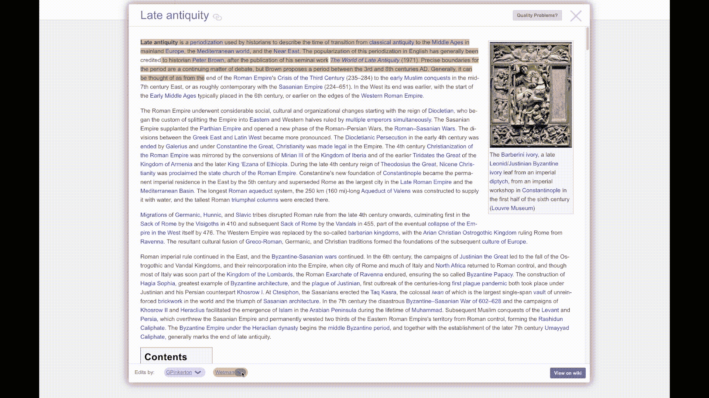

最近，我一直在从事维基百科的一个开源分支，名为 [WikiEdu](https://wikiedu.org/) 。我决定创建一个滚动特性，滚动到编辑对文章所做的修改。

文章显示在浮动窗口中，编辑器列在底部。如果用户对文章进行了活动的修订，它们将与修订一起突出显示。

这是一个需要解决的有趣问题，因为我必须在文章呈现后创建滚动功能，滚动事件将由当前修订的位置决定。在这篇文章中，我将解释我是如何解决这个问题的。

## **定义问题:**

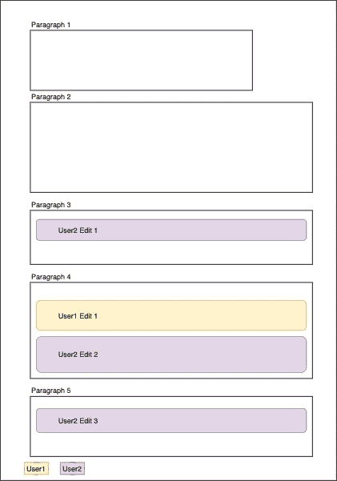

基本上这个功能应该如何工作就像浏览器中的页面查找功能一样。使用“在页面中查找”功能，您可以搜索某个单词或短语，如果该单词或短语包含在页面中，您可以通过单击向上或向下箭头滚动到该单词或短语(见下图)。

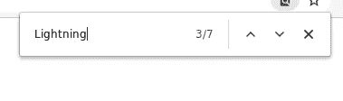

find_in_page

然而，我的版本有一个额外的复杂性，因为可能有多个搜索词，这取决于进行修订的编辑的数量。

**功能**:

1.  单击时，页面将滚动到文章查看器顶部选定用户所做的第一次编辑。

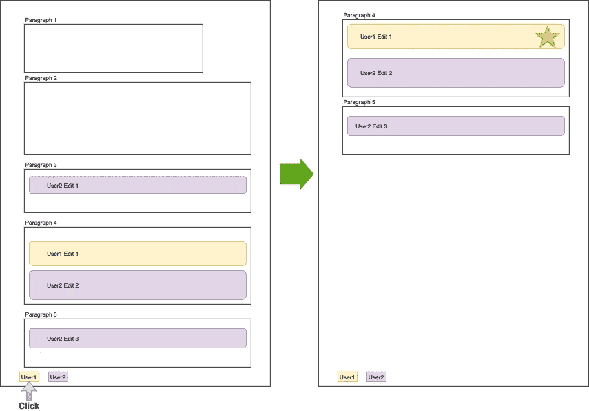

1

2.下一个滚动事件将找到一个视图之外的修订，并将其滚动到页面底部。这有助于保持用户对文章的心理模型。

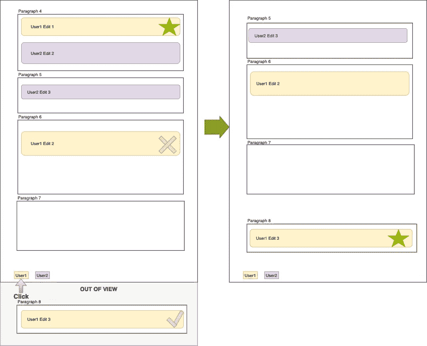

2

3.如果用户从先前选择的编辑器中选择了不同的编辑器，则该特征足够智能地滚动到当前编辑下方的新编辑器的最近编辑。如果在当前编辑下没有编辑，则滚动到编辑者进行的第一次编辑。

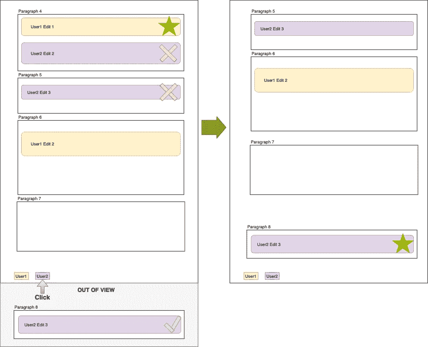

3

**或……**

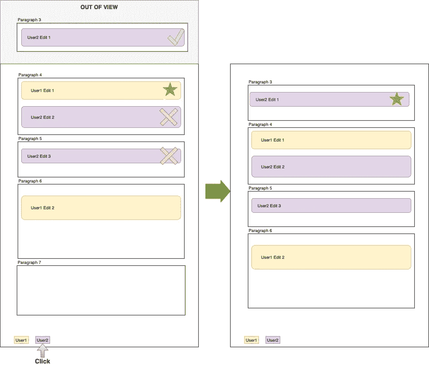

3

4.如果用户一直点击到最后一次编辑，那么页面将滚动回第一次编辑。

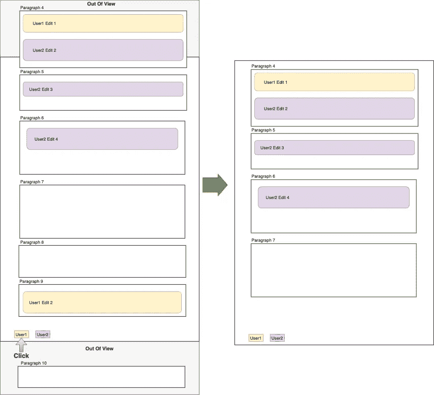

4

## **收集并存储滚动数据:**

所以首先要做的是找到包含编辑修改的段落。

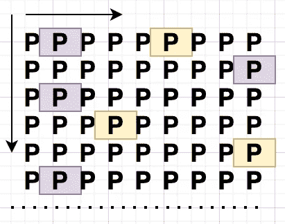

这篇文章是通过 MediaWiki 的 API 检索的。我试图找到一种方法，在数据呈现之前以字符串形式收集数据。这将使得运行时间更快。然而，没有一种体面的方式来做到这一点。文章呈现后，我不得不满足于用 querySelector 抓取段落。

有了查询结果，我就可以进行搜索，找到包含与特定编辑器相关的突出显示文本的段落。然后将该段落添加到包含其他信息(如段落索引和当前段落的位置)的数据结构中。

最终结果是这样的:

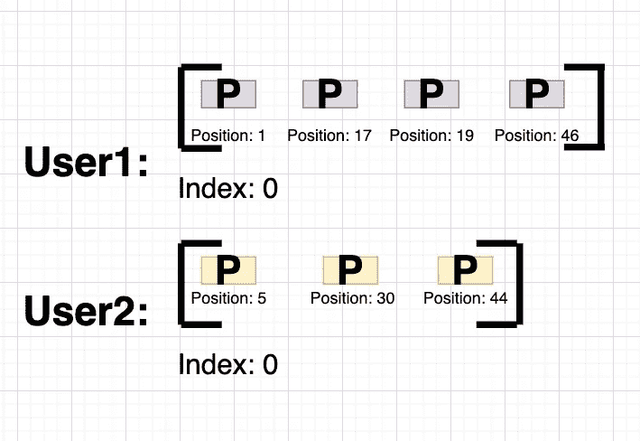

“索引”键用于跟踪已经滚动到的当前段落。单击编辑器的按钮将使索引增加 1。

实际代码:

## **滚动功能:**

对于滚动，我决定使用 [react-scroll](https://www.npmjs.com/package/react-scroll) 库。有一些内置的方法，比如 Element.scroll()和 Element.scrollIntoView()，但是 react-scroll 提供了更多的灵活性和控制，所以我选择了它。

一旦收集了用户的数据，我需要编写一个函数来确定下一步滚动到哪里。这个功能可以分为三个部分。

**如果用户从一个编辑器切换到另一个编辑器:**

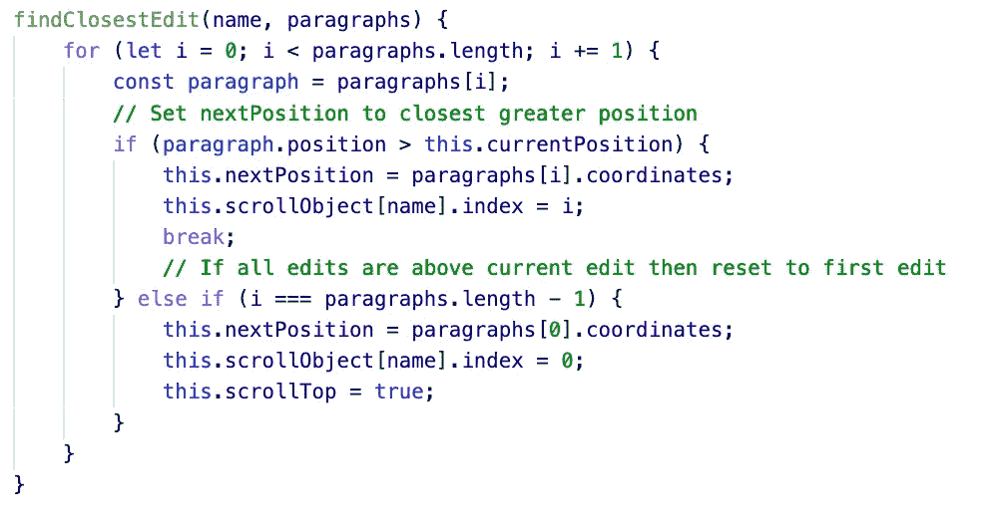

**如果看到下一个位置:**

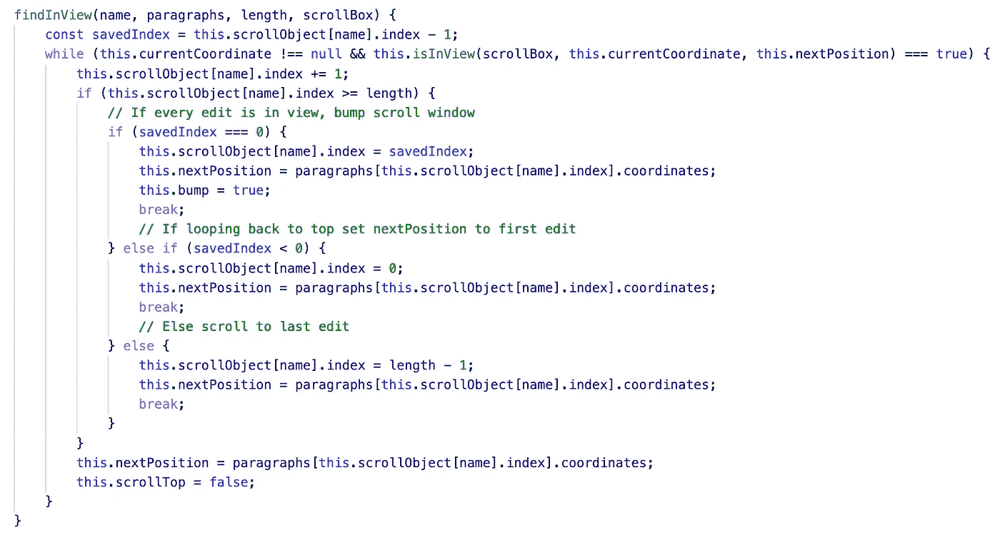

**如果距当前位置的距离小于最小滚动距离:**

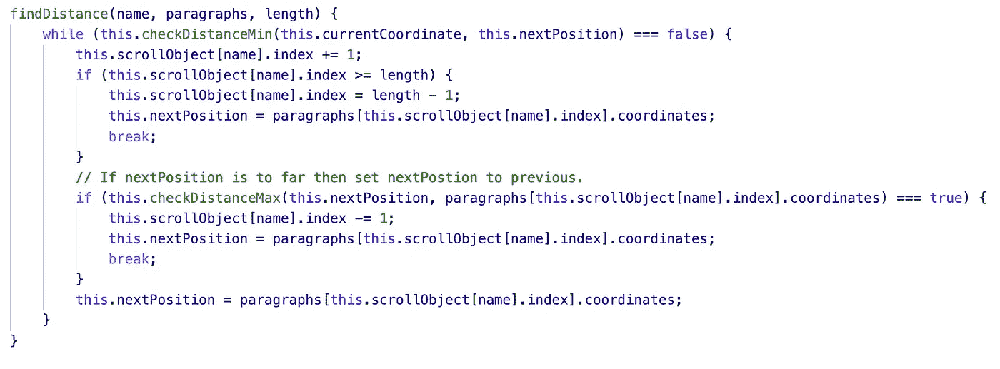

**滚动到**:

下面是最后一个功能！

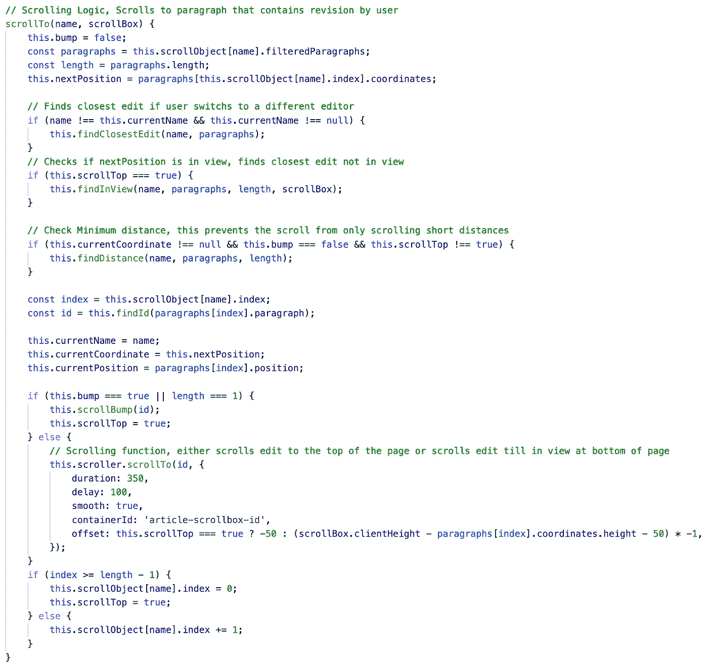

最终结果！

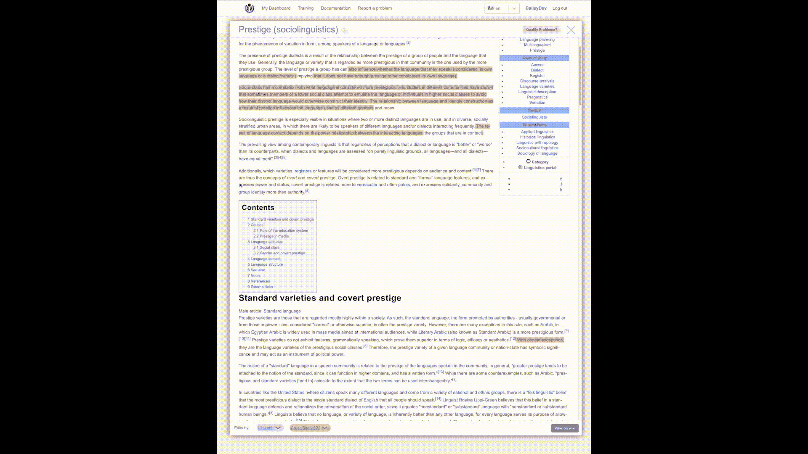

Main Scroll

我真的很喜欢构建这个功能，并且对结果非常满意！希望这篇文章对你有用。随意伸手！

喜欢这篇文章吗？如果有，通过 [**订阅解码，我们的 YouTube 频道**](https://www.youtube.com/channel/UCtipWUghju290NWcn8jhyAw) **获取更多类似内容！**