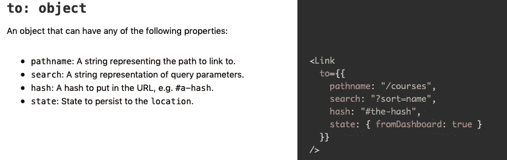
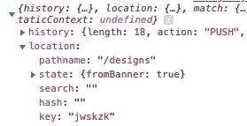

# 使用反应路由器创建哈希锚链接效果

> 原文：<https://javascript.plainenglish.io/creating-a-hash-anchor-link-effect-with-react-router-a63dcb1a9b0e?source=collection_archive---------1----------------------->


Photo by [Ferenc Almasi](https://unsplash.com/@flowforfrank?utm_source=unsplash&utm_medium=referral&utm_content=creditCopyText) on [Unsplash](https://unsplash.com/s/photos/react?utm_source=unsplash&utm_medium=referral&utm_content=creditCopyText)

最近，当我为一个客户开发一个小型的 React 应用程序时，我被要求创建一个“粘性横幅”，出现在网站的每一页上。该横幅将包含一个链接，将用户从网站的任何地方带到特定页面的特定部分。在非反应应用程序中，像这样的链接可以很容易地使用和锚元素以及 href 属性来创建。然而，在 React 中，内部导航不能用锚标签来处理，这让我不得不寻找另一种方式。

在谷歌上快速搜索是否有一个普遍接受的解决方案后，我发现大多数人似乎都满足于使用额外的库，比如 reactor-roll，但我想找到一种方法来使用 reactor-router 的内置功能来为我工作。这是我发现的！

为此，我使用了反应路由器的链接组件。我使用导航栏的导航链接来利用它的样式选项，但是链接组件有额外的选项，非常适合这种情况。具体来说，“to: object”选项，如[反应训练](https://reacttraining.com/react-router/web/api/Link/to-function)中所述。



[https://reacttraining.com/react-router/web/api/Link/to-function](https://reacttraining.com/react-router/web/api/Link/to-function)

现在，看看这些选项，您可能会认为我会只使用 hash 选项，但据我所知，hash 选项仅在链接到已经加载的页面部分时有效，而不适用于链接到完全不同的组件。相反，使这个工作的关键是使用状态！一旦我知道有一种方法可以通过我的 Link 组件传递状态，我就知道在新组件中必须有一种方法可以访问该状态。网站上给出的例子也是如何最好地利用这一发现的完美线索。以下是我对链接组件的实现:

```
<div className='banner' onClick={this.handleScroll} >                  
  <Link className='banner-link' to={{                             
    pathname: '/designs',                    
      state: {                        
        fromBanner: true                    
      }                
    }}                
  >                    
    ULTIMATE &nbsp; WEDDING &nbsp; PACKAGE                 
  </Link>            
</div>
```

通过状态`fromBanner: true`后，我需要做的就是检查我链接的组件中的状态，然后从那里采取适当的动作。然而，即使我发送“状态”，这个状态也不会是我链接的组件的状态的一部分。相反，该状态将位于组件的道具中。在组件中添加一个`console.log(this.props)`mount 揭示了这个有趣的信息:



如果我在没有点击链接的情况下加载这个组件，该状态将被列为“空”，但是有了链接，该状态将显示我使用上面的 to:对象传递的内容。就这样，几乎一切都准备好了。从这里开始，我只需要做两件事:

1.  在组件中运行一个检查安装以检查`this.props.location.state`，然后滚动到适当的位置，如果它回来了
2.  在链接中写入额外的逻辑，这样，如果从目标组件中单击链接，它仍会滚动到该位置

第一部分需要添加一个对我想要滚动到的元素的引用。我通过编写`targetRef=React.CreateRef()`在组件顶部创建了 ref，然后将该 ref 附加到我想要滚动到的元素:`<div ref={ref => {this.targetRef = ref}} >` *

最后，我通过在我的目标组件的 ComponentDidMount 中调用这个函数将 ref 付诸实施:

```
scrollToTarget = () => {
  setTimeout(() => {
    this.targetRef.scrollIntoView({ behavior: 'smooth' })             
  }, 500);    
}
// setTimeout is optional, but instantly scrolling can be jarring
```

对于第二部分，我做了两件事。首先，当从目标组件调用它时，我将 setTimeout 函数传递给 Banner 组件。其次，我向链接的父元素添加了一个 onClick 函数，它检查我在上一步中传递的属性。如果道具存在，它运行函数滚动到目标 ref。

就是这样！下面是我用于横幅组件的代码，后面是目标组件的代码。感谢您的阅读，祝您编码愉快！

[反应训练](https://reacttraining.com/react-router/web/api/Link/to-function)

[反应过来参提示](https://github.com/filippoitaliano/react-snorty-tips/blob/master/react/anchor-link.md)

[参考文献和 DOM](https://reactjs.org/docs/refs-and-the-dom.html)