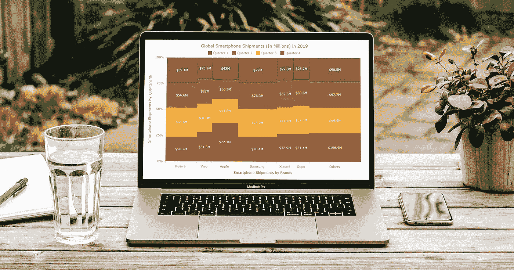
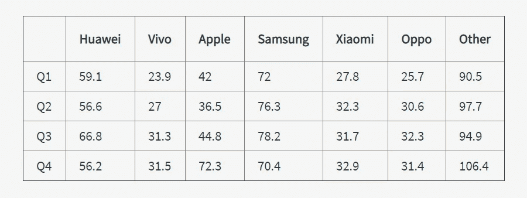
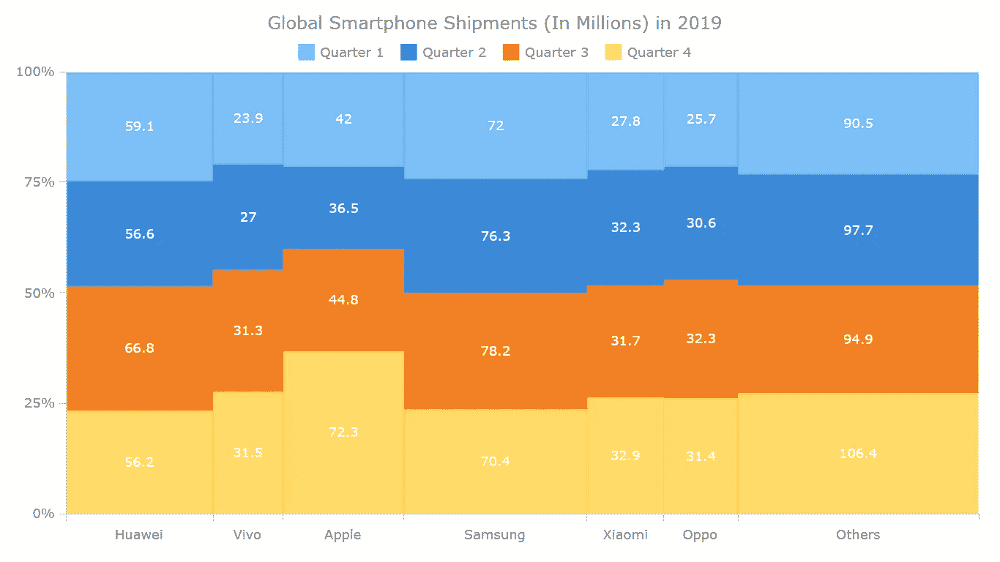
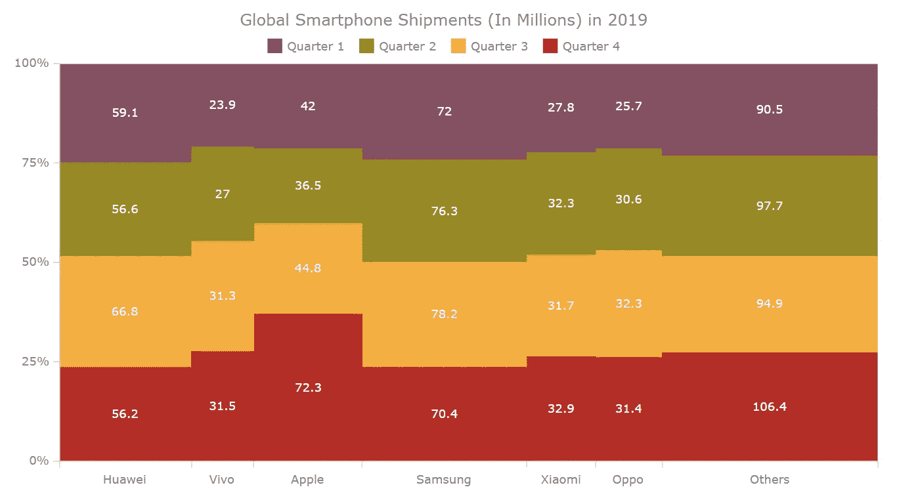
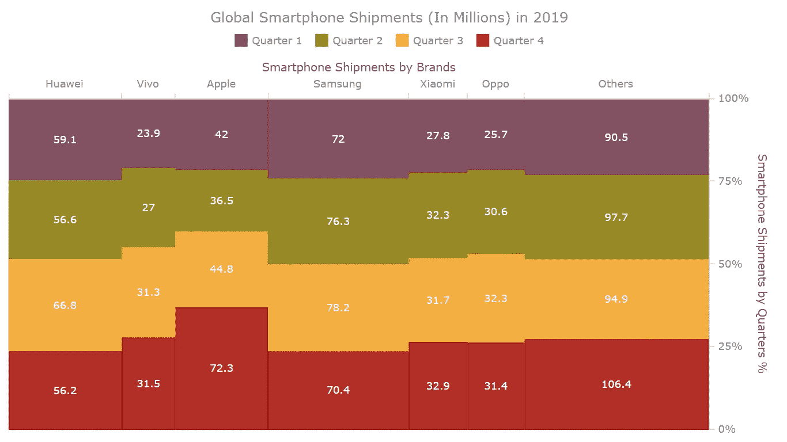
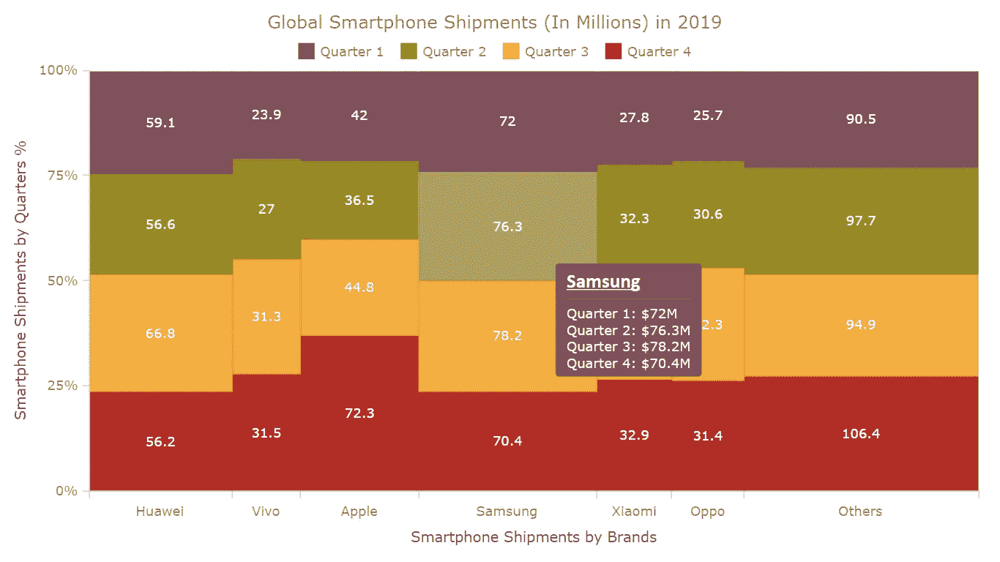
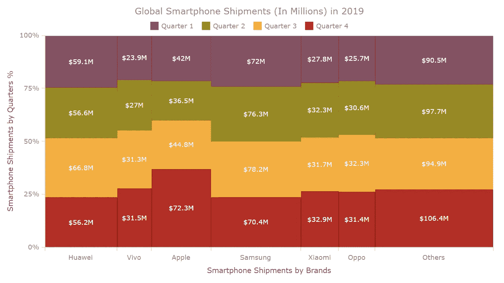

# 用 JavaScript 创建 Marimekko 图表

> 原文：<https://javascript.plainenglish.io/creating-a-marimekko-chart-with-javascript-42e1f65fd841?source=collection_archive---------15----------------------->



您想知道如何使用 JavaScript 为基于 HTML5 的应用程序和网页轻松创建交互式 Marimekko 图表吗？如果是的话，你已经走上了学习的最佳道路。

Marimekko 图表也称为 [Mekko 图表](https://www.anychart.com/chartopedia/chart-type/mekko-chart/)和市场图，Marimekko 图表在其 Y 轴上显示从 0%到 100%不等的数值。最令人兴奋的部分在于它们的 X 轴，它表示类别中值的总和。每个类别沿 X 轴的宽度描绘了整个类别对所有数据的贡献。简而言之，这是一种可视化分类数据的堆积图。尽管如此，Y 轴和 X 轴通过确定每个线段的宽度和高度在百分比范围内变化。

你是智能手机爱好者吗，有兴趣按季度和供应商查看 2019 年全球智能手机出货量吗？然后，特别要遵循本教程，因为我们要使用简单的 JS 图表编码技术，在一个优雅的 Marimekko 图中可视化这些市场数据。

# 如何建立一个基本的 JS Marimekko 图表

在 JavaScript 图表中可视化数据的一般顺序由以下简单的四个步骤组成，构建 JS Marimekko 图表也不例外:

1.  创建一个包含显示图表的容器的 HTML 页面。
2.  连接所有需要的脚本。
3.  加载您需要在图表中可视化的数据。
4.  最后，编写 JS 图表代码。

现在，让我们深入这些步骤来绘制我们漂亮的 Marimekko 图表。

# 第一步。创建 HTML 页面

第一步是建立一个基本的 HTML 页面来放置 Marimekko 图表。

```
<!DOCTYPE html>
<html>
  <head>
    <title>My Marimekko Chart Example</title>
    <style>
      html, body, #container {
        width: 100%;
        height: 100%;
        margin: 0;
        padding: 0;
      }
    </style>
  </head>
  <body>
    <div id="container"></div>
 ***// Marimekko chart code goes here***  </body>
</html>
```

上面开发的 HTML 页面由两个主要部分组成，标题(在`<head></head>`标签之间)和页面主体(在`<body></body>`标签之间)。在标题部分，我们设置了 HTML 页面标题(在`<title></title>`标签之间)和 CSS 规则(在`<style></style>`标签之间)来管理`container`元素的外观。

id 为`container`的 body 部分中的`div`元素是用于放置 Marimekko 图表的块。因为我希望图形出现在整个 HTML 页面上，所以我将容器元素的宽度和高度字段设置为 100%。因此图表将显示在整个页面上。

# 第二步。连接所有需要的脚本

接下来，我们应该连接构建 Marimekko 图表所需的所有 JavaScript 脚本。

一般来说，构建 Marimekko 或基本上任何其他图表的这些简单步骤对于所有 JavaScript 图表库都是相同的。在本教程中，我将以 [AnyChart](https://www.anychart.com) 为例。这是一个流行的灵活的 JS 库，用于交互式数据可视化，它有很棒的[文档](https://docs.anychart.com)和 [API 参考](https://api.anychart.com)，以及大量的[演示](https://www.anychart.com/products/anychart/gallery/)，因此即使对于初学者来说，它看起来也很容易上手。

AnyChart 有一个模块化系统，这意味着您不需要整个库，并且可以只连接那些您实际需要的图表类型和功能。通过这种方式，在您的网页上运行的 JavaScript 代码的大小显著减小。这对性能总是有好处的。因此，在我们的例子中应该使用“base”和“mekko”模块来表示 Marimekko 图表中的数据。它们将在`<script></script>`标签中的`<head></head>`部分被引用。

```
<script src="https://cdn.anychart.com/releases/8.9.0/js/anychart-base.min.js"></script>
<script src="https://cdn.anychart.com/releases/8.9.0/js/anychart-mekko.min.js"></script>
```

构建 Marimekko 图表所需的 JavaScript 代码应该写在 HTML 页面的`<body></body>`标签之间。

下面是新修改后的代码外观。是不是很酷？继续读，伙计们。我们正接近最激动人心的部分。

```
<!DOCTYPE html>
<html>
  <head>
    <title>My Marimekko Chart Example</title>
    <script src="https://cdn.anychart.com/releases/8.9.0/js/anychart-base.min.js"></script>
    <script src="https://cdn.anychart.com/releases/8.9.0/js/anychart-mekko.min.js"></script>
    <style>
      html, body, #container {
        width: 100%;
        height: 100%;
        margin: 0;
        padding: 0;
      }
    </style>
  </head>
  <body>
    <div id="container"></div>
    <script>
 ***// Marimekko chart code goes here***
    </script>
  </body>
</html>
```

# 第三步。加载想要可视化的数据

如本教程开头所述，Marimekko 属于 2D 堆积图系列，但它通过不同的列宽展示了额外的数据维度。这种图表类型被广泛用于解释销售数据和进行市场分析，但请确保您根据自己的需求选择了合适的数据。

你好奇你最喜欢的智能手机品牌在 2019 年的全球出货量吗？等等，让我们更深入地观察每季度的出货量，这样数据就能适合 Marimekko 图表。

在目前的情况下，Marimekko 图表将用于说明 2019 年季度智能手机出货量(以百万计)排名前六的品牌。以下是我们将使用的数据集。(资料来源: [IDC](https://www.idc.com) 。)



Mekko graphics 的奇妙之处在于，两个轴都以百分比表示数据，但您只需输入实际数据，图表就会自动计算所有数据。

我们将移动运输数据转换成一个特定的 JavaScript 对象，如下所示。它将数据头设置、标题和数据本身保存为数组的数组。

X 轴包含每个智能手机品牌的总出货量，而 Y 轴用于按季度读取每个智能手机品牌的出货量百分比。

以下是我们将使用的数据集。下面 JavaScript 对象的`header`设置用于设置每个智能手机生产商品牌的季度明细。因此，我们将看到季度关系。

```
var data = {
  title: 'Global Smartphone Shipments (In Millions) in 2019, quarterly',
  header: ['Name', 'Quarter 1', 'Quarter 2', 'Quarter 3', 'Quarter 4'],
  rows: [
    ['Huawei', 59.1,56.6,66.8,56.2],
    ['Vivo', 23.9,27,31.3,31.5],
    ['Apple', 42,36.5,44.8,72.3],
    ['Samsung', 72,76.3,78.2,70.4],
    ['Xiaomi', 27.8,32.3,31.7,32.9],
    ['Oppo', 25.7,30.6,32.3,31.4],
    ['Others', 90.5,97.7,94.9,106.4],
  ]
};
```

# 第四步。编写 JS Marimekko 图表代码

一旦所有的准备工作都完成了，我们就可以进入最后一部分来展示最期待的 Marimekko 图了。负责显示 Marimekko 图表的整个 JavaScript 图表代码必须插入到写在`<script>`标签中的`anychart.onDocumentReady()`函数中。顾名思义，它会一直等到页面准备好显示数据。

```
<script>
  anychart.onDocumentReady(function() {
 ***// The entire JavaScript code of the Marimekko chart
    // will be here***
  });
</script>
```

然后，使用步骤 3 中的代码生成需要提供给 Mekko 图表的数据。

```
var data = {
  title: 'Global Smartphone Shipments (In Millions) in 2019, quarterly',
  header: ['Name', 'Quarter 1', 'Quarter 2', 'Quarter 3', 'Quarter 4'],
  rows: [
    ['Huawei', 59.1,56.6,66.8,56.2],
    ['Vivo', 23.9,27,31.3,31.5],
    ['Apple', 42,36.5,44.8,72.3],
    ['Samsung', 72,76.3,78.2,70.4],
    ['Xiaomi', 27.8,32.3,31.7,32.9],
    ['Oppo', 25.7,30.6,32.3,31.4],
    ['Others', 90.5,97.7,94.9,106.4],
  ]
};
```

下一步是指定 JS 图表类型。在这种情况下，我们应该使用`mekko`图表，并向它提供要在 Marimekko 图表中可视化的数据。

```
***// create a mekko (marimekko) chart***
var chart = anychart.mekko();
***// set the chart data***
chart.data(data);
```

让我们启用图表的图例，如下所示。

```
***// enable the chart legend***
chart.legend(true);
```

最后，在容器中绘制 Marimekko 图表的命令:

```
***// set the chart container id***
chart.container('container');
***// draw the resulting marimekko chart***
chart.draw();
```

我们期待已久的东西来了。(见 [AnyChart 游乐场](https://playground.anychart.com/xZ1hInAb/)上的这张基本 Marimekko 图。)



上面的基本交互式 HTML5 Marimekko 图表的完整代码如下。

```
<!DOCTYPE html>
<html>
  <head>
    <title>My Marimekko Chart Example</title>
    <script src="https://cdn.anychart.com/releases/8.9.0/js/anychart-base.min.js"></script>
    <script src="https://cdn.anychart.com/releases/8.9.0/js/anychart-mekko.min.js"></script>
    <style>
      html, body, #container {
        width: 100%;
        height: 100%;
        margin: 0;
        padding: 0;
      }
    </style>
  </head>
  <body>
    <div id="container">
    <script>anychart.onDocumentReady(function () { ***// create data***  var data = {
    title: 'Global Smartphone Shipments (In Millions) in 2019',
    header: ['Name', 'Quarter 1', 'Quarter 2', 'Quarter 3', 'Quarter 4'],
    rows: [
      ['Huawei', 59.1,56.6,66.8,56.2],
      ['Vivo', 23.9,27,31.3,31.5],
      ['Apple', 42,36.5,44.8,72.3],
      ['Samsung', 72,76.3,78.2,70.4],
      ['Xiaomi', 27.8,32.3,31.7,32.9],
      ['Oppo', 25.7,30.6,32.3,31.4],
      ['Others', 90.5,97.7,94.9,106.4],
    ]
  }; ***// create a mekko (marimekko) chart***  var chart = anychart.mekko(); ***// set the chart data***  chart.data(data); ***// enable the chart legend***  chart.legend(true); ***// set the chart container id***  chart.container('container'); ***// draw the resulting marimekko chart***  chart.draw();}); </script>
  </body>
</html>
```

# 自定义 JS Marimekko 图表

嗯，这一节是锦上添花。AnyChart 中有大量的[文档资源](https://docs.anychart.com/Basic_Charts/Marimekko_Chart/Mekko_Chart)，您可以从中获得深入的知识来改进、修改和定制生成的图表。要获得灵感，请查看[演示库](https://www.anychart.com/products/anychart/gallery/Mekko_(Marimekko)_and_Mosaic_Charts/)。

让我们尝试修改我们的 JavaScript Marimekko 图表，让它看起来更优雅。

# 使用调色板更改图表颜色

Marimekko 图表的颜色可以使用调色板选项自定义。参考[本手册](https://docs.anychart.com/Appearance_Settings/Palettes)了解更多关于 AnyChart 调色板的详细信息。在下面的例子中，我们应用了葡萄酒调色板。还有更多预建的调色板，等待着你。

```
***// apply a palette for coloring***
chart.palette(anychart.palettes.wines);
```

图表用新颜色看起来是不是很方便？(见 [AnyChart 游乐场](https://playground.anychart.com/OVq82Lgy/)。)



# 格式化图表坐标轴

以下附加代码用于[通过添加标题和改变轴的方向来格式化轴](https://docs.anychart.com/Axes_and_Grids/Axis_Basics)。

下面是包含轴标题的代码:

```
***// set the x-axis title*** chart.xAxis().title('Smartphone Shipments by Brands');
***// set the y-axis title*** chart.yAxis().title('Smartphone Shipments by Quarters %');
```

Y 轴的方向可以是左或右。默认值为左。X 轴的方向可以设置为顶部或底部，默认情况下设置为底部。根据您的兴趣配置它们。两个轴的方向发生了以下变化。出于演示目的，X 轴和 Y 轴的方向将设置为顶部和右侧。

```
***// set the x-axis orientation*** chart.xAxis().orientation("top");
***// set the y-axis orientation*** chart.yAxis().orientation("right");
```

图表用坐标轴标题看起来可读性更好。(见 [AnyChart 游乐场](https://playground.anychart.com/0mJHN97o/)。)



从下一个示例开始，Marimekko 图表坐标轴的方向恢复为默认外观。

# 格式化图表工具提示

工具提示通常是隐藏的，但是当鼠标悬停在图表的点上时，它们会变得可见。这可用于显示额外的有用信息。

作为第一步，让我们生成悬停时需要显示的信息。根据下面的代码片段，我们显示了`seriesName`(季度)和`value`(相应季度的装运量，单位为百万美元)。

```
***// customize the tooltip format*** chart.tooltip().format('{%seriesName}: ${%Value}M');
```

“联合”显示模式有助于同时显示所有季度的数据。

```
***// set the tooltip display mode*** chart.tooltip().displayMode("union"); 
```

下面是对 Marimekko 图表工具提示标题的视觉外观进行的另一个简单修改。我们可以改变字体大小、背景外观和字体粗细，如下所示。

```
***// customize the tooltip title*** var title = chart.tooltip().title();
title.fontFamily("Calibri");
title.fontDecoration("underline");
title.fontWeight(700);
title.fontSize(18);
```

我们基于 JS 的 Marimekko 图表似乎变得更好，可读性更强。(见 [AnyChart 游乐场](https://playground.anychart.com/nHEAdkRg/)。)



# 格式化图表标签设置

标签是可以与图表上的点一起显示的文本框。标签通常表示每个点包含的信息。让我们配置这个 Marimekko 图表中的标签，添加以百万美元显示的每个季度的出货量值。

```
***// set the chart labels settings*** chart.labels().format('${%Value}M');
```

最后，这是我们的交互式 Marimekko 图表在按照上面的建议进行相关定制后的样子。(见 [AnyChart 游乐场](https://playground.anychart.com/XluPu7xv/)。)



新定制的高级 Marimekko 图表看起来比最初的可视化更具信息量和吸引力。你可以用你的创意来展示更多细节。

根据最终确定的 Marimekko 图表，三星是 2019 年全球领先的智能手机供应商。但是要注意，三星！华为好像很快就要挑战你了。你有没有注意到苹果在第四季度表现异常出色，击败了所有竞争对手？这一杰出成就背后的成功故事是 iPhone 11 系列的推出，它吸引了全球许多人的目光。

玩你的数据吧，伙计们，因为它们正等着为你揭示令人兴奋的信息。

以下是本教程中最终 Marimekko 图表的完整 HTML 代码:

```
<!DOCTYPE html>
<html>
  <head>
    <title>My Marimekko Chart Example</title>
    <script src="https://cdn.anychart.com/releases/8.9.0/js/anychart-base.min.js"></script>
    <script src="https://cdn.anychart.com/releases/8.9.0/js/anychart-mekko.min.js"></script>
    <style>
      html, body, #container {
        width: 100%;
        height: 100%;
        margin: 0;
        padding: 0;
      }
    </style>
  </head>
  <body>
    <div id="container">
    <script>anychart.onDocumentReady(function () {***// create data* **        var data = {
          title: 'Global Smartphone Shipments (In Millions) in 2019',
          header: ['Name', 'Quarter 1', 'Quarter 2', 'Quarter 3', 'Quarter 4'],
          rows: [
            ['Huawei', 59.1,56.6,66.8,56.2],
            ['Vivo', 23.9,27,31.3,31.5],
            ['Apple', 42,36.5,44.8,72.3],
            ['Samsung', 72,76.3,78.2,70.4],
            ['Xiaomi', 27.8,32.3,31.7,32.9],
            ['Oppo', 25.7,30.6,32.3,31.4],
            ['Others', 90.5,97.7,94.9,106.4],
          ]
        }; ***// create a mekko (marimekko) chart***  var chart = anychart.mekko(); ***// set the chart data***  chart.data(data); ***// enable the chart legend***  chart.legend(true); ***// apply a palette for coloring***  chart.palette(anychart.palettes.wines);

 ***// customize the tooltip format***  chart.tooltip().format('{%seriesName}: ${%Value}M');
 ***// set the tooltip display mode***
  chart.tooltip().displayMode("union"); ***// customize the tooltip title***  var title = chart.tooltip().title();
  title.fontFamily("Calibri");
  title.fontDecoration("underline");
  title.fontWeight(700);
  title.fontSize(18);

 ***// set the chart labels settings***  chart.labels().format('${%Value}M');

 ***// set the x-axis title***  chart.xAxis().title('Smartphone Shipments by Brands');
 ***// set the y-axis title***  chart.yAxis().title('Smartphone Shipments by Quarters %'); ***// set the chart container id***  chart.container('container'); ***// draw the resulting marimekko chart***  chart.draw();}); </script>
  </body>
</html>
```

# 结论

使用 JavaScript 构建 Marimekko 图表不是比您在本指南开始时想象的更容易吗？像这样的一些图表库的 API 易于访问，信息丰富，可以使您的数据可视化开发工作变得非常容易。可用的强大文档将帮助您快速解决编码时可能遇到的任何问题。祝你好运！

*原载于 2020 年 12 月 22 日*[*【https://www.anychart.com】*](https://www.anychart.com/blog/2020/12/22/marimekko-chart-javascript/)*。*