# 在 React 中创建一个中等大小的博客文章生成器

> 原文：<https://javascript.plainenglish.io/creating-a-medium-like-blog-post-builder-in-react-d49e408ab262?source=collection_archive---------2----------------------->

我喜欢写作，主要是因为我喜欢说话，但经过 25 年的机枪嘴，我的家人已经听腻了。所以我写，因为别人还不知道我有多讨厌。

Medium 是一个很好的平台，它有一个直观的 post builder。如果没有它，我可能会在 markdown 上闲逛，为每个新帖子编写 HTML & CSS，或者简单地发布长长的文本墙。谁有时间做那个？不是这个人。

所以我决定学习如何在 React 中创建自己的 post builder，以防将来有一天 sheep 崛起并接管 Medium，并拒绝让任何非 sheep 的人在平台上写东西。糟糕的消息。

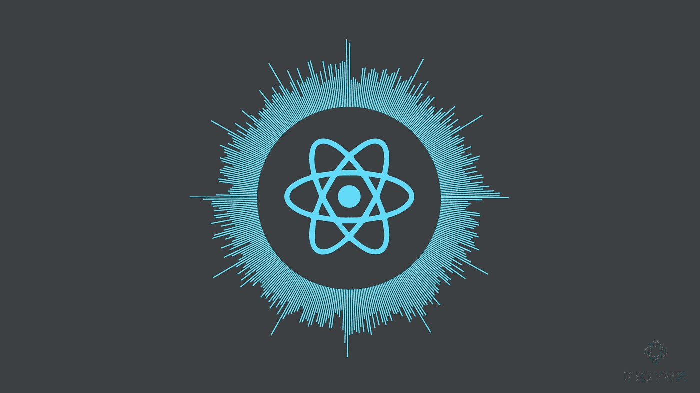

这个过程相对简单，我将在这里详述。如果你想了解更多，请继续阅读。

**先决条件**

*   React 和 React 16 特性的中级知识。
*   从 npm 下载软件包的能力。
*   一台电脑。
*   你太闲了。像我一样。

**设置**

我用`create-react-app`入门，用`npm i -g create-react-app`安装的。然后我运行`create-react-app post-builder`生成项目，用`npm run start`加载到浏览器中。

之后，我删除了以下文件:

*   `src/App.css`
*   `src/App.test.js`
*   `src/logo.svg`
*   `src/serviceWorker.js`

还有`index.js`的服务人员的东西。

然后，我编辑我的 App.js 文件，直到它看起来像这样:

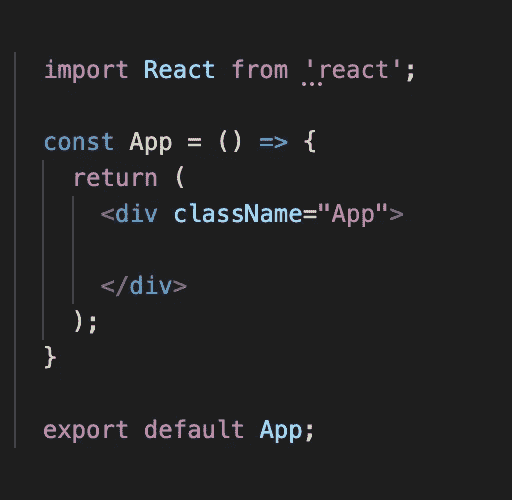

我在这个项目中使用了`styled-components`，这是一个很棒的用于编写`css-in-js`的库。如果你在追溯我在这里所做的，你可能也想用它。运行`npm i styled-components`下载。但是你也可以用普通的 css，或者 sass，或者敌人的血。没关系。

**后置生成器组件**

`<PostBuilder />`组件将成为主要组件。它将有一个单一的状态字段，`items.`这将是一个对象数组，每个对象代表页面上的一个项目，如文本区、图像或代码块。

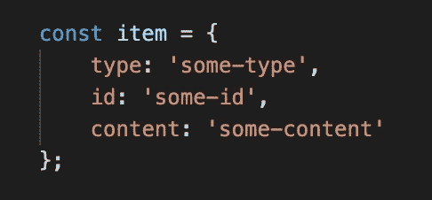

然后组件将映射到`items`数组，并为每个数组呈现一个单独的`<Item />`组件。

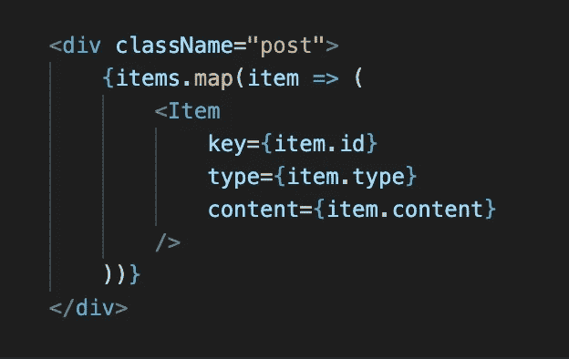

我在`src/components/PostBuilder/index.jsx`中创建了`<PostBuilder />`，把上面的东西都加进去之后，看起来就是下图。所以稍后页面上会出现一些东西，我也在 state 中粘贴了一个初始项目。

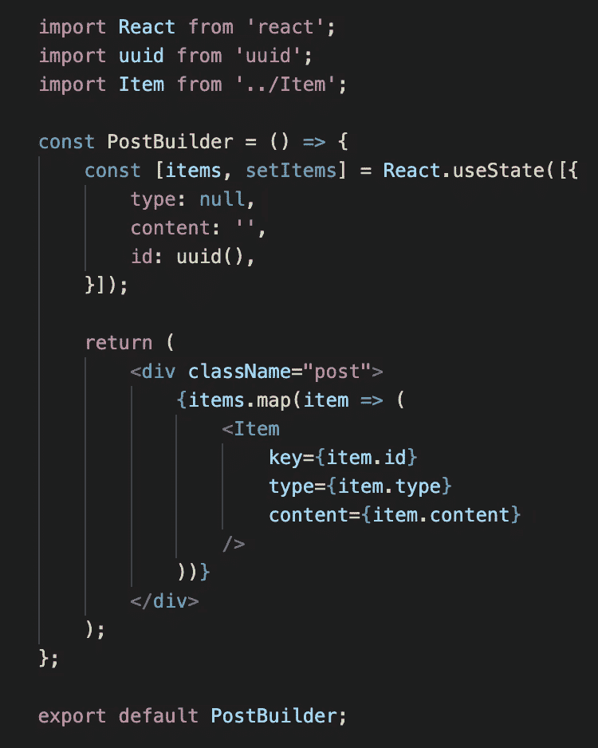

`<Item />`还没有创建，所以`<PostBuilder />`抛出了一个错误。我决定接下来做那件事。

是一个漂亮的 npm 包，当你调用它的时候，它会生成一个唯一的 id。

**物品组件**

然后是`<Item />`组件，负责呈现默认的文章项目(一个文本区域)或一些自定义项目(比如一个图像或代码块)。我在`src/components/Item/index.jsx`中创建了它，它看起来像这样:

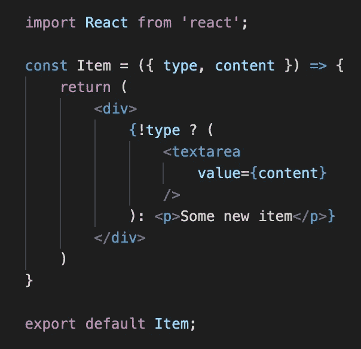

每当`type`为假时，组件使用一些条件逻辑来呈现默认元素(a `textarea`)。如果它是真实的，它会呈现一些其他元素。我稍后会定义这些。

完成这些工作后，我向`<App />`导入并添加了`<PostBuilder />`组件(并向页面添加了一些填充)。有了`items`数组中的初始元素，我得到了这样一个页面:

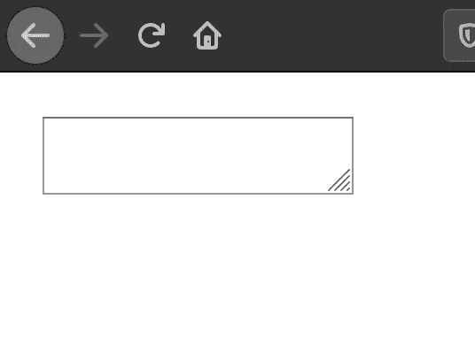

哇哦。装运它。

*对项目组件进行样式化*

就在那时，我决定与魔鬼共舞，做一些 css，这是一个荒谬的决定，因为你甚至不能输入东西。但是嘿嗬。一个`textarea`值得自己皮好。

如果你以前从未使用过`styled-components`，这相当容易。我在与`<Item />`组件相同的文件夹中创建了一个`style.js`文件。代码看起来像这样:

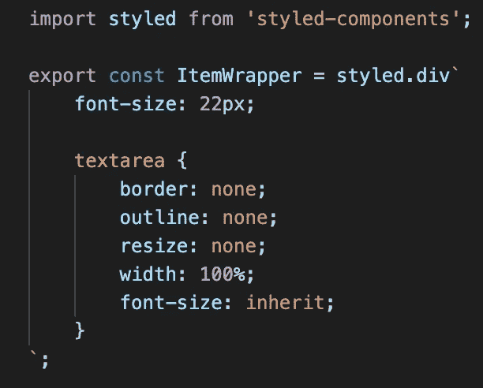

this is probably all wrong

对`styled.div`的调用像其他组件一样返回一个 React 组件。该组件的所有子组件都应用了这些样式。我把它导入到`<Item />`里，用它替换了顶层的 div。

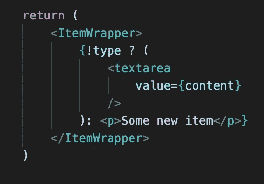

完成了。我的文本框看起来很性感，而且已经着火了。(Btw，我说的性感是指完全隐形。如果你仔细想想，这是相当令人心酸的，因为情人眼里出西施，因此不设定武断的标准是很重要的。谢了。)

*聚焦文本框*

此时，我最不想做的事情就是让`<Item />`中的`textarea`专注于创建，也就是说，插入符号会出现在框中，而无需手动点击它。那也让我有机会试试`useRef` & `useEffect`钩子。做了那件事之后，`<Item />`看起来是这样的:

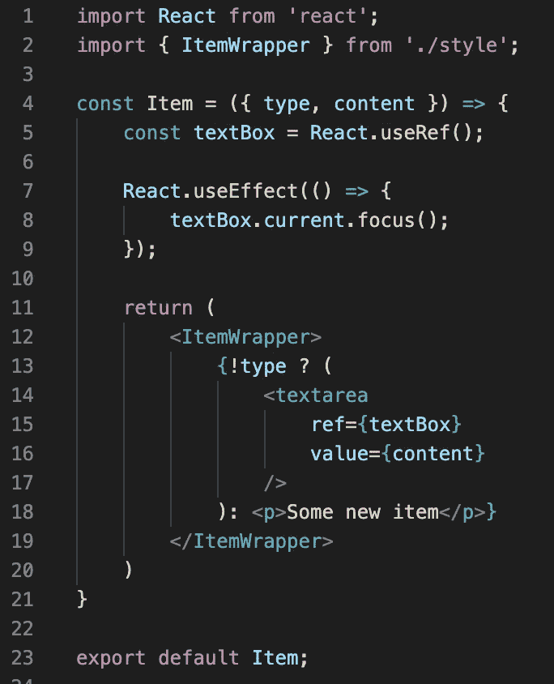

新的东西在生产线上`5`、`7-9`、&、`15`。

*   `5`创建了初始 ref。Refs 提供了特定 DOM 元素的句柄，以便您可以对它们执行操作。
*   `7–9`告诉浏览器立即聚焦 textarea。
*   `15`将 textarea 附加到该 ref，从而可以访问 DOM 中的元素。

**添加和更新项目**

在那个时候，`textarea`实际上并没有工作。您不能在其中输入，因为没有办法更新传递给它的`value`属性。我也没有办法在页面上添加新的条目。因此，我需要两个函数:一个向`items`状态字段添加新项，一个更新特定项的内容。我把它们都放在了`<PostBuilder />`里。这是他们的样子:

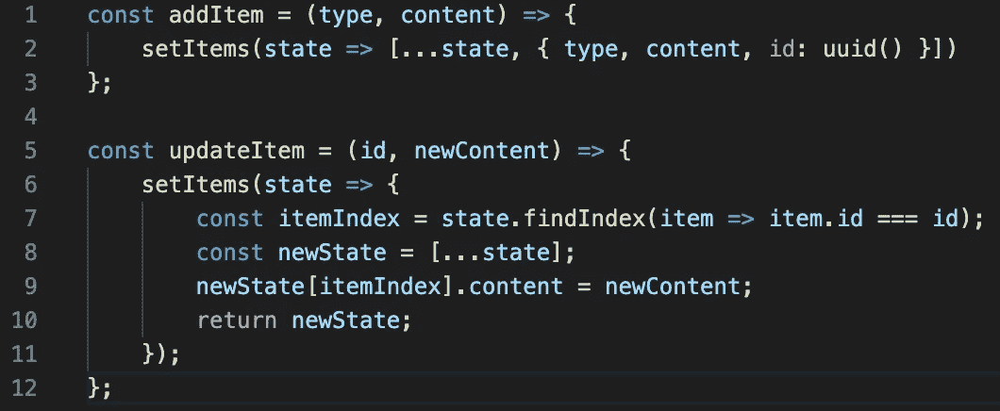

*第 1–3 行*

这是`addItem`函数，负责在页面上粘贴一个新的项目。它接收新项目的类型和内容，并将它们都添加到 state 中。

对`setItems`的调用使用更新状态的回调方法，因此它总是使用最新的版本。然后[使用数组展开语法](https://til.hashrocket.com/posts/gpdlaxubjz-array-concatenation-with-the-spread-operator)向`items`添加一个新的项，并返回新的数组，该数组成为新的状态。

*第 5–12 行*

这是`updateItem`函数，再次使用更新状态的回调方法。它接收要更新的项目的 id 和新内容。

在第`7`行，它通过使用所提供的 id 检索其索引来获得正确的项目。

在第`8`行，它使用数组展开语法以*不可变的*方式创建旧状态的副本。

在第`9`行，它使用索引更新特定条目的内容。

然后，在第`10`行，它返回新的数组，该数组成为状态。

**让项目自我更新**

在`updateItem`函数可用的情况下，我将它传递给了`<Item />` 组件，这样就可以使用它了。

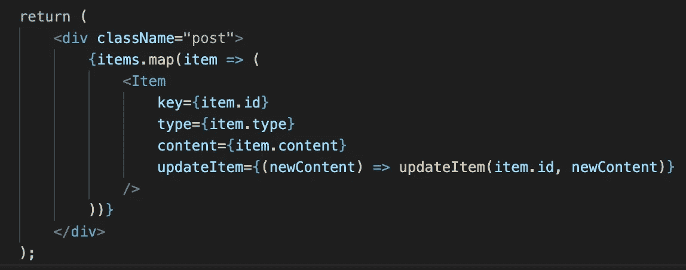

然后在`<Item />`组件中，我把它连接起来。

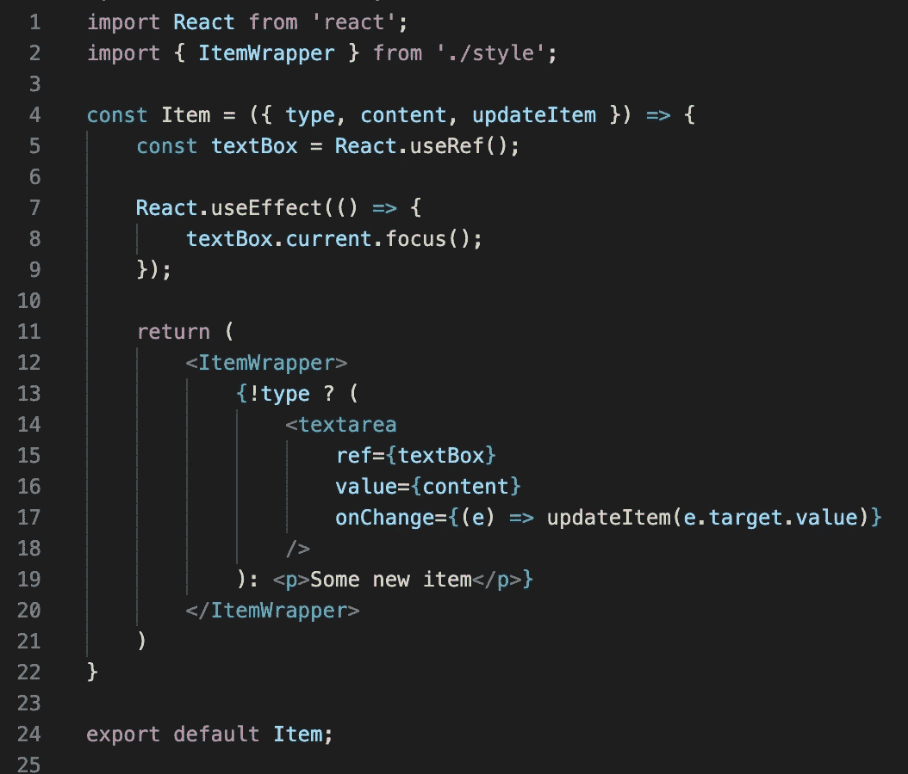

这里的新东西是在传入的道具中添加了`updateItem`，并设置了`textarea`元素的`onChange`道具。

之后，我试着输入`textarea`，结果成功了！太棒了。

**创建新的文本区域**

在 Medium 上写文章时，按回车键会把你带到一个新的文本部分。我也想这样做，因为媒体不应该得到所有的乐趣。

最简单的方法是在 textarea 触发`onKeyPress`事件时创建一个新项目。我将获取它，检查键是否是`Enter`，如果是，则创建一个新的`item`。

我先在`<PostBuilder />`里加了一个`handleKeyPress`函数，传给了`<Item />`。

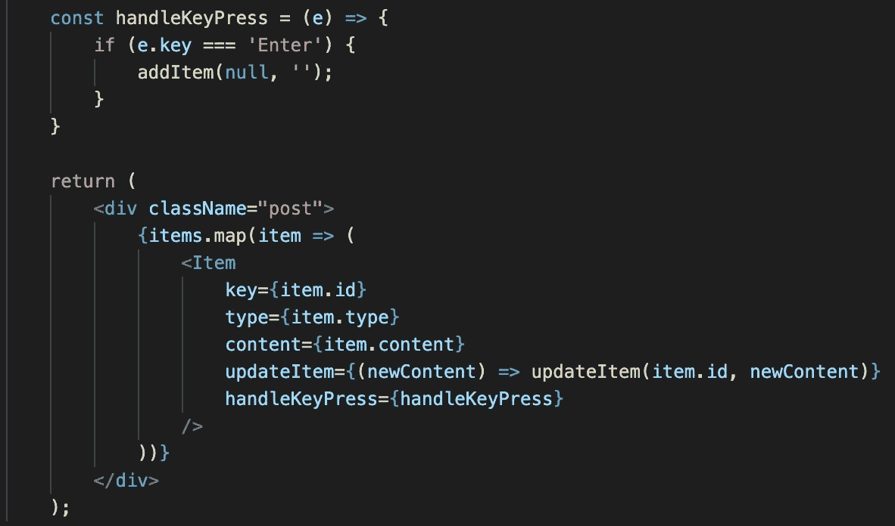

我在这里将`null`作为类型传递，因为它是一个 falsy 值，因此将导致呈现一个`textarea`，因为`<Item />`中有条件语句。

最后，我将`handleKeyPress`添加到`<Item />`的道具列表中，并通过`onKeyPress`事件将其传递给`textarea`元素。

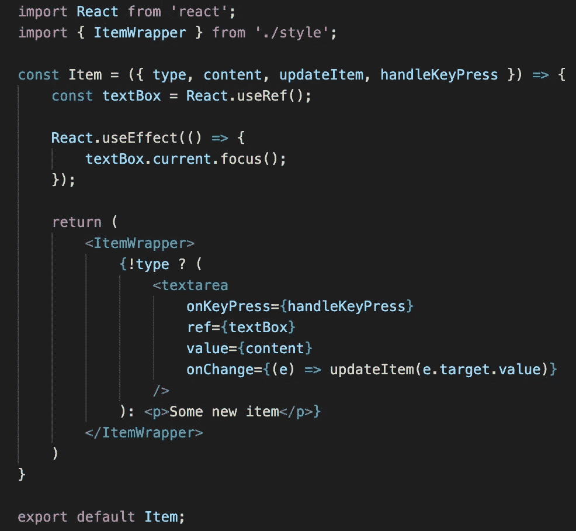

在那之后，我可以整天创造`textareas`。我做到了。咿呀。

**图片**

最后，我决定开发一个单独的定制组件:图片。此时，每个条目的`content`属性只有文本，因为`textareas`只需要文本。但理论上，它可能是任何东西。所以，对于图像，我决定看起来像这样:

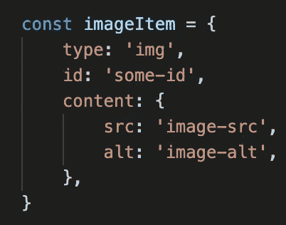

利用这些知识，我在 `src/components/Image/index.jsx`创建了`<Image />`组件。

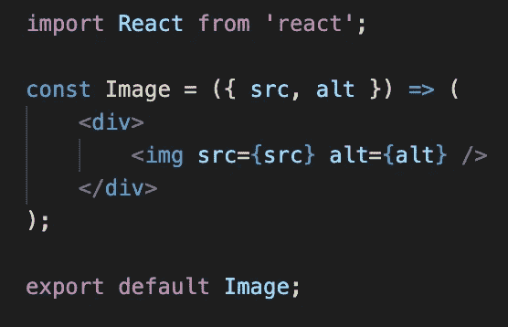

但是我还不能渲染它。这是下一步。

**组件映射**

此时，<item>组件只能呈现`textareas`或`
`标签。为了呈现自定义组件，我必须想办法将它们映射到特定的类型。映射表似乎很好。在`<Item />`中，在组件体之外，我写道:</item>

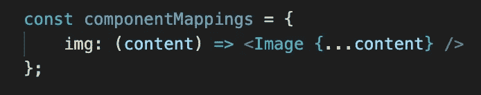

然后我把`<Item />`中的`
`标签替换成你在下面看到的高亮显示的内容:

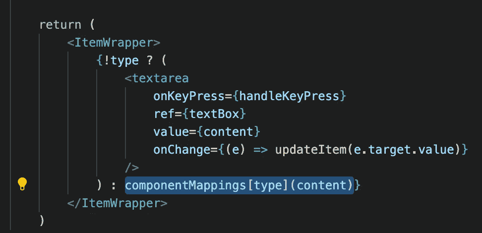

因此，如果 type 不是 falsy，条件将不会返回一个`textarea`，而是从映射表中检索正确的组件。当然，如果你给它传递了一个不存在的类型，整个事情就会变得一团糟。但是没有一点危险的生活是什么？

**工具栏**

我知道我上面说了“最后”，但这是一个血口喷人的谎言。我仍然必须为用户创建一些方法来选择将哪个新项目添加到帖子中。嗯，或者造型，但是因为造型就像慢性胀气一样令人愉快，我决定创造`<Toolbar />`。

我从`<Item />`中导出了`componentMappings`对象，这样我就可以用它来动态生成工具栏，也就是说`componentMappings`中的每个键都会产生自己的按钮。

然后，在`src/components/Toolbar/index.jsx`中，我创建了`<Toolbar />`组件本身。

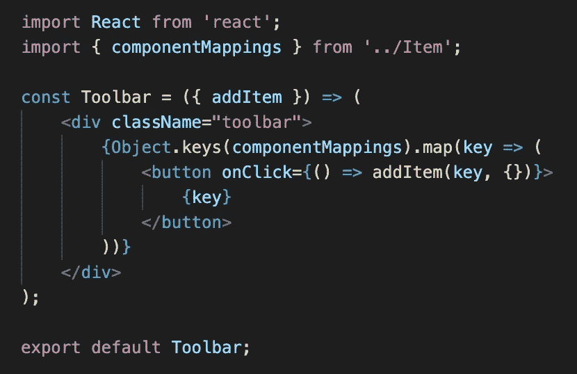

因此，`<Toolbar />`循环遍历`componentMappings`中的每个键，并为其创建一个按钮。使用将从`<PostBuilder />`传递的`addItem`函数，它附加一个`onClick`事件并添加一个新项目，传递将成为组件的`type`的键和一个用于`content`的空对象。我把`<Toolbar />`加到了`<PostBuilder />`的底部，并把`addItem`传递给了它。

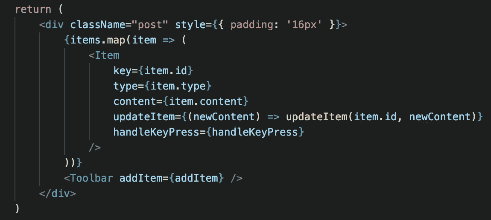

此时，我开始意识到一些问题。

首先，试图创建一个图像会破坏应用程序。这是因为在`<Item />`中使用的 ref 仅在`textarea`被渲染时存在。因为我是作为定制组件而不是`textarea`呈现的，所以 ref 没有被定义，因此试图在它上面调用`focus`会抛出一个错误。

不过，这很容易解决。在`<Item />`中，我把`useEffect`钩子改成了这样:

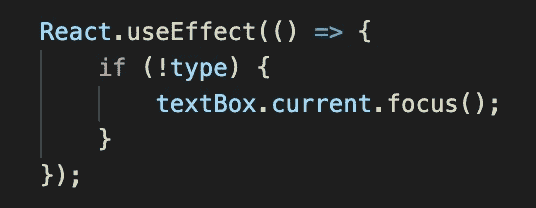

问题解决了。

但是还有第二个问题。我如何为图片获取`src` & `alt`属性？我不知道这些关于创造的价值观。用户没有办法在点击工具栏上的`image`按钮时提供它们。

这个有点棘手。最后，我决定创建新的组件来提供定制项目需要的每个属性。我制作了一个`<EditImage />`组件，如果`src`和`alt`属性丢失或错误，我就在`<Image />`中渲染它。

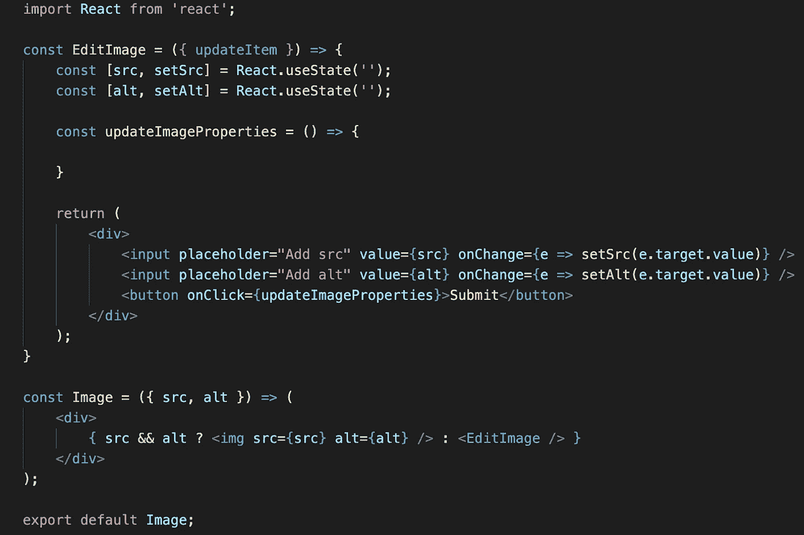

这一切都很简单。`<EditImage />`提供了两个简单的输入和一个按钮，用于设置`src`和`alt`属性。它将使用一个尚未提供的`updateItem`函数，将这些值传递回`<PostBuilder />`中的`items`数组。如果`src`或`alt`为假，则`<Image />`会渲染`<EditImage />`。

我不确定这是否是解决问题的最佳方式，但它确实有一个不错的副作用。编辑组件可以多次使用。如果用户以后想更改`alt`和`src`属性，添加这种组件会使事情变得容易得多。所以我决定坚持下去。

`<EditImage />`需要访问`updateItem`函数，所以我把它添加到了`<Item />`中的`componentMappings`对象中。

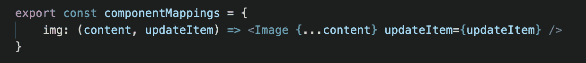

并更新了`componentMappings`函数调用传递参数:

然后添加到道具列表和`<Image />`中的`<EditImage />` jsx:

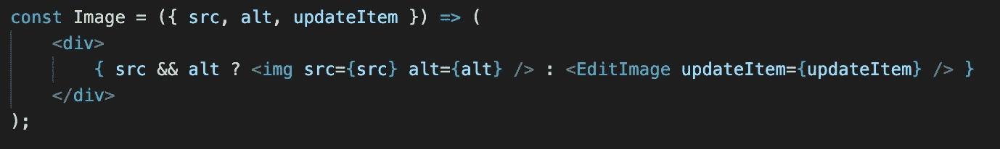

最后，更新了`<EditImage />`中的`updateImageProperties`功能:

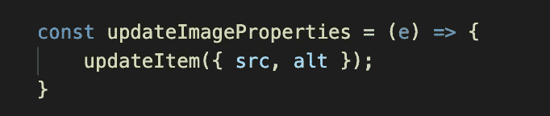

完成所有这些后，我只剩下这个:

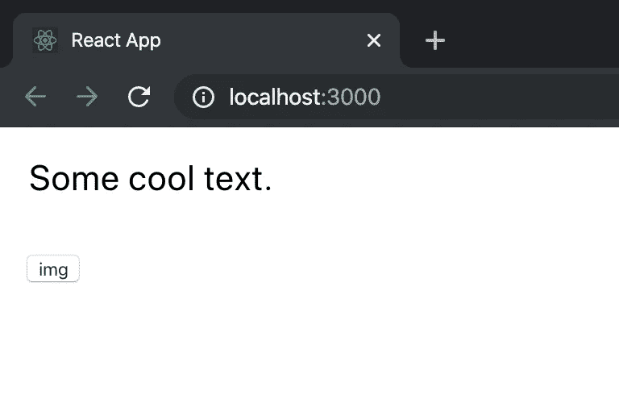

当我点击`img`按钮时:

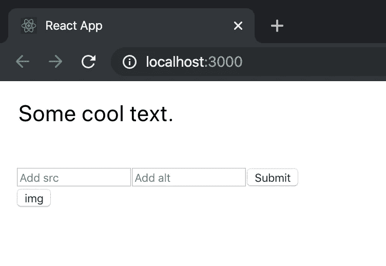

最后，当我添加了一个`src`和`alt`:

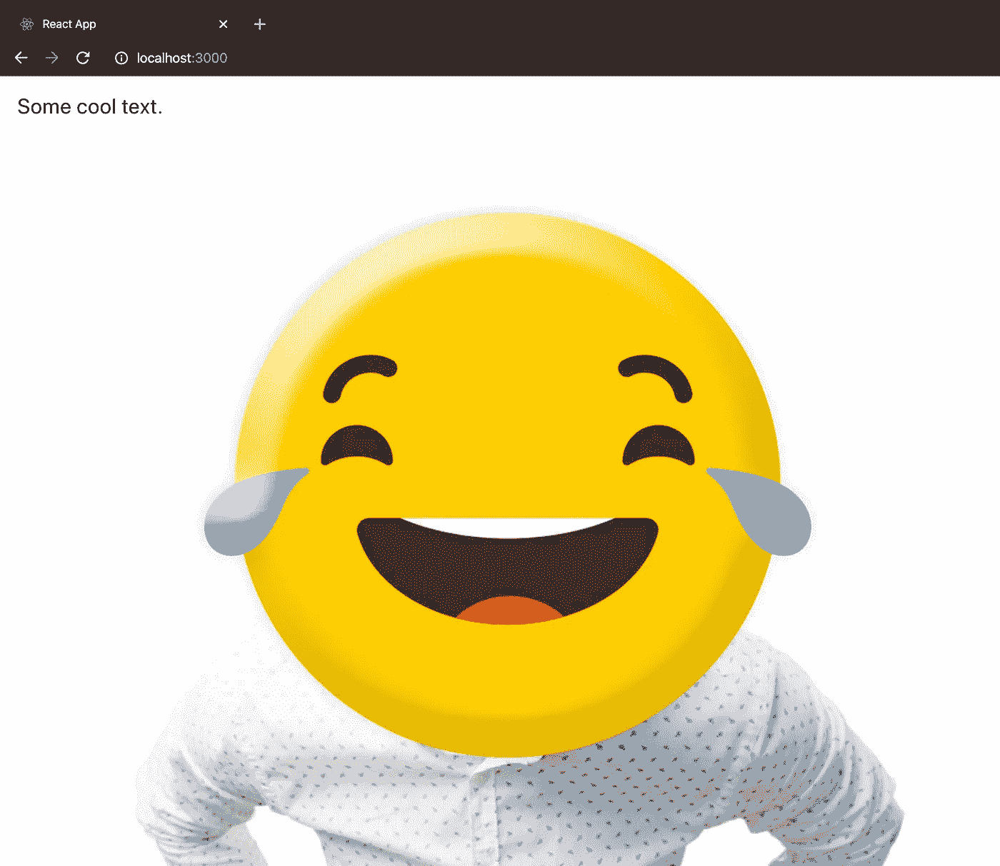

你好，谷歌？是的。雇用我。

**造型**

最后要做的就是造型。这一节实际上并没有给应用程序的功能增加任何东西，所以如果您一直在学习的话，可以完全跳过这一节。但是，如果你很古怪，有麻烦，并且喜欢 css，那么继续读下去，士兵。

*页边距&标题*

在 Medium 中，文章的正文在屏幕上居中，两边各有一个边距。我是通过在`src/`文件夹的根目录下创建一个`style.js`文件来添加的，这个文件夹导出了一个名为`AppWrapper`的新样式组件。它有以下风格:

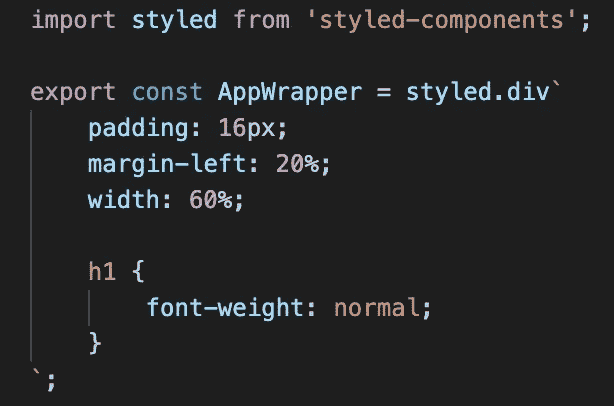

然后我用在了`<App />`里，加了一个头:

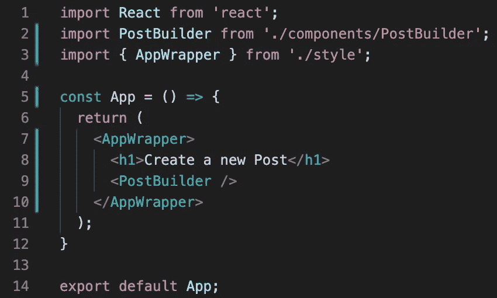

页面看起来是这样的:

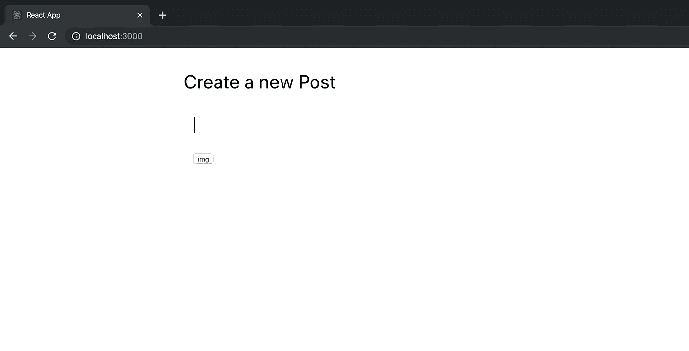

*工具栏样式*

在与`<Toolbar />`组件相同的文件夹中，我创建了一个`style.js`文件，代码如下:bb

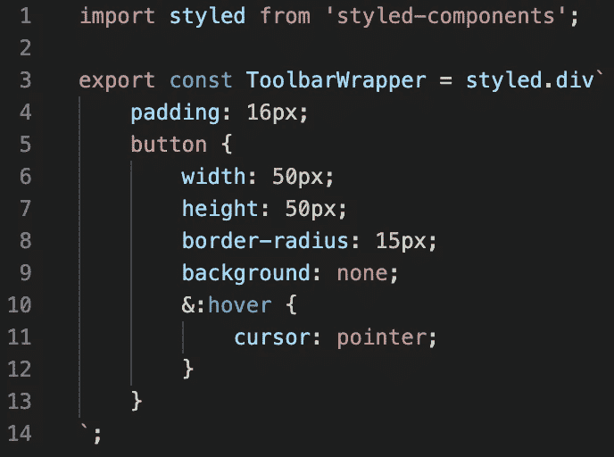

然后我加到了`<Toolbar />`:

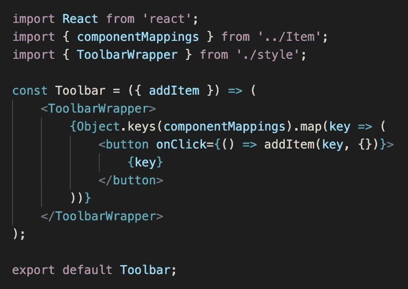

留给我这个:

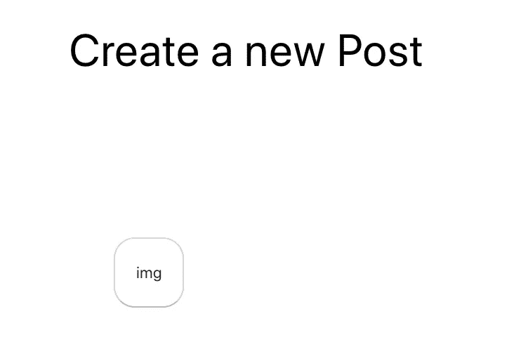

戈尔杰。

*造型<图像/ >和<编辑图像/ >*

因为`<EditImage />`是`<Image />`的直接子元素，所以我会同时设计它们的样式。在与`<Image />`同一个文件夹的`style.js`文件中，我写下了这个怪物:

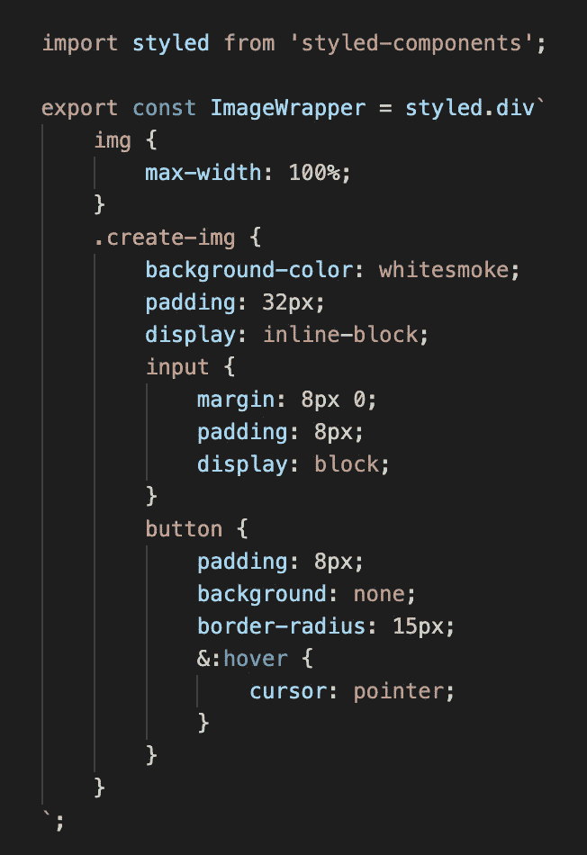

然后我将包装器添加到`<Image />`组件中。

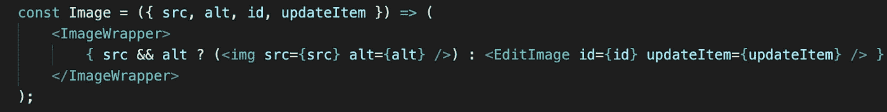

并在`<EditImage />`的`div`中增加了`.create-img`类:

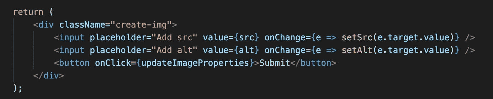

最后，我的页面看起来像这样:

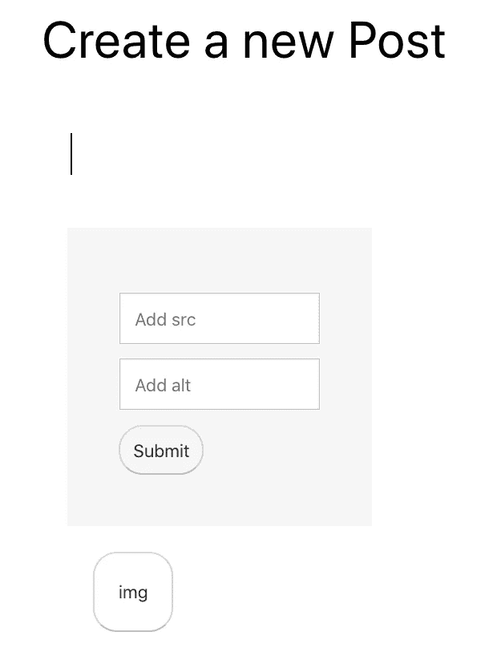

所以。可爱。

**额外步骤**

如果你跟随这个，并且你喜欢它，那么也许你想要一些下一步做什么的想法。也许你不会，在这种情况下，请随时给我发电子邮件，让我知道。您可以:

*   添加更多定制组件，包括一个`<Video />`组件
*   使`<Image />`组件不那么笨拙(任何 src 和 alt 都将被接受，甚至是坏的，所以你可以验证，或者一个重新加载编辑组件的按钮)
*   添加按钮以移除项目

**倒影**

在很大程度上，创建 Post Builder 非常简单，但有些事情我可能会在将来重新考虑。

*   映射表感觉有点弱。可能有更好的方法来做这些。
*   <editimage>组件是我没有预见到的问题的最后解决方案。我肯定有更合适的选择。</editimage>

我在这里学到了很多。这可能不是最复杂的任务，但它允许我使用 React 的许多不同功能，并要求我思考如何使组件足够通用(我认为？很辛苦)。我也喜欢顶层的`items`数据结构影响整个视图的方式，因此`<PostBuilder />`的大多数孩子相对来说比较笨。我喜欢愚蠢的事情，因为他们让*我*看起来更好。

感谢阅读。