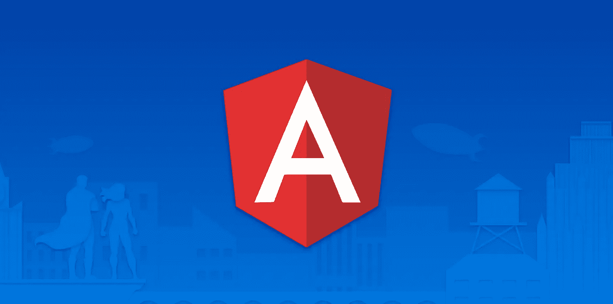

# 通过做这些关键的事情，让你的新角度项目变得更好

> 原文：<https://javascript.plainenglish.io/creating-a-new-angular-project-here-is-what-you-need-to-do-71ba08587b1d?source=collection_archive---------5----------------------->

## 创建一个新的角度项目？这是你需要做的。



作为一名软件开发人员，从头开始一个新项目总是很有趣，但随之而来的是巨大的复杂性和责任。

在这篇文章中，我分享了一些在你的角度项目的早期需要注意的事情。这样做，将会在应用程序变得更大更复杂的时候为你节省大量的时间。

# **1。更新聚合填充**

现在有很多浏览器，支持所有的浏览器是一个挑战。Angular 建立在最新的网络平台标准之上。这意味着旧的浏览器可能很难呈现你的 Angular 应用程序。

聚合填充脚本或简称为聚合填充，可帮助您添加对没有最新浏览器功能的浏览器的支持。Polyfills 包含在 ***polyfills.t*** s 文件中。

更新和定制您的***poly fills . ts****文件对于确保您的所有目标 web 浏览器都得到完全支持至关重要。*

# ***2。添加 *<脚本>* 元素***

*作为一名开发人员，您有时会遇到一些罕见的情况，有人会在浏览器中关闭 JavaScript。这可能很难调试。*

*这就是***<noscript>***标签派上用场的地方。当浏览器中禁用 JavaScript 时，您可以向用户显示更多信息的错误消息，而不仅仅是显示一个空白页面。*

*只需在【index.html】*文件`<noscript> Your JavaScript is disabled </noscript>`的 ***<正文>*** 元素内添加下面一行**

# ****3。规格化 CSS****

**不同的浏览器会呈现不同的 HTML 元素。比如:默认的行高、边距和字体大小在不同的浏览器上会有所不同。**

**重置样式表是确保应用程序在所有浏览器中以一致的方式显示的明智之举。**

**在 Angular 中，你可以通过使用 **normalize** npm 包轻松地规范化或重置你的 CSS，这是 HTML5 CSS 重置的一个很好的替代方案。**

**要安装 **normalize** 包，只需在项目根文件夹中运行以下命令。**

```
**$ npm install normalize.css**
```

**然后在 styles.css 文件中导入 normalize**

```
**@import '~normalize.css';**
```

# ****4。Lint 你的代码****

**TSLint 是一个分析工具，用于检查代码风格的一致性、可读性和可维护性。**

**默认情况下，Angular 项目的根目录下会有一个林挺文件 tslint.json。**

**请确保使用您自己的规则和配置对该文件进行定制，以保持其更新。这样，您将拥有一致且格式良好的代码。**

****注:TSLint** 已于 2019 年末弃用。 **ESLint** 现在是最新最棒的，但是概念还是一样。**

**更详细的解释，请看这篇文章[这里](https://link.medium.com/CMOwU6VRM7)。**

# ****5。添加 webpack-bundle-analyzer****

**Angular 应用程序依赖于节点包来添加功能，而无需重新发明轮子。**

**要了解 Angular 项目对开源节点包的依赖程度，可以查看一下 ***node_modules*** 文件夹中的内容。**

**如果以错误的方式将这些节点包导入到组件、模块或服务中，可能会对应用程序的性能产生负面影响。**

**Webpack-bundle-analyzer 将帮助您以交互方式可视化 Webpack 文件的大小。这反过来帮助您对可能会降低应用程序速度的包做出明智的决定。**

**我们现在不看如何实现它，但是要了解更多细节，请看我的一篇早期文章[这里](https://link.medium.com/O1XpyQyEO7)。**

**经常运行 webpack-bundle-analyzer，以确保包的大小不会失控。**

# ****6。更新组件前缀****

**当你创建一个新的 Angular 应用程序时，你得到的默认前缀是: ***app。****根据您的定制需求更新它总是一个好主意，例如显示您的公司名称或项目名称，使其独一无二。***

***只需更新 ***angular.json*** 文件中的**前缀**值，即可满足您的需求。***

**这里有一篇关于如何做到这一点的好文章。**

# **7.更新 README.md 文件**

**自述文件包含有关项目的重要信息，包括:如何开始、配置说明、联系信息等。**

**Angular 项目的默认 README.md 文件包含有关项目如何生成、如何为正在开发的应用程序提供服务、构建应用程序、运行单元测试以及如何移植代码等信息。**

**当您对项目进行调整时，对 README.md 文件进行同样的调整是很重要的。这对您的文档和项目新成员的加入非常重要。**

# **8.确保单元测试正在运行**

**如果您通过 Angular CLI 创建组件和服务，默认情况下，您将获得生成的单元测试文件。但是，您经常会发现这些单元测试并没有成功运行。**

**确保所有测试在项目早期成功运行，并在您添加功能时不断更新它们。**

# **结论**

**在项目早期做这些简单的事情比当应用程序变得大而复杂时要容易得多。**

**如果您对新创建的 Angular 应用程序中需要更新的其他内容有什么建议，请在下面添加评论。**

## **简单英语中的 JavaScript**

**你知道我们有四个出版物和一个 YouTube 频道吗？在 [**找到他们所有人。点击**](https://plainenglish.io/) 和 [**订阅解码，我们的 YouTube 频道**](https://www.youtube.com/channel/UCtipWUghju290NWcn8jhyAw) **！****