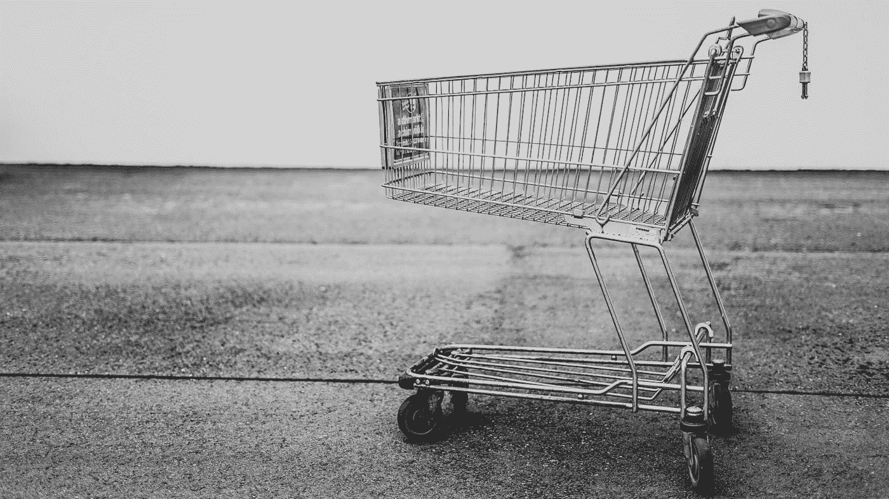

# 在 ReactJS 中实现持久购物车

> 原文：<https://javascript.plainenglish.io/creating-a-persistent-cart-in-react-f287ed4b4df0?source=collection_archive---------0----------------------->

Photo by [Bruno Kelzer](https://unsplash.com/@bruno_kelzer?utm_source=medium&utm_medium=referral) on [Unsplash](https://unsplash.com?utm_source=medium&utm_medium=referral)

## 为您的客户创造更好的体验，即使他们没有登录

## 你知道 react，你想实现一个购物车。假设你已经尝试过了，即使你没有。

在重新加载页面之前，一切都很好，很流畅，正常工作。就这样，你购物车里的所有东西都不见了，现在你脑子里只有一个遥远的记忆。

你如何实现一个购物车，或者类似的东西，即使在页面重新加载，或者关闭并重新加载你的网站之后，仍然保存信息？

实际上很简单，使用一个叫做 **localStorage** 的小东西。

# 什么是本地存储？

顾名思义，本地存储是浏览器的本地存储，嗯…

不过说真的，你需要知道的是，这个漂亮的小工具将无限期地存在，直到你删除它——当注销一个用户，或完成一个订单——或者在用户硬重新加载或重置他们的浏览器的情况下。

# 使用本地存储的好处

您可能想知道，本地存储用于存储用户登录时的关键信息，这确保用户可以访问某项服务或功能，而无需每次客户端发出请求时都向服务器或其他方请求许可。

换句话说，只要内存存在，您就可以即时访问它，所以您不必担心异步函数或类似的问题。

没有一些代码，这不会是一个很酷的教程，所以让我们开始吧。然而，在我们开始之前，让我解释一下 localStorage 实际上是如何工作的。

重要的是要理解，在本地存储中存储的任何内容都保存为字符串，基本上是 JSON 格式。

# 有三种方法可以用来修改这个结构

## **local storage . setitem(key:string，value: string)**

请注意，要设置(保存)。我们需要把它作为一个键值对，两者都由字符串组成。这很重要，因为正如我之前所说，localStorage 只会正确地保存字符串。

要设置我们想要的值——cart 数组——我们可以简单地调用 **JSON.stringify(cart)** ,它将被转换成一个字符串表示。

## **local storage . getitem(key:string)**

要获得一个项目，我们只需输入我们之前用来设置该项目的键，这也是一个字符串。

因为该值是一个字符串，所以我们调用 **JSON.parse(cartString)** 将其转换为存储前的值——在我们的例子中是一个数组。

## **localStorage.removeItem(键:字符串)**

最后，要删除一个值，我们只需传递它的键，它就会永远从浏览器的本地存储中删除，只存在于你的梦里。

我们将首先创建一个数组，通过使用 useState 钩子并将其初始值设置为一个空数组来保存购物车的状态。

那很容易。您还可以看到，我添加了一些空函数，我们也将使用它们来实现购物车的逻辑。

还可以看到我实现了 useEffect，这是一个钩子，可以作为 componentDidMount 或 componentWillMount 的功能组件版本运行。这样做是因为如果用户刷新页面，本地状态将会丢失，因此我们需要在 localStorage 中加载购物车(如果存在的话),以将其恢复到应用程序的状态。

# 添加新项目

向购物车添加商品时，我们必须考虑两个条件。

*   添加购物车中尚不存在的商品
*   添加购物车中已经存在的商品。

首先，我们需要检查数组中是否存在该项目，如果不存在，就添加它，但如果存在，我们需要更新现有项目的数量。

最后，我们需要将更新后的购物车保存到 localStorage，以防用户对刷新按钮非常满意。

希望前面的解释和详细的注释足以让您了解到目前为止 localStorage 是如何工作的。

# 更新项目

为了更新一个条目，我们的函数将接收两个参数，itemID 和要加或减的数量。

数量可以是负数，这意味着我们从现有的项目中减去 x 质量，如果是正数，则加上它们。

我们可以假设该函数总是在列表中存在的项目上被调用，但是无论发生什么情况，让您的代码工作总是一个好主意，所以我们将解决这种情况。

我们需要担心两件事。

*   如果一个项目不存在会发生什么。
*   如果最终数量等于或小于 0，会发生什么

我们可以像以前一样简单地在数组上使用 find，并检查它是否存在。如果没有，我们简单地返回来停止这个函数。

如果确实存在，我们可以更新并验证受影响物品的最终数量。

我们通过简单地更新数量并检查结果是否≤ 0 来做到这一点。如果是，我们必须从购物车中删除该商品。

我们可以从数组中过滤掉上面显示的项目。同样，我们必须用结果状态更新 localState。

我们的功能终于完成了。即使用户刷新或关闭浏览器，我们的购物车现在也将保存在 localStorage 中。

此外，如果用户结账或完成购买，您可以通过调用*local storage . remove item(" cart ")*从内存中重置购物车。

唷！您现在离为客户创造完美体验又近了一步。

我知道我们没有看到任何视觉上的东西，但这个帖子就这个话题已经够长了。

在任何情况下，我可能会写一个后续版本，通过实际实现和渲染一个购物车，这样如果你不知道如何完成它，你可以学习连接这个功能。

所以请继续关注，如果你想看到更多这样的内容，也许还有后续版本。😉

干杯。