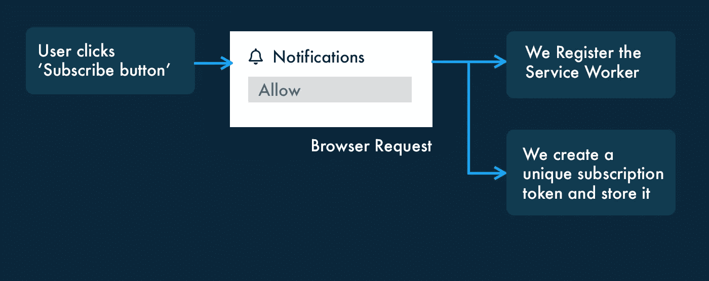
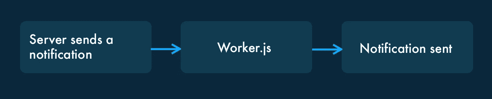

# 使用服务人员创建推送通知系统

> 原文：<https://javascript.plainenglish.io/creating-a-push-notification-system-with-service-workers-e3e1813f2b5?source=collection_archive---------5----------------------->

我最近用 NodeJS 开了一个新的博客,在那里我很快面临一个难题:当一篇新文章发表时，如何通知用户。最重要的是，**我想在不依赖第三方服务的情况下完成这一切。我认为这是一个使用网络通知的好机会。**

只有当用户打开网站时，原生浏览器通知才真正起作用。我希望当有新的事情发生时，无论网站是否开放，所有用户都能收到来自服务器的通知。

但是如果用户关闭了页面，我们如何向他们返回通知呢？**要做到这一点，我们必须使用服务人员**，并且我们需要存储我们用户的详细信息。在这篇文章中，我将介绍如何做这些事情，并最终创建您自己的推送通知系统。

# 服务人员快速入门

出于我们的目的，一个服务人员可以归结为一个文件，它可以**从服务器捕获推送事件，即使网站关闭了**。这意味着我们可以在页面关闭但浏览器打开时运行 Javascript。这有很多用途(例如，预加载资源，使网页加载更快)，但重要的是，我们可以将它用作发送通知的设备。

用户必须同意允许这整个过程发生，所以我们必须请求这种访问。对我们来说，这个请求过程看起来有点像这样:

A flow of how we request access from the user.

# 0.MongoDB

由于本文使用 mongoDB，请确保您已经通过此处 的 [**说明安装了它，然后再继续。如果你有另一个存储系统，那么不用担心，只要确保你相应地调整型号和 NPM 软件包。**](https://docs.mongodb.com/manual/installation/)

# 1.请求乏味的密钥

Vapid 密钥是我们用来验证只有我们使用的 web 服务器才能发送通知的**。有其他机制可以做到这一点，但是让我们把重点放在乏味的键上，因为它是最直接的。我们要做的第一件事是安装我们将在本教程中使用的主要 JS 包。为此，请在终端中运行以下命令:**

上面的第二行应该输出一个私钥和一个公钥。**这些是你的乏味的键**，我们将在接下来的几个步骤中使用它们。

# 2.客户端“点击”事件

下一步是在客户端设置一段代码，它向服务器发送请求。在我们的服务器上，我们将创建一个/subscribe 路由来处理所有订阅。现在，让我们看看客户端。**注意，我们需要在顶部插入我们乏味的公钥。**

当用户点击“订阅”按钮时，我们只做三件事:

1.  我们**登记**为劳务人员。
2.  我们使用**push manager**Javascript API 为用户创建一个新的订阅。使用此方法为每个用户生成一个唯一的订阅对象。
3.  我们**将订阅**发送到我们的服务器。

应用程序 URL 需要转换成特定的形式，这就是第二个功能正在帮助我们做的。除此之外，当用户单击 subscribe 按钮时，我们将向服务器(to /subscribe)发送一个请求，在那里我们将处理该请求。

在第 4 行，我们引用了一个 **worker.js** 文件。**这是我们的服务人员。**我们也需要创建这个文件——我不会在这里列出，但是它可以在 GitHub Repo 中找到。大约有 8 行，它处理来自我们服务器的传入消息，并将它们作为 web 通知输出。

# 3.服务器端“商店订阅”

我在 mongoDB 中为订阅创建了一个模型。这可以通过 GitHub Repo 访问，并且相对简单。让我们看看/subscribe 路线。我们在这里做一些事情:

1.  我们**设置**vapp 键。
2.  我们对订阅对象进行**散列**以用作我们的唯一密钥。
3.  我们**检查**数据库中是否已经存在该订阅哈希。
4.  如果数据库中不存在**订阅**文档，则在数据库中创建该文档。
5.  否则我们**会以适当的信息回应**。

太好了，现在我们有了订阅路线。我们所有的订阅都存储在 MongoDB 数据库中，我们可以在需要的时候向它们发送通知。现在让我们试着发送一些东西。

# 4.发送通知

Remember, since we loaded the server worker, our server can now interact with the user’s browser, even when the page is closed.

现在我们已经收集了我们的订户，我们想向他们发送一些东西。我们所要做的就是遍历它们，并为每个人生成一个通知:

# 5.添加安全性

Presumably what you’re doing right now.

如果您正在运行这个程序，重要的是添加适合您的设置的正确的安全性。例如，您可能想要使用*快递费率限制*包来防止有人滥发订阅路由请求。

同样，当您发送通知时，您要确保服务器上有安全检查，至少要有用户名和密码。

如果您以 API 的形式运行通知服务，那么您可能需要遵循[保护 API 的指南](https://medium.com/apis-and-digital-transformation/best-practices-for-building-secure-apis-2b4eb8071d41)。我们不想发生的是有人恶意发送通知给我们所有的订户。

本教程集中于*如何*创建推送通知服务，但是设置您自己的用户认证系统将在其他教程中得到更好的说明。

# 结论

我希望这不仅能让你了解如何建立一个通知系统，还能让你了解服务人员的力量。

[**在这里获取 GitHub Repo 的完整代码。**](https://github.com/smpnjn/web-push-notifications)

[*关注更多*](https://twitter.com/smpnjn) *。*