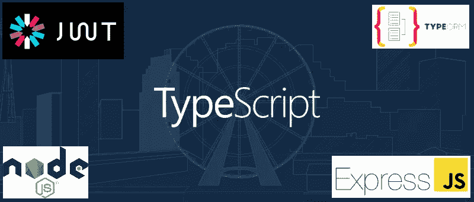

# 带有 Express.js、JWT、授权角色和 TypeORM 的 TypeScript Rest API

> 原文：<https://javascript.plainenglish.io/creating-a-rest-api-with-jwt-authentication-and-role-based-authorization-using-typescript-fbfa3cab22a4?source=collection_archive---------0----------------------->



今天，我们将使用 TypeScript Express.js 和 TypeORM 来创建一个企业级 Rest API，它具有 JWT 身份验证和基于角色的授权。目标是创建一个存储库，您可以使用它作为您现实生活项目的基础。

在我们开始之前，建议您熟悉以下主题。你不需要成为专家，但是，如果你从未听说过这些，我选择了一个入门读物:

**什么是 Rest API 和基础 http 响应代码**

[](https://medium.com/@parastripathi/what-is-rest-api-a-beginners-guide-700e4931e67c) [## 什么是 REST API:初学者指南

### 由于这是一个初学者指南，我不会使用各种技术术语，而是一个简单的例子和…

medium.com](https://medium.com/@parastripathi/what-is-rest-api-a-beginners-guide-700e4931e67c) 

**什么是 JWT，为什么我们用它来进行无状态认证**

[](https://medium.com/vandium-software/5-easy-steps-to-understanding-json-web-tokens-jwt-1164c0adfcec) [## 理解 JSON Web 令牌的 5 个简单步骤(JWT)

### 在本文中，将解释什么是 JSON Web 令牌(JWT)的基本原理，以及为什么使用它们。JWT 是…

medium.com](https://medium.com/vandium-software/5-easy-steps-to-understanding-json-web-tokens-jwt-1164c0adfcec) 

**什么是 ORM(对象关系映射器)**

[](https://blog.bitsrc.io/what-is-an-orm-and-why-you-should-use-it-b2b6f75f5e2a) [## 什么是 ORM，为什么要使用它

### 对象关系映射器简介

blog.bitsrc.io](https://blog.bitsrc.io/what-is-an-orm-and-why-you-should-use-it-b2b6f75f5e2a) 

# 为什么是 TypeORM？


TypeORM 允许您只编写一个 TypeScript 类，使用 synchronize 工具，它会自动为您的实体生成所有 SQL 结构。有了类验证器包，我们可以使用相同的模型类来进行验证。

兼容 MySQL / MariaDB / Postgres / SQLite /微软 SQL Server/Oracle/SQL . js/MongoDB。您可以在这些数据库之间切换，而不必重写代码。

我们将从 SQLite 开始这个项目。我不建议留着生产。但是，因为我不知道您将使用什么 DB，所以它允许我们创建一个通用项目，您只需“npm install”即可运行，而无需设置数据库服务器。

# 我们开始吧

TypeORM 有一个 CLI 工具，允许我们在 TypeScript 中生成一个基本应用程序。要使用这个工具，我们首先需要安装 typeORM 作为一个全局依赖项:

```
npm install -g typeorm
```

现在我们可以设置我们的应用程序了:

```
typeorm init --name jwt-express-typeorm --database sqlite --express
```

它将使用 TypeORM 和 body-parser 在 TypeScript 中创建一个示例 express 应用程序。让我们安装这些依赖项:

```
npm install
```

现在，我们将安装一些附加的依赖项

```
npm install -s helmet cors jsonwebtoken bcryptjs class-validator ts-node-dev
```

之后，我们将拥有以下依赖关系

通过设置各种 HTTP 头，帮助我们保护我们的应用程序

**cors** 启用跨来源请求

**body-parser** 将客户端的请求从 json 解析成 javascript 对象

jsonwebtoken 将为我们处理 jwt 操作

**bcryptjs
帮助我们散列用户密码**

**typeorm** 我们将要使用的 orm 来操作数据库

**reflect-metadata** 允许一些标注特性与 TypeORM 一起使用

class-validator
一个非常适合 TypeORM 的验证包

我们将使用 sqlite 作为开发数据库

当我们更改任何文件时，ts-node-dev 会自动重启服务器

## 安装类型检查依赖项

因为我们正在使用 TypeScript，所以为我们的依赖项安装@types 是一个好主意。

```
npm install -s @types/bcryptjs @types/body-parser @types/cors @types/helmet @types/jsonwebtoken
```

之后，你将能够使用自动完成和类型检查，甚至是 JavaScript 包。

# src 文件夹

TypeORM CLI 创建了一个包含所有 typescript 文件的`src`文件夹。现在我们将修改这些文件来创建我们的 API。


## 索引

CLI 已经创建了一个`index.ts`文件作为应用程序的入口点。让我们重写以更好地适应我们的目的。

## 路线

CLI 还创建了一个`routes.ts`文件。在大型项目中，将所有路线放在同一个文件中可能不是一个好主意。我们将创建一个`routes/`文件夹，其中有一个`routes/index.ts` ，它聚集了来自其他文件的路线。

**路线/授权交易**

**路线/用户 ts**

**路线/索引. ts**

例如，要访问登录路径，您需要调用:

```
http://localhost:3000/auth/login
```

## 中间件

如您所见，路由在调用控制器之前会调用一些中间件。中间件实际上只是一个处理你的请求并调用下一个中间件的功能。最好的理解方式是创建你的第一个中间件。

**middleware/checkjwt . ts** 这个中间件会在每一个需要登录用户的路由上被调用。它将检查请求头中是否有有效的 JWT。如果令牌有效，它将调用控制器将处理的下一个函数。否则，它将发送一个带有 401(未授权)状态代码的响应。

**middleware/check role . ts**
即使用户有效登录，他也可能试图访问他可能没有角色授权访问的路由。这个中间件将检查登录的用户是否真正拥有访问这个路由所需的角色。如果没有，用 401(未授权)状态代码响应。请注意，我们将角色作为字符串数组。这是因为将来您可能需要多个角色来访问同一条路线。

## 配置文件

为了生成和验证 jwt 令牌，我们需要一个密钥。我们将把它存储在一个配置文件中。您可以将 jwtSecret 更改为您想要的任何字符串。

**配置/配置文件**

## 用户实体

CLI 已经创建了一个“实体/用户. ts”文件。但是我们希望更改字段，添加验证并创建散列密码的方法。所以我们需要重写这个类。

**实体/用户. ts**

## 控制器

CLI 还创建了一个名为`controller`的文件夹。您可以删除它，并创建另一个名为`controllers`(复数)的。然后，我们将创建 auth 和用户控制器。

**控制器/授权控制器. ts**

**控制器/用户控制器. ts**

## 文件中的请求流

我们写了很多代码，可以忘记每个文件被调用的顺序。为此，我创建了一个简单的图表，举例说明了用户请求检查角色和使用 userController 函数的流程。


# 开发和生产脚本


Node.js 本身不能运行本地的`.ts`文件。因此，了解以下工具非常重要。
`"tsc"` —创建一个`/build`文件夹，将你所有的`.ts`文件转换成`.js`文件。
`"ts-node"` —允许节点运行`.ts`项目。不建议用于生产用途。
`"ts-node-dev"` —同上，但允许您在每次更改文件时重新启动节点服务器

为了更好地设置开发和生产环境，我们将修改`package.json`的脚本会话。

最后，我们添加了最后一行 s `migration:run.`一些 windows 用户在尝试从 npm 运行 TypeORM 迁移时会收到一个错误。直接从节点模块文件夹运行它解决了这个问题。

# 第一个用户呢？

正如你所看到的，即使创建一个新用户，我们也需要有一个管理员。第一个用户将由迁移过程创建。迁移对于维护生产数据库也非常重要。如果您打算在生产中使用 TypeORM，我强烈建议您阅读迁移文档:
[http://typeorm.io/#/migrations](http://typeorm.io/#/migrations)

现在，让我们创建我们的第一个迁移

```
typeorm migration:create -n CreateAdminUser
```

然后，我们将修改生成的文件:

现在我们启动服务器，这样同步工具可以生成我们的数据库表。

```
npm start
```

现在我们可以运行迁移，插入第一个管理员用户。

```
npm run migration:run
```

最后，您的服务器已经准备就绪。就找邮递员，或者其他什么工具，提一些要求。

最终的资源库可以在 GitHub 上找到:

[](https://github.com/andregardi/jwt-express-typeorm) [## andregardi/jwt-express-typeorm

### Rest API 使用 TypeScript Express.js 和 TypeORM 进行 JWT 身份验证和基于角色的授权…

github.com](https://github.com/andregardi/jwt-express-typeorm)