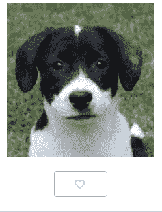

# 在 React 中创建可重用的“类似”按钮组件

> 原文：<https://javascript.plainenglish.io/creating-a-reusable-like-button-component-in-react-8028d17c024c?source=collection_archive---------3----------------------->



这是一个分步指南，说明如何在 React 中创建一个可用作“类似”或计数器按钮的组件。

1.  创建呈现按钮的类组件:

```
class LikeButton extends React.Component {render() {

	  return <button>A button!</button>
  }}
```

很简单！

2.为“喜欢”设置从 0 开始的初始状态，并更新按钮以显示当前状态。

```
class LikeButton extends React.Component {state = {
    likes: 0
  };render() {

	  return <button>Likes: {this.state.likes} </button>
  }
}
```

3.创建一个点击处理程序，在每次点击按钮时增加喜欢的次数。

```
addLike = () => {
    let newCount = this.state.likes + 1;
      this.setState({
      likes: newCount
    });
  };
```

更新按钮以使用点击处理程序:`return <button onClick={this.addLike}>Likes: {this.state.likes} </button>`

4.如果您要向多个项目(照片库或物品列表)添加一个按钮，并希望分别计算每个项目的“喜欢”程度，请执行以下附加步骤:

*   确保您的索引/图库/列表中的每个项目在其父 html 元素(div、li 等)中都有一个唯一的键——即`key={item.id}`
*   在渲染按钮组件时，请将该 id 作为道具传入——T2
*   将 id 添加到按钮— `<button onClick={this.addLike} id={this.props.itemId}>Likes: {this.state.likes} </button>`

你就完了！参见本[代码本](https://codepen.io/rachelhawa/pen/VwwdNQz)中增加样式的工作示例。