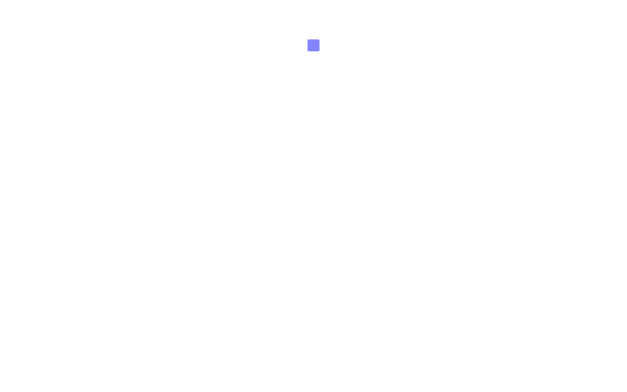

# 使用 React，Three JS 和 react-three-fiber 创建台球桌游戏

> 原文：<https://javascript.plainenglish.io/creating-a-rudimentary-pool-table-game-using-react-three-js-and-react-three-fiber-part-1-cbb1214bed82?source=collection_archive---------9----------------------->

## 第一部分

很长一段时间，我想学习并开始使用 WebGL。在做了一些 OpenGL 的工作后，我认为 WebGL 会是一个很好的补充。这是我碰到 three.js 的时候。

[**Three.js**](https://threejs.org) 是一个非常棒的 3D 图形库。它是用 JavaScript 编写的，但是不支持 React。与 React 一起工作了很长时间后，我想将 React 的表现力与三个 j 的力量结合起来。这是我发现 [**反应过来的时候——三纤**](https://github.com/react-spring/react-three-fiber) 。它是 three.js 的轻量级 React 渲染器，运行良好。

这是一个由三部分组成的系列文章，其中我们将看到如何使用 React、three.js 和 react-three-fiber 来创建一个台球桌游戏。

*   第 1 部分:React、three.js 和 react-three-fiber 入门。
*   第 2 部分:设置基本场景(即将推出)。
*   第 3 部分:添加物理并完成(即将推出)。

# 重要的事情先来

*   创建 React 项目。最好的方法是使用 [**创建-反应-应用**](https://github.com/facebook/create-react-app)
*   下一步是安装 three.js 和 react-three-fiber 模块。根据您选择的软件包管理器，继续安装它们。`npm i three react-three-fiber`或`yarn add three react-three-fiber`

既然我们的项目已经设置好了，让我们做有趣的部分，开始编码吧。

# 组织项目

这是一个我喜欢遵循的项目结构，无论如何，你必须这样做。这是我喜欢的组织方式，但也可以随意移动东西。

在 src 目录中，让我们为组件、视图、实用程序和资产创建不同的目录。您的目录结构应该如下所示

```
project
+-- README.md
+-- src
|   +-- index.js
|   +-- App.js
|   +-- assets/
|   +-- components/
|   +-- utils/
|   +-- views/
```

# 创建一个基本场景

*   继续在 views 目录中创建一个名为 Scene.js 的文件。
*   只需将下面的代码复制并粘贴到 Scene.js 文件中。

这将为我们创建一个立方体网格。

让我们去看看每一行是做什么的。

您看到的所有 jsx 标签都是 react——three . js 对象周围的三纤维包装器

*   网格组件是来自三个 js 库的[网格](https://threejs.org/docs/#api/en/objects/Mesh)对象。对于 [boxBufferGeometry](https://threejs.org/docs/#api/en/geometries/BoxBufferGeometry) 和 [meshNormalMaterial](https://threejs.org/docs/#api/en/materials/MeshNormalMaterial) 也是如此。
*   如果你在 three js 网站上查看这些组件的文档，你会看到 BoxBufferGeometry 有一个带一堆参数的构造函数。
*   使用 react-three-fiber 在 React 中创建新实例的方法是使用该组件的 **args** prop，并将参数作为数组传入。
*   所以在上面的例子中，`<boxBufferGeometry attach='geometry' args={[1, 1, 1]} />`将创建一个新的 BoxBufferGeometry(又名 cube ),其宽度、高度和深度的参数分别为 1、1 和 1。 **attach** 属性告诉渲染器给定组件是哪种对象。您可以使用这个给定对象及其超类的所有属性作为组件的道具。你可以在[文档](https://threejs.org/docs/index.html#manual/en/introduction/Creating-a-scene)中找到三个 js 的所有属性。
*   类似地，meshNormalMaterial 可以用于给几何体着色，还有许多其他用途，我们将在后面看到。

恭喜您，您刚刚创建了一个立方体并将其添加到场景中。下一步是在画布元素中渲染场景。你们都知道该怎么做，所以再见了，祝编码愉快。

我只是在开玩笑。现在，让我们创建一个画布。

# 创建画布

我们到此为止。只需运行`npm start`，你就可以在浏览器中看到你漂亮的立方体。

您的输出应该如下所示



Basic cube

*   这里要做的最后一件事是画布不会占据屏幕的整个高度。
*   所以在你的 index.css 中添加下面几行

我希望你对刚才的努力感到满意，但是正如你所看到的，这个立方体看起来更像一个正方形。不要慌，相信我，它是一个立方体。要将其视为一个 3D 对象，让我们添加鼠标/跟踪板控件，以便我们可以执行平移，旋转和缩放(也称为动态观察控件)。

# 添加动态观察控件

*   这里要理解的第一件事是，OrbitControls 不是三个主要模块的一部分，因此你不能像我们在前面的立方体网格和几何体代码中看到的那样直接使用它。
*   为了处理这个问题，react-three-fiber 提供了一个`extend`函数，可以用于三个主要 js 代码库之外的模块。记得在组件函数之前先调用扩展函数，之后，你就可以像使用其他三个 js 模块一样使用扩展模块了。
*   因此，正如我们之前看到的，在使用网格和几何体时，我们可以以同样的方式使用轨道控制及其所有的[属性](https://threejs.org/docs/#examples/en/controls/OrbitControls)。
*   再来说说上面用的钩子还有`useRef`、`useThree`和`useFrame`。
*   useRef 是 Reacts 提供给我们访问底层 dom 节点的方法。你可以在这里了解更多信息
*   [useThree](https://github.com/react-spring/react-three-fiber#hooks) 是一个 react-three-fiber 挂钩，本质上让我们可以访问添加到场景中的所有东西。这对我们以后会非常有帮助。
*   [使用帧](https://github.com/react-spring/react-three-fiber#hooks)同样，每画一帧就调用一个 react-three-fiber 钩子。如果你用过浏览器提供的 RequestAnimationFrame API，这个钩子类似于那个。在后面的例子中，它将阐述我们物理计算的基础。
*   最后一步是将新创建的控件添加到画布中。为此，请打开 App.js 文件，用下面的代码替换当前代码。

启动应用程序，不会有任何变化，但现在你可以使用鼠标滚轮/跟踪板来放大和缩小，同时按住左键单击将允许你旋转和检查立方体的所有方面，并允许你平移。您应该能够做如下所示的事情。


Cube after adding orbit controls

在我们开始模拟台球桌之前，我们还有最后一件事要做。让我们稍微调整一下我们的摄像头，这样我们就可以看到如何更改摄像头的默认设置。

# 编辑相机设置

*   你可以在这里找到相机对象的所有属性和功能。

这是三部分系列的第 1 部分。我将在接下来的几天里发布即将到来的部分。

另外，这是我的第一篇博文。如果你能在评论中留下一些反馈，那就太好了，这样我就可以了解并改进我的内容交付。可以在[推特](https://twitter.com/Manan_30)和 [Instagram](https://www.instagram.com/manan__joshi/) 关注我。

和平结束，快乐编码！！！

*原发布于 2019 年 10 月 28 日*[*https://dev . to*](https://dev.to/manan30/creating-a-rudimentary-pool-table-game-using-react-three-js-and-react-three-fiber-part-1-363l)*。*