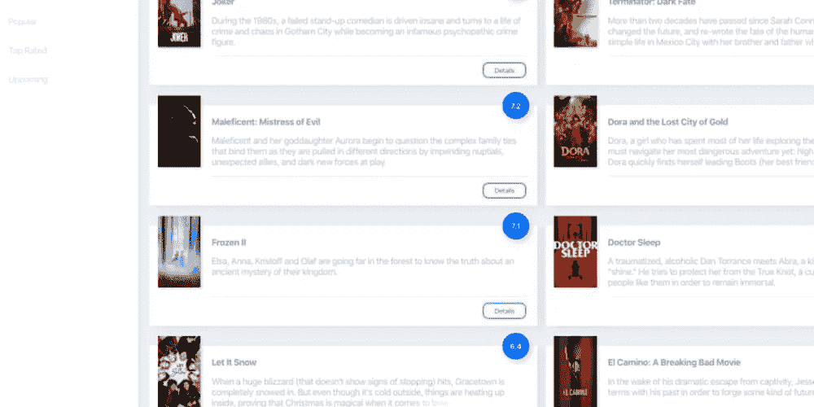

# 使用 React、styled-components 和 React Hooks 创建一个可搜索的电影应用程序

> 原文：<https://javascript.plainenglish.io/creating-a-searchable-movie-app-using-react-styled-components-and-react-hooks-8d149611d05c?source=collection_archive---------8----------------------->



随着 React Hooks 成为新常态，它们无疑让我更加沉迷于 React。前几天，我在这里评论了一个帖子[，觉得我应该写这篇文章。在本文中，我们将完全使用 React hooks 使用](https://dev.to/manan30/comment/hk8a) [TMDb API](https://www.themoviedb.org/) 创建一个小型的可搜索电影数据库。我们还将看到如何创建 100%可重用的组件。所以不要再拖延了，让我们开始吧。

# 项目设置

让我们创建一个新的 react 应用程序。最好的方法是使用`npx create-react-app movie-database`。接下来，我们想安装`styled-components`来设计我们的应用程序，安装`axios`来发出网络请求。使用`npm i axios styled-components`或`yarn add axios styled-components`安装它们。

安装好项目依赖项后，让我们在这里生成一个键[来访问 TMDb API。因为顶部的链接有详细的步骤，所以我不打算在这里重复这些步骤。但是，如果你觉得在任何一个步骤上卡住了，请在下面留下你的评论。](https://developers.themoviedb.org/3/getting-started/introduction)

我希望您能够成功地生成一个密钥！请复制密钥并将其粘贴到某个我们在某个时候会需要该密钥的地方。

# 概观

现在我们的项目都设置好了。让我们了解事情是如何进行的，以及我们将使用什么样的钩子。首先，对钩子做一些基本介绍。传统上，我们认为功能组件是没有状态和生命周期方法的哑组件。因此，这不允许我们制造有效的可重用组件和类组件，另一方面，有许多与它们相关联的模板，甚至执行一个简单的操作。但是，钩子完全改变了我们的思维方式。有了钩子，我们可以让任何功能组件有状态，甚至在其中执行生命周期操作。在本文中，我们将看到两个 React 挂钩，即`useState`和`useEffect`。`useState`钩子允许我们将状态变量添加到我们的功能组件中，而`useEffect`帮助我们完成通常在生命周期方法中完成的任务。React 还允许我们定义自己的定制钩子，稍后会详细介绍。点击阅读更多关于 React 钩子[的信息。](https://reactjs.org/docs/hooks-overview.html)

此外，我们将使用[样式组件](https://www.styled-components.com/)来设计应用程序的样式，但你也可以使用 CSS 或任何其他预处理器。

所以，让我们开始创建一些组件。首先，我们将创建一个网格组件来显示所有的电影。创建一个名为 Grid 的目录，并添加`index.js`和`styled.js`文件。

# 网格组件

## 网格/索引. js

```
import React from 'react';
import PropTypes from 'prop-types';

import GridItem from '../Item';

import GridContainer from './styled';

import Constants from '../../utils/Constants';

function Grid({ items }) {
  return (
    <GridContainer>
      {items.map((item, i) => {
        const idx = i;
        return (
          <GridItem
            key={idx}
            title={item.title}
            image={`${Constants.IMAGE_URL}/${item.poster_path}`}
            overview={item.overview}
            ratings={item.vote_average}
          />
        );
      })}
    </GridContainer>
  );
}

Grid.propTypes = {
  items: PropTypes.arrayOf(PropTypes.any)
};

Grid.defaultProps = {
  items: []
};

export default Grid;
```

## Grid/styled.js

```
import styled from 'styled-components';

const GridContainer = styled.div`
  display: flex;
  width: 100%;
  flex-direction: row;
  flex-wrap: wrap;
`;

export default GridContainer;
```

*   让我们看看这个组件是如何工作的。`Grid`组件将根据其子组件的宽度创建一个`N X N`网格。你唯一需要传入的是一个`items`数组。这是你的第一个可重用组件。你可以在任何项目中使用这个`Grid`。您可以传入道具或使用任何其他组件作为其子组件。
*   在这个例子中，我创建了一个`GridItem`组件作为`Grid`的子组件。`GridITem`组件的代码如下。创建一个名为 GridItem 的目录，并添加`index.js`和`styled.js`文件。

# 网格组件

## GridItem/index.js

```
import React from 'react';
import PropTypes from 'prop-types';

import {
  Container,
  Content,
  Image,
  Text,
  FAB,
  Separator,
  Button
} from './styled';

function Item({ image, title, overview, ratings }) {
  return (
    <Container>
      <Image image={image} />
      <Content>
        <Text weight='bolder' relative>
          {title}
        </Text>
        <Text color='#BFC0CE' height>
          {overview}
        </Text>
        <FAB>{ratings}</FAB>
        <Separator />
        <Button>Details</Button>
      </Content>
    </Container>
  );
}

Item.propTypes = {
  image: PropTypes.string,
  title: "PropTypes.string,"
  overview: PropTypes.string,
  ratings: PropTypes.string
};

Item.defaultProps = {
  image: '',
  title: "'',"
  overview: '',
  ratings: ''
};

export default Item;
```

## grid item/style . js

```
import styled from 'styled-components';

const Container = styled.div`
  display: inline-flex;
  height: 150px;
  width: calc(50% - 45px);
  margin-top: 16px;
  margin-bottom: 20px;
  margin-right: 15px;
  padding: 15px;
  background: white;
  box-shadow: 10px 5px 15px #e0e5ec;
`;

const Image = styled.div`
  height: 128px;
  width: 90px;
  margin-top: -32px;
  background-color: white;
  background-image: url(${props => props.image && props.image});
  background-position: center center;
  background-repeat: no-repeat;
  background-size: cover;
  box-shadow: 3px 2px 4px #dbdee3;
`;

const Content = styled.div`
  height: 100%;
  width: 100%;
  margin-left: 20px;
  margin-top: 5px;
  margin-bottom: 15px;
`;

const Text = styled.div`
  position: relative;
  margin-bottom: 15px;
  height: ${props => props.height && '3.6em'};
  font-size: ${props => (props.size && props.size) || '16px'};
  font-weight: ${props => (props.weight && props.weight) || ''};
  color: ${props => (props.color && props.color) || '#9D9FB0'};
  overflow: hidden;
  ::after {
    content: '';
    text-align: right;
    position: absolute;
    bottom: 0;
    right: 0;
    width: ${props => (props.relative && '0') || '40%'};
    height: 1.2em;
    background: linear-gradient(
      to right,
      rgba(255, 255, 255, 0),
      rgba(255, 255, 255, 1) 50%
    );
  }
`;

const FAB = styled.div`
  display: flex;
  height: 48px;
  width: 48px;
  margin-top: -150px;
  border-radius: 50%;
  float: right;
  color: white;
  box-shadow: 4px 4px 10px #c9d8db;
  background-color: #2879ff;
  align-items: center;
  justify-content: center;
  font-size: 14px;
  font-weight: bold;
`;

const Separator = styled.hr`
  position: relative;
  height: 2px;
  margin: 10px 0;
  background: #f2f4f8;
  border: none;
`;

const Button = styled.div`
  display: flex;
  width: 64px;
  padding: 5px;
  margin-right: 5px;
  float: right;
  justify-content: center;
  align-items: center;
  font-size: 12px;
  border-radius: 10px;
  border: 2px solid #2879ff;
  color: #2879ff;
  cursor: pointer;
  :hover {
    background: #2879ff;
    color: white;
    box-shadow: 2px 0 7px #c9d8db;
  }
`;

export { Container, Content, Image, Text, FAB, Separator, Button };
```

有了网格组件，让我们获取一些数据来显示。我们将使用 axios 从 TMDb API 获取数据。是时候展示我们之前创建的 API 密钥了。

让我们创建一个名为`API.js`的文件，并使用下面的代码。

# API.js

```
import axios from 'axios';

const movies = type => {
  return axios.get(
    `${Constants.REQUEST_URL}/movie/${type}?api_key=${Constants.API_KEY}`
  );
};

export default { movies };
```

现在让我们将视图中的所有内容联系在一起，看看钩子是如何工作的。创建一个名为`Main`的目录，并添加如下所示的两个文件。这是我们的主视图，我们的电影网格将在这里显示。

# 主视图

## Main/styled.js

```
import styled from 'styled-components';

const RootContainer = styled.div`
  height: 100vh;
  width: 100vw;
  display: inline-flex;
`;
const SideBarSection = styled.section`
  width: 20%;
  background-color: white;
  box-shadow: 3px 0 15px #e5e9f0;
`;

const ContentSection = styled.div`
  height: 100%;
  width: 100%;
`;

const SearchBarSection = styled.section`
  height: 38px;
  width: 256px;
  margin: 10px 0;
  padding: 0 20px;
`;

const MoviesGridSection = styled.section`
  height: calc(100% - 88px);
  width: calc(100% - 28px);
  padding: 20px;
  overflow-y: scroll;
`;

export {
  RootContainer,
  SideBarSection,
  ContentSection,
  SearchBarSection,
  MoviesGridSection
};
```

## main/索引. js

```
import React, { useState, useEffect } from 'react';

import Search from '../../components/Search';
import MoviesGrid from '../../components/Grid';

import Get from '../../api/Get';
import Constants from '../../utils/Constants';
import useSearch from '../../hooks/useSearch';

import {
  RootContainer,
  ContentSection,
  MoviesGridSection,
  SearchBarSection
} from './styled';

Constants.FuseOptions.keys = ['title'];

function Main() {
  const [movies, setMovies] = useState({});
  const [movieType, setMovieType] = useState('');

  useEffect(() => {
    try {
      (async () => {
        const popularMovies = await Get.movies('now_playing');
        setMovies(state => {
          const newState = { ...state };
          newState.now_playing = popularMovies.data.results;
          return newState;
        });
        setMovieType('now_playing');
      })();
    } catch (e) {
      console.log({ e });
    }
  }, []);

  return (
    <RootContainer>
      <ContentSection>
        <MoviesGridSection>
          <MoviesGrid items={results} />
        </MoviesGridSection>
      </ContentSection>
    </RootContainer>
  );
}

export default Main;
```

*   在`index.js`文件中，我们使用了`useState`和`useEffect`。让我们看看他们怎么做。
*   第一个`useState`。我们都熟悉在类组件的构造函数中定义一个`state object`。在功能组件中，我们可以使用`useState`钩子定义有状态变量。
*   `useState`不过是一个 JavaScript 函数，它接受一个初始值作为参数，并返回给我们一个数组。`const [A, setA] = useState(0)`如。这里我们给`useState`钩子传递一个初始值 0，它返回给我们一个有两个条目的数组。第一个是该变量的当前值，第二个是设置该值的函数。
*   作为比较，类组件中上述代码中的状态变量如下所示

```
this.state = {
  movies: {},
  movieType: ''
};
```

*   我们知道，每当我们在类组件中执行`this.setState()`时，它都会被重新呈现。类似地，当我们调用由`useState`返回的`set`函数时，组件被重新呈现。在上面的点中调用`setA()`会重新渲染组件。
*   而这个简单来说就是`useState`。最后，它允许你声明状态变量。
*   继续进行`useEffect`。useEffect 允许我们执行以前在生命周期方法中执行的任务。
*   useEffect 要比 useState 复杂得多。它接受一个回调函数和一个可选的依赖数组作为参数。看起来是这样的`useEffect(callback, <dependencies>)`。
*   `callback`函数指定了效果应该做什么，而依赖数组告诉效果何时需要运行。
*   如果 useEffect 没有依赖关系数组，它将在每次渲染时运行，如果它是一个空数组，它将只在第一次渲染时运行，如果依赖关系数组有内容，它将在依赖关系改变时运行。
*   指定一个空数组可以用来执行我们通常在`componentDidMount()`生命周期方法中执行的任务。因为我们只想在代码的`useEffect`钩子中使用一个空数组后获取数据。

继续使用`npm start`运行应用程序，您将能够看到电影列表。

接下来，我们想在我们的应用程序中添加一个搜索。

*   在这个应用中，我们将使用 [Fuse.js](https://fusejs.io/) 在我们的应用中执行模糊搜索。
*   继续使用`npm install fuse.js`安装 fuse.js 模块。

首先，让我们在应用程序中添加一个搜索组件。创建一个名为 Search 的目录，并添加到`index.js`和`styled.js`文件中。

# 搜索组件

## 搜索/index.js

```
import React from 'react';
import { MdSearch } from 'react-icons/md';
import PropTypes from 'prop-types';

import { SearchBarContainer, SearchIcon, SearchInput } from './styled';

function Search({ handler, value }) {
  return (
    <SearchBarContainer>
      <SearchIcon>
        <MdSearch />
      </SearchIcon>
      <SearchInput
        onChange={handler}
        value={value}
        placeholder='Search Movies'
      />
    </SearchBarContainer>
  );
}

Search.propTypes = {
  handler: PropTypes.func,
  value: PropTypes.string
};

Search.defaultProps = {
  handler: () => {},
  value: ''
};

export default Search;
```

## search/style . js

```
import styled from 'styled-components';

const SearchBarContainer = styled.div`
  display: flex;
  justify-content: center;
  align-items: center;
  height: 100%;
  width: 100%;
  border-bottom: 2px solid #dfe5ef;
`;

const SearchIcon = styled.div`
  display: inline-flex;
  height: 24px;
  width: 24px;
  color: #9d9fb0;
  font-size: 14px;
  font-weight: bolder;
  svg {
    height: 100%;
    width: 100%;
  }
`;

const SearchInput = styled.input`
  height: 24px;
  width: 100%;
  margin-left: 10px;
  border: none;
  background-color: transparent;
  color: #9d9fb0;
  font-size: 14px;
  font-weight: bolder;
`;

export { SearchBarContainer, SearchIcon, SearchInput };
```

*   我们将把这个组件添加到我们的`Main`视图中。用下面的代码替换`return`的内容。

```
return (
    <RootContainer>
      <ContentSection>
        <SearchBarSection>
          <Search handler={e => search(e.target.value)} value={searchTerm} />
        </SearchBarSection>
        <MoviesGridSection>
          <MoviesGrid items={results} />
        </MoviesGridSection>
      </ContentSection>
    </RootContainer>
  );
```

*   现在我们将编写一个自定义钩子来为我们执行搜索。
*   创建一个名为`useSearch.js`的新文件，并添加如下代码。

```
import { useState } from 'react';
import Fuse from 'fuse.js';

function search({ fuse, data, term }) {
  const results = fuse.search(term);
  return term ? results : data;
}

function useSearch({ data = [], options }) {
  const [searchTerm, setSearchTerm] = useState('');
  const fuse = new Fuse(data, options);
  const results = search({ fuse, data, term: searchTerm });
  const reset = () => setSearchTerm('');
  return { results, search: setSearchTerm, searchTerm, reset };
}

export default useSearch;
```

*   正如你所看到的，我们正在使用`useState` React 钩子来创建一个定制钩子。这个钩子接受我们想要搜索的数组和传递给 fuse.js 的选项。
*   让我们在`Main`视图中使用这个钩子。
*   复制下面的代码，粘贴到`Main`视图渲染函数中的`useEffect`下面。

```
const { results, search, searchTerm } = useSearch({
  data: movies[movieType],
  options: Constants.FuseOptions
});
```

*   这就是了，我们刚刚在应用程序中添加了搜索功能。你可以根据电影的名字来搜索它们。

正如你所看到的，React 钩子使得事情变得更加清晰和易于理解。我喜欢钩子，希望看完这篇文章后，你也会喜欢钩子。

一如既往，如果你被困在某个地方，或者想讨论一些事情，或者给我一些反馈，请随时发表评论。

查看[演示](https://manan30.github.io/movies-db/)并完成[代码](https://github.com/manan30/movies-db)。

在 [Twitter](https://twitter.com/Manan_30) 和 [Instagram](https://www.instagram.com/manan__joshi/) 上找到我

*原载于 2019 年 11 月 14 日*[*https://dev . to*](https://dev.to/manan30/creating-a-searchable-movie-app-using-react-styled-components-and-react-hooks-25ej)*。*