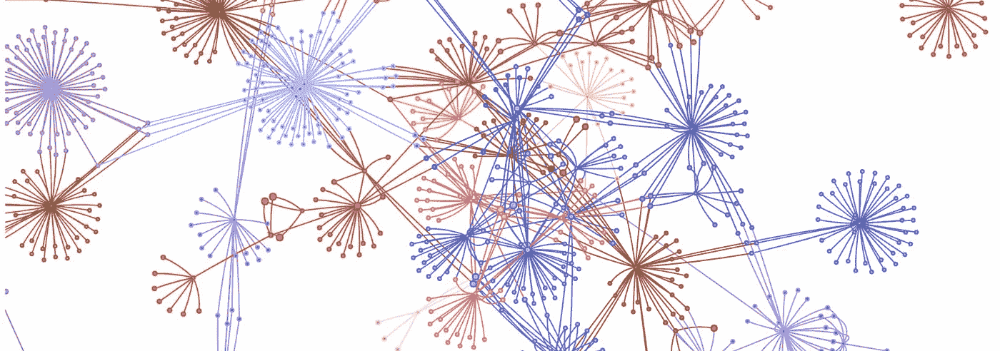

# 使用 Redux 为微前端创建共享状态库

> 原文：<https://javascript.plainenglish.io/creating-a-shared-state-library-for-micro-frontends-using-redux-7776bff18ef1?source=collection_archive---------5----------------------->



我们的开发团队最近开始使用 React 为电子商务网站构建微前端。在构建了第二个站点之后，我们注意到在 redux 操作以及它们如何处理常见的后端交互之间有很多重复。例如，用户向购物车添加商品或登录在不同的应用程序中是完全一样的。

不可避免地，我们发现了一个影响 carts 操作的 bug，并最终对两个站点上的 reducers 应用了一个修复……虽然跨两个站点复制和粘贴一个修复是微不足道的，但我们只能想象这个问题会跨越几十个站点。重构呢？这是不可持续的。有很多关于创建共享组件库的文章和观点，但是共享状态管理库呢？

我们知道我们需要创建一个 NPM 包，我们当前和未来的网站都可以利用，但问题是如何协调我们希望 redux 处理的特定于应用程序的逻辑。例如，如果站点 A 需要一个 reducer 来处理一些特定的逻辑，而这些逻辑的范围仅限于该站点，那该怎么办呢？一种方法是在 React 应用程序中使用 2 个商店。这种方法很快被证明是容易出错的，并且可能会给开发人员带来很大的认知负担。

使用 2 个商店的问题是你需要使用额外的样板代码来使`useDispatch`或`useSelector`工作。在下面的例子中，我们将上下文传递给 redux 挂钩，以识别要访问哪个存储。有两家店意味着两套`dispatch`T3 等等

我已经能感觉到这种方法酝酿的混乱。我们想要的很简单；使用外部减速器和动作的灵活性，无需多个存储🤔。

答案，现在看起来很明显，是通过`combineReducers`使用还原剂组合，如果我们选择，允许我们从无数不同的来源组合我们的还原剂。

创建一个 NPM 包，简单地公开我们已经写好(两次)的 reducers 和 actions，是一个简单的复制粘贴工作。有趣的工作是在我们的捆绑和发布中让我们的库工作，并允许在消费前端轻松导入。

在我们的 webpack 配置中，我们给`entry`点起了别名，以使开发人员更容易使用他们需要的特定 reducer，而不必编写/some/long/path/to/a/reducer。

我们的`externals`包含了我们前端已经有的包，因此它们不会被重复包含，并将减少包的大小。您可以在消费文件`frontEndStore.js`中看到，我们简单地导入我们想要的缩减器，并将它们与任何本地缩减器组合在一起。瞧。现在我们不需要担心支持多个商店！

但是出版呢？很高兴你问了。发布到 NPM 只是一个命令，但是我们也希望在 git repo 中保留标记的历史，以防我们需要在某个标记处签出库，也许是为了创建特定版本的修补程序或比较版本。以下是使版本控制和 git 标签变得简单的命令:

```
//package.json"scripts": {
  "preversion": "npm test && npm run build",
  "version": "npm run build && git add .",
  "postversion": "git push && git push --tags",
  "test": "jest",
  "analyze": "NODE_ENV=production PROFILER=1 npx webpack",
  "build": "NODE_ENV=production npx webpack",
  "start": "NODE_ENV=development npx webpack --progress --color --watch"
}
```

现在，开发人员需要做的就是运行`npm version minor`来更新 package.json 版本，添加标签并创建一个生产版本。`npm publish`将为你的崇拜者开放图书馆！

虽然这种解决方案似乎符合我们的需求和特定场景，但对于微前端架构肯定有很多强烈的意见，我们仍在学习之旅中。希望这将使您创建共享 redux 库的尝试变得更加容易。

喜欢这篇文章吗？如果有，通过 [**订阅获取更多类似内容解码，我们的 YouTube 频道**](https://www.youtube.com/channel/UCtipWUghju290NWcn8jhyAw) **！**