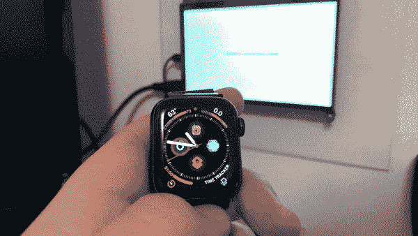
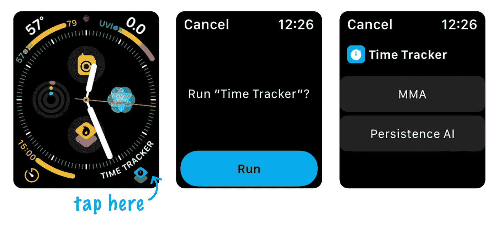
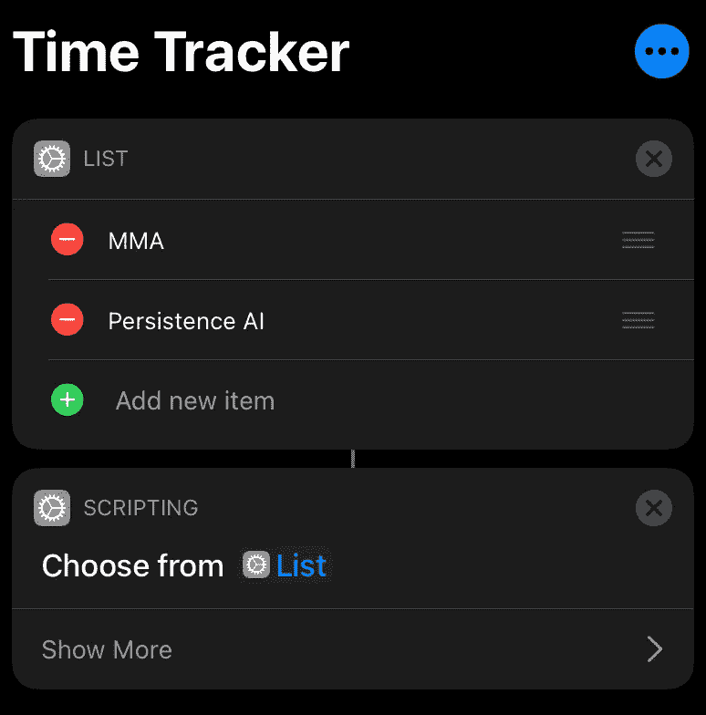
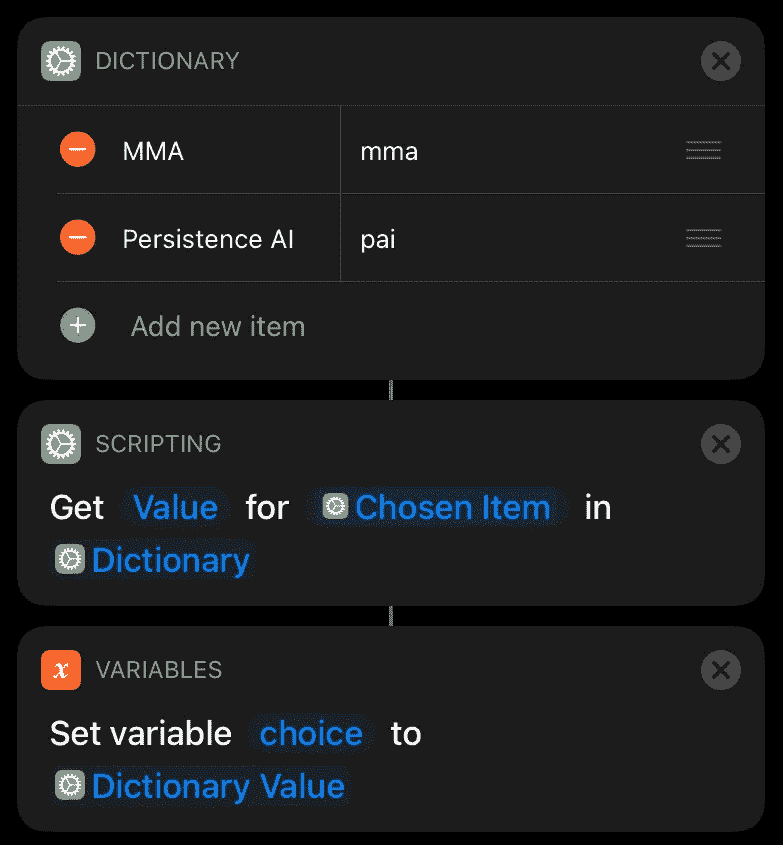
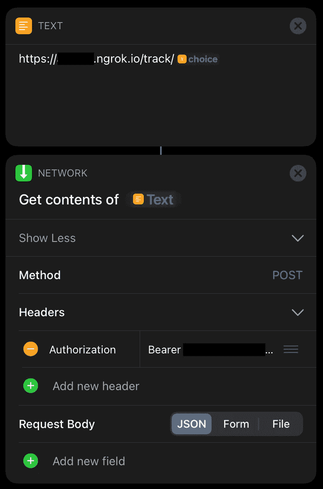
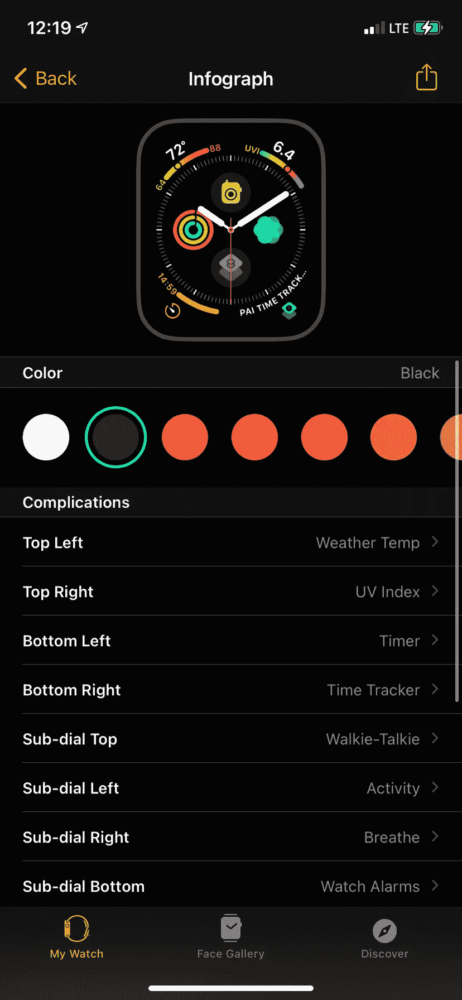
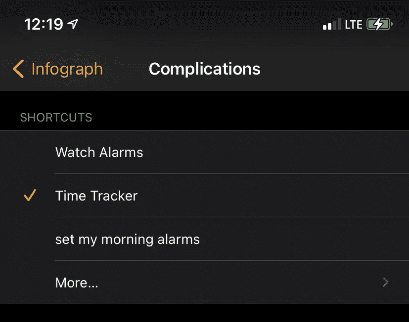

# 用 watchOS 快捷方式和 Node.js 创建一个简单的时间跟踪器

> 原文：<https://javascript.plainenglish.io/creating-a-simple-time-tracker-with-watchos-shortcuts-and-nodejs-9733ad361dfd?source=collection_archive---------7----------------------->

## 在我的 Apple Watch 上轻轻一点，追踪时间变得前所未有的简单。

如果你只是想看看这个项目的代码，点击这里查看 GitHub repo！随意克隆它&让它成为你自己的。

在过去的几个月里，我所有的工作都是以小时为基础的，不是兼职就是合同。

一开始，我非常努力地用电子表格记录我的时间……但这并没有持续很久。在我意识到之前，我已经开始在文本文件中记录我的时间，然后最终只使用我的 Notes 应用程序。这个过程使得报告时间和计费客户最近变得一团糟。

我一直试图找到一种方便的方法来跟踪我的时间，而不会占用太多时间——我想我可以建立一个网络应用程序，并使用带有触摸屏的树莓 Pi 来跟踪事情，或者也许我可以在我的桌子上贴满 NFC 标签，扫描它们来开始/停止跟踪某些活动的时间。或者甚至是一个小木箱，里面有我想追踪的所有东西的按钮？

然后，iOS 14 和 watchOS 7 发布了，我发现了[快捷键](https://apps.apple.com/us/app/shortcuts/id915249334)。我肯定这对你们大多数人来说不是什么大新闻，但是我一直都没有意识到它的存在。

因此，我决定创建一个可以在我的手表表面上运行的快捷方式，搭配一个小的 Nodejs web 应用程序，来记录我正在进行的各种项目的时间。

# 最终结果

如果你只是想看看，这里有一个快速演示。[你也可以在 GitHub](https://github.com/adboio/time-tracking) 上看到 web 应用的源代码。

在我选择一个选项后，一个事件被保存到一个数据库中，这样我就能准确地知道我每天何时开始&何时停止每个项目的工作。

我最终得到了类似这样的数据，我计划创建一个很酷的 web 界面来查看它。

# 第 0 步:计划

目标是能够点击我的表盘上的图标，从菜单中选择一个项目，开始或停止跟踪给定活动的时间。然后，我将能够在以后查看数据，以计算在每个项目上花费的时间。

为了做到这一点，我需要做到以下几点:

1.  创建一个能够处理发布请求并向数据库添加跟踪事件的 web 应用程序
2.  创建一个快捷方式(与 watchOS 兼容),可以显示菜单并向服务器发出 POST 请求

# 第一步:网络应用

我决定先解决更耗时的部分:网络应用。

我的首选技术是 Nodejs + Expressjs + MySQL，所以我创建了一个新的 Express 项目，并在 Raspberry Pi 上启动了一个 MySQL 服务器。在这篇文章中，我不会详细介绍如何设置这些东西，但是有很多很棒的资源可以用来学习如何设置。

## 数据库ˌ资料库

我想出的 MySQL 数据库模式没什么特别的；只有一个带有`id`、`time`、`type` ( `0`表示开始，`1`表示停止)和`activity`字段的表格。您可以使用这段 SQL 来创建表:

一旦添加了一些数据，该表将如下所示:

## 按指定路线发送

web 应用程序本身实际上只有两项工作:处理向数据库添加跟踪事件的 POST 请求，以及呈现包含数据的简单网页。在本文中，我们将主要关注前者——您可以创造性地显示数据！:)

我创建了一个用于处理请求的`/track` route，它有两个函数用于获取/设置数据库中的事件，还有一些简单的逻辑用于判断请求是要“开始”还是“停止”跟踪活动。

您可能会注意到这个路由还实现了一些定制的中间件，即`authHandler.checkApiKey`函数，它的功能正如其听起来一样:检查每个请求的授权头中是否有有效的 API 键，以确保没有恶意请求通过。如果你有兴趣，[你可以在这里查看代码](https://github.com/adboio/time-tracking/blob/master/helper/authHandler.js)。

## 主办；主持

一旦服务器开始运行，我们需要它在真实的互联网上可用，以便快捷方式(或其他任何东西)能够向它发出请求。

你可以通过 Heroku 这样的服务很容易地做到这一点，或者甚至在 Raspberry Pi 上托管你自己的网络服务器。

为了时间和简单，也因为我已经有了一个帐户，我选择使用 [ngrok](https://ngrok.com) 来托管我的应用程序。`ngrok`允许您将所有 web 流量从公共 ngrok.io 域转发到您机器上运行的本地 web 服务器。我一直在使用 ngrok 测试 web 应用程序，所以我已经有了一个付费帐户，可以提供我需要的所有功能。

当 Pi 启动时，我使用`pm2`在端口 3000 上启动我的节点服务器，并使用自定义域启动`ngrok`。所以，每次我打开我的 Raspberry Pi，ngrok 和节点服务器都会开始运行，允许来自公共互联网的请求访问我的应用程序。

# 步骤 2:捷径

现在我已经有了一个服务器，它接受来自公共 URL 的 POST 请求，我可以创建一个 iOS 快捷方式来发出这些请求。

我创建了一个名为 Time Tracker 的快捷方式，并通过显示我可能想要跟踪的项目列表来启动它。

当我选择一个时，活动的唯一“代码”从字典中选择并保存到一个名为`choice`的变量中，因此它最终可以在 POST 请求中传递。

最后，用`choice`变量构造 URL，并使用 POST 动作和带有 API 键的授权头执行“从 URL 获取内容”动作。

# 第三步:把它放到 Apple Watch 上！

有趣的是把所有这些联系在一起！

在 Watch 应用程序中，您可以自定义显示在 watchface 上的所有复杂功能，从 watchOS 7 开始，这些复杂功能可以与快捷方式关联。

点击你的表盘，选择你想要快捷键的位置，然后选择你的新快捷键。

# 就是这样！

这(希望)解决了我现在的时间跟踪问题，我希望你能学到一些新东西，或者为你的下一个项目获得一些灵感。

如果您对构建有任何疑问，或者在尝试创建自己的构建时需要帮助，请随时联系我们。:)