# 为我们的后端创建一个简单的 Vue.js 网站

> 原文：<https://javascript.plainenglish.io/creating-a-simple-vue-js-website-for-our-backend-1d1ef8839c27?source=collection_archive---------2----------------------->

## 如何在 Vue.js 中为 JAVA Springboot 后端构建 UI

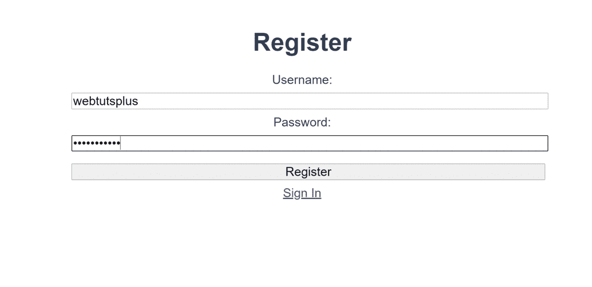

# 介绍

到目前为止，我们已经能够使用 Spring Boo t 和

[](https://medium.com/webtutsplus/a-simple-user-authentication-api-made-with-spring-boot-4a7135ff1eca) [## 用 Spring Boot 制作的一个简单的用户认证 API

### 如今，开发一个合适的应用程序来做你需要它做的事情比以往任何时候都容易。有成千上万的…

medium.com](https://medium.com/webtutsplus/a-simple-user-authentication-api-made-with-spring-boot-4a7135ff1eca) 

我们已经能够[将它上传到数字海洋](https://medium.com/webtutsplus/how-to-publish-your-spring-boot-app-to-the-cloud-97590666bf7b)，这样它就可以被访问

[](https://medium.com/webtutsplus/how-to-publish-your-spring-boot-app-to-the-cloud-97590666bf7b) [## 如何将您的 Spring Boot 应用发布到云

### 介绍

medium.com](https://medium.com/webtutsplus/how-to-publish-your-spring-boot-app-to-the-cloud-97590666bf7b) 

从网上。虽然，即使作为一个更喜欢后端而不是前端的人，我也承认 API 本身很无聊，所以今天我们将使用 Vue.js 3 为 API 添加一个图形用户界面，这样它就不会那么无聊了。

也请查看我们的最新系列

[](https://medium.com/technology-hits/lets-develop-an-ecommerce-application-from-scratch-using-java-and-spring-6dfac6ce5a9f) [## 让我们使用 Java 和 Spring 从头开始开发一个电子商务应用程序

### 我们将使用 Java、Spring backend 从头开始构建一个电子商务应用程序，在 Vue.js 中构建 web UI，以及…

medium.com](https://medium.com/technology-hits/lets-develop-an-ecommerce-application-from-scratch-using-java-and-spring-6dfac6ce5a9f) 

# 演示

你可以在这里看到最终的演示，并尝试一下。

 [## 网络教程

### 编辑描述

139.59.208.56](http://139.59.208.56/#/signup) 

# 要求

为了开始，我们需要安装 NodeJS，因为我们将使用它来与 Vue.js 一起工作。要获得 NodeJS，你可以前往[他们的网站](https://nodejs.org/)来获得 NodeJS，就个人而言，我会建议你使用 LTS 版本，因为它应该更稳定。对于 Linux 用户，我建议使用[节点版本管理器](https://github.com/nvm-sh/nvm)，因为我发现 Linux 在处理文件和权限方面存在一些问题，尽管这只是一个建议。

要测试您是否成功安装了 NodeJS，您可以打开您的终端并运行以下命令:

```
node -v && npm -v
```

它会给出你已经安装的 NodeJ 的版本和你已经安装的 NPM(节点包管理器)的版本。

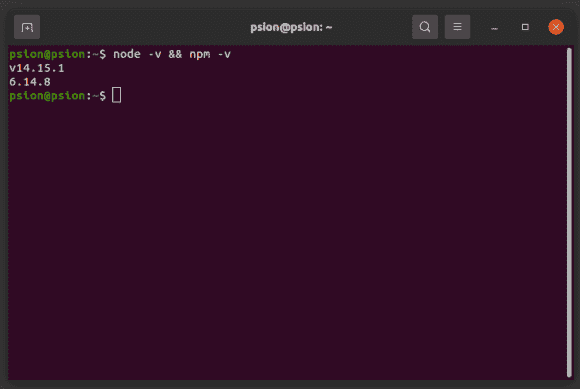

现在您已经安装了节点和 NPM，我们可以继续安装 Vue 的 CLI(命令行界面)。打开您的终端或 cmd，输入以下命令安装 CLI:

```
npm install -g @vue/cli
```

该命令告诉 npm 全局安装 vue . js ' CLI(-g)，这样您就可以使用 CLI 命令，而无需在每个目录下安装 CLI。如果你得到一个错误，抱怨没有权限，那是因为 NPM 没有修改文件所需的权限。我一直有权限错误，这就是为什么我最终使用节点版本管理器。

您可以通过在终端中键入以下命令来测试新安装的 Vue.js' CLI:

```
vue -V
```

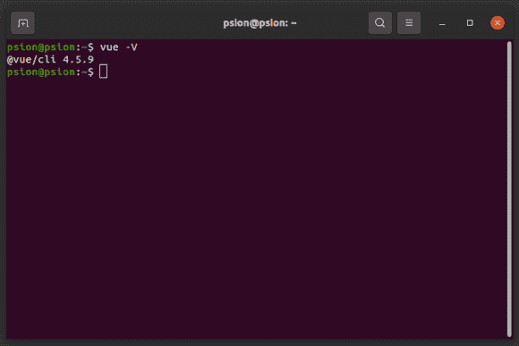

您还需要一个编辑器或 IDE。就我个人而言，我将使用 [VS 代码](https://code.visualstudio.com/)，但请随意使用您最熟悉的代码。

最后，如果这还不明显，你需要在你的电脑上安装一个网络浏览器。类似于[谷歌的 Chrome](https://www.google.com/chrome/) ， [Mozilla 的 Firefox](https://www.mozilla.org/en-US/firefox/new/) ，[微软的 Edge](https://www.microsoft.com/en-us/edge) ，[Chrome](https://www.chromium.org/Home)，甚至[苹果的 Safari](https://www.apple.com/safari/) 。

注意:我将与我在上一个教程中创建的云服务器进行交互，但是如果由于某种原因，在您阅读本文时服务器不再可用，您可以下载服务器的源代码，并在您自己的 VPS 或本地主机上运行它。

现在我们开始黑吧，好吗？

# 设置项目

前往您的开发文件夹，在该文件中打开您的终端。键入以下命令:

```
vue create web-tutorial
```

这个命令告诉 Vue.js' CLI 创建一个名为 web-tutorial 的项目，尽管您可以随意命名这个项目。接下来，将要求您选择要使用什么预设来创建您的项目，使用箭头键，向下移动到“手动选择功能”，然后单击“输入”。

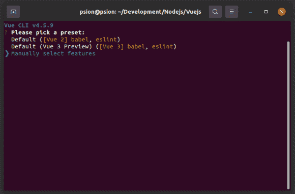

接下来，您将被要求检查您想要在您的项目中访问哪些特性，为此您将想要选择:Babel、Router 和 Linter / Formatter。如果您向下移动到一个选项，您可以通过按“空格键”来选择它。一旦你选择了这三样东西，你可以按回车键继续。

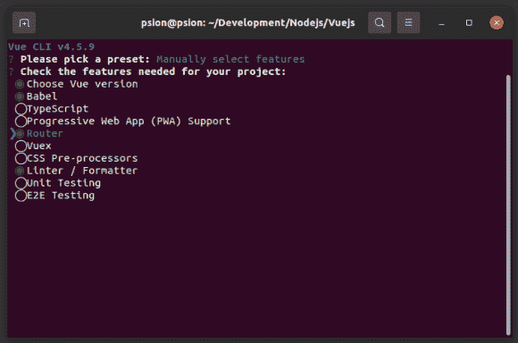

我们将使用 Vue.js 3，因此向下移动到“3.x(预览)”，然后按“Enter”。

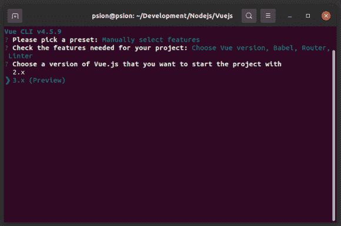

接下来，它会问你是否想使用路由器的历史模式，你可以说不，通过键入“n”，然后按下回车键“回车”。

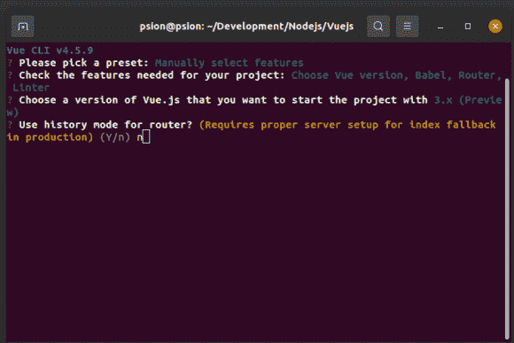

对于 linter，我们只需要带有错误预防功能的 ESLint，所以您只需按“Enter”即可。

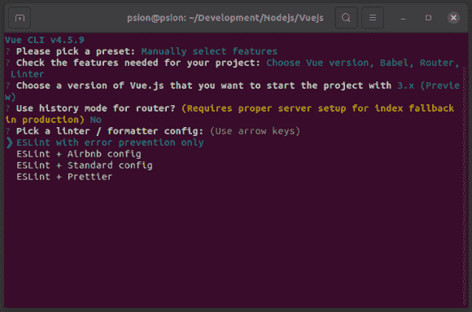

对于额外的 lint 功能，您只需按“Enter”即可。

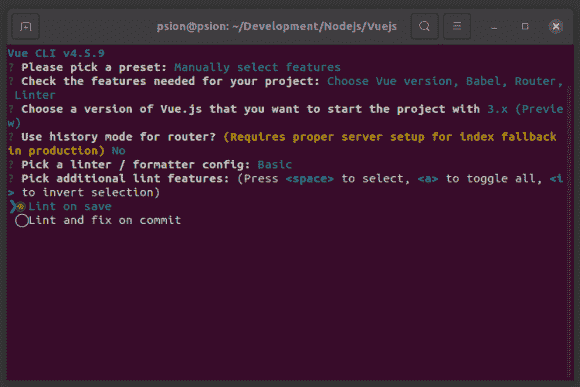

如果我们的 Babel 和 ESLint 配置在它们自己的专用文件中，我们会更喜欢这样，这样我们就可以按“Enter”键。

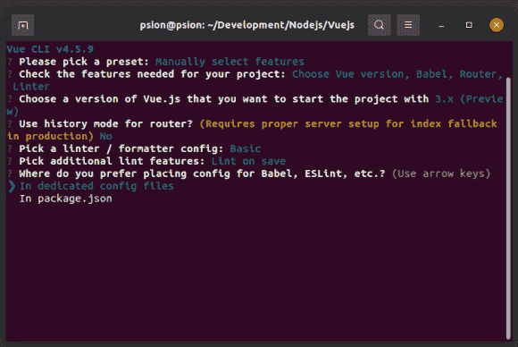

当它询问你是否想将它保存为一个预置时，你可以说不(“n”，然后“输入”)，尽管你也可以保存它，如果你真的想的话。

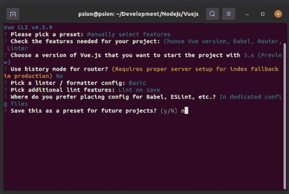

唷！最后完成项目选项的设置后，Vue.js CLI 将根据您选择的选项生成您的项目。这可能需要一段时间，所以请随意伸展一下你的腿。

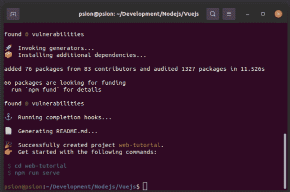

你会注意到 Vue.js 已经推荐了一些启动命令给我们运行，让我们看看它们是做什么的。第一个命令将您终端的 active directory 更改为我们刚刚创建的目录(cd web-tutorial)，第二个命令创建一个开发服务器，它将在本地服务器上托管我们的代码，如果在源代码中检测到任何更改，它将自动刷新。在使用了 Java 和 Spring Boot 之后，热重装是一个受欢迎的改变，手动重启服务器很烦人。如果我们现在在浏览器中打开 [HTTP://localhost:8080](http://HTTP://localhost:8080) ，我们应该会看到这个网站:


这是我们创建项目时，Vue.js 自动为我们生成的默认预建网站。现在我们已经启动并运行了开发服务器，我们可以在我们的文本编辑器或 ide 中打开项目，在我的例子中，这将是 VS 代码。像往常一样，随意查看代码，但不要在不知道它做什么的情况下尝试更改一些东西，因为这可能会导致奇怪的错误和大量的谷歌搜索来试图找到答案，相信我，我现在会这样做。

# 让我们做一个网站

所有重要的代码都可以在“src”文件夹中找到。“src/main.js”是我们项目的主要入口。“src/views”是我们所有网页的位置。“src/路由器”是路由器逻辑初始化的地方。“src/components”包含了被称为“组件”的东西，Vue.js 的设计非常模块化，你可以使用组件作为一种方式来构建一个包含可重用代码的网站。“src/assets”包含我们网站的资产，如图片。

既然我们知道了什么是重要的部分，我们可以从删除我们不会使用的部分开始。你可以删除“src/components ”,因为我们的网站非常简单。你可以删除“src/views/About.vue”和“src/views/Home.vue”，我们将一起创建不同的页面。

接下来，我们打开“src/App.vue”。你可以把它看作是我们网站的主要包装。Vue 代码倾向于由三部分组成。第一部分是“<template></template> ”部分，这是我们代码的逻辑部分，最后一部分是“”部分，这是我们存储网页设计部分的地方。首先，我们将替换“src/App.vue”的模板部分:

```
<template>
  <router-view/>
</template>
```

我们只是移除了屏幕顶部的导航栏，以便于使用。接下来，我们需要在“src/views”中创建三个新文件。第一个文件将称为“log in . vue”(“src/views/log in . vue”)，第二个文件将称为“sign up . vue”(“src/views/sign up . vue”)，第三个文件将称为“logout . vue”(“src/views/logout . vue”)。接下来，我们需要创建每个文件的脚手架，所以让我们从“src/views/Login.vue”开始:

让我们从解释模板部分开始:

h1:这是一个头标记，值为 Login。

接下来是脚本部分:

我们需要导出这个视图，以便可以从应用程序的其他部分访问它。从技术上来说。vue 文件被认为是组件，所以我将把它们称为组件。我们将登录组件命名为“Login”。

最后是风格部分:

我们给我们的网站主体 80%的宽度，这样它的两边会有一点空白，这让我们的网站看起来更整洁。我们声明使用哪种字体系列，我们在顶部和底部给它一些填充，我们设置字体大小，并删除空白。CSS 是一个非常复杂的话题，我甚至不能假装是这方面的专家，所以我只能从表面上向你解释。

我们规定输入、文本区域、按钮、段落、div、部分、文章和选择的值显示为块，宽度为 100%，字体系列为 sans-serif，字体大小为 1em，边距为 0.5em

我们也有一个特殊的“警告”类，它将被用来把警告文本的颜色变成红色。

CSS 在所有页面上都是一样的，这就是我在这里介绍它的原因。

接下来是“src/views/SignUp.vue”(这几乎会是 Login.vue 的一个副本):

```
The code is a lot similar to that of “src/views/Login.vue”, but with two differences. In the header tag (h1) we changed the text to “Sign Up” and we also changed the name of the component to “SignUp”.
```

最后一页是“src/views/LogOut.vue”:

同样，我们只是将 header 标记改为“Log Out ”,并将组件的名称改为“LogOut”。有了摆在我们面前的基础，我们需要将这些新创建的页面(或组件)添加到我们的路由器。所以我们来编辑一下“src/router/index.js”:

因此，我们导入了登录、注册和注销组件，然后为每个组件添加了一个路由，这就是我们在该文件中所做的全部更改。这段代码的其余部分由 CLI 生成。现在，如果你打开你的网站，你会看到这样的内容:

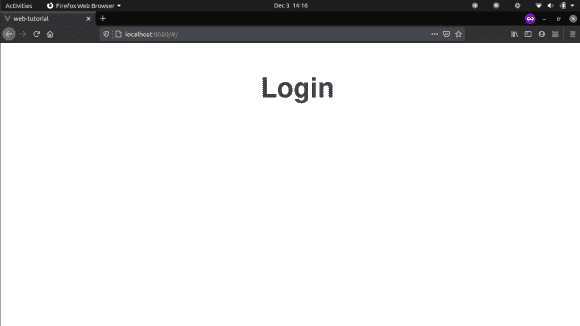

如果看起来不是这样，那么只需检查您的开发服务器是否仍在运行(npm run serve)。

# 构建登录页面

现在，这段代码有点长，所以我会在解释它的时候尽可能地把它分开，然后在最后，我会把它全部展示出来。首先，让我们看看登录页面的模板部分“src/views/Login.vue”:

所以我们仍然有 header 标签，说明这是登录页面。

接下来是另一个 header 标签，但是这个是 h3 而不是 h1，所以它比 h1 标签小一点。header 标签的 v-if 部分是 Vue.js 所独有的，它类似于 Javascript 的普通 if 语句，它只是说如果变量“error”的值为“true ”,我们只想显示这个子标题，这个变量已经在我们的 script 标签中设置好了，所以我们马上就会看到它。“{{errorMessage}}”部分用于显示我们将在脚本标记中初始化的“errorMessage”变量的内容。

之后，我们有一个表格。表格类似于你在网络空间之外得到的那种表格。“@submit.prevent="logIn " "”声明当我们提交这个表单进行评估时，我们不希望它刷新页面，我们希望它运行名为“logIn”的函数，这个函数可以在 script 标记中找到。

顾名思义，labels 是一个用于特定字段的标签，它跟在表单的后面。

第一个输入是文本类型，这意味着我们将像处理普通文本输入一样处理它。我们给它一个名称、id 和“用户名”类型的 v-model。v-model 将我们的输入值绑定到脚本标记内的变量，称为“username”。

第二个输入是密码类型，所以它会审查我们在输入框中键入的任何内容。我们给它一个名称、id 和“密码”的 v-model。

最后，我们有一个路由器链接到我们的注册页面，这是一个 Vue.js 特定的标签。它将被用来路由我们的网站到注册页面。

接下来是“src/views/Login.vue”的脚本标签:

为了更容易解释我们代码的特定部分，我们将把它分成几个片段。

```
import { ref } from 'vue';
import router from '../router/index';
```

首先，我们导入 ref，这是 Vue 中的一种特殊类型，它允许我们创建具有特定值的引用，这与数据管理有关，我们还导入 router，以便我们可以使用 Javascript 更改路由。

```
setup() {
    const username = ref('');
    const password = ref('');
    const error = ref(false);
    const errorMessage = ref('');
```

因此，我们创建了一个特殊的函数来设置这个组件的代码。该功能是 Vue.js 3 功能的一部分。

我们创建了几个常量引用，称为用户名、密码、错误和错误消息。Username 将用于存储对用户输入的用户名的引用，我们将其初始化为一个空字符串。Password 与 username 变量的情况类似。正如我们之前看到的，error 将用于确定我们是否需要显示错误消息。如果我们需要显示一个错误消息，我们将设置 error message 等于我们想要显示的消息，这样我们就可以有动态的错误消息。

我们创建了一个名为 logIn 的异步函数。当用户提交论坛时，将调用该函数。这个函数必须是异步的原因是，我们希望等待服务器的回复，否则我们会得到非常奇怪的结果，您可以通过删除函数的异步部分来测试，看看会发生什么。

我们检查以确保用户输入了用户名和密码，否则，我们使用子标题抛出一条错误消息。

如果用户输入了用户名和密码，我们会将其传递给一个特殊的函数来联系服务器。我们使用 await 关键字等待函数从服务器返回信息。

如果响应是“SUCCESS”，我们隐藏错误消息，并使用“router.push('logout ')”将用户重新路由到注销页面，我们必须明确地传递我们想要去的路由，该路由是在“src/router/index.js”文件中设置的。

如果响应不是“成功”,我们抛出一个错误消息。

该函数专门用于与服务器通信。它需要用户名和密码。它也是异步的，因为我们必须等待服务器的回复。

我们创建了一个名为 data 的新变量，并将其初始化为 JSON 值“FAILURE ”,我们这样做是因为我们希望我们的网站即使在无法与服务器通信时也能正常工作。

Fetch 是一个特殊的函数，是 Javascript web 标准的一部分。它允许我们向服务器发送 POST 请求并获取信息。第一个值是我们希望发送 post 请求的目的地，您可以将其更改为您的服务器的 IP 地址或本地主机。我们指定要发送一个 POST 请求。在我们的头中，我们规定我们将发送 JSON。在主体中，我们放入 JSON 数据，在本例中，是用户名和密码。该函数返回一个包含 HTTP 响应的承诺，因此我们需要使用“resp.json()”提取 JSON 数据。然后，我们获取 JSON 数据，并将其设置为“data”变量。如果有任何错误，我们只需将它们记录到我们的控制台。

最后，我们只返回收到的数据。

```
return {
      username,
      password,
      error,
      errorMessage,
      logIn,
    };
```

最后，我们需要返回我们创建的所有函数和变量，以便组件的其余部分可以访问它们。以下是“src/views/Login.vue”的完整源代码:

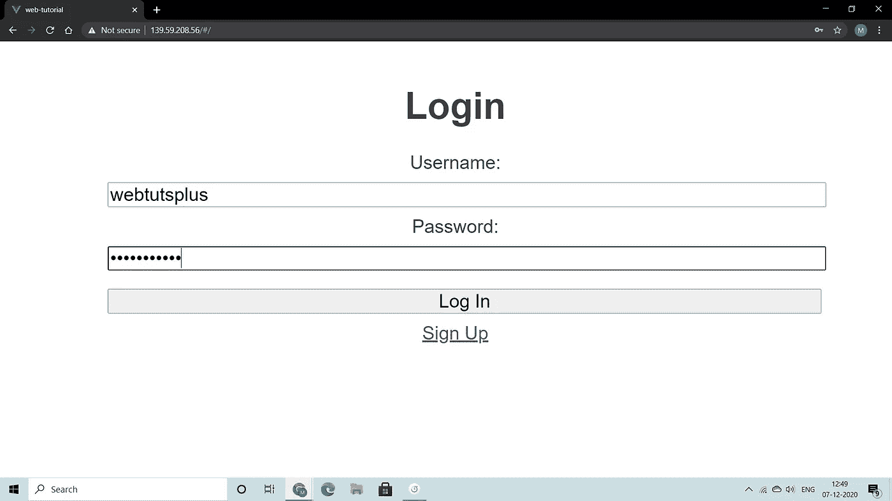

接下来是“src/views/SignUp.vue”，尽管我会从一开始就给你所有的源代码，因为没有什么是我们没有讨论过的，我认为没有理由在书面文档中重复我自己:

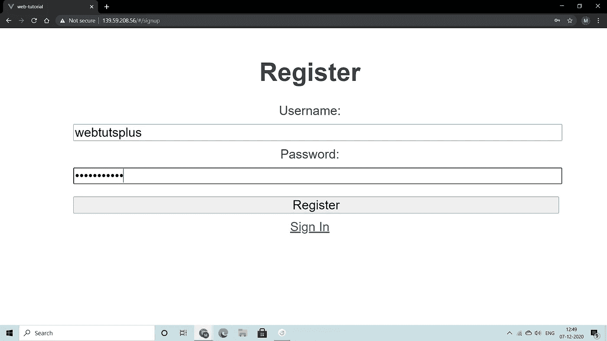

最后，我们有“src/views/LogOut.vue”:

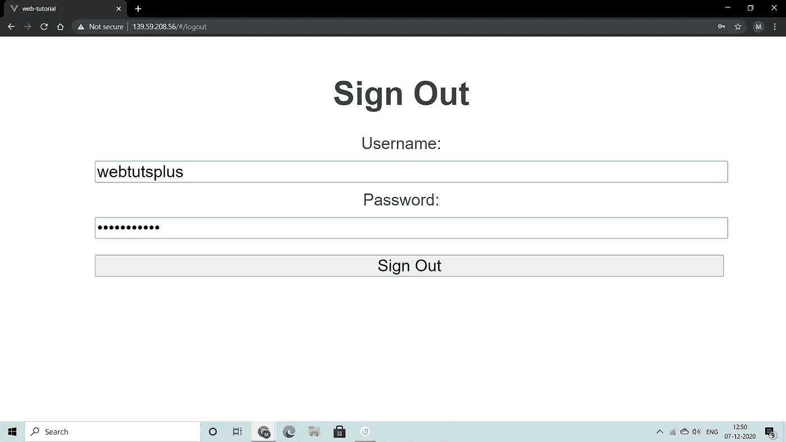

你现在应该有一个完全工作的前端网站，可以与我们之前创建的后端接口。你可以在这里找到完整的源代码。

你现在应该有一个完全正常工作的前端网站，可以与我们之前创建的后端的[接口。你可以在这里找到完整的源代码。](https://webtutsplus.com/?p=9)

感谢您阅读本文。

## 祝你愉快！