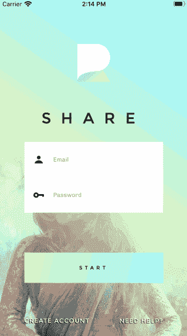
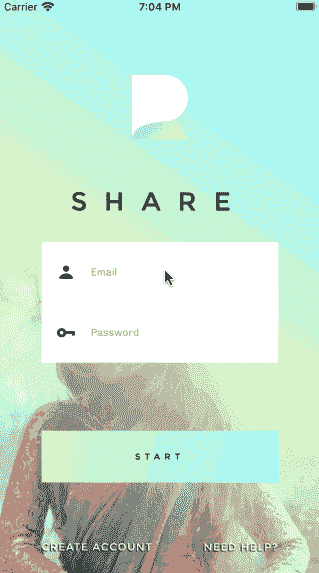

# 使用 React Native 创建流畅的登录和注销体验

> 原文：<https://javascript.plainenglish.io/creating-a-smooth-sign-in-and-logout-experience-with-react-native-62e5deffbff?source=collection_archive---------0----------------------->

在这个简短的教程中，我将展示如何使用 React 导航和 React 上下文以流畅和自然的方式处理应用程序认证。

这是我之前写的题为 [*如何用 React Native*](https://medium.com/@henkcorporaal/how-to-build-animated-login-screens-with-react-native-edb81cb500aa) 构建动画登录屏幕的教程的后续。

这里给你一个我们将要建立的印象:



Life with a mac keyboard with stuck keys

**React Native Starter Kit** :这个登录界面是取自*React Native Share Starter Kit*的一个样本，可以在这里购买[。](https://market.nativebase.io/view/react-native-share-app-theme)

**React 原生资源:**想访问这个项目的源代码和其他 React 原生资源？然后[注册我的简讯](http://knowlephant.com)。

*在我们开始之前，重要的是要认识到本教程只是前端的，不会涉及后端认证验证和令牌生成。*

# 使用全手柄容器视图组件让您的生活变得轻松

一个典型的应用程序有许多动作，这些动作出现在整个应用程序的许多屏幕上。我在想:

*   背景图像
*   键盘避免视图
*   触摸以消除键盘交互
*   加载视图

等等。等等..

为什么不将这些功能组合在一个 handle-all ContainerView 组件中，该组件可以在整个应用程序中重用？这至少是我在大多数应用程序中处理所有这些功能的方式。

这类组件的主要挑战是，当我们不知道这些组件的形状和状态时，如何从屏幕上呈现子组件。

对于有经验的开发人员来说，解决方案似乎很简单。但是每个人都有第一次…

…因此，解决方案是呈现儿童道具，这在您的应用程序调用的任何组件上都可用。

> ……`this.props.children`的作用是当**调用**一个组件时，它用来显示你在开始和结束标签之间包含的任何内容。
> 
> 参见:[React 的道具快速介绍.儿童](https://codeburst.io/a-quick-intro-to-reacts-props-children-cb3d2fce4891)

还要注意 React Native 如何为 iOS 和 Android 不同地处理 *KeyboardAvoidingView* 组件，这不是很好，但上述解决方案似乎是目前的常见做法。

还要注意放置在 *TouchableWithoutFeedback* 和其他子视图之间的视图组件。我的经验是，React 本机可触摸组件有时会弄乱设置给其子组件的样式。

# 使用 React 上下文在登录和主屏幕之间导航

也许这个标题似乎关闭。毕竟，使用 React Native 最受欢迎的导航 API 的典型导航操作将通过调用:

```
navigation.navigate(“ScreenName”);
```

但是这种方法并不适用于在认证屏幕和应用程序主屏幕之间导航的情况。

那么，我们应该如何处理这种情况呢？

答案既简单又有点复杂。

最容易的部分是简单地对应用程序中现有的身份验证标记执行检查，并根据它的存在呈现一个 navigationStack 或另一个。

困难的部分是为我们的应用程序设置状态管理。这样，我们可以调度登录和注销操作，并从我们应用程序的任何屏幕更新我们的应用程序状态。我们需要访问我们的应用程序的状态，因为一旦我们收到它，它将是我们的身份验证令牌存储的地方。

所以让我们从简单的部分开始:

…显然，这段代码不会运行，但我们会很快修复它。

这个解决方案的伟大之处在于，一旦状态改变导致 *RootStackScreen* 重新呈现，React Navigation 就会立即处理导航动画。

# 使用上下文设置商店

接下来是本教程中更复杂的部分。目标是让登录按钮的按下引发一系列事件，最终导致 *RootStackScreen* 的重新呈现，并由于更新的 authToken 状态而导航到 Home。

让我们通过以下步骤来简化这一过程:

**步骤 1:** 一旦我们按下登录按钮，我们就将一个动作对象分派给一个包含动作类型和用户认证数据的 reducer。

(注意，对于 *handleLogoutPress* 实现，您可以在主屏幕中应用类似的设置。)

**步骤 2:**reducer 执行类型检查，并用新的认证令牌更新状态(或者在注销时删除令牌)。

**步骤 3:** 该状态更新强制重新呈现所有消耗状态的组件。这一切之所以成为可能，是因为我们将用商店组件覆盖所有屏幕…

…它返回保存我们的应用程序状态的上下文提供程序。

请注意，*NavigationContainerStack*成为整个应用程序的基本组件，因此可以访问我们的存储中的所有值。

**步骤 5:** 随着状态更新，我们的 **RootNavigationStack** 也将更新，我们可以执行现有的令牌检查(并在登录和主屏幕之间来回导航)。

# 应用程序启动时存储和检查身份验证凭据

很好，前端登录和注销看起来工作得很好。但是，如果我们每次重新打开应用程序时都不需要提供我们的验证信息，那不是很好吗？



Something like this, perhaps?

实际上，实现相对简单。expo-secure-store API 在这里帮助了我们，因为它使我们能够在我们的设备上保存 authToken 的加密值。

让我们实现以下两个快速步骤，让这一切发生。

**第一步:**成功登录后，用 **SecureStore** 存储新的 authToken。你能想到实施这一步骤的最佳地点吗？

**第二步:**在应用启动时使用 SecureStore 检查现有令牌。在哪里？我们进行所有其他令牌检查的地方: *RootNavigationStack。*

仅此而已。我希望你发现这个前端登录教程是有用的。接下来，我将展示如何向您的应用程序添加社交登录。