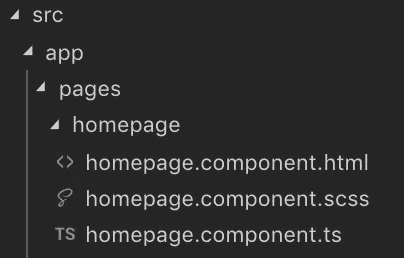
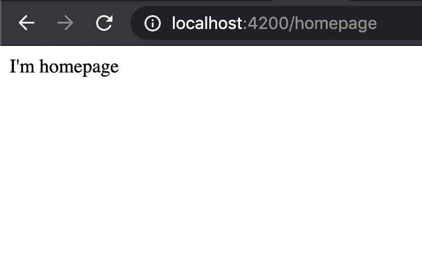
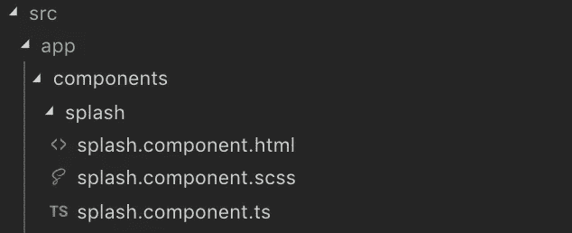
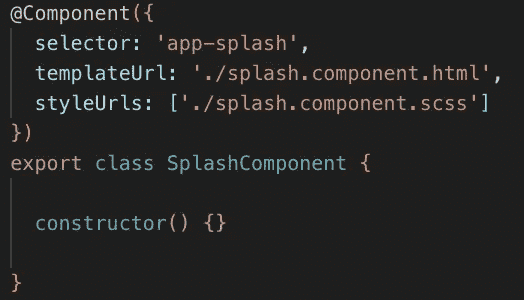
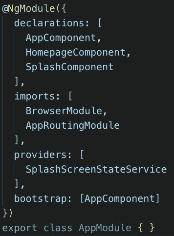

# 在 Angular 中创建一个闪屏，用于在启动时加载所有数据

> 原文：<https://javascript.plainenglish.io/creating-a-splash-screen-in-angular-for-loading-all-the-data-at-startup-b0b91d9d9f93?source=collection_archive---------0----------------------->


Photo by [Dan Nelson](https://unsplash.com/@danny144?utm_source=medium&utm_medium=referral) on [Unsplash](https://unsplash.com?utm_source=medium&utm_medium=referral)

如今，用户对应用程序的 UI 和 UX 的要求和关注越来越高。这主要是由于市场上的竞争如此激烈，以至于用户确切地知道当今技术能走多远。

因此，重要的是不仅要为用户提供一个功能符合设计目的的应用程序，而且要吸引用户的眼球。

因此，一个站点或应用程序提供的第一张名片是访问屏幕和加载必要数据的方式。

我们说的是 ***闪屏:*** 用任何应用程序的 logo、使用应用程序前的有用信息，或者简单地用一个加载屏幕让用户明白应用程序正在加载他的数据并且没有被阻止，来转移用户注意力的简单方法。

## **目标**

今天的目标是创建一个闪屏显示给用户，直到数据准备好并可用于我们的主页

## **先决条件**

在开始之前，了解一些事情是有用的:

*   对于开发来说，最好了解一下 [Javascript](https://developer.mozilla.org/en-US/docs/Web/JavaScript) (推荐使用 [Typescript](https://www.typescriptlang.org/docs/) 但不是必需的)和 Html
*   [节点](https://nodejs.org/en/)您机器上安装的 v12 +;
*   Npm 包管理器由于 [Angular](https://angular.io/docs) ，Angular CLI 和 Angular 应用程序依赖于 npm 包。为了安装 npm 软件包，您需要一个 npm 软件包管理器。遵循本指南了解如何使用它。

## 准备环境

创建项目、生成应用程序和库代码、执行测试、构建和部署等任务都依赖于 Angular CLI。

要安装 Angular CLI，请打开终端并运行以下命令:

```
npm install -g @angular/cli
```

## **让我们开始**

使用以下命令创建并启动项目:

```
ng new splash-app --routing
```

在我的例子中，当它问我“*你想使用哪种样式表格式？”我选择了 SCSS，但这取决于你的习惯。*

```
cd splash-app
ng serve
```

现在导航到`[http://localhost:4200](http://localhost:4200)`查看 Angular CLI 为我们创建的默认应用程序。

## **主页面:【首页】**

用户将访问的主页是我们的主页，大概是任何种类的项目列表。

因此，让我们创建以下路径:`src/app/page/homepage/`



Homepage’s files

**主页.组件. ts**

```
import { Component } from '@angular/core';@Component({
   selector: 'app-home',
   templateUrl: './homepage.component.html',
   styleUrls: ['./homepage.component.scss']
})
export class HomepageComponent {
   constructor() { }
}
```

**homepage.component.html**

```
<div>I'm homepage</div>
```

**声明新组件**

转到`src/app/app.module.ts`并添加新的申报

```
declarations: [
   AppComponent,
   HomepageComponent
],
```

**记录新路线**

转到`src/app/app-routing.module.ts`,如果用户访问一条空路线，则创建一条带有重定向的新路线

```
import { NgModule } from '@angular/core';
import { Routes, RouterModule } from '@angular/router';
import { HomepageComponent } from './pages/homepage/homepage.component';const routes: Routes = [
   {
      path: 'homepage',
      component: HomepageComponent
   },
   {
      path: '',
      redirectTo: 'homepage',
      pathMatch: 'full'
   }
];@NgModule({
imports: [RouterModule.forRoot(routes)],
exports: [RouterModule]
})export class AppRoutingModule { }
```

**最后一步**

为了导航到想要的路线，我们需要将`<router-outlet></router-outlet>`包含到`src/app/app.component.html`

> “路由器出口”通知 Angular 用所选路由的组件更新应用视图。

**输出**



Homepage route

## 是闪屏的时候了

在组织应用程序的初始阶段之后，终于到了创建我们想要的闪屏的时候了。

有些步骤看起来类似于创建主页组件，然而，这种开发的特殊方面是创建一个服务，当我们认为合适时，它负责完成飞溅。

让我们先从服务开始

创建文件`src/app/services/splash-screen-state.service.ts`并编写以下代码

```
import { Injectable } from '@angular/core';
import { Subscription, Subject } from 'rxjs';@Injectable()
export class SplashScreenStateService {
   subject = new Subject(); subscribe(onNext): Subscription {
      return this.subject.subscribe(onNext);
   } stop() {
      this.subject.next(false);
   }}
```

如你所见，我们只创建了一个*停止*方法，而没有创建一个*开始*方法。
这是因为在第一次访问时，我们打算激活闪屏而不发生任何事件。

还有，把注意力放在`subject = new Subject()`线上。
我们使用了 *Subject* 而不是 *BehaviorSubject* 或 *ReplaySubject* ，因为订阅者不需要知道任何关于先前值的信息。
这样，订阅者将只获得在订阅后发出的已发布值。

当然，像任何其他服务一样，我们需要将它包含到`src/app/app.module.ts`中的 providers 数组中

```
providers: [
   SplashScreenStateService
]
```

# **最后的闪屏**

创建文件夹`src/app/components/splash-screen`



Splash files

**splash.component.ts**

这是我们的空组件的样子



Empty SplashComponent

作为 HomepageComponent，我们需要将其包含到`src/app/app.module.ts`



app.module.ts

现在将选择器添加到`src/app/app.component.html`中，使其内容与下面的代码相同

```
<router-outlet></router-outlet>
<app-splash></app-splash>
```

## **我们需要什么来让启动画面变得生动起来**

转到`src/app/components/splash-screen/splash-screen.component.ts`

**变量**

```
// The screen starts with the maximum opacity
public opacityChange = 1;public splashTransition;// First access the splash is visible
public showSplash = true;readonly ANIMATION_DURATION = 1;
```

**隐藏方法**

```
private hideSplashAnimation() {
   // Setting the transition
   this.splashTransition = `opacity ${this.ANIMATION_DURATION}s`;
   this.opacityChange = 0; setTimeout(() => {
      // After the transition is ended the showSplash will be hided
      this.showSplash = !this.showSplash;
   }, 1000);
}
```

**订阅停止事件**

```
constructor(
   private splashScreenStateService: SplashScreenStateService
) { }ngOnInit(): void { // Somewhere the stop method has been invoked
   this.splashScreenStateService.subscribe(res => {
      this.hideSplashAnimation();
   });}
```

**splash.component.html**

```
<div *ngIf="showSplash" class="app-splash-screen" [ngStyle]="{'opacity': opacityChange, 'transition': splashTransition}">

   <div class="app-splash-content">
      <div data-text="Loading ..." class="loading-text">Loading ...
      </div>
   </div></div>
```

**splash.component.scss**

```
.app-splash-screen {
   background: #3a36d1;
   position: fixed;
   top: 0;
   left: 0;
   right: 0;
   bottom: 0;
   display: flex;
   justify-content: center;
   align-items: center;
   width: 100%;
   height: 100%;
   z-index: 1;
   opacity: 1;
}.loading-text {
   position: relative;
   color: rgba(0, 0, 0, 0.3);
   font-size: 5em;
}.loading-text:before {
   content: attr(data-text);
   position: absolute;
   overflow: hidden;
   max-width: 7em;
   white-space: nowrap;
   color: #fff;
   animation: loading 8s linear;
}@keyframes loading {
   0% {
      max-width: 0;
   }
}
```

**好吧，一切都很好，但是谁来停止启动画面呢？**🤔

目前，让我们采取最简单的解决方案。我们委托主页调用服务器，接收它需要的数据，一旦完成，也停止启动画面。

因此，转到`src/app/pages/homepage/homepage.component.ts`并在超时 5 秒后停止闪屏。
(超时模拟 http 请求)

```
constructor(
   private splashScreenStateService: SplashScreenStateService
) { }ngOnInit(): void {
   setTimeout(() => {
      this.splashScreenStateService.stop();
   }, 5000);
}
```

**输出**


SplashScreen

# 主页解析器

什么是解析器？

> 角度解析器是一种平滑的方法，通过在导航到特定组件之前加载数据来增强用户体验。

在这种情况下，我们希望将主页从从服务器加载数据的责任中解放出来，因为没有这些数据，主页就没有存在的理由。

使用这种方法，主页只需检索数据，而不必担心如何为 HTTP 请求构建请求，也不必知道在需要来自不同服务的数据时应该调用哪些服务。对解析器的单一访问为组件提供了所需的一切。

## **让我们创建解析器**

创建解析器到`src/app/resolvers/homepage.resolver.ts`路径。

对于本文，我们将用经典的超时替换对服务器的直接调用。

```
import { Resolve, ActivatedRouteSnapshot, RouterStateSnapshot } from '@angular/router';
import { Injectable } from '@angular/core';
import { Observable, of } from 'rxjs';
import { SplashScreenStateService } from '../services/splash-screen-state.service';@Injectable()
export class HomepageResolver implements Resolve<any> { constructor(
      private splashScreenStateService: SplashScreenStateService
   ) { } public resolve(route: ActivatedRouteSnapshot, state: RouterStateSnapshot): Promise<Observable<any>> { return new Promise((resolve, reject) => {
         setTimeout(() => {
            this.splashScreenStateService.stop();
            resolve(of(['item1', 'item2']));
         }, 5000);
      }); }
}
```

正如你所看到的，我们已经将我们在*主页*文件中所做的大致移动到了*解析器*中，返回了一个条目列表。

像其他人一样，将解析器添加到 providers 数组中的`src/app/app.module.ts`。

```
providers: [
   SplashScreenStateService,
   HomepageResolver
]
```

并移动到`src/app/app-routing.module.ts`以将解析器添加到`homepage`路线。

```
const routes: Routes = [
   {
      path: 'homepage',
      component: HomepageComponent,
      resolve: {'itemsList': HomepageResolver}
   },
   {
      path: '',
      redirectTo: 'homepage',
      pathMatch: 'full'
   }
];
```

现在，让我们回到`src/app/pages/homepage/homepage.component.ts`，用下面的代码替换现有的代码

```
constructor(private activatedRoute: ActivatedRoute) { }ngOnInit(): void {
   this.activatedRoute.snapshot.data.itemsList
      .subscribe(res => {
         console.log({ res });
      })
}
```

## **最后也是最简单的步骤**

因为我们的解析器为主页提供了一个元素列表，所以让我们尝试在模板上显示它们。

转到`src/app/pages/homepage/homepage.component.html`并添加

```
<ul>
   <li *ngFor="let item of myItems">
      {{item}}
   </li>
</ul>
```

在`homepage.component.ts`上创建“ *myItems* ”列表，并用订阅结果增强它。

**输出**


Homepage

# 参考

本文中的所有代码都可以在这里找到:[https://github.com/CoxxD/splash-app](https://github.com/CoxxD/splash-app)

# 结论

闪屏当然是现在许多应用程序都采用的一个特性。易于使用，但对用户来说非常有效和有吸引力。

如果你喜欢这篇文章，请按👏想按多少次就按多少次。另外，如果你有任何问题，请随时提问。

非常感谢你的阅读！

*更多内容尽在*[***plain English . io***](http://plainenglish.io/)