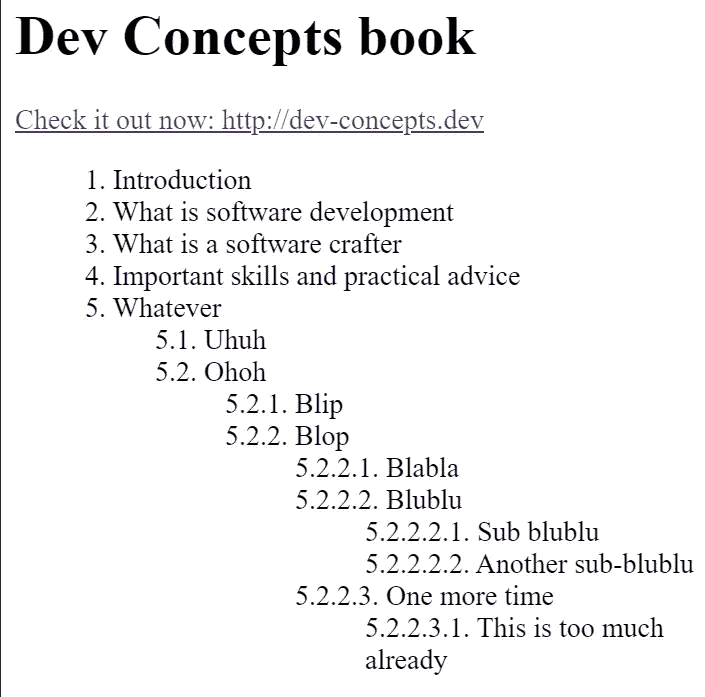

# 用 HTML 和 CSS 创建目录

> 原文：<https://javascript.plainenglish.io/creating-a-table-of-contents-with-html-and-css-7443b185d544?source=collection_archive---------4----------------------->

## 今天，当我准备发布我的书的目录时，我意识到我不知道如何把它添加到我的登陆页面


Picture courtesy of [Lalaine Macababbad](https://unsplash.com/@lalainemacababbad)

在本文中，我将解释如何使用纯 HTML 和 CSS 生成一个自动编号的目录。

# CSS 计数器来拯救

在过去，我认为已经为此编写了相当多的 JavaScript 代码。幸运的是，如今网络平台比以往任何时候都更加强大。我们可以单独用 HTML 和 CSS 做一些奇妙的事情。首先，数数！

有了 [CSS 计数器](https://developer.mozilla.org/en-US/docs/Web/CSS/CSS_Lists_and_Counters/Using_CSS_counters)，我们可以使用和递增 CSS 为我们透明维护的变量；允许我们轻松定制内容的外观。

CSS 计数器的值可以使用[内容](https://developer.mozilla.org/en-US/docs/Web/CSS/content)属性中的`counter()`或`counters()`来显示。

让我们看一下 MDN 上提供的例子:

```
body {
  counter-reset: section;
}

h3::before {
  counter-increment: section;
  content: "Section " counter(section) ": ";
}...<h3>Introduction</h3>
<h3>Body</h3>
<h3>Conclusion</h3>
```

通过上面的方法，每次一个`h3`标签被添加到文档中，名为`section`的 CSS 计数器就会使用`counter-increment`递增。因此，第一次出现的值为`1`，第二次出现的值为`2`，依此类推。

其次，使用`content`属性中的`counter(section)`显示该计数器的值。

注意`counter-reset`允许重置特定计数器的值。

但是 CSS 计数器比那更酷！

# 嵌套 CSS 计数器

CSS 计数器支持嵌套。事实上，嵌套的计数器实例是为每个子元素自动创建的，所以不需要额外的配置。多酷啊。

使用`counters` CSS 函数，我们可以一次显示所有嵌套的计数器值，并决定使用哪个字符来分隔每个值。

查看 MDN 上的[示例。](https://developer.mozilla.org/en-US/docs/Web/CSS/CSS_Lists_and_Counters/Using_CSS_counters)

# 目录示例

因为嵌套的 CSS 计数器正好满足了我的需要，所以我决定用它们来创建我的目录。

这是它的要点:

可以看到，这是一个简单的`ol` & `ul`嵌套 HTML 结构。

要对其进行样式化，我们只需使用以下代码:

上面使用了一个我称为`item`的 CSS 计数器，它的值在需要时被重置/递增，并使用`content`呈现。

这将导致以下结果:



撇开造型细节不谈，这正是我想要的。你确实可以走得更远，使用响应式网页设计技术，根据可用空间调整页边距等等。

你可以在这里找到工作的例子:【https://stackblitz.com/edit/html-css-table-of-contents? file=index.html

你也可以[看一下我的书](https://www.dev-concepts.dev/table-of-contents/)的目录，看看它是如何运作的！

# 结论

在本文中，我快速介绍了 CSS 计数器，并解释了它们支持嵌套，这使得使用纯 HTML 和 CSS 创建自动编号的目录变得非常简单。

今天到此为止！

PS:如果你想学习 ***吨*** 其他关于软件/Web 开发的很酷的东西，那么就去看看[我即将出版的书](http://dev-concepts.dev/)，和/或订阅[我的简讯](https://mailchi.mp/fb661753d54a/developassion-newsletter)！