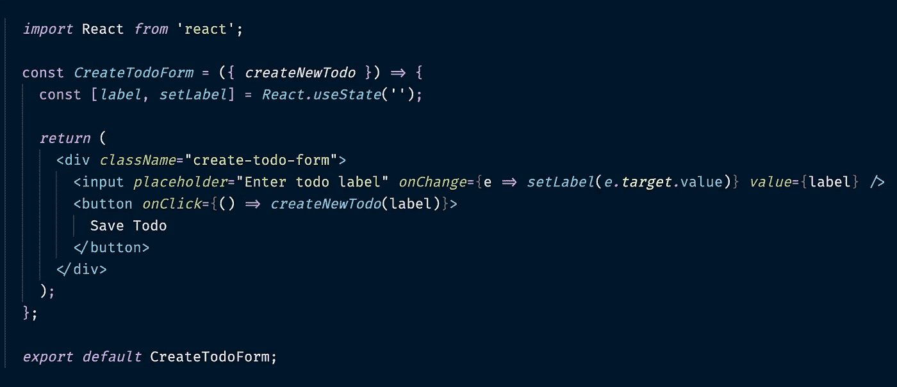
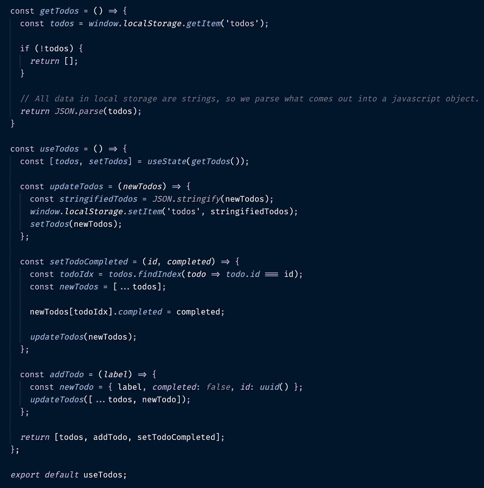
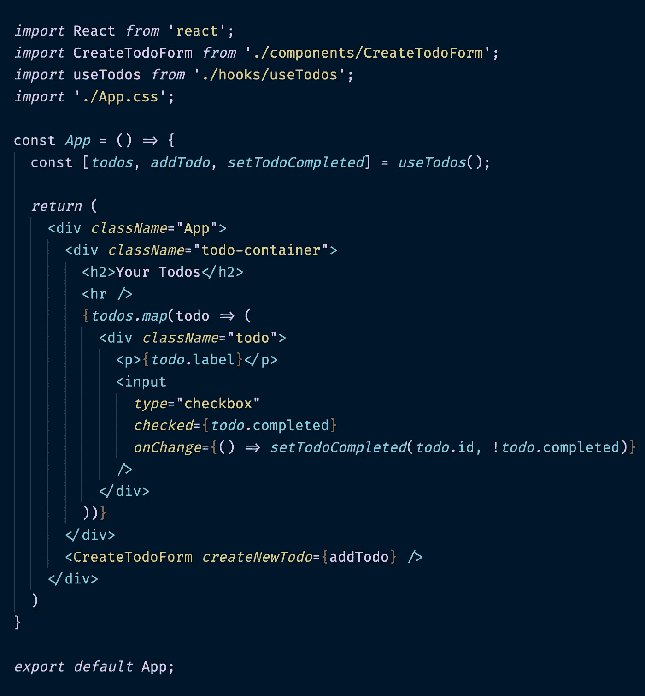

# 使用 React、自定义挂钩和本地存储创建 Todo Chrome 扩展

> 原文：<https://javascript.plainenglish.io/creating-a-todo-chrome-extension-with-react-custom-hooks-and-local-storage-f8f8d8910ee?source=collection_archive---------3----------------------->

曾经想给自己发送令人讨厌的入侵式通知吗？或者每天提醒自己，你更可能手淫和吃多力多滋，而不是真正做任何工作？

好吧，别再找了。我掩护你。

Chrome 扩展可以做到所有这些，最棒的是，你甚至不能通过重新加载页面来逃避它们。另外，没人知道怎么关掉这些该死的东西。

在本文中，我们将创建一个 todo 应用程序，并将其作为 chrome 扩展部署在本地。我考虑做一个“你所在地区的性感单身”节目，但意识到我不认识任何性感单身。请给我打电话。

我们将对此使用 React。完全没有必要。事实上，这是长期*不必要的*。但是我能说什么呢？我绝对讨厌自己。

让我们开始吧。

**先决条件**

*   React 的一些基础知识
*   稍微熟悉一下定制挂钩
*   一大堆你知道你永远不会完成的事情，但你仍然想记录下来，因为永远欺骗自己比面对事实更容易

**克隆回购**

克隆`[react-starter](https://gitlab.com/sk3pt1cc/react-starter)`回购。

使用`npm run start`启动它。

参观`localhost:3000`。

**创建待办事宜应用**

这有三个部分:主应用程序组件，一个用于创建新待办事项的组件&一个定制的`useTodos`钩子。我将逐一介绍。

`<CreateTodoForm />`



简单的形式。它有一个创建 todo 标签的文本框和一个保存标签的按钮。它接收一个`createNewTodo` prop，这是一个我们很快就会看到的函数。

`useTodos`



这是 app 最复杂的部分，我一点一点来处理。

```
const *getTodos* =()=>{
  const *todos* = *window.localStorage.getItem*('todos'); if(!todos){
    *return* [];
  } *return JSON.parse*(todos);
}
```

一种从本地存储器中检索目标数据的功能。如果它们返回 falsy(即它们还不存在)，我们就返回一个空数组。

最后一行将 todos 转换成 javascript 对象。这是必要的，因为本地存储将对象保存为字符串。

`const[*todos*, *setTodos*]= *useState*(getTodos());`

我们在这里使用状态，以便每当`todos`改变时触发重新渲染。通过调用`getTodos`设置初始值。

```
const updateTodos = (newTodos) => {
  const stringifiedTodos = JSON.stringify(newTodos);
  window.localStorage.setItem('todos', stringifiedTodos);
  setTodos(newTodos);
};
```

一种功能，它更新本地存储器中的新目标，然后将它们设置为状态。我们需要在`newTodos`上调用`JSON.stringify`，因为本地存储只能保存字符串。

```
const setTodoCompleted = (id, completed) => {
  const todoIdx = todos.findIndex(todo => todo.id === id);
  const newTodos = [...todos]; newTodos[todoIdx].completed = completed; updateTodos(newTodos);
};
```

在给定的 todo 上设置属性`completed`的函数。首先，我们从 state 中的`todos`数组获取 todo 的索引。然后，我们使用[数组展开语法](https://developer.mozilla.org/en-US/docs/Web/JavaScript/Reference/Operators/Spread_syntax)将数组复制到一个新的字段中。这是为了让我们不要将 [*突变为*](https://alistapart.com/article/why-mutation-can-be-scary/) 的原始值。然后，我们更新`completed`字段，最后用更新后的数组调用我们的`updateTodos`函数。

```
const addTodo = (label) => {
  const newTodo = { label, completed: false, id: uuid() };
  updateTodos([...todos, newTodo]);
};
```

向列表中添加新任务的函数。我们首先创建新的 todo 对象，使用从`<CreateTodoForm />`传来的标签。我们还默认设置了`completed = false`&使用 npm `uuid`库为我们的 todo 生成一个惟一的 id。我们在更新中使用这个，如`setTodoCompleted`所示。最后，我们调用`updateTodos`并再次使用数组展开语法，只是这次它用于将`newTodo`追加到我们当前的`todos`数组中。

最后一部分返回`todos`数组和对`addTodo`和`setTodoCompleted`函数的引用，这是`<App />`需要的。

`<App />`



将一切联系在一起。我们映射`todos`中的项目，并为每个项目呈现一个标签&复选框。这些有从`useTodos`钩子调用我们的`setTodoCompleted`函数的`onChange`处理程序。

我们也渲染 `<CreateTodoForm />`并将`addTodo`传递给它。

`App.css`包含一些基本的造型。如果你想使用它们，它们看起来像这样:

```
.App {
  padding: 32px;
}.todo {
  display: flex;
  padding: 8px;
  margin: 8px;
  background-color: whitesmoke;
}.todo p {
  margin: 0;
  margin-right: 16px;
}.create-todo-form {
  text-align: center;
}.create-todo-form button {
  margin: 5px;
}
```

运行应用程序。一切都应该正常。

**部署为 Chrome 扩展**

打开`public/manifest.json`并粘贴以下内容:

```
{
  "short_name": "TodoApp",
  "name": "TodoApp",
  "manifest_version": 2,
  "browser_action": {
    "default_popup": "index.html",
    "default_title": "TodoApp"
  },
  "permissions": [
    "storage"
  ],
  "version": "1.0"
}
```

这个文件描述了这个应用程序。属性指向它的主页，在大多数情况下是`index.html`。

保存它，并从应用程序的根目录运行`npm run build`。

现在，打开 Chrome 并导航到地址栏中的`chrome://extensions`。打开窗口右上角的`Developer Mode`，然后点击左上角的`Load Unpacked`。找到你的`build/`文件夹，点击`select`。您的扩展应该出现在列表中，在浏览器扩展栏中伴随着一个小图标，可能是一个白色大写字母“T”。你点击这个打开扩展。

**但是现在还不行。**

Chrome 的安全策略阻止扩展执行内联脚本，这正是我们的应用程序所使用的。为了解决这个问题，您必须在`manifest.json`中添加另一行代码:

```
"content_security_policy": "script-src 'self' '<your-sha>'; object-src 'self'"
```

您可能会奇怪，为什么我一开始没有要求您添加这个。嗯，这不仅仅是令人讨厌——尽管令人讨厌*是一个高尚的原因——这是因为你需要从 chrome 打开你的扩展失败时产生的错误日志中复制一些东西。*

返回`chrome://extensions`，点击分机上的`Errors`按钮。在以`Refused to execute inline script...`开头的文本中，找到以`sha-256`开头的字符串并复制它。两个撇号之间的所有内容。现在，替换上面文本中的`<your-sha>`并将整个内容粘贴到`manifest.json`中。

使用`npm run build`重新构建你的扩展，并使用`Load unpacked`按钮将其加载回 chrome。应该就是这样了。

太好了——现在你可以创建浏览器扩展，一切尽在掌握。你无所不能。去大西洋航行。成为总统。搞定英国退出欧盟。

只是不要再做一个他妈的颜色选择器。

如果你想知道更多类似的信息，请点击这里或 Twitter @ lm _ writing 关注我