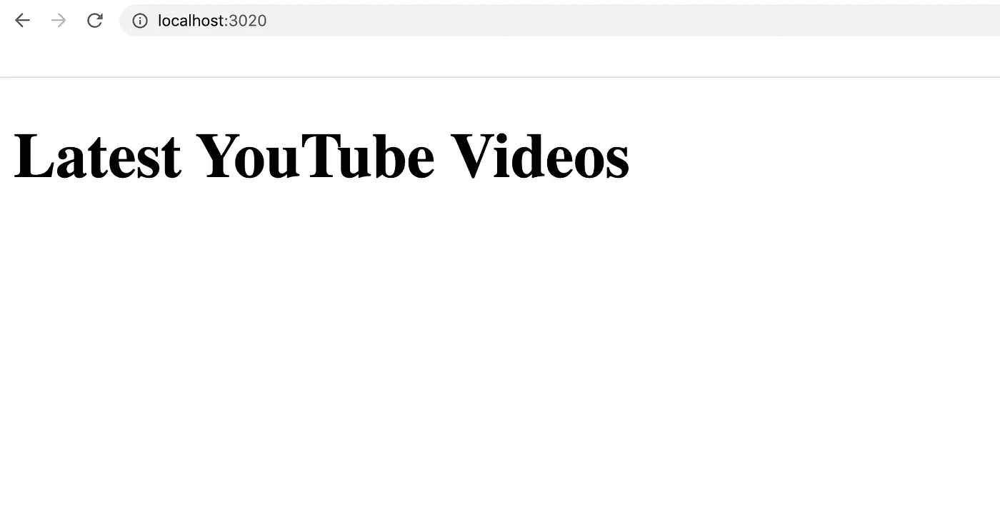
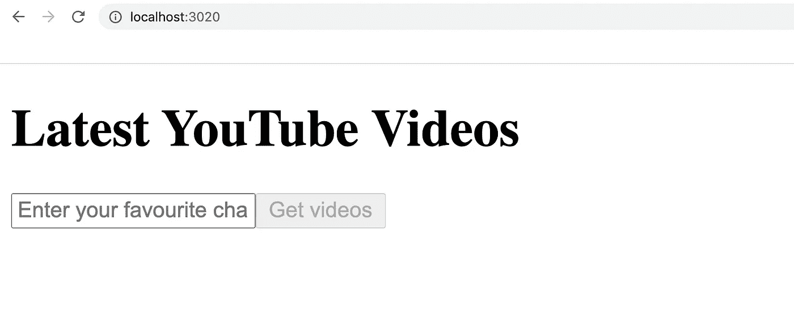
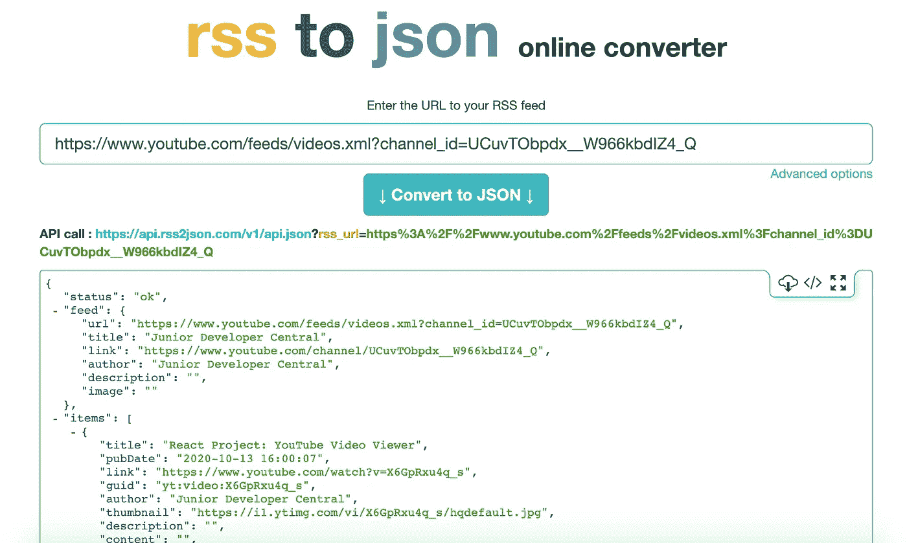
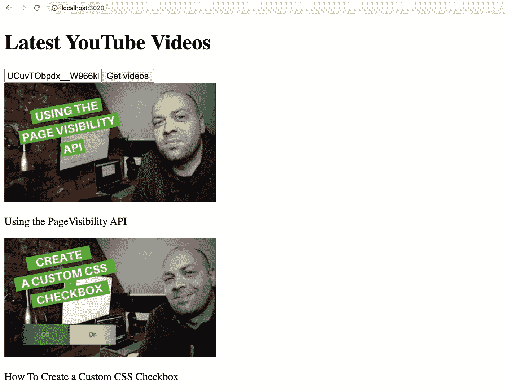
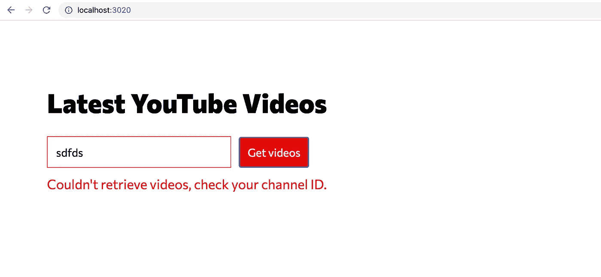

# 用 React 创建 YouTube 的“最新视频浏览器”

> 原文：<https://javascript.plainenglish.io/creating-a-youtube-latest-video-viewer-with-react-9d04161c51b3?source=collection_archive---------5----------------------->


在本教程中，我们将使用 React 的一些基础知识，包括 React 挂钩来构建一个简单的应用程序，列出特定频道的最新 YouTube 视频。

*本文基于一段视频教程来自* [*我自己的 YouTube 频道*](https://youtube.com/juniordevelopercentral) *其中你* [*可以在这里查看*](https://youtu.be/X6GpRxu4q_s) *。这里可以看到* [*项目的一个 demo*](https://upbeat-hopper-d3563b.netlify.app/)*。*


Example of the completed APP

该应用程序的工作原理是利用 YouTube 的 RSS 源，提取视频信息，包括缩略图和标题等。

# **入门**

因此，我们需要一个能够理解和编译 React 和 JSX 代码的开发环境。如果你熟悉的话，你可以用 **create-react-app** 创建一个新的应用，或者你可以从[这里](https://github.com/codebubb/react-starter)克隆我的 React starter，这是我在视频教程中使用的。

我们的应用程序需要一些组件，所以在您的`src`文件夹中，让我们为我们的主应用程序创建`App.js`，为我们的表单字段创建`Search.js`来查找特定的 YouTube 频道，创建`Video.js`来显示来自 RSS 提要的单个条目。

让我们也为我们的 Sass `App.scss`创建一个 SCSS 文件和一个`index.js`文件来引导应用程序。

# 运行正常的

让我们通过在`index.js`文件中设置我们的 React 应用程序来为我们的项目做些准备和运行:

*   第 1 行:这是 Webpack 在最终版本中包含我们的`index.html`文件的额外一行。
*   第 3–4 行:导入 React 库。
*   第 5 行:这里我们正在导入我们的`App`组件(这会很可能导致不稳定，因为这个文件中什么都没有)。
*   第 8 行:这里我们获得了对 HTML 页面中一个元素的引用，该元素将用于安装 React 应用程序。
*   第 10 行:将我们的`App`组件呈现给上面的 HTML 元素。

接下来，我们需要在我们的`App.js`文件中放一些东西来创建我们的`App`组件。

*   第 1 行:我们正在导入 React 以及`useState`和`useEffect`钩子，我们很快就会用到它们。
*   第 3 行:导出 App 组件，这样它就可以被导入到我们的`index.js`文件中。
*   第 4–9 行:使用函数式 React 组件，我们可以只返回一些 JSX。

从终端，我们可以通过服务应用程序来测试一切是否正常:

```
npm run serve
```



一旦开发服务器运行，当导航到`[http://localhost:3020](http://localhost:3020)`时，您应该会看到上面的页面

如果您使用另一个设置，而不是我前面提到的 React starter repo，请确保运行相关的 serve 命令并导航到您的配置使用的地址。

# 设置搜索组件

我们的搜索组件将有一个输入文本字段和一个按钮，基本上负责接受用户试图查看的频道 ID，然后将其传递回`App`组件，该组件将发出获取数据的请求。

*   第 3 行:我们将`Search`创建为传递了`props`对象的功能组件。
*   第 4 行:这里我们使用`useState` React 钩子创建一个名为`channelId`的新状态项。当使用`useState()`时，我们可以析构实际的状态值以及相应的 setter(在本例中是`setChannelId`)来管理状态值
*   第 8 行:当创建输入字段时，我们将一个函数传递给`onChange`事件，当用户在输入中键入内容时，该事件将被触发。该功能实际上使用`setChannelId.`更新`channelId`状态值
*   第 9 行:如果用户没有输入任何东西，我们可以利用`channelId`状态值来禁用按钮，当用户点击按钮时，我们将调用`props`对象上传入的另一个函数，`setCurrentChannelId`将存储在`channelId`中的值从`Search`组件传递回`App`组件。

现在让我们将`Search`组件添加到我们的`App`模板中，并在 props 上传递该函数，以处理当用户单击搜索按钮时返回的数据。

*   第 2 行:导入我们刚刚更新的`Search`组件。
*   第 5 行:为`App`组件设置一点状态，它将保存用户查找的当前频道
*   第 10 行:将`Search`组件添加到我们的 JSX 模板中，并传入一个`setCurrentChannelId`属性，该属性接受一个函数(当用户按下`Search`组件中的按钮时将被调用)并用从`Search`组件传回的值更新`currentChannelId`状态。



The App with the Search Component added

# 视频组件

在我们获取一些数据并将其显示给用户之前，让我们设置一个组件，该组件将显示每个视频的缩略图和标题，以及 YouTube 上该视频的链接。

*   第 7 行:我们以这种方式手动构建缩略图，这样我们可以得到“中等质量”的缩略图，这样我们的图像可以快速加载

组件`Video`只是一个模板，我们将通过组件的`props`向其传递一个视频对象。从 YouTube RSS 提要返回的数据将具有像`link`、`guid`和`title`这样的属性，我们可以用它们来构造模板。当我们在下一步中检索数据时，您将看到所有这些属性。

# 检索 YouTube 视频数据

因此，YouTube 提供了一个频道的 RSS 提要，但数据是 XML 格式的。例如，我的频道是[https://www.youtube.com/feeds/videos.xml?channel _ id = UCuvTObpdx _ _ w 966 kbdiz 4 _ Q](https://www.youtube.com/feeds/videos.xml?channel_id=UCuvTObpdx__W966kbdIZ4_Q)

但是 XML 数据在前端并不方便(我们已经习惯了所有的东西都是 JSON ),所以我们可以自己解析 XML 或者使用服务来完成这项工作。为了简洁起见，在教程中，我使用了一个服务( [rss2json](https://rss2json.com) )。com)来做到这一点。



Converting the XML feed to JSON with rss2json.com

如您所见，该服务允许您粘贴一个 RSS URL，并返回 XML 的 JSON 等价物。

因此，在我们的`App`组件中，让我们调用这个端点并将数据保存到我们应用程序的状态中。然后我们可以创建一个`Video`组件列表来显示数据。

*   第 3 行:不要忘记导入`Video`组件
*   第 7 行:这里我们创建了更多的状态来保存从 RSS 提要返回的数据
*   第 9 行:这是我们将使用用户在`Search`组件中输入的`channelId`进行调用的基本 URL
*   第 11 行:这里我们调用了`useEffect` React 钩子，如果在`currentChannelId`状态中有值，它将调用 API 端点并将`videos`状态设置为响应的`items`属性。
*   第 22 行:我们将`currentChannelId`作为第二个参数传递给`useEffect`钩子，以便在`currentChannelId`的值改变时重新触发它。这样，每当用户输入新的通道 ID 时，都会再次向 API 发出请求。
*   第 29 行:最后，为了显示视频列表，我们简单地使用`map`遍历所有返回的视频项，并返回一个`Video`组件，将整个视频对象作为道具传入，并将视频的`key`设置为每个视频特有的`guid`属性。

现在，如果我们输入 YouTube 频道的 ID 并点击“获取视频”按钮，我们会看到一些结果显示在我们的应用程序中。



Results from parsed YouTube RSS feed.

我们的应用程序现在能够加载 YouTube 频道最近视频的缩略图和标题，但它的外观可能需要一些工作，所以让我们添加一些样式。

# 设计应用程序

以下是我为应用程序创建的样式。

我保持了非常简单的样式，并且都在一个文件中，所以你可以在一个地方看到它，但是它可以被分解成单独的文件来匹配每个组件。

我导入了[专员](https://fonts.google.com/specimen/Commissioner)谷歌字体，但是你可以把它换成别的字体。

应用样式后，我们的应用程序如下所示:


The app with styling applied

我们可以把我们的应用程序留在那里，但在从 RSS 提要中检索数据时，在处理错误方面可以做一些改进。

# 错误处理

最后，让我们创建一个状态来保存从 RSS 提要请求视频时发生的任何错误。我们将把它放在我们的`App.js`组件中。

*   第 9 行:使用`useState`钩子，我们创建新的错误状态
*   第 24 行:如果接收到一个成功的请求，我们将清除之前设置的任何错误消息
*   第 28 行:但是如果确实发生了错误，我们将设置一个适当的消息
*   第 39 行:在 JSX 中，我们将显示错误

现在，如果我们键入一个无效的频道 id，或者向 RSS 提要发出请求时出现问题，我们会看到错误显示。



Error handling in the app

# 结论

在本教程中，我们看到了如何使用 YouTube RSS 提要从频道 ID 中获取特定 YouTube 频道的最新视频。

使用 rss2json.com 的[服务，我们能够将 RSS 提要转换成 JSON 响应。](https://rss2json.com)

我们创建的应用程序使用了几个 React 挂钩；用于在组件中设置状态的`useState`钩子和用于触发调用的`useEffect`钩子，以检索要在应用程序中使用的数据。

考虑您的应用程序将如何处理错误是很重要的，在这个项目中，我们通过捕捉在请求获取特定通道 id 的 JSON 数据时发生的错误来做到这一点。

感谢阅读，如果你觉得这个教程有用，请在 Twitter( [@codebubb](https://twitter.com/codebubb) )上给我留言。