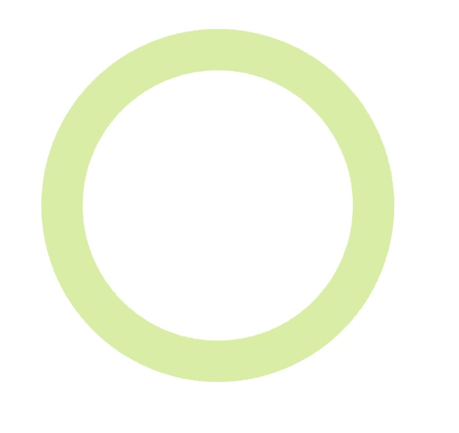
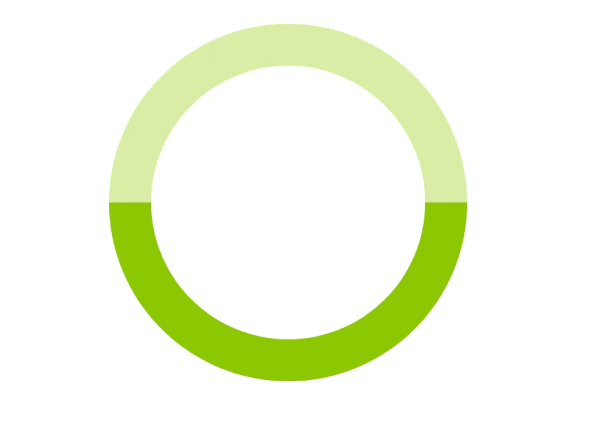
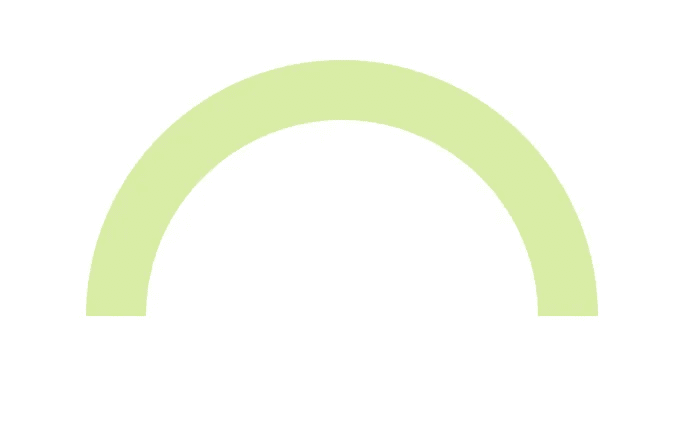
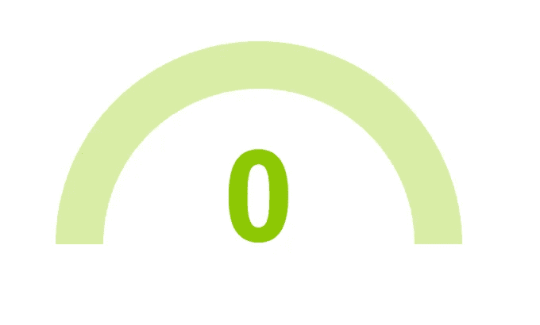
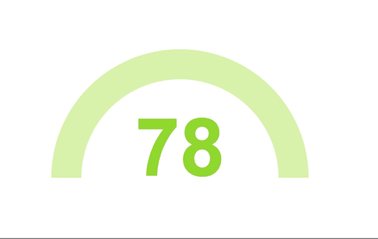

# 用普通 Javascript 创建动画仪表图

> 原文：<https://javascript.plainenglish.io/creating-an-animated-gauge-chart-with-vanilla-javascript-38d1d7e81b2b?source=collection_archive---------4----------------------->


Photo by [Kobu Agency](https://unsplash.com/@kobuagency?utm_source=medium&utm_medium=referral) on [Unsplash](https://unsplash.com?utm_source=medium&utm_medium=referral)

我的办公室和许多其他办公室一样，有各种各样的午餐和学习活动。本周，我们分成两人一组，用普通的 JavaScript 创建了一个量表。看起来相当简单的任务变成了相当具有挑战性的任务，并帮助巩固了一些我一直困扰的 JS 概念。下面，我将一步一步地向你介绍我和我的搭档是如何创建我们自己的量表的，以及你可以采用的一些替代方法。

View this code on [CodePen](https://codepen.io/karaluton/full/VGKoLd/)

## 步骤 1:创建拱门

在我们的午餐和学习期间，每个人都完成了挑战，之后我们都展示了我们所做的，看到每个人创建量规拱形的方法是如此有趣。在 6 组配对中，每一组都选择了不同的方式。我和我的伙伴决定创建一个透明的圆圈，并添加一个边框，这将是仪表本身。

**HTML**

```
<body>
  <div class="loader"></div> 
</body>
```

**CSS**

```
*, 
*::after, 
*::before {
  box-sizing: border-box;
}body {
  height: 100vh;
}.loader {
  background: transparent;
  border: 30px solid #D7ECA6;
  border-radius: 50%;
  height: 16rem;
  width: 16rem;
}
```



First step in creating the arch for the gauge

当选择一个随机数时，我们试图制作的标尺将填充深绿色，因此我们决定向 loader div 添加一个 before 元素，它将是深绿色。

**CSS**

```
*, 
*::after, 
*::before {
  box-sizing: border-box;
}body {
  height: 100vh;
}.loader {
  background: transparent;
  border: 30px solid #D7ECA6;
  border-radius: 50%;
  height: 16rem;
  position: relative;
  width: 16rem;
  &::before {
    content: '';
    border: 30px solid #8CC800;
    border-left-color: transparent;
    border-radius: 50%;
    border-top-color: transparent;
    height: 16rem;
    left: -30px;
    top: -30px;
    transform: rotate(45deg);
    position: absolute;
    width: 16rem;
    z-index: 2;
  }
}
```

我们继续在 before 元素上添加一个`transform: rotate(45deg);`的原因是为了让绿色进度条位于我们圆圈的底部，而不是稍微倾斜，这是原来的位置。



Our circle with the darker green progress bar

为了简化您的代码，您可以将 before 元素全部移除，代之以将一个`border-left-color`和一个`border-bottom-color`添加到您的深绿色中，然后在您的 loader div 上设置一个`transform: rotate(45deg)`。我和我的搭档没有想到这种方法，直到我们看到另一个小组这样做，但这完全有道理！

现在是拱门。我们想隐藏深绿色的进度条，所以我们在整个 loader div 周围添加了一个容器。我们确保容器的宽度与 loader div 相同，但高度是它的一半。这样我们可以在容器上设置`overflow: hidden`,它会隐藏深绿色的边框，使仪表看起来像一个拱门。

**HTML**

```
<body>
 <div class="container">
   <div class="loader"></div> 
 </div>
</body>
```

**CSS**

```
*, 
*::after, 
*::before {
  box-sizing: border-box;
}body {
  height: 100vh;
}.container {
  font-family: Arial;
  height: 8rem;
  left: 50%;
  overflow: hidden;
  position: relative;
  top: 50%;
  transform: translate(-50%, -50%);
  width: 16rem;
}.loader {
  background: transparent;
  border: 30px solid #D7ECA6;
  border-radius: 50%;
  height: 16rem;
  transition: transform .2s ease;
  position: relative;
  width: 16rem;
  &::before {
    content: '';
    border: 30px solid #8CC800;
    border-left-color: transparent;
    border-radius: 50%;
    border-top-color: transparent;
    height: 16rem;
    left: -30px;
    position: absolute;
    top: -30px;
    transform: rotate(45deg);
    width: 16rem;
    z-index: 2;
  }
}
```



Our arch all finished!

## 第二步:获取随机数

让我们首先硬编码我们的随机数，让它在我们的拱门内居中。

**HTML**

```
<body>
 <div class="container">
   <h1 class="loader__title">0</h1>
   <div class="loader"></div> 
 </div>
</body>
```

**CSS**

```
*, 
*::after, 
*::before {
  box-sizing: border-box;
}:root {
 --rotation: 0deg;
}body {
  height: 100vh;
}.container {
  font-family: Arial;
  height: 8rem;
  left: 50%;
  overflow: hidden;
  position: relative;
  top: 50%;
  transform: translate(-50%, -50%);
  width: 16rem;
}.loader {
  background: transparent;
  border: 30px solid #D7ECA6;
  border-radius: 50%;
  height: 16rem;
  transition: transform .2s ease;
  position: relative;
  width: 16rem;
  &::before {
    content: '';
    border: 30px solid #8CC800;
    border-left-color: transparent;
    border-radius: 50%;
    border-top-color: transparent;
    height: 16rem;
    left: -30px;
    position: absolute;
    top: -30px;
    transform: rotate(45deg);
    width: 16rem;
    z-index: 2;
  }
  &__title {
    color: #8CC800;
    font-size: 5rem;
    left: 50%;
    position: absolute;
    transform: translateX(-50%);
  }
}
```



Our arch with the starting number hard coded

为了获得一个随机生成的数字，我们首先创建了一个`changeNum()`函数，并在一个`setInterval()`方法中调用它。这将触发每两秒产生一个新的随机数。

**JS**

```
const changeNum = () => {};setInterval(() => {
  changeNum();
}, 2000);
```

> 让我们来分解一下:如果你不熟悉`*setInterval()*`方法，它会以毫秒为单位以指定的间隔调用一个函数，并一直调用这个函数，直到`*clearInterval()*`被调用或者窗口被关闭。这基本上与`*setTimeout()*`方法相反。

我们希望我们的量规获取 1 到 100 之间的一个随机数。为了做到这一点，我们使用了`Math.random()`方法，并将其包装在一个`Math.round()`方法中，这样我们就可以得到一个没有小数点的数字。我们还设置了一个变量来选择`.loader__title` h1。

**JS**

```
const changeNum = () => {
  const randomNum = Math.round(Math.random() * 100);
  let title = document.querySelector(".loader__title");
};setInterval(() => {
  changeNum();
}, 2000);
```

> 让我们来分解一下:`*math.random()*`方法返回一个介于 0 和 1 之间的数字。我们将这个数乘以 100，这样我们就可以得到一个介于 0 和 100 之间的数。`math.round()`方法返回舍入到最近间隔的数值。您也可以在这里使用`math.floor()`，它将返回小于或等于给定数字的最大整数。

现在，一些有趣的事情开始了。我们希望显示的数字增加或减少，所以我们设置了一个名为`currentNumber`的变量来获取我们的`.loader__title`当前显示的数字。然后，我们将该数字与 if 语句中生成的新随机数进行比较，以确定我们是否需要增加或减少显示为我们的`.loader__title` h1 的数字。我们最初没有在另一个`setInterval()`方法中设置 if 语句，因此我们没有看到数量的增加或减少，因为它发生得太快了。一旦我们设定了那个方法，我们就得到了我们想要的效果。

**JS**

```
const changeNum = () => {
  const randomNum = Math.round(Math.random() * 100);
  let title = document.querySelector(".loader__title");
  let currentNumber = title.innerText;setInterval(() => {
     if (currentNumber < randomNum) {
      currentNumber++;
      title.innerText = currentNumber;
    } else if (currentNumber > randomNum) {
      currentNumber--;
      title.innerText = currentNumber;
    }
  }, 3);
};setInterval(() => {
  changeNum();
}, 2000);
```



Our random number is now incrementing and decrementing

## 步骤 3:用深绿色的 before 元素表示我们的进度

我和我的伙伴决定使用一些 CSS 变量来旋转我们的`.loader` div，并使其与正在生成的随机数相匹配。我们首先将`--rotation`变量设置为 0deg，然后将`transform: rotate(var(--rotation));`添加到`.loader` div，这样当 JS 更新时，边框将旋转到与随机数匹配的进度。

**CSS**

```
*, 
*::after, 
*::before {
  box-sizing: border-box;
}:root {
 --rotation: 0deg;
}body {
  height: 100vh;
}.container {
  font-family: Arial;
  height: 8rem;
  left: 50%;
  overflow: hidden;
  position: relative;
  top: 50%;
  transform: translate(-50%, -50%);
  width: 16rem;
}.loader {
  background: transparent;
  border: 30px solid #D7ECA6;
  border-radius: 50%;
  height: 16rem;
  transition: transform .2s ease;
  transform: rotate(var(--rotation));
  position: relative;
  width: 16rem;
  &::before {
    content: '';
    border: 30px solid #8CC800;
    border-left-color: transparent;
    border-radius: 50%;
    border-top-color: transparent;
    height: 16rem;
    left: -30px;
    position: absolute;
    top: -30px;
    transform: rotate(45deg);
    width: 16rem;
    z-index: 2;
  }
  &__title {
    color: #8CC800;
    font-size: 5rem;
    left: 50%;
    position: absolute;
    transform: translateX(-50%);
  }
}
```

为了实际得到我们需要旋转 div 的度数，我们用 randomNum 除以 100，然后乘以 180 度。我们乘以 180 的原因是，如果随机数是 100，这意味着元素前的深绿色将显示 100%，它需要旋转整整 180 度才能完全显示。然后我们用另一个`Math.round()`方法包装所有东西，以确保我们没有任何小数点。最后，我们设置我们的`root`变量来更新度数，这将更新我们之前在`.loader` div 上设置的 CSS 变量。

**JS**

```
const changeNum = () => {
  const randomNum = Math.round(Math.random() * 100);
  const degrees = Math.round((randomNum / 100) * 180);
  const root = document.querySelector(":root");
  let title = document.querySelector(".loader__title");
  let currentNumber = title.innerText;setInterval(() => {
     if (currentNumber < randomNum) {
      currentNumber++;
      title.innerText = currentNumber;
    } else if (currentNumber > randomNum) {
      currentNumber--;
      title.innerText = currentNumber;
    }
  }, 3);root.style.setProperty("--rotation", `${degrees}deg`);
};setInterval(() => {
  changeNum();
}, 2000);
```

就是这样！这就是我们如何用普通的 JavaScript 制作一个量表。在对这个挑战进行了更多的思考后，我意识到我们可以使用 CSS turn 单元来代替使用`transform: rotate();`来获得学位，这样会使数学计算更容易一些，但我仍然认为我们做每件事的方式完全没问题。

你是不是用和我完全不同的方式制作了计量器？一定要在下面评论或者给我发一条你自己独特方法的推文！

[](https://twitter.com/karaluton) [## 卡拉·卢顿(@卡拉卢顿)|推特

### 卡拉卢顿的最新推文(@卡拉卢顿)。前端开发者+前音乐公关。退休芭蕾舞演员…

twitter.com](https://twitter.com/karaluton)