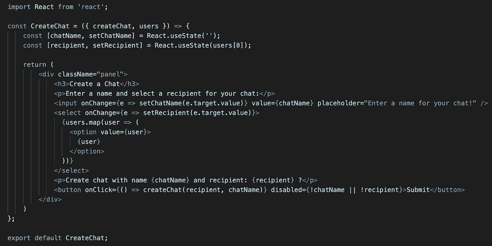
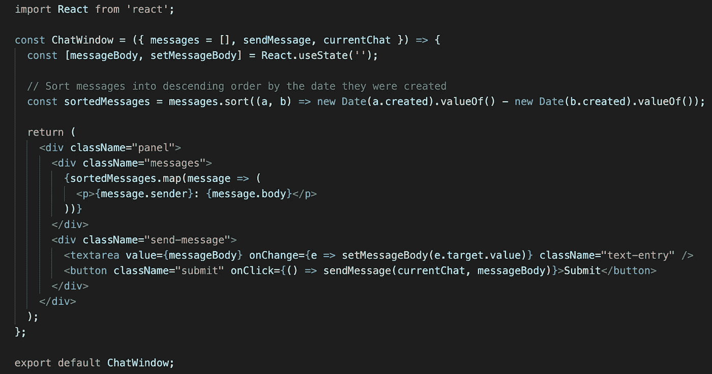
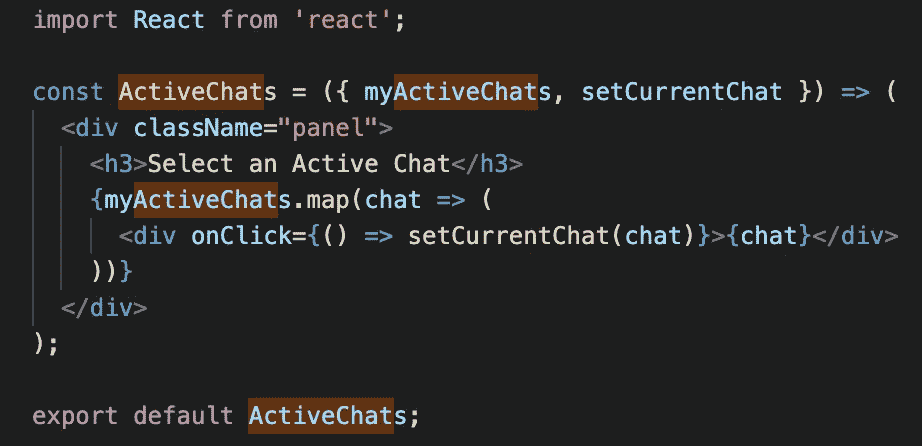
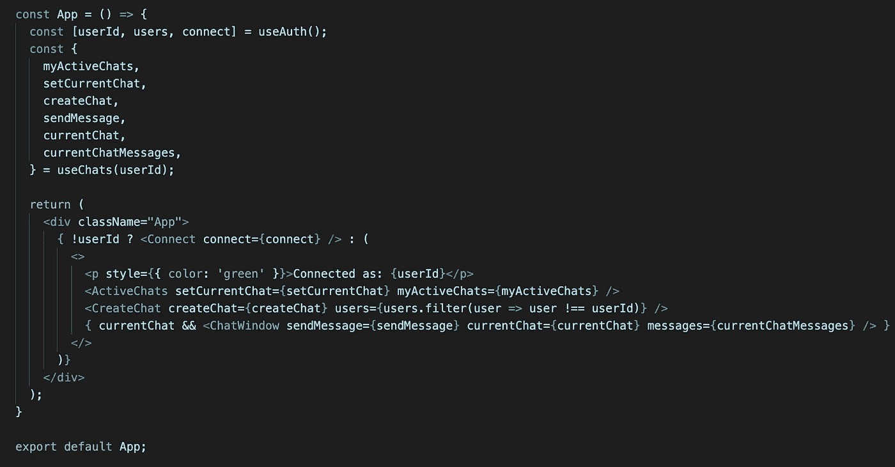
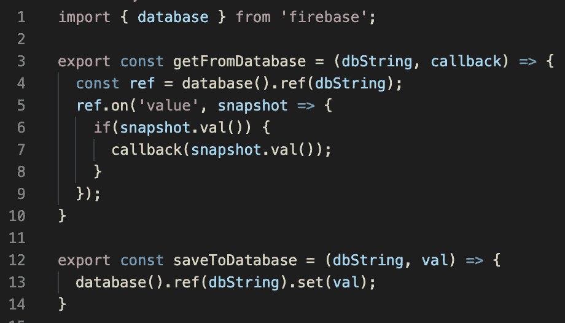
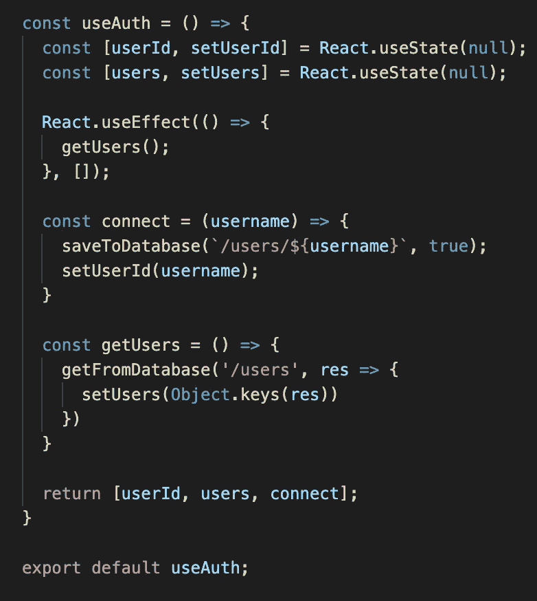

# 使用 React、自定义钩子和 Firebase 创建即时消息

> 原文：<https://javascript.plainenglish.io/creating-an-instant-messenger-with-react-custom-hooks-firebase-355bd544192?source=collection_archive---------2----------------------->

我将向您展示如何使用 React & Firebases 实时数据库创建自己的 IM 客户端，不需要后端编程。

我不会详细介绍 Firebase 的设置，因为我已经有了一篇文章， [*“使用 Google 的 Firebase 部署和验证 React 应用程序”*](https://medium.com/javascript-in-plain-english/deploying-and-authenticating-a-react-app-with-googles-firebase-541f7fa7be6a) *。*我们在这里做事情的方式有一些小的不同，但是任何对 Firebase 完全陌生的人都可能想要阅读它以获得深入的解释。

如果你只对如何与 Firebase 的实时数据库对话感兴趣，那么一旦你完成了设置，就跳到`Talking to Firebase`。

**先决条件**

*   反应的中级知识

**入门**

*在控制台中创建一个 Firebase 项目*

在这里 &创建你的项目[按照步骤操作。](https://console.firebase.google.com/)

*克隆回购*

克隆`[react-starter](https://gitlab.com/sk3pt1cc/react-starter)`回购。

使用`npm run start`来启动它。

拜访`localhost:3000`。

*初始化 Firebase*

我们需要在代码中设置 Firebase。这个过程有几个步骤，但不需要太长时间。

1.  **使用 Firebase CLI 进行初始化**

在终端中，运行`npm i -g firebase-tools,`，然后运行`firebase login`。这将打开一个浏览器窗口，您可以在其中登录您的 google 帐户。

然后，在项目根，运行`firebase init`。你会看到一组选项。首先，选择“数据库”。然后，选择`Use an existing project.`找到您刚刚创建的项目。接下来，接受默认的数据库规则。然后设置你的公共目录为`build/`，回答是重写所有 URL 为`/index.html`，回答否重写`index.html`。

运行这个命令会为您生成几个文件。Firebase 使用这些信息来确定要写入哪个数据库。它们是自动生成的，所以你不需要担心它们。当你在几分钟内运行`firebase deploy`时，Firebase 将创建你需要的一切。

**2。更新数据库规则**

找到`database.rules.json`，将`read`和`write`改为`true`。这是不安全的，不应该用于真正的东西。

**3。用你的配置初始化 fire base**

现在，用你自动生成的配置初始化 Firebase。在 Firebase 控制台中导航到您的项目。在左侧工具栏中找到`Project Overview`旁边的齿轮图标。点击那个，然后`project settings`。向下滚动直到看到`Firebase SDK snippet`，然后点击`Config`。

如果看到`There are no apps in your project`，点击看起来像这样的小图标——>`</>`。给它取任何名字，注册它。现在你应该在屏幕上看到你的配置对象，在“添加 Firebase SDK”下面。

将`firebaseConfig` JSON 对象复制到`src/firebase.config.js`中。确保在该文件的底部也写有`export default firebaseConfig;`。

运行，`npm i firebase`(不同于`firebase-tools`)，然后在`src/index.js`中添加:

```
import * as firebase from 'firebase/app';
import firebaseConfig from './firebase.config';firebase.initializeApp(firebaseConfig);
```

**4。展开**

执行`firebase deploy`将您的所有更改上传到控制台。

你已经准备好了。

**组件**

我们将创建五个 React 组件。我将依次检查每一个。

`<Connect />`用于连接 IM 客户端。它呈现一个输入框&作为登录按钮。


`connect`是从`App.js`传下来的函数，我们后面会看到。

`<CreateChat />`用于创建与某人的新聊天。它呈现了一个聊天名称输入框、一个选择接收者的选择菜单和一个创建接收者的按钮。



`createChat`是从`App.js`传下来的函数。我们很快就会看到它会做什么。

`users`是所有注册了应用程序的用户的数组。

`<ChatWindow />`用于查看聊天内容和提交新消息。它呈现聊天中包含的所有消息。它们首先按创建日期排序。它还显示了一个用于输入新消息的文本区域和一个用于提交消息的按钮。



`messages`包含属于当前聊天的所有消息。

`sendMessage`是一个向数据库发送消息的函数。我们很快就会看到这一点。

`currentChat`是当前正在查看的聊天名称。

`<ActiveChats />`用于查看用户拥有的所有聊天记录。



`myActiveChats`包含用户拥有的聊天。

`setCurrentChat`更新我们当前正在查看的聊天内容。

`<App />`汇聚一切。它使用了两个自定义挂钩，`useAuth` & `useChats`。这些都返回`<App />`及其子组件所需的各种方法/对象。我先给你看一下`<App />`，然后看一下定制挂钩。



如果未定义`userId`(即我们未登录)，则`<App />`呈现`<Connect />`。否则，显示当前用户，`<ActiveChats />`组件&组件`<CreateChat />`组件。在将`users`传递给`<CreateChat />`时，当前用户被过滤掉了，所以你无法与自己创建聊天。

`<ChatWindow />`仅在选择了当前聊天时显示。

**与 Firebase 对话**

定制钩子完成了大部分工作，但是它们不直接与 Firebase 对话。这发生在应用程序中最重要的文件`src/database.js`中。



`getFromDatabase`设置一种与 Firebase 对话的 webhook。它使用来自`firebase` npm 包的`database`方法来建立连接，然后每当数据改变时触发回调。它需要一个`dbString`，代表数据库中您想要获取数据的具体位置。该字符串可以由许多部分组成，每个部分由正斜杠分隔。每个斜线代表一个新的嵌套级别。因此，如果您将`[]`放在位置`/chats/active/messages`，它将被写入数据库，如下所示:

```
{
  chats: {
    active: {
      messages: []
    }
  }
}
```

如果您要从`/chats/active/messages`中检索数据，那么您将返回`[]`。

`getFromDatabase`还有一个`callback`，当数据改变时执行。

在函数本身中:

*   在第 4 行，它得到一个数据应该被写入的引用
*   在第 5 行，它告诉 Firebase 注意数据的更新，并提供一个回调，该回调传递了更改后的数据快照
*   在第 6 行，它调用`snapshot.val()`来获取数据，并检查它是否是`null`
*   在第 7 行，它用数据调用回调

`saveToDatabase`要简单得多。它只得到通过了`dbString` &的值来写。

**定制挂钩**

这个拼图的最后一块是定制的钩子。我将依次检查每一个。

`useAuth`负责登录用户&获取所有用户。它返回的`userId`是当前登录用户的名字，`users`是系统中所有用户的列表& `connect`是一个用于登录的函数。



`connect`接收您想要登录的用户名。这被输入到`<Connect />`组件中。一旦我们有了用户名，我们就把它保存到数据库中。如果该用户已经存在，firebase 不会覆盖该记录，因此您将以相同的用户身份登录。

`getUsers`从数据库中检索用户，并将它们存储在 state 中。

`useChats`是应用程序的主要工具，负责创建和加载聊天信息&。它返回六样东西:

*   `sendMessage` —将新消息保存到数据库的功能
*   `createChat` —创建新聊天的功能
*   `currentChat` —对当前聊天的引用
*   `myActiveChats` —当前用户的聊天列表
*   `currentChatMessages` —当前聊天中的所有消息
*   `setCurrentChat` —用于设置当前聊天


第 10 行是一个`useEffect`钩子，它获取属于用户的所有聊天信息&属于当前聊天的所有消息。仅当`currentChat`或`userId`改变时运行。这里使用`Object.keys`和`Object.values`将数据转换成它需要的格式。

第 20 行是`sendMessage`函数。它接收消息体和它所属的聊天，并将两者保存到数据库中。它使用`uuid`，一个生成唯一 id 的`npm`包。

第 27 行是`createChat`。它接收一个`recipient`和一个`chatName`，并将这些保存到三个不同的地方:接收者的个人聊天记录，这样他就可以在自己的列表中看到；用户的个人聊天，因此他们可以在他们的列表中看到它；和全球聊天，这是消息存储的地方。它使用一个空对象，因为应用程序将消息存储为由唯一 id 作为关键字的值。然后，它将当前聊天设置为刚刚创建的聊天，这将触发`useEffect`挂钩并重新加载所有内容。`uuid`用于确保聊天有唯一的名称，否则数据库中可能会有冲突。

就是这样。确保你所有的导入都是正确的，然后加载应用程序并试一试。你需要以一个用户的身份登录，然后以另一个用户的身份登录，这样你就可以和别人聊天了。但是，如果你在两个不同的浏览器中打开应用程序并尝试聊天，你应该会看到你所有的信息都在实时更新。

如果你被困在某件事情上，或者有任何一般性的问题，请随时在 twitter 上给我发消息，我很乐意帮助你。很有可能你会发现我错过的东西，而不是你错过的东西。

**接下来的步骤**

对于那些想进一步发展这个想法的人，你可以做几件事:

*添加谷歌认证*

用户管理非常原始。如果你读过我的另一篇文章， [*“使用 google 的 Firebase 部署和验证 React 应用程序”*](https://medium.com/javascript-in-plain-english/deploying-and-authenticating-a-react-app-with-googles-firebase-541f7fa7be6a) ，那么你可以继续使用 Google 来识别你的用户。这也将使应用程序更加安全，因为用户不能以其他人的身份登录。

部署它

你也可以将应用程序部署到网络上，这意味着你的朋友可以来使用它。先确保他们签了一份 GDPR 表格😉

感谢阅读。我也写其他东西。你可以在我的媒体简介中找到所有信息，或者关注我的 twitter [这里](https://twitter.com/lm_writing)。