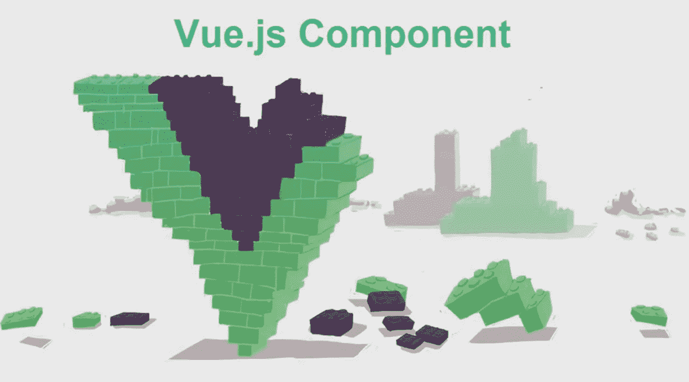
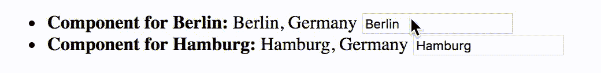

# 在 VueJS 中创建组件

> 原文：<https://javascript.plainenglish.io/creating-components-in-vuejs-c7a61d84430c?source=collection_archive---------2----------------------->



[**组件**](https://vuejs.org/v2/guide/components.html) 是一种为你的 Vue.js 应用编写模块化、可重用代码的方式。组件可以被认为是定制的 HTML 元素，可以被主`Vue`实例和/或其他组件使用。它们也可以被认为是小型或子`Vue`实例。

要创建一个组件，可以用`Vue`构造函数的`component`方法对其进行全局注册。

```
Vue.component('some-component', {
    /* data, methods, etc. go here */
});
```

第一个参数是用作组件名称的字符串。您可以在 HTML 中将该名称用作标记名来呈现组件。

```
<some-component></some-component>
```

习惯上，名称全部小写，并用连字符分隔单词(kebab-case)。

第二个参数是一个配置对象，也可以传递给`Vue`构造函数。几乎所有可以传递给`Vue`构造函数的东西都可以传递给`Vue.component`。两个重要的例外是`el`和`data`。

您没有将一个`el`传递给`Vue.component`，因为它们是在遇到它们的标签的地方呈现的。您可以为组件的 DOM 子树指定一个模板，而不是一个`el`。

在适当的时候你确实传递了`data`，但是它与你传递给`Vue`构造函数的`data`采用了不同的形式。传递给`Vue.component`的`data`必须是一个返回对象的函数，而不是一个对象。

```
Vue.component('some-component', {
    data: function() {
        return {
            heading: 'Some Component'
        };
    }
});
```

这是必要的，因为组件可以多次使用，我们希望每个组件都有自己的数据对象。请看[这里](https://vuejs.org/v2/guide/components.html#data-Must-Be-a-Function)的一个例子，如果你为一个组件的数据使用一个共享对象会发生什么。


Photo by [Yancy Min](https://unsplash.com/@yancymin?utm_source=medium&utm_medium=referral) on [Unsplash](https://unsplash.com?utm_source=medium&utm_medium=referral)

# 模板

有几种方法可以为组件指定模板。

一种方法是将模板的内容放在组件本身的标记内。为此，您需要向标签添加一个名为`inline-template`的属性。

```
<some-component inline-template>
    <div>
        <h1>{{heading}}</h1>
        <p>This is a component</p>
    </div>
</some-component>
```

这种方法的价值有限，因为您经常想要重复使用组件，并且每次都必须重写模板是非常烦人的。

另一个选择是为你的模板使用一个`<script>`标签。

```
<some-component></some-component>
```

```
<script id="some-template" type="text/x-template">
<div>
    <h1>{{ heading }}</h1>
    <p>This is a component!!!</p>
</div>
</script>
```

```
Vue.component('some-component', {
    data: function() {
        return {
            heading: 'Some Component'
        };
    },
    template: '#some-template'
});
```

也可以将`template`属性直接设置为包含模板的字符串。这只适用于短的(单行)模板。较长的模板变得难以使用。

```
Vue.component('some-component', {
    data: function() {
        return {
            heading: 'Some Component'
        };
    },
    template: '<h1>{{heading}}</h1>'
});
```

请注意，在上面的所有模板示例中，只有一个根元素包含在模板中，而所有其他元素都包含在模板中。这是对 Vue 模板的要求。

# `props`

数据可以作为自定义属性传递给组件。这些数据在 Vue.js 术语中被称为`props`。为了将一个属性传递给一个组件，您必须通过在一个名为`props`的数组中列出它来声明它的名称。

```
<div id="main">
    <ul>
        <li v-for="city in cities">
            <individual-city v-bind:id="city.id" v-bind:name="city.name" v-bind:country="city.country"></individual-city>
        </li>
    </ul>
</div>
```

```
Vue.component('individual-city', {
    props: ['id', 'name', 'country'],
    template: '<span>{{name}}, {{country}}</span>'
});

new Vue({
    el: '#main',
    data: {
        cities: [
            {
                id: 1,
                name: 'Berlin',
                country: 'Germany'
            },
            {
                id: 2,
                name: 'Hamburg',
                country: 'Germany'
            }
        ]
    }
});
```

当你将道具传递给一个组件时，组件将道具作为自身的属性存储，就像它在`data`中传递的项目一样。如果父对象将其自己的反应属性作为道具传递，当这些属性的值发生变化时，组件将接收更新后的值，并在必要时重新渲染组件。

因为传递给组件的属性会随着父组件的相应属性的改变而改变，所以组件最好将它们收到的属性作为只读属性对待。如果他们改变了其中任何一个人的价值观，他们不能确定他们不会通过自己的行动改变到别的东西。

如果一个组件改变了它的一个属性的值，并且这个属性是一个原始值，那么父属性*的相应属性将不会受到影响。组件不能改变其父组件是设计使然。通过确保数据单向流动——从父组件到组件——vue . js 消除了许多潜在的混乱。*

如果您想让组件影响它的父组件，您可以让组件发出父组件侦听的事件。您使用组件的`$emit`方法来完成这项工作。

```
<div id="main">
    <ul>
        <li v-for="city in cities">
            <strong>Component for {{city.name}}:</strong>
            <individual-city
                  v-bind:id="city.id"
                  v-bind:name="city.name"
                  v-bind:country="city.country"
                  v-on:changed="updateCityName"></individual-city>
        </li>
    </ul>
</div>
```

```
Vue.component('individual-city', {
        props: ['id', 'name', 'country'],
        methods: {
            changed: function(e) {
                this.$emit('changed', this.id, e.target.value);
            }
        },
        template:
            '<span>{{name}}, {{country}} <input v-bind:value="name" v-on:input="changed"></span>'
    });

    new Vue({
        el: '#main',
        data: {
            cities: [
                {
                    id: 1,
                    name: 'Berlin',
                    country: 'Germany'
                },
                {
                    id: 2,
                    name: 'Hamburg',
                    country: 'Germany'
                }
            ]
        },
        methods: {
            updateCityName: function(id, name) {
                for (var i = 0; i < this.cities.length; i++) {
                    if (this.cities[i].id == id) {
                        this.cities[i].name = name;
                        return;
                    }
                }
            }
        }
    });
```



如果将对象或数组作为属性传递给组件，组件对对象或数组所做的更改将影响父对象。您应该注意不要让组件改变传递给它们的任何对象或数组。如果组件需要改变传递给它的对象或数组，那么应该传递对象或数组的克隆。

感谢您的阅读！

## 进一步阅读

[](https://bit.cloud/blog/meet-component-driven-content-applicable-composable-l24cw7ku) [## 满足组件驱动的内容:适用的、可组合的

### 自从 React 和 Angular 等技术出现以来，我们经常将术语“组件”与…

比特云](https://bit.cloud/blog/meet-component-driven-content-applicable-composable-l24cw7ku) 

*更多内容请看*[***plain English . io***](https://plainenglish.io/)*。报名参加我们的* [***免费周报***](http://newsletter.plainenglish.io/) *。关注我们关于*[***Twitter***](https://twitter.com/inPlainEngHQ)[***LinkedIn***](https://www.linkedin.com/company/inplainenglish/)*[***YouTube***](https://www.youtube.com/channel/UCtipWUghju290NWcn8jhyAw)***，以及****[***不和***](https://discord.gg/GtDtUAvyhW) *对成长黑客感兴趣？检查* [***电路***](https://circuit.ooo/) ***。*****