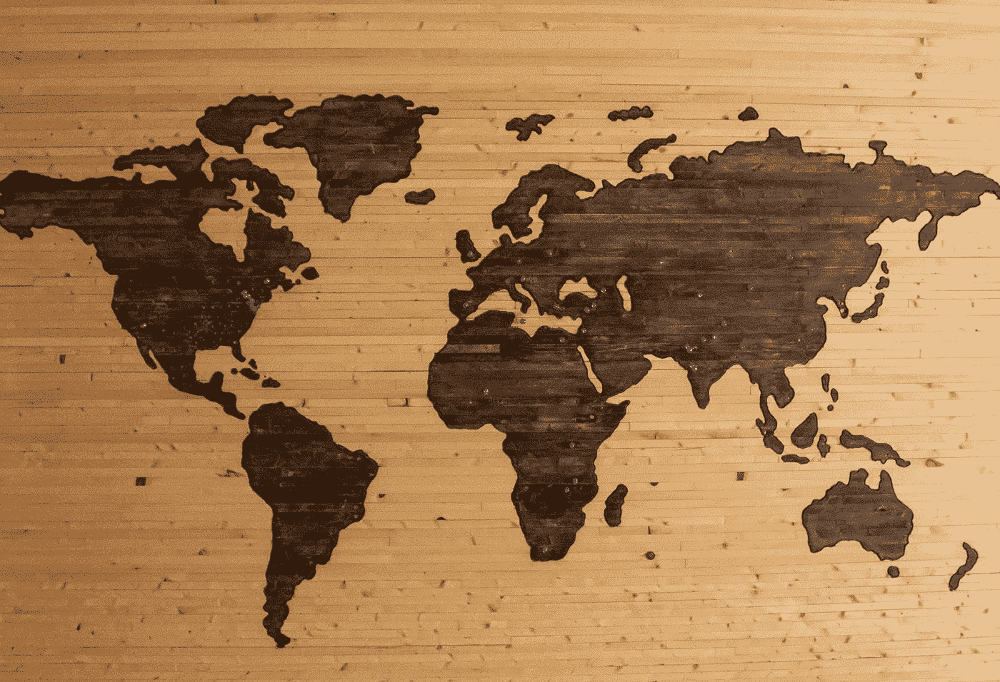
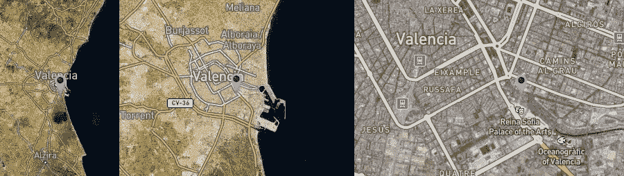
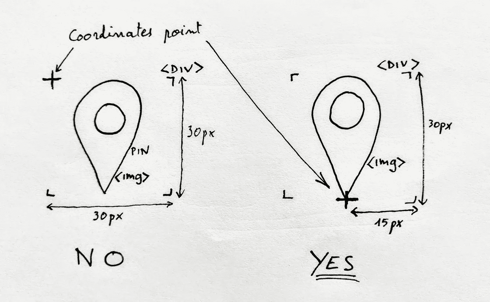
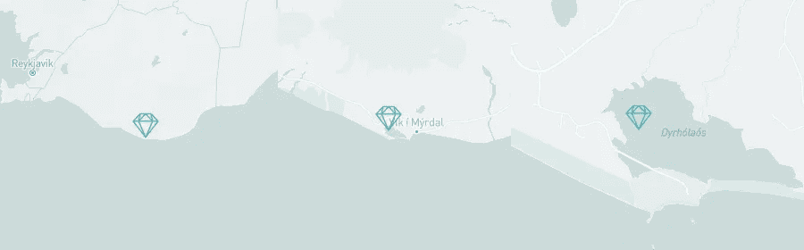

# 使用 React MapBox 创建自定义图钉

> 原文：<https://javascript.plainenglish.io/creating-custom-pins-with-react-mapbox-8b2c91a8659f?source=collection_archive---------6----------------------->



Photo by [Brett Zeck](https://unsplash.com/@iambrettzeck?utm_source=unsplash&utm_medium=referral&utm_content=creditCopyText) on [Unsplash](https://unsplash.com/s/photos/map?utm_source=unsplash&utm_medium=referral&utm_content=creditCopyText)

## 让他们指向正确的点！

[*MapBox*](https://www.mapbox.com/) *允许大量定制，包括完全自由地设计自己的图钉来定位地图上的位置。正如他们的* [*官方技术文档*](https://docs.mapbox.com/mapbox-gl-js/example/custom-marker-icons/) *所示，pin 基本上是一个 div，呈现在由坐标指定的位置上，并且 div 的内部可以被裁剪以适合任何应用程序。这里我们要关注的是自定义标记显示的确切位置，如果它是大头针或指向对象的形式。*

与其他地图提供商一样，放大和缩小时大头针的大小保持不变，而地图会扩大或变小。在为我们的项目 [GemBox](https://github.com/iourisorokine/Gem-Box) 创建定制别针时，我们注意到一个有趣的现象:



When zooming in, the exact location pointed by the pin changes

图例解释得很好，如果你仔细看，第三张图片上大头针显示的确切位置与第一张有很大不同。这个问题已经被一些开发者解决了，但是仍然有可能找到地图。

原因很简单:在 MapBox 中，大头针的坐标默认是指 div 的左上角，因此在放大和缩小时，正是这个角被锚定到正确的位置。

取决于你的 pin 是如何设计的，你将不得不使用 CSS，并把这个点改变到 div 的底部或者你的 pin 指向的任何地方。

## 调整我们的自定义 pin

对于我们的项目，我们对 React 使用了 MapBox，但是原理与标准 DOM 操作完全相同。我们的 pin 组件的代码如下所示:

```
// top of the component
import { Marker } from "react-map-gl";//in the render
<Marker 
   latitude={props.data.latitude}
   longitude={props.data.longitude}
   captureClick={false}
   draggable={false}>
      <div className=”custom-pin” 
         onClick={() => {props.openPopup(props.data);
         }}>
         
      </div>
</Marker>
```

Marker 是 MapBox 包中的一个组件，它在地图上呈现一个 div，在我们的例子中它只包含一个图像。有许多可选属性，包括 *offsetTop* 和 *offsetLeft。我们会玩这些。*

让我们检查一下我们的大头针应该是什么样的:它是一个 30px 边的正方形，点应该在中间的底部；



越来越清晰了:

*   我们将在组件的*渲染*中为标记属性添加 30px 的*偏移*和一个 15px 的*偏移*。我们正在“把图像拉回来”,所以数字应该是负数。
*   在 CSS 中，我们将确保 img 大小合适，如果长宽比不同，我们添加 align(在我们的例子中—水平居中)。

结果是:

```
// top of the component
import { Marker } from "react-map-gl";//in the render
<Marker 
   latitude={props.data.latitude}
   longitude={props.data.longitude}
   captureClick={false}
   draggable={false}
   offsetTop={-30}
   offsetLeft={-15}>
      <div className=”custom-pin” 
         onClick={() => {props.openPopup(props.data);
         }}>
         
      </div>
</Marker>//in the CSS.custom-pin {
   height: 30px;
   width: 30px;
   display: flex;
   justify-content: center;
}.custom-pin img {
   width: 100%;
   height: 100%;
}
```

下面的例子是该应用程序的进一步版本，因此风格完全不同，但它表明，通过这些调整，当我们放大时，我们的大头针总是指向正确的位置:



3 times the same pin with different zoom: the diamond points at the same spot

就是这样，我们通过将坐标设置到正确的点来纠正我们的 pin。MapBox for React 允许对其元素进行大量定制，因此使用开发人员工具在浏览器中检查它们通常有助于确定其结构方式以及如何处理它。

关于 React 地图框和标记的更多信息:

*   [反应地图框简介](https://medium.com/better-programming/into-to-react-mapbox-gl-js-b7d827f7d7d6)
*   [样式标记](https://stackoverflow.com/questions/51459791/stylable-marker-feature-in-react-mapbox-gl)
*   [动画标记](https://medium.com/better-programming/animate-map-markers-using-mapbox-react-hooks-2f646a6301e)

玩得开心！