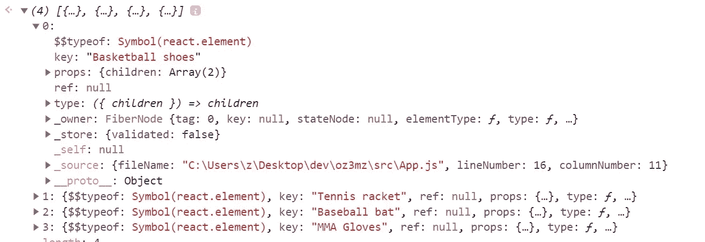
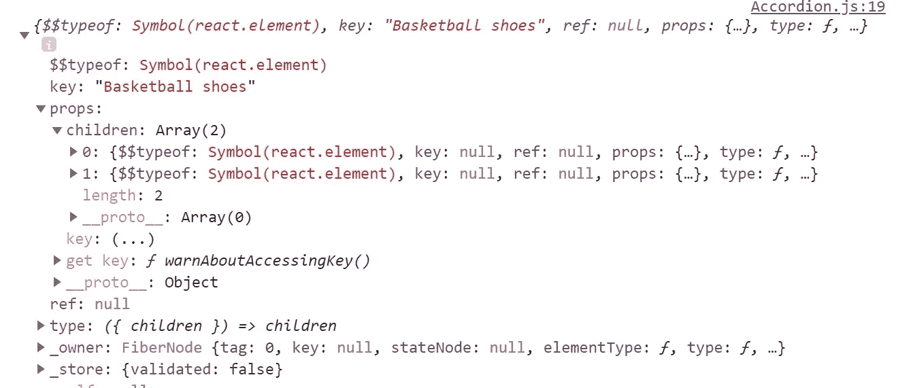

# 高度可重复使用的反应组件

> 原文：<https://javascript.plainenglish.io/creating-highly-reusable-react-components-learn-by-creating-an-accordion-list-b32d150eb649?source=collection_archive---------0----------------------->

## 让我们用 React 构建一个 accordion 复合组件。儿童 API


Photo by [James Lee](https://unsplash.com/@picsbyjameslee?utm_source=medium&utm_medium=referral) on [Unsplash](https://unsplash.com?utm_source=medium&utm_medium=referral)

在本文中，我们将重点关注创建高度可重用的 React 组件。我的目标是让它成为任何想要了解 React 更多信息以及它的一些特性是如何工作的人的一个坚实的切入点。

为此，我们将从头开始创建一个定制的 accordion 复合组件。如果你不确定我说的*手风琴是什么意思，*想象一下一个项目列表，当点击时，它会展开显示额外的内容。

虽然我强烈建议先阅读整篇文章，但是在文章的最后还有一个视频版本，以及一些代码片段。

另外，如果你喜欢这篇文章，可以看看我在[上传文件的文章，点击这里](https://dzuz14.medium.com/simple-file-uploading-with-react-hooks-fe89c225db57)。

# 第一印象

乍一看，构建一个 accordion 组件似乎是一项微不足道的任务。只要添加一些状态来跟踪哪个项目是打开的，添加一个点击处理程序，传递一些道具，我们就完成了，对吗？当然，我们也许可以一起为一个非常特定的用例工作，但这不是我们这里的目标。

相反，我们应该让我们的组件适应各种各样的用例。它应该只需要很少的设置工作，并且不需要额外的代码就可以工作。用户应该能够“设置它，然后忘记它。”

# 规划我们的手风琴组件

我们将把手风琴设计成复合组件。如果你曾经使用过像 [React Bootstrap](https://react-bootstrap.github.io/) 这样的库，那么复合组件语法应该对你来说非常熟悉。

以下是我的设想:

我们的 accordion 将支持显示多个项目组件。它可以手动添加，也可以通过迭代数据结构(如数组)以编程方式生成。

# 入门指南

现在我们已经定义了我们的组件层次结构，让我们从根`Accordion`组件开始。现在，我们需要做的就是创建一个基本的 React 组件，接受孩子作为道具。有了这些，我们可以直接进入创建下一个组件，`Item`。

# 手风琴。'项目'

在 React 中，当您在一个父元素中呈现多个元素时，您需要确保两个元素都驻留在一个公共的包装器元素中。例如，此语句将在 React 中产生一个错误:

我们很可能会遇到一个错误，声称“相邻的 JSX 表达式必须包含一个父表达式。”为了解决这个问题，我们可以执行以下任一操作。

在我看来，强迫用户添加一些他们自己的语法以使我们的组件工作(尽管只是很小的添加)似乎不太专业。因此，我建议我们创建一个简单的包装组件，让他们开箱即用。

由于我们的`Item`组件非常简单，我们甚至不需要为它创建一个新文件。相反，我们可以在与`Accordion`相同的文件中声明它。

所有需要做的就是将`Item`指定为一个箭头函数，接受孩子作为道具，我们现在有了一个容易识别的包装组件，可以通过点符号在`Accordion`中使用。

# 手风琴。'折叠'

我们的下一个任务是显示一个`Item`的折叠内容。理想情况下，这将在它自己的文件中创建，并导入到根`Accordion`组件中。所需要的就是显示它的子元素，并应用一些非常基本的样式。

# 手风琴。'扩展'

`Expanded`组件也很简单，只涉及显示子元素。除此之外，还需要一些基本的造型。

准备就绪后，让我们更新我们的`Accordion`组件，以包含新的`Collapsed`和`Expanded`组件。鉴于 JavaScript 中的一切都是对象(甚至 React 组件)，使用点符号就像我们在`Item`中做的一样简单，将这些组件作为`Accordion`的一部分包含进来！

到目前为止，如果我们真的想将它导入到一个文件中并使用它，我们至少能够看到放置在`Collapsed`和`Expanded`组件中的任何内容。但是我不建议你在本教程结束之前尝试运行这个`Accordion`。

# 显示几个折叠项

一个只显示一个项目的手风琴显然是非常无聊的。

在本教程的剩余部分，我们将使用下面的模拟数据来呈现几个项目。

为了显示数据，我们只需创建一个`Accordion`，映射整个数组，并为每个数组元素生成一个`Item`、`Collapsed`和`Expanded`组件。

# 跟踪展开的项目

出于功能性的考虑，当点击`Collapsed`组件时，我们需要考虑两种情况:

*   如果单击的项目没有展开，则显示其展开的内容。此外，如果展开了另一个项目，请确保将其关闭。
*   如果单击的项目已经展开，请关闭它

为了跟踪这一点，如果我们使用一个存储在状态变量中的字符串呢？当一个特定的项目被点击时，我们可以从中提取某种类型的惟一值，并使用它来确定它的展开状态。

## *但是这个独特的价值是什么，它将从哪里来？*

一个简单的解决方案就是给`Collapsed`增加一个名为`id`的新道具。我们希望`id`道具对于每个`Collapsed`组件都是唯一的，所以我们可以在模拟数据中使用每个对象的`summary` 键。

让我们回到我们的`Collapsed`组件代码，并确保我们更新它来接受这个新的道具。现在，我们可以将`id`作为一个数据属性附加上去，然后忘掉它。

# 处理点击

为了在点击`Collapsed`组件时执行状态更新，我们将创建一个函数来处理它。我们可以在根`Accordion`组件中定义这个函数，并将其作为道具传递给`Collapsed`。

我们现在要在我们的`Accordion`代码中实现上一节的状态和这个函数。

状态变量`open`最初将被设置为空字符串(这意味着不会展开任何项目)。在随后的点击中，它会根据函数中的逻辑进行更新。

在结束本节之前，我们需要再次访问`Collapsed`组件，并更新它以接受`handleOpen`作为道具。

# 拦截拉手风琴的孩子

我知道你们都是精明的读者，我将假设你们已经注意到了根`Accordion`组件中我们的代码有问题。忽略到目前为止我们添加到该组件的所有附加代码，让我们看下面一行:

```
return <div>{children}</div>
```

如果我们没有在代码中显式地将道具传递给`Collapsed`,我们该如何传递呢？既然我们将`Item`、`Collapsed`和`Expanded`的实现留给了组件的用户，那么我们刚刚创建的状态和点击处理程序不是完全无用吗？

如果 React 没有为我们提供一种在孩子被渲染之前与他们互动的方式，那么答案将是“是”。然而，对我们来说幸运的是，React 为我们提供了一种简单的方法来做到这一点。我们将特别关注的 React API 的两个特性是:

*   `[React.Children](https://reactjs.org/docs/react-api.html#reactchildren)`
*   `[React.cloneElement](https://reactjs.org/docs/react-api.html#cloneelement)`

# 做出反应。'儿童地图'

为了拦截子节点传递给我们的`Accordion`组件，我们可以利用***提供的功能。这个函数将允许我们在渲染每个子组件之前对其进行迭代，并定制最终将显示在屏幕上的内容。***

**在`map`流程中，我们的两个优先事项是:**

*   **拦截每一个`Collapsed`组件，并作为道具传递给它一个函数。这将是我们之前创建的`handleOpen`函数。**
*   **基于状态中`open`变量的当前值，有条件地渲染每个`Expanded`组件**

**为了更好地理解`map`函数，让我们看看可以传递给它的两个参数:**

*   **要迭代的子对象**
*   **对每个孩子执行的函数**

**在这一点上，用一些代码开始研究这个问题可能更容易。在这个代码片段中，我已经排除了我们的`Accordion`组件中的大部分代码，只关注`React.Children`。**

**需要注意的是，第一个参数`children`永远不会改变。它在那里充当我们想要迭代的子数组。第二个参数需要是一个由我们创建的函数，它将使我们能够访问每个单独的孩子，并且将是所有神奇事情发生的地方。**

# **React 是递归的**

**如果这种方式有助于您将其形象化，您可以将 React 组件视为具有递归行为。组件可以有子组件，它们的子组件可以有子组件，这些子组件可以一直有子组件，直到我们到达一个基础案例(没有更多的元素留下来渲染)。**

## ****让我们来看看引擎盖下的孩子们发生了什么****

**如果我们在第二个参数的函数中添加一个`console.log`,我们应该期望控制台中显示一个包含四个元素的数组。**

**但是，在查看控制台输出之前，您能猜出数组中的每个元素是什么吗？**

```
**{React.Children.map(children, child => {
  console.log(children)
  return <div></div>
})}**
```

****

**如果您猜到每个元素将是一个`Item`组件，那么您猜对了！如果这还不清楚，让我们再看看我们的组件层次结构——它应该开始变得有意义了。**

**如果我们不再假设`React.Children.map`在直接子级运行，并且只有一个`Item`组件可以是`Accordion`的直接子级，那么它返回给我们四个`Item`组件是有意义的。**

**然而，正如我们之前了解到的，每个孩子也可以有自己的孩子。因此，我们需要深入到层次结构中去寻找我们想要的组件。**

# **查找“折叠”和“展开”**

**既然我们已经确定我们正在处理一组`Item`组件，我们如何找到`Collapsed`和`Expanded`？如果我们检查我们阵列中的一个`Item`组件，看看它的道具会怎么样？**

**不记录`children`，让我们记录`child` 来代替。**

```
**{React.Children.map(children, child => {
  console.log(child)
  return <div></div>
})}**
```

****

**根据控制台输出，我们的孩子正好有 ***两个孩子*** *。如果我是一个爱赌博的人，我会忍不住拿房子打赌，那两个孩子是我们长期寻找的`Collapsed`和`Expanded`组件！有了这些信息，我们可以添加完成我们的`Accordion`所需的其余逻辑。***

# **收起手风琴**

**在我展示完整代码的片段之前，让我们深入了解一下需要添加到我们的`map`语句中的内容。我们只需要几行代码，就完成了。**

**为了使代码更整洁、更易于维护，我决定创建一些描述性变量，而不是在没有明确说明代码在做什么的情况下将所有内容都放入 return 语句中。**

**对于`id`和`Expanded`变量，我们从`Collapsed`组件(`child.props.children[0]`)中提取 ID，并使用它来有条件地呈现`Expanded`组件(`child.props.children[1]`)。这确保了一个`Expanded`组件只有在 ID 和打开状态变量匹配时才会被呈现。**

**至于`Collapsed`变量，我们通过传入当前的`Collapsed`组件(`child.props.children[0]`)来使用`React.cloneElement`作为第一个参数，并传入我们想要添加到它的任何道具作为第二个参数。使用`cloneElement`将导致我们的`Collapsed`变量成为`Collapsed`的新副本，而`handleOpen`函数合并到它的道具*中。***

# **这就是了，女士们先生们**

**这是最辉煌的最终代码。**

# **摘要**

**非常感谢您阅读这篇文章。你可以通过查看我的 [GitHub](https://github.com/dzuz14) 或者如我所承诺的，查看本教程的视频来更深入地了解。**