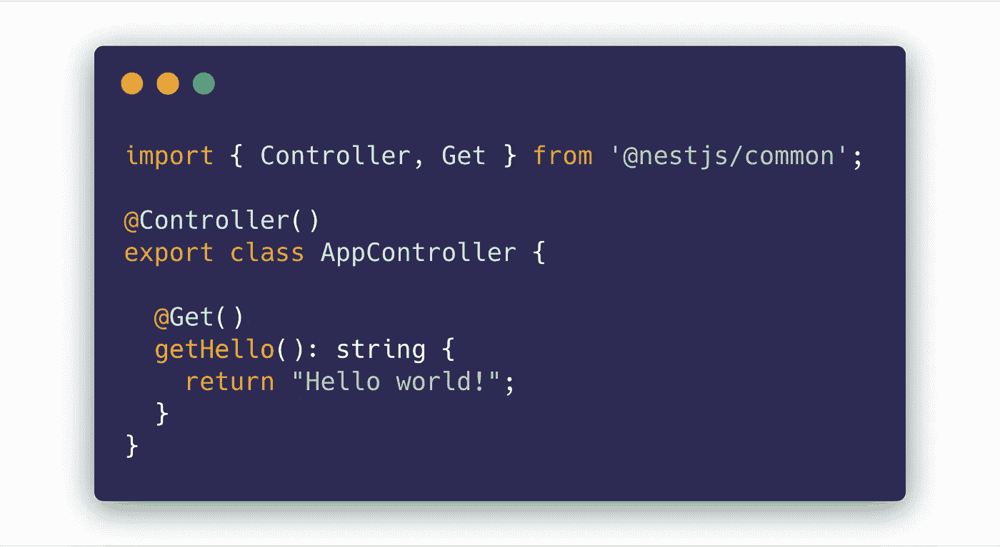
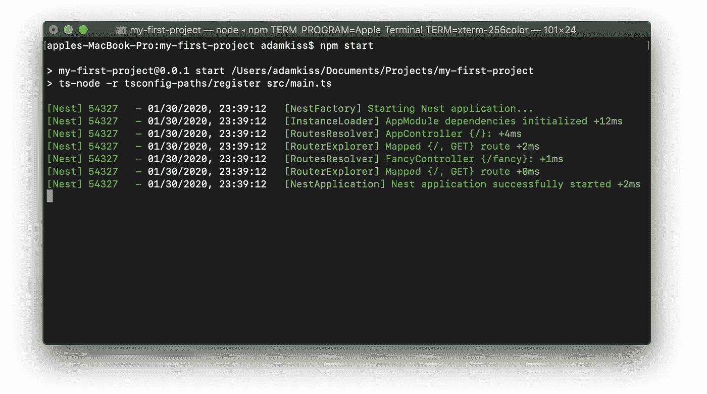
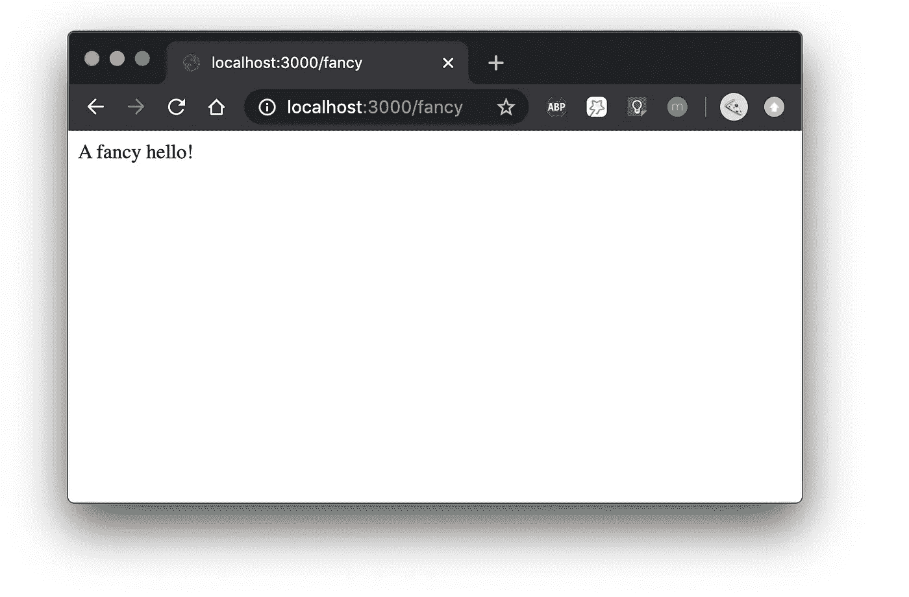
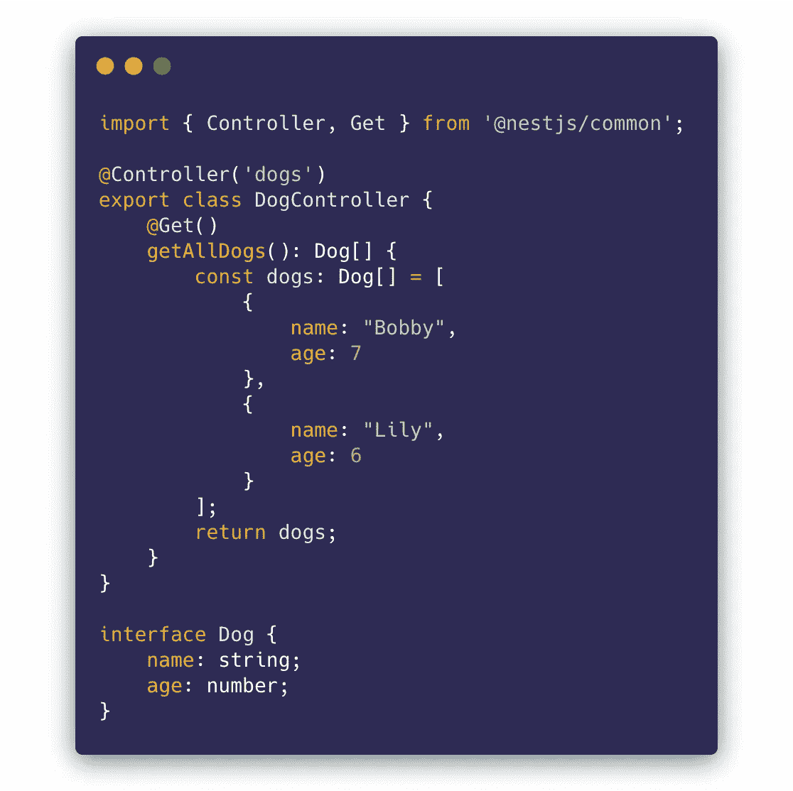
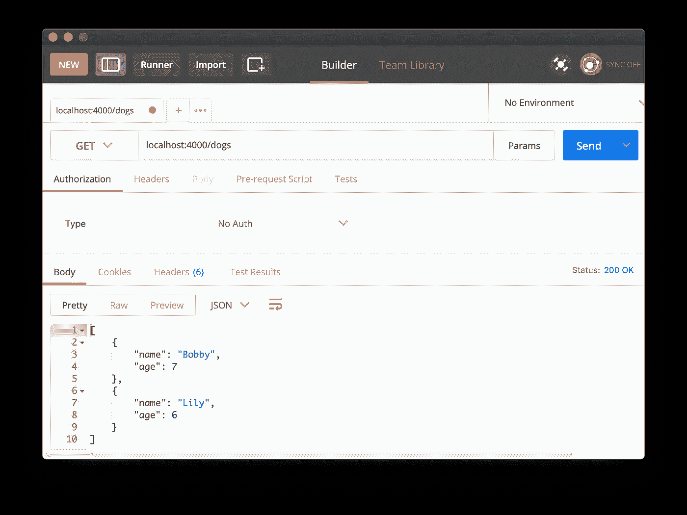
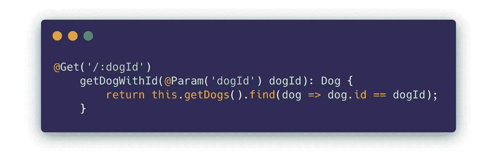
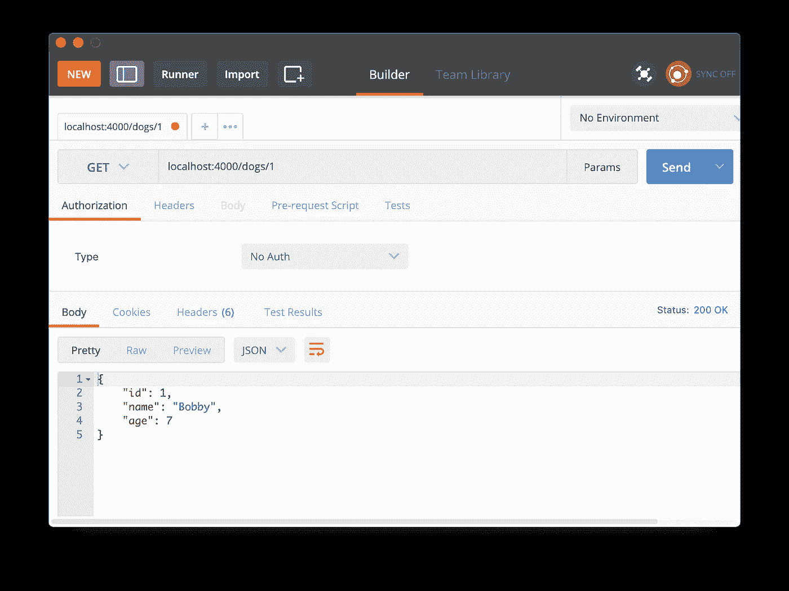
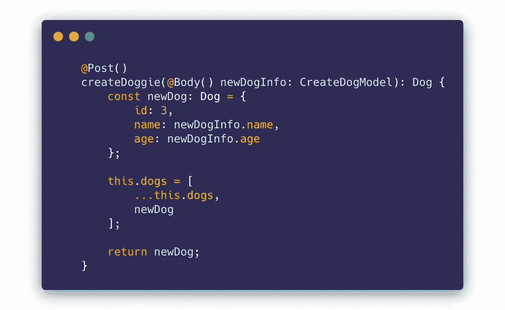
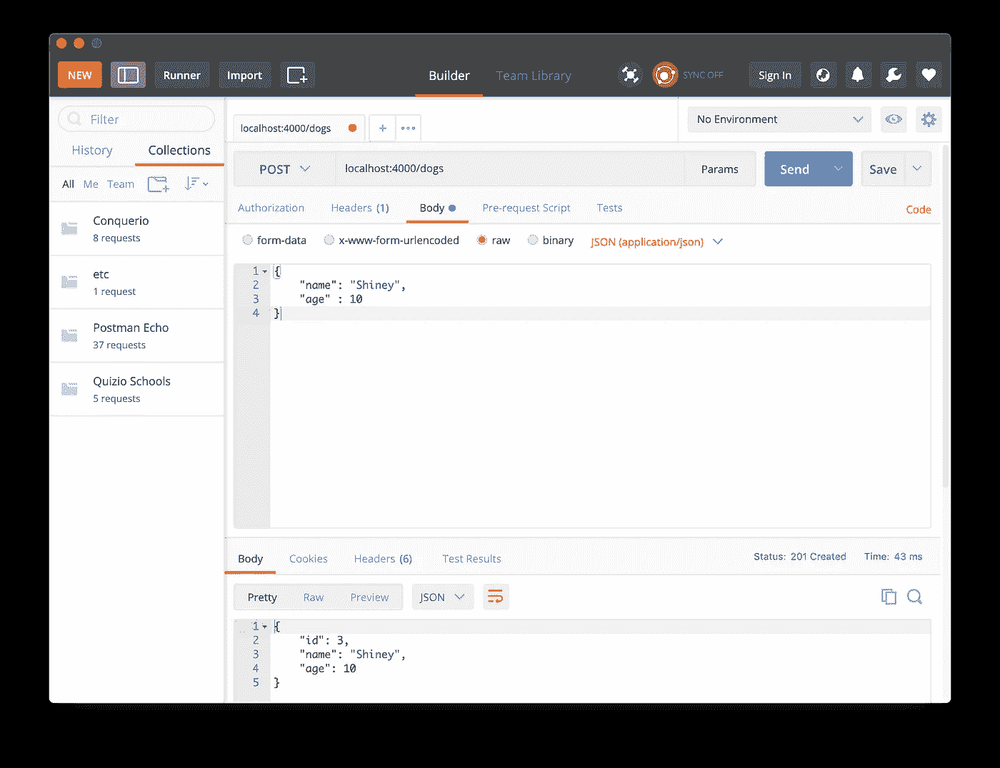

# 探索 NestJS——如何在 Nest 中创建 HTTP 端点

> 原文：<https://javascript.plainenglish.io/creating-http-endpoints-in-nestjs-8cc801e079ec?source=collection_archive---------1----------------------->


Photo by [SpaceX](https://unsplash.com/@spacex?utm_source=medium&utm_medium=referral) on [Unsplash](https://unsplash.com?utm_source=medium&utm_medium=referral)

欢迎阅读“探索 NestJS”系列的第 3 章！

如果你还没有看过前两篇入门文章，我劝你先看看: [*安装 NestJS 并入门*](https://medium.com/javascript-in-plain-english/exploring-nestjs-installing-nestjs-and-getting-started-fb2e4f36b596)[*Nest 的模块系统*](https://medium.com/javascript-in-plain-english/exploring-nestjs-nests-module-system-88c6d7ad0970) 。

作为一个 web 框架，Nest 必须提供的最重要的东西是响应 HTTP 请求的能力，从而与客户端应用程序对话。

在这一章中，我们将最终探索 NestJS 的主要和最重要的功能之一:HTTP 端点和与 HTTP 客户端的通信。

# 管制员能做什么？

控制器的工作是响应 HTTP 请求。

虽然也存在其他协议，但通常 HTTP(超文本传输协议)用于客户端-服务器通信(基本上是*整个 web* )。

当你访问一个网页时，一个初始的 HTTP *GET* 请求被发送到网站的 URL。当您提交表单时，会发送一个 HTTP *POST* 请求。当你更新你的个人资料图片时，会发送一个 HTTP *PUT* 请求，并附带一个有效载荷，这就是你新的闪亮的个人资料图片。

对于 web 开发来说，掌握 HTTP 协议的知识是至关重要的，如果您没有太多相关经验，我建议您阅读一些关于 HTTP 协议的好文章。

# 给我看看代码！

Nest 是一个面向装饰者的框架，创建一组 HTTP 端点非常容易，只需装饰(注释)函数。

您将响应请求的功能放在控制器中。

一个非常简单的控制器，当向 Nest 应用程序发出 HTTP 请求时，它会以“Hello world”作为响应，如下所示:



# 创建控制器

你在[第 2 章](https://medium.com/javascript-in-plain-english/exploring-nestjs-nests-module-system-88c6d7ad0970\)中看到了如何使用 NestJS CLI 生成一个新模块。

您也可以使用以下 CLI 命令轻松生成控制器:

```
nest generate controller my-nice-controller
```

但是，让我们手动创建一个控制器。

## 步骤 1:创建控制器本身

首先，您必须为控制器创建一个新文件。

控制器总是被命名为`<controller-name>.controller.ts`。

让我们在主`AppModule` : `fancy-controller.controller.ts.`中创建一个新的控制器


## 第二步:创建一个新类，并用*“控制器”*装饰它

将以下代码插入控制器:

我们使用的*控制器*装饰器带有一个参数，即控制器应该激活的基本路由。

如果您在本地运行应用程序， *FancyController* 将在以`localhost:3000/fancy`开始的路线(URL)上激活。

我们还有一个用 *Get* 装饰器装饰的函数。每当我们的控制器*得到*(没有双关的意思)一个对其 URL 的 GET HTTP 请求，字符串*“A fancy hello！”*将返回给 HTTP 客户端。我们一会儿就来试试这个。抓紧了。

## 步骤 3:在模块中注册控制器

在我们的控制器工作之前，我们必须在一个 NestJS 模块中注册它。

实际上，我们需要将它注册到一个模块的*“控制器”*数组中(如[第二章](https://medium.com/javascript-in-plain-english/exploring-nestjs-nests-module-system-88c6d7ad0970)所述)。

让我们在任何一个 Nest app 的默认模块中注册我们新创建的 FancyController，`AppModule`:

现在，我们都准备好尝试一下了！

通过在终端中键入以下命令来运行(或重启)Nest 应用程序:

```
npm start
```



完美！现在打开你最喜欢的浏览器，进入`localhost:3000/fancy`。

您应该会看到以下消息:



> *总结一下:浏览器向您输入的 URL 发出一个****GET HTTP****请求，这个请求在您的嵌套项目中映射到返回的函数:*“一个花哨的 hello！”*。整洁！*

# 处理不同类型的请求

## 处理 GET 请求

GET 请求通常用于请求资源，可以是 HTML、图像、文本等。

在 NestJS 中，你通常会将基于 JSON 的对象表示发送到 HTTP 客户端(一个对象可以是你想要的任何东西，例如:一些关于天气、关于一只喜欢的狗、关于凯莉·詹娜等等的信息)。



The DogController

在上面的例子中，我们有一个名为 *DogController 的控制器。*

它有一个用 *@Get()，*修饰的函数，当被调用时返回一个 Dog 类型对象的数组。

让我们用 HTTP 客户端调用这个端点。我将使用[邮递员](https://www.postman.com/)来完成这个任务。

> *一个* HTTP 客户端*是一个可以向服务器发送 HTTP 请求的软件(在我们的例子中是 NestJS)。浏览器可以被认为是 HTTP 客户端。你可以通过* curl *发送 HTTP 请求。HTTP 请求可以通过使用* fetch *、* axios *等在你的 React、Angular、Vue app 中发送。*



Postman used for sending a GET request

这里您可以看到 HTTP GET 调用的结果。

NestJS 以 JSON 格式返回我们的狗列表。酷！

现在，假设我们想要获得关于一只狗的信息。NestJS 支持参数化的 URL。这些 URL 有某些动态值的占位符:



A request with a parameter

我们在控制器中声明了一个 URL，它有一个由“: *dogId”表示的动态值。*

现在，我们可以发出以下 HTTP 请求，只获取某只狗:



## 处理发布请求

HTTP POST 请求通常用于创建资源。

继续我们的狗的例子，如果你想创建一个新的狗呢？

我们将在控制器中创建另一个函数来响应 POST 请求并创建一条新的狗🐕。



Our new endpoint!

好吧，现在我们用了一个新的室内设计师！

*@Body()* 将把我们的 HTTP Post 有效负载(在请求体中发送的信息)注入类型为 *CreateDogModel:* 的变量 *newDogInfo*


CreateDogModel

现在，每当我们用一个有效的 JSON 请求体(格式为 *CreateDogModel* )点击我们的 POST 端点时，一个新的 dog 就会被创建！

使用 Postman 我们可以发出这样的 POST 请求:



您可以看到 HTTP 请求的响应是新创建的资源。看起来棒极了！🎇

## 处理上传、删除请求

创建处理 PUT 和 DELETE 请求的端点与您之前看到的非常相似，主要是修饰者对 HTTP 动词(PUT、DELETE、PATCH 等)的更改。).

# 我还可以用控制器做什么？

由于这是关于 NestJS 的介绍性文章系列的一章，所以我不会深入研究控制器。

我认为 [NestJS 关于控制器](https://docs.nestjs.com/controllers)的文档非常好🔥。

如果您想知道是否可以轻松设置状态代码、标题和重定向，答案是肯定的！

去尝试一切吧！🙏🏻

干杯！