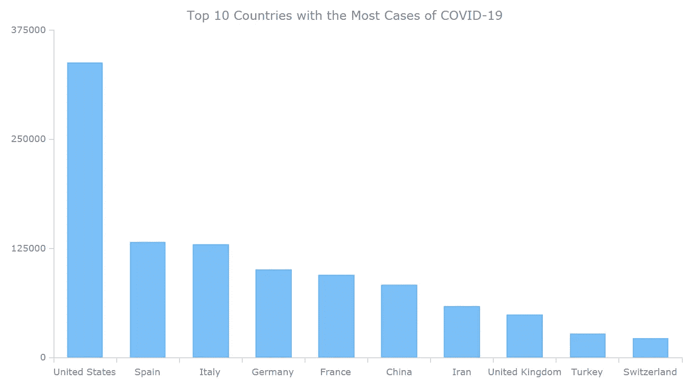
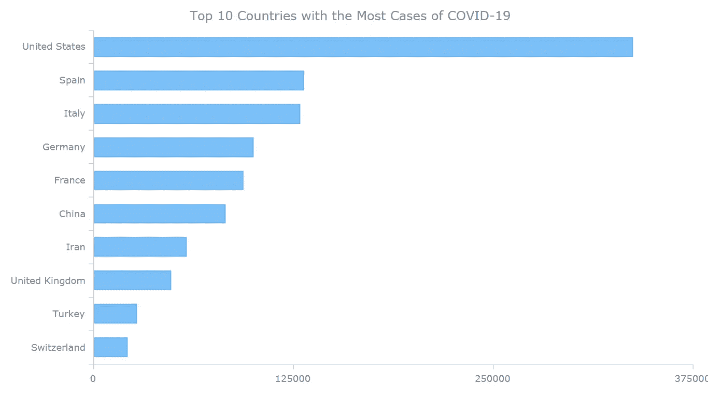
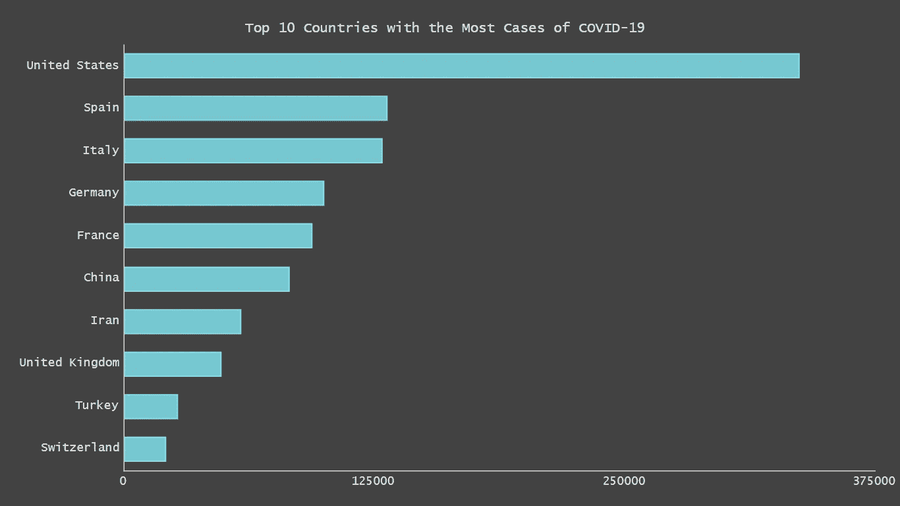
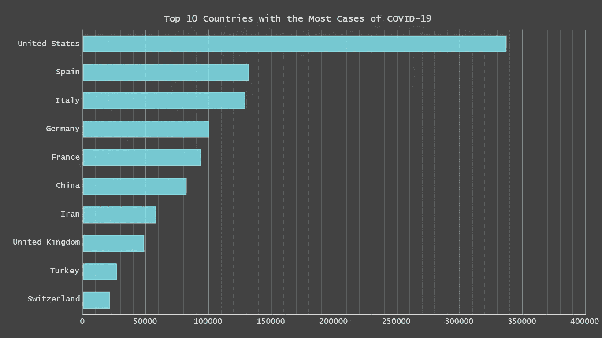
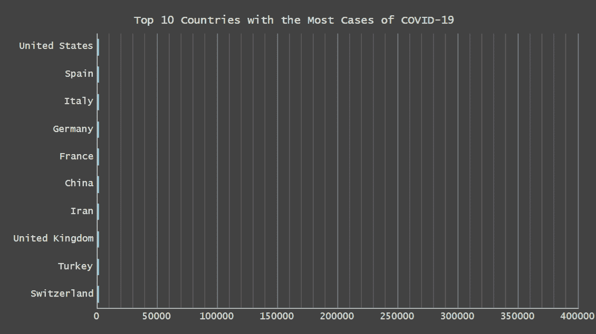

# 在新冠肺炎数据上创建 JavaScript 柱形图和条形图

> 原文：<https://javascript.plainenglish.io/creating-javascript-column-and-bar-charts-on-covid-19-data-2ca70a39b826?source=collection_archive---------11----------------------->


**您的网站或应用需要引人注目的 JS 图表吗？从基础开始！完成这个快速数据可视化教程，您将学习如何轻松地创建 JavaScript** [**列**](https://www.anychart.com/chartopedia/chart-type/column-chart/) **和** [**条形图**](https://www.anychart.com/chartopedia/chart-type/bar-chart/) **，它们在任何基于 HTML5 的项目中都非常好看，便于比较。**

本教程中要构建和演示的图表示例将可视化来自 JHU CSSE 的最新[新型冠状病毒病例数据，因为新冠肺炎是当今最热门的话题。](https://github.com/CSSEGISandData/COVID-19)

继续阅读，你会发现 JS 图表实际上非常简单。尤其是如果你至少对编程有一个非常基本的了解(比这更好的是可怕的，但远非必要)。

# 如何构建一个基本的 JavaScript 柱形图

通常，制作几乎任何基本类型的 JS 图表都需要四个简单的步骤，柱形图也不例外:

1.  创建网页。
2.  参考必要的文件。
3.  设置数据。
4.  给图表编码。

现在让我们一个接一个地看，然后为了更好地说明，进行一点更高级的定制。

## 1.创建网页

首先，创建一个要构建图表的 HTML 页面。

添加将成为图表容器的块级 HTML 元素，并指定其 ID。

要使图表填满整个页面，请将`width`和`height`参数设置为 100%。

所以整个 HTML 页面看起来像这样:

```
<!DOCTYPE html>
<html>
  <head>
    <title>JavaScript Chart on COVID-19 Data</title>
  </head>
  <body>
    <div id="container" style="width: 100%; height: 100%;"></div>
  </body>
</html>
```

## 2.参考必要的文件

第二，在`<head>`部分的`<script>`标记中包含构建图表所需的所有脚本。

根据本教程构建的图表将由 any chart JavaScript charting library 提供支持，该库易于使用且灵活，并且有一个包含许多示例的详细文档。因此，请将 CDN 中的基本模块包括在内。

图表代码本身将转到`<body>`部分内的`<script>`标签。

```
<!DOCTYPE html>
<html>
  <head>
    <title>JavaScript Chart on COVID-19 Data</title>
    <script src="https://cdn.anychart.com/releases/8.7.1/js/anychart-base.min.js"></script>
  </head>
  <body>
    <div id="container" style="width: 100%; height: 100%;"></div>
    <script>
 ***// The chart code will be written here.***
    </script>
  </body>
</html>
```

## 3.设置数据

第三，您应该添加想要可视化的数据。

基本上，有许多[方法](https://docs.anychart.com/Working_with_Data/Supported_Data_Formats)将数据加载到图表中。本教程描述了如何创建一个简单的图表，所以让我们安排简单的数据。

目前，新型冠状病毒疫情是全世界的头号话题。让我们制作一个 JavaScript 柱形图，可视化截至昨天，即 2020 年 4 月 5 日，确诊新冠肺炎病例最多的前 10 个国家**。数据将取自约翰·霍普金斯大学系统科学与工程中心(JHU·CSSE)的[数据仓库](https://github.com/CSSEGISandData/COVID-19)，其中包含可信的统计数据。根据该报告，截至 4 月 5 日，新冠肺炎确诊病例排名前 10 位的国家如下:**

> **国家——病例数**
> 
> 美国—337072
> 西班牙—131646
> 意大利—128948
> 德国—100123
> 法国—93773
> 中国—82602
> 伊朗—58226
> 英国—48436
> 土耳其—27069
> 瑞士—21100

让我们将这些数据转换成一个带有数据数组和标题设置的 JavaScript 对象:

```
var data = {
  header: ["Country", "Number of cases"],
  rows: [
    ["United States", 337072],
    ["Spain", 131646],
    ["Italy", 128948],
    ["Germany", 100123],
    ["France", 93773],
    ["China", 82602],
    ["Iran", 58226],
    ["United Kingdom", 48436],
    ["Turkey", 27069],
    ["Switzerland", 21100]
]};
```

## 4.给图表编码

最后，现在你已经有了页面、脚本和数据，你已经为最后一步做好了准备——开始编码。

记得在 HTML 页面的`<body>`部分的`<script>`标记中包含图表代码。

首先，添加`anychart.onDocumentReady()`函数，以便在页面准备就绪时加载图表:

```
<script>
  anychart.onDocumentReady(function() {
 ***// The main chart code goes here.***
  });
</script>
```

然后，添加数据:

```
anychart.onDocumentReady(function() {var data = {
    header: ["Country", "Number of cases"],
    rows: [
      ["United States", 337072],
      ["Spain", 131646],
      ["Italy", 128948],
      ["Germany", 100123],
      ["France", 93773],
      ["China", 82602],
      ["Iran", 58226],
      ["United Kingdom", 48436],
      ["Turkey", 27069],
      ["Switzerland", 21100]
  ]};});
```

接下来，定义图表类型。(您可以在[支持的图表列表](https://docs.anychart.com/Quick_Start/Supported_Charts_Types)中找到任何现成图表中可用的图表类型的完整列表。)在该图表中，选择柱形图类型，数据在`data`变量中指定:

```
***// create the column chart*** var chart = anychart.column();

***// add the data*** chart.data(data);
```

让我们也为图表添加一个标题，以便一目了然地展示它的内容:

```
chart.title("Top 10 Countries with the Most Cases of COVID-19");
```

最后要做的是设置绘制图表的容器和命令:

```
***// set the container*** chart.container("container");***// draw the chart*** chart.draw();
```

**搞定！看看下面的结果:**



为了您的方便，这个 JS/HTML5 柱形图在 AnyChart Playground 上可用，在那里您可以看到它的交互式实时版本(例如，将鼠标悬停在各列上，会显示带有确切数字的工具提示)，使用代码和可视化来继续自己掌握这项技术。为了以防万一，下面还提供了完整的 HTML/JS 代码:

```
<!DOCTYPE html>
<html>
  <head>
    <title>JavaScript Chart on COVID-19 Data</title>
    <script src="https://cdn.anychart.com/releases/8.7.1/js/anychart-base.min.js"></script>
  </head>
  <body>
    <div id="container" style="width: 100%; height: 100%;"></div>
    <script>
anychart.onDocumentReady(function() {***// create the data* **  var data = {
    header: ["Country", "Number of cases"],
    rows: [
      ["United States", 337072],
      ["Spain", 131646],
      ["Italy", 128948],
      ["Germany", 100123],
      ["France", 93773],
      ["China", 82602],
      ["Iran", 58226],
      ["United Kingdom", 48436],
      ["Turkey", 27069],
      ["Switzerland", 21100]
  ]};

 ***// create the column chart***  var chart = anychart.column();

 ***// add the data***  chart.data(data);

 ***// set the chart title***  chart.title("Top 10 Countries with the Most Cases of COVID-19");

 ***// set the container***  chart.container("container");***// draw the chart* **  chart.draw();

});
    </script>
  </body>
</html>
```

看起来非常简单和整洁，不是吗？

现在，让我们看看如何修改这样一个 JavaScript 柱形图，以备不时之需。

# 图表定制

## 切换图表类型(到水平条)

有许多用于数据可视化的[图表类型](https://www.anychart.com/chartopedia/usage-type/)，有时您可能需要更改您首先选择的一种，以便更好、更深入地查看您的数据。

例如，下面是如何将柱形图类型切换到条形图类型——将(垂直)柱形图转换为(水平)条形图——只需将`anychart.column()`更改为`anychart.bar()`:

```
var chart = anychart.bar();
```

就是这样！现在这个 JavaScript 柱形图是一个 JS 条形图— [在操场上看看](https://playground.anychart.com/ocNPbTvy/):



## 设定主题

您可以通过多种方式自定图表的外观。然而，要快速改变外观，从预先构建的[图表设计主题](https://docs.anychart.com/Appearance_Settings/Themes)中进行选择可能会很方便。

比如说我们挑一个叫暗绿松石的。这可以通过两步快速完成。

首先，在`<head>`部分的`<script>`标签中引用它:

```
<script src="https://cdn.anychart.com/releases/8.7.1/themes/dark_turquoise.min.js"></script>
```

其次，将它应用到图表中，如下所示:

```
anychart.theme(anychart.themes.darkTurquoise);
```

[下面是它现在的样子](https://playground.anychart.com/n12VY4jr/):



## 启用网格线

在这种数据可视化中，直观地识别由条形线表示的值并不太容易。所以你可能要添加网格线，以促进感知。

在实际启用网格之前，让我们确定所需的刻度间隔——每 50，000 个案例，每 10，000 个案例有一个小刻度。然后，只需添加相应的网格线。

```
***// add ticks*** chart.yScale().ticks().interval(50000);
chart.yScale().minorTicks().interval(10000);
***// add grid lines*** chart.yGrid().enabled(true);
chart.yMinorGrid().enabled(true);
```

注意，在 AnyChart 中，条形图被实现为[垂直](https://docs.anychart.com/Basic_Charts/Vertical/Overview) JavaScript 柱形图。因此，条形图中的水平轴是 Y，垂直轴是 x。所以不要与您在上面的代码片段中看到的内容混淆，那里的一切都是绝对正确的。

这是本步骤的[结果:](https://playground.anychart.com/0zSQuUJg/)



## 打开动画

最后，让我们打开加载时的条形图动画，这是一个简单但很酷的视觉效果:



```
chart.animation(true);
```

这是本教程的[最终图表——所有描述的转换逐一实现的结果！您可以轻松地将其集成到您的 web 项目中。去掉所有的注释，你会发现它是用不到 30 行纯 JavaScript 代码在**中创建的。**](https://playground.anychart.com/YMW1r6LE/)

这是我们从基本 JS 柱形图得出的最终交互式 JS 条形图的完整代码:

```
<!DOCTYPE html>
<html>
  <head>
    <title>JavaScript Chart on COVID-19 Data</title>
    <script src="https://cdn.anychart.com/releases/8.7.1/js/anychart-base.min.js"></script>
    <script src="https://cdn.anychart.com/releases/8.7.1/themes/dark_turquoise.min.js"></script>
  </head>
  <body>
    <div id="container" style="width: 100%; height: 100%;"></div>
    <script>
anychart.onDocumentReady(function() {***// create the data* **  var data = {
    header: ["Country", "Number of cases"],
    rows: [
      ["United States", 337072],
      ["Spain", 131646],
      ["Italy", 128948],
      ["Germany", 100123],
      ["France", 93773],
      ["China", 82602],
      ["Iran", 58226],
      ["United Kingdom", 48436],
      ["Turkey", 27069],
      ["Switzerland", 21100]
  ]};

 ***// create the chart***  var chart = anychart.bar();***// set the theme* **  anychart.theme(anychart.themes.darkTurquoise);

 ***// add the data***  chart.data(data);

 ***// set the chart title***  chart.title("Top 10 Countries with the Most Cases of COVID-19");***// add tick intervals* **  chart.yScale().ticks().interval(50000);
  chart.yScale().minorTicks().interval(10000);
 ***// add grid lines***  chart.yGrid().enabled(true);
  chart.yMinorGrid().enabled(true);***// turn on the chart animation* **  chart.animation(true);

 ***// set the container***  chart.container("container");***// draw the chart* **  chart.draw();

});
    </script>
  </body>
</html>
```

# 结论

如您所见，创建 JavaScript 柱形图和条形图一点也不困难。如果你想知道如何进一步修改本教程中的数据可视化或创建其他图表，请访问[文档](https://docs.anychart.com)并从[图库](https://www.anychart.com/products/anychart/gallery/)中的演示中获得灵感。

如果有任何问题，请随意提问。

***参见:*** [***创建 JavaScript 条形图***](https://www.anychart.com/blog/2017/10/25/javascript-bar-chart-tutorial/)

【JavaScript 用简单英语写的一句话:我们总是对帮助推广优质内容感兴趣。如果你有一篇文章想用简单的英语提交给 JavaScript，用你的中级用户名发一封电子邮件到[submissions@javascriptinplainenglish.com](mailto:submissions@javascriptinplainenglish.com)给我们，我们会把你添加为作者。