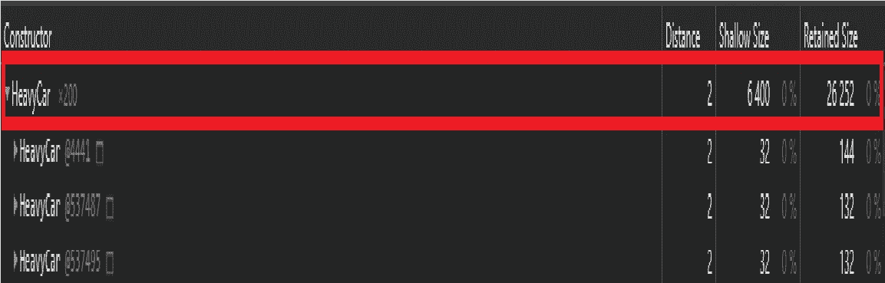
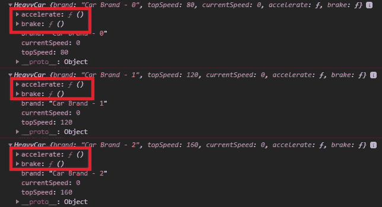
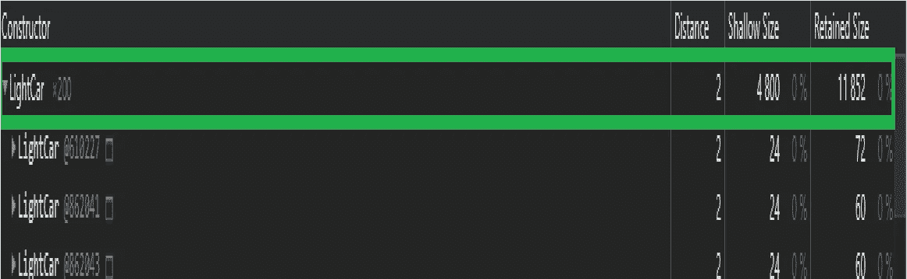
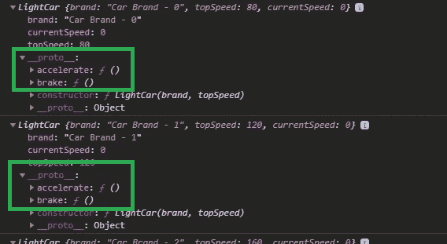

# 用构造函数和原型创建内存优化的实例

> 原文：<https://javascript.plainenglish.io/creating-memory-optimized-instances-with-constructor-functions-and-prototypes-5249310c96a6?source=collection_archive---------4----------------------->

Memory-optimized Javascript Object Instances

如果您使用 JavaScript 已经有一段时间了，您可能会遇到“构造函数”这个术语，这是一种调用函数的奇特方式，该函数将被用作创建对象实例的蓝图。

在 Java 这样的经典面向对象语言中，这些蓝图将是类。(尽管我们在 JavaScript 中有了 *class* 关键字，但它与经典的面向对象关键字并不完全相同。但是让我们稍后在另一篇文章中讨论这个问题)。

在本文中，让我们将注意力转移到使用这些构造函数创建内存优化实例的方法上。

## 场景:

为了解释优化的结果并实现可量化的指标，让我们假设以下情况:

在我们的 web 应用程序中，我们必须创建 200 个 car 对象实例，它们具有以下属性:

1.  品牌
2.  最高速度
3.  流速

汽车也应该有两种方法，即:

1.  加速
2.  刹车

## 旁注:

为了从 chrome 开发者工具的“堆快照”中快速收集信息，我们将把汽车实例分配给窗口对象。

此外，我们选择数字 200，因为随着实例数量的增加，优化的效果将在指标上明显可见。

## 重型汽车:

现在，让我们开始写一些代码，让我们将构造函数命名为 *HeavyCar* ，以区别于我们将在本文后面看到的优化版本。

运行完上面的代码后，让我们拍一个堆快照，看看 *HeavyCars* 消耗了多少内存。

Heap Snapshot of HeavyCar

查看该报告，我们可以推断出 *HeavyCar* 的每个实例都有一个 **32 字节**的浅层大小，总共 200 个实例累积到 **6400 字节(6.4 千字节)**。

## 深入了解这些实例:

如果我们一起看这些实例，我们会意识到，虽然这些实例的属性(如 *brand* 、 *topSpeed* 和 *CurrentSpeed* )可能包含每个实例的唯一值，但方法(如 *accelerate* 和 *brake* 将总是具有相同的逻辑，而与实例无关。

但是这些方法在每个实例中都被复制，增加了每个实例的内存占用，从而增加了累积的内存占用。

Methods on every instance

## 关于优化的思考:

根据我们的观察，我们可以表示，如果有一种方法可以使这些方法集中化，我们可以节省一些内存，这将大大减少累积的内存占用。

所谓集中化，是指我们将这些方法放在内存中的单一位置，并从实例中引用内存中的该点。

因为 Javascript 是基于原型继承的，所以上面的建议几乎不费吹灰之力就能实现。我们所要做的就是，将那些方法添加到构造函数的 ***原型*** 中，并让实例从它们的 ***__proto__*** 对象中引用它。

## 轻型汽车:

让我们称我们优化的构造函数为 *LightCar。下面是实现我们上面讨论的代码:*

在使用上述实现获取堆快照时，我们得到以下结果:

Heap snapshot of LightCar

正如我们所看到的，我们已经将每个实例的浅层大小从 **32 字节减少到了**24 字节，这有助于显著减少累积内存占用。我们已经设法将 200 个实例的浅层大小从 ***6.4 Kb 降低到 4.8 Kb。***

随着实例数量呈指数级增长，我们通过优化节省的内存量也将呈指数级增长。

## 看一看优化的实例:

现在我们已经通过原型链接优化了方法，让我们看看我们的实例:

References to the methods on the Prototype chain

我们可以看到，现在每个实例中的方法都在 ***__proto__*** 下，需要注意的是 ***__proto__*** 中的一个并不是方法本身的实际副本，而是对它们的内存位置的引用。

这是我们能够减少实例内存占用的实际原因。

## 结论:

这类优化通常更容易被忽略，但最终会导致严重的性能问题。尤其是如果一个人正在开发一个数据密集型应用程序，这是目前最突出的一种网络应用程序，他们更有可能在应用程序的生命周期中更快地面临性能障碍。

作为一条经验法则，总是考虑将您的方法添加到构造函数的原型中，以避免以后在生产中处理严重瓶颈的麻烦。

感谢阅读我的想法，干杯:)