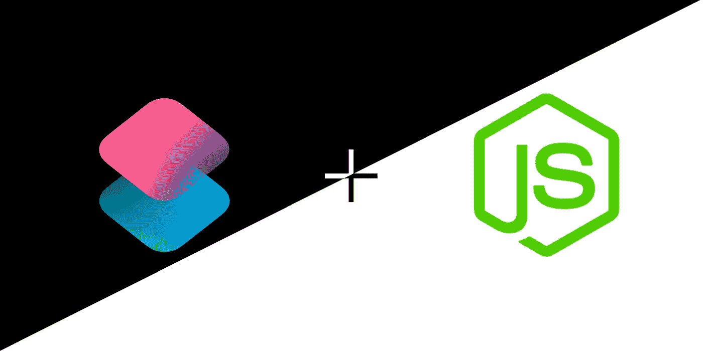
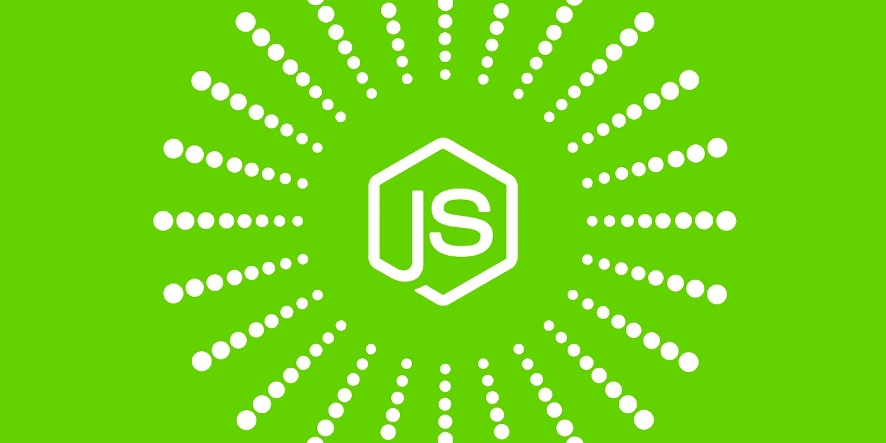
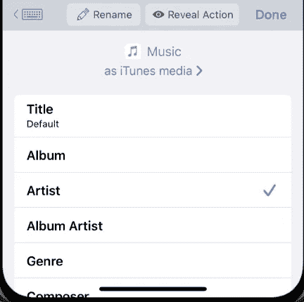

# 使用 Node.js 创建 Siri 命令

> 原文：<https://javascript.plainenglish.io/creating-siri-commands-with-node-js-6ea66ca990f?source=collection_archive---------7----------------------->

所以我们已经有几次使用了 Siri 快捷方式。但我仍然发现它们在没有任何第三方阻止的情况下相当有限。那么我们能用香草块做什么呢？

实际上，你被 HTTP 请求**卡住了**😔。但是别担心，我的伙伴戴夫。我用 JavaScript 找到了一些解决方案💡！(实际上只有两个解决方案，但它们很棒)

在我的解决方案中，我将展示不同的想法，并简要概述，然后我会给你一些例子！抱歉，没有代码😦。但是别担心，我开发了一个应用程序，你可以在最后查看！

# Siri 快捷方式+ NodeJS 服务器

NodeJS

有了这个解决方案，你可以做很多东西！是的，我知道你基本上是在创建一个 API，但是等等。

您的机器上运行着一个 NodeJS 服务器(显然带有 ExpressJS)。你可以读取/编辑你的文件，控制你的电脑，调用其他 API，触发一些网络钩子，等等。

你想创造更奇特的东西吗？你可以添加一个电子图形用户界面。

唯一的限制是你的能力，你的创造力，你喝的☕咖啡的数量，以及你能找到的 NPM 模块。

## **我给你举几个例子:**

*   可以关闭/暂停/重启电脑的快捷方式。如果你想更进一步，你可以把它添加到一个自动或例行程序中，在你睡觉时关闭你的电脑😴。

对于这个例子，我推荐使用`spawn`,并可能使它成为一个服务。有几个 NPM 模块可以让你的代码成为服务。

*   打开您正在设备上阅读的网站的快捷方式。有点像 DIY Handoff。顺便说一下，这个例子只对 Windows 和 Linux 有用。如果你在苹果电脑上做，你只是在浪费时间。
*   准备工作区的快捷方式。你知道媒体在一个窗口，也许 YouTube/网飞在另一个窗口开始你的一天。然后唤醒您最喜欢的代码编辑器，让您的 Spotify 播放列表在您准备工作时随时播放。

对于这两个例子，我将使用 NPM 模块`open`并添加一个带有`electron`的 GUI 来制作不同类型的屏幕。比如 DIY 移交的历史屏幕和 workspace 应用程序的设置屏幕。

*   显示猫图片的快捷方式🐈在你的桌面上！(或者可能是独角鲸)

在这个例子中发挥创造性。

看，你可以用 NodeJS 服务器创建很多东西！

## **利弊:**

*   实际上你可以创造任何东西！
*   你可以使用任何你想要的模块！
*   你没有任何限制！
*   但是如果你的应用不在云服务器上，你基本上需要你的电脑运行(但是如果你的应用需要你的电脑上的东西，这不是问题)
*   如果你不能从互联网访问你的 NodeJS 服务器，你将不得不从同一个网络运行你的快捷方式。😱
*   如果你绑定到你的本地网络，你的电脑有一个动态的 IP 地址，你需要在每次改变的时候更新你的快捷方式中使用的 IP 地址。
*   如果你分享你的快捷方式，用户很可能需要修改一些东西。

# Siri 快捷键+ WebHooks

WebHooks

这种解决方案在某些情况下是可行的，但有更多的限制。对于这个解决方案，首先你创建一些无服务器的功能(又名 WebHooks)并把它们托管在一个云服务中(比如在 ZEIT Now 或 Firebase 中🔥).然后你创建一个快捷方式，向你的 WebHook 发出一个 HTTP 请求，它可以给你一些东西(get)，或者发送一些东西(POST)，或者两者都有。很简单。

这意味着您创建的快捷方式将主要用于检索/编辑某种数据或切换外部操作。但是你仍然可以得到一些有用的快捷方式。

同样，通过使用 WebHooks，您可以将工作负载留给外部服务器，这对于第二层自动化来说是非常棒的。

所以这里列出了一些你可以赋予你的网页钩子的功能！

## **功能:**

*   获取数据(天气、交通、状态等)的快捷方式。)
*   设置数据(笔记、链接、数据库等)的快捷方式。)
*   切换外部操作的快捷方式(询问优步，在你的社交网络上发布消息，控制设备)
*   控制智能家居的快捷方式(如果您的设备与 HomeKit 兼容，请不要浪费时间)

## **利弊:**

*   你不需要一直开着电脑，就能获得一些令人惊叹的应用。
*   对于第二平面应用程序来说太棒了。
*   如果你想让人们使用你的快捷方式。他们只需要快捷方式，因为你的网页挂钩使用公共网址，这意味着用户不必改变网址。简单。(但是，如果您正在处理私人数据，请添加某种身份验证)
*   您被限制使用 API，并且您可能会遇到您的云提供商的一些限制。

# Siri 快捷方式提示和知识

但是在你开始创建你的应用之前，让我给你一些有用的提示和知识。

1.  遗憾的是，没有任何第三方块，就不能有全局变量。
2.  如果你需要发送一个**推送通知**或者将来会发送一些东西你就不能有快捷监听了。你需要像 IFTTT 这样的服务。
3.  如果你需要加密什么，那就忘了它吧。
4.  但是您可以创建一个安全的连接，因为有一个块可以生成不同类型的散列。
5.  注意你的快捷键是如何解释变量/输入的。有时它会给你带来麻烦。

Siri Shortcuts Variable Settings

6.如果你手边有一个 iPad，在里面创建你的快捷方式。我保证编码会简单十倍。

# 结论

如果你有时间，并且想在不查看第三方应用程序的情况下有更多的选择(这通常是很贵的)，那么尝试编写一个解决方案添加到你的快捷方式中可能是一个好主意。有了节点和快捷方式，你将⚡提高你的生产力，你将有更多的工具在你的腰带上。

现在 Siri 快捷键唯一的限制就是你的想象力。

# **现实生活中的例子**

我保证我有一个例子，你可以回顾并作为灵感。这是一个电子应用程序，只需扫描一个代码，就可以将图像/文件共享到你的电脑上。请随意查看👍🏻。

[**PhaserSync 服务器**](https://github.com/DJCarlosValdez/PhaserSync)

[**同步发送照片快捷方式**](https://www.icloud.com/shortcuts/9cbbbb02099d4b51adcaa86f5f616c07)

[**PhaserSync 发送文件快捷方式**](https://www.icloud.com/shortcuts/241a0551bd16490a98513b598922968e)

感谢阅读！希望对你有用。

卡洛斯