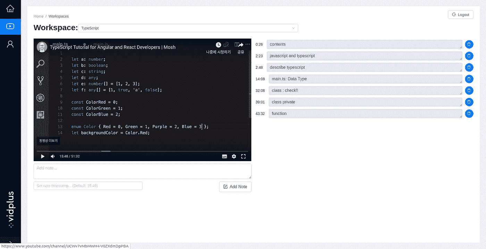

# 使用 React 引用创建带时间戳的视频注释

> 原文：<https://javascript.plainenglish.io/creating-timestamped-video-annotations-with-react-refs-db0ee3e9a53d?source=collection_archive---------1----------------------->

## 使用 React-Player 模块创建一个可以与 UI 交互的视频播放器



An image of **Vidplus**, a web-based video annotation tool. Video (left) and annotations (right) are shown.

最近，我和一些团队成员一起创建了一个名为 Vidplus 的基于网络的视频注释工具。该工具帮助用户从 YouTube、DailyMotion、脸书等网站上的教育视频中获得尽可能多的东西。通过允许他们写*有时间戳的注释*。我负责使用 React 创建注释页面——如上所示。

最初，视频是通过主页上的 URL 加载的。然后，用户可以通过点击“添加注释”按钮或按回车键来创建与视频时间戳相关联的注释。当用户点击现有注释的时间戳时，视频会立即跳转到该时间戳，这样用户就可以看到该注释引用了视频的哪一部分。

通常，为了创建这种类型的 UI/UX，必须引用和使用视频所属的视频共享服务所提供的 API(例如，[用于 iFrame 嵌入的 Youtube 播放器 API](https://developers.google.com/youtube/iframe_api_reference))。幸运的是，CookPete 已经在 NPM 发布了一个名为 [React-Player](https://www.npmjs.com/package/react-player) 的包，作为多个外部视频播放器 API(Youtube、脸书等)的 React 组件包装器。).本文将研究我们如何使用这个包和 React refs 来实现上述特性。

## 什么是反应型裁判？

在深入研究前端代码的细节之前，清楚地理解什么是 React refs 是很重要的。从本质上讲，refs 是对 DOM 元素或 React 组件的 Javascript 引用，这些组件呈现在组件中。下面是参考文献的一般用法:

```
import ReactPlayer from "react-player";class VideoPlayer extends Component {
  constructor(props) {
    super(props);
    this.player = React.createRef();
  } render() {
    // Detailed options (props) omitted for readability.    
    return <ReactPlayer
      ref={this.player}
      url={this.props.url}
    />
  }
}
```

如上所示，我们首先使用 React.createRef()方法在 VideoPlayer 类组件中创建一个 React ref。然后，使 ref 引用 render()方法内的 ReactPlayer React 组件。现在可以通过调用`this.player.current`来访问实际的视频播放器组件实例。

注意:[不要过度使用参考文献](https://reactjs.org/docs/refs-and-the-dom.html)。虽然这里需要引用，因为 react-player 模块具有只能通过引用访问的实例方法，但它们鼓励对子元素进行强制性修改(这与 react 首选的不变性相冲突)。

## 使用 ReactPlayer 引用实现交互功能

应在 ReactPlayer ref 上使用的两种方法如下:

1.  `getCurrentTime()`:获取视频的当前时间，以秒为单位。
2.  `seekTo(amount)`:让视频播放器跳到`amount`秒。

使用这两种方法，我们可以使 UI 的其余部分直接与视频交互。为了使带时间戳的注释像预期的那样运行，剩余代码的一般流程应该是:

1.  使用`this.player.current.getCurrentTime()`定期更新共享状态下(如 Redux)视频的当前时间。
2.  添加注释时(通过单击“Add Note”或按 Enter 键)，从共享状态中检索当前时间戳，并将其与注释一起显示在浏览器页面上。
3.  当点击现有注释的时间戳时，将共享状态下的另一个属性(即`targetTimestamp`)更新为点击的时间戳。
4.  从共享状态中检索`targetTimestamp`，并在`seekTo`方法中使用它。使用`this.player.current.seekTo(targetTimestamp)`将使视频跳转到目标时间戳。

这就是你如何使用 React refs 和来自 NPM 的 React Player 模块使视频与 UI 进行交互！