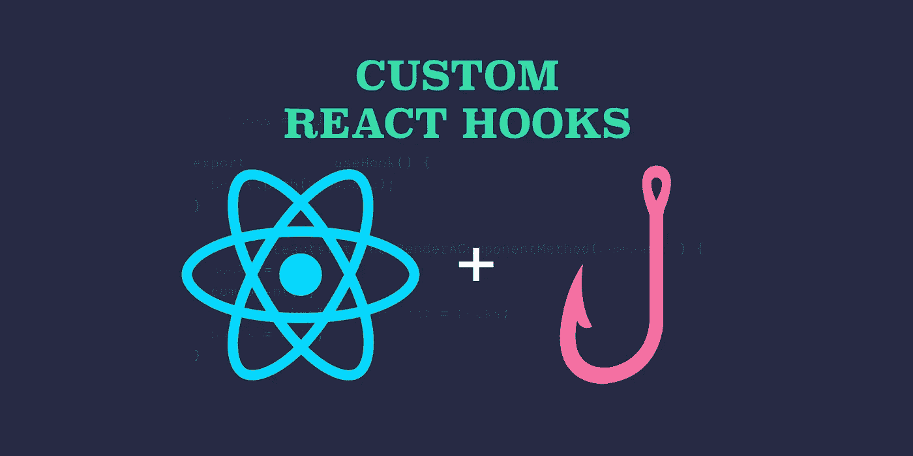
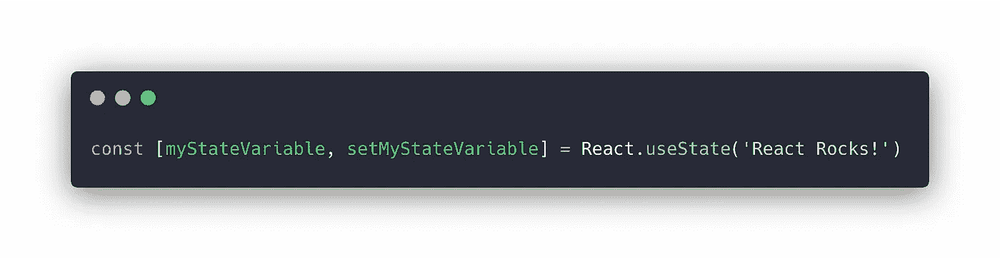
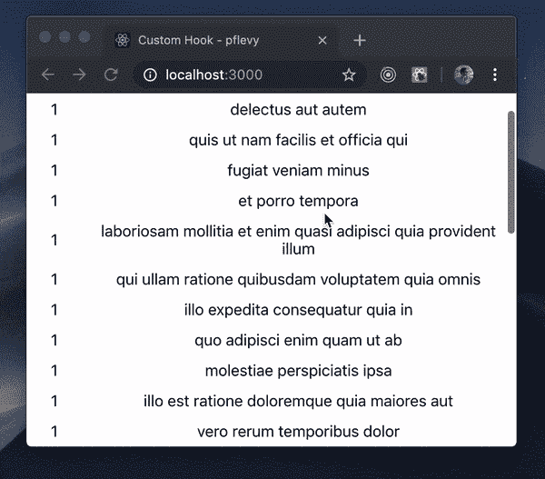
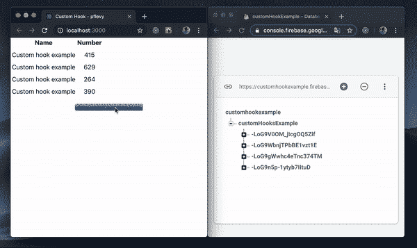

# 创建可重用的自定义 React 挂钩

> 原文：<https://javascript.plainenglish.io/creating-useful-custom-react-hooks-2ad125e36a32?source=collection_archive---------0----------------------->

从 React 16.8 **开始，你不再需要类组件**来处理**状态逻辑**。现在的做法是这样的:

上面的代码在一个功能组件(以前被称为“无状态功能组件”)上完美地工作，这为我们构建项目的方式带来了许多新的可能性。

最常用的钩子是**使用状态**和**使用效果。如果你对这些都不熟悉，我建议你阅读 React Hooks 上的官方文档。**

但不止于此。为了充分利用这个新特性，我们可以编写**定制的 react 钩子**，以便**在组件之间重用**逻辑。让我们看看几个真实的例子。

> 您可以在现有项目上使用下面的代码，或者通过在终端上运行“create-react-app custom-hooks-project”来创建一个新项目。

# **用 react 钩子创建无限卷轴**

假设您想要呈现一个包含许多条目的表格。您可能不希望 react 一次呈现所有内容，这样会导致页面非常长，用户甚至可能无法看到页面的底部。一个可能的解决方案是实现一个**无限滚动**表，在用户向下滚动时呈现新的条目。

1.  编辑文件 **App.js** ( [要旨](https://gist.github.com/pflevy/9ccbdd86a75d800446c549225c642c05.js)

**App.js**

上面的代码从 web 上加载一些假数据，并将其显示在 HTML 表中。所有的行元素一次呈现，如果您有一个很长的项目列表，这是不好的。为了解决这个问题，我们可以一次呈现 30 个项目，每次用户点击页面底部时再呈现 10 个项目。

如果我们要在 **App.js** 文件上实现这个逻辑，然后需要在另一个组件上重用它，就会有代码冗余。
多亏了 React 钩子，我们可以在一个单独的**定制钩子**上实现逻辑，并在任何需要的地方使用它。

> 创建定制钩子的命名约定是以单词“ **use** 开始，例如 useCustomHookName。这对于 react 检查钩子是否违反[规则很重要。](https://reactjs.org/docs/hooks-rules.html)

**2。**创建自定义 react 钩子文件**使用 InfiniteScroll.js** ( [要点](https://gist.github.com/pflevy/67957a25877133e45edd4c7e33d796cf))

**useInfiniteScroll.js**

这个创建的钩子接受两个参数:

*   **start** :开始渲染的元素个数。
*   **步调**:后续要渲染的元素数量。

默认情况下，它们分别设置为 30 和 10。这意味着您可以调用钩子而不传递任何参数，这些值将被使用。

逻辑非常简单:用户每次点击页面底部时，自定义钩子返回的值(将是我们想要呈现的元素数量)就会增加 **pace** 变量。

> 确保最初呈现的元素数量允许垂直滚动。

现在剩下要做的就是在 App.js 组件中使用新创建的 react 钩子。用下面的代码替换 App.js 以前的代码:

**3。**更新文件 **App.js** ( [要点](https://gist.github.com/pflevy/4f292936ff823cffc7447abdaa9aad0a.js))

Updated **App.js**

您可以在控制台上运行' **npm start'** 来测试应用程序。它应该按如下方式工作:

Infinite Scroll hook in practice

# 创建实时 firebase 数据库条目监听器

让我们用这个把它变得更复杂。如果你还没有试过 Firebase 的实时数据库，我建议你试试。他们让建立一个免费的在线数据库和后端服务变得非常容易，这样你就可以专注于前端开发。

如果您需要设置方面的帮助，您可以遵循此[链接](https://medium.com/swlh/real-time-iot-app-with-react-firebase-esp8266-e2e673efd1bf#152d)上的步骤。

> 在的情况下，您不想创建自己的数据库，但是尝试这个例子，您可以取消我在配置文件中提供的数据的注释。

假设您有一个带有实时数据库的 firebase 帐户，现在是时候创建配置文件了。但是首先，通过运行“npm install firebase - save”在您的项目上安装 firebase。

1.  创建配置文件 **database.js** ( [要点](https://gist.github.com/pflevy/2e015861e4ac4c50786e53cb35751309)

**database.js**

该文件支持连接到您的数据库，从现在起，每次您想要对文件执行数据库操作，例如插入新条目、编辑以前的条目等，请确保您从“导入 firebase”。/database.js" 文件，而不是来自“firebase”包。

配置好数据库后，您现在可以访问它的一些方法，如 push、put、remove 等。如果需要帮助，您可以阅读完整的文档，对于本例，您将需要' **push** '将数据插入数据库，并需要' **on** '实时检索这些数据。

2.创建文件**使用数据库条目. js** ( [要点](https://gist.github.com/pflevy/3ab3668b062812252f7d0c0a8279774d))

**useDatabaseEntry.js**

当从 firebase 检索数据时，您会得到一个由 firebase 自动生成的唯一键索引的**对象**。问题是。map()函数仅适用于数组。这个自定义钩子所做的是**从 firebase 中检索数据并将其转换成一个数组**，这样就可以很容易地将它映射到我们的表中。

3.编辑文件 **App.js** ( [要点](https://gist.github.com/pflevy/6955e7c85e7afa1a40873dfe6705d9d7))

**App.js**

在 App.js 文件中，有一个按钮**将**数据推送到 firebase，useDatabaseEntry 接收所需的条目作为参数，并返回一个包含该条目数据的数组。

其优点是，您现在可以使用这个新钩子**从 firebase 数据库的任何条目**中直接**作为数组**检索实时数据，这使得它很容易被映射到一个表中。

> 如果你想练习，试着点击几次按钮插入更多的数据，并利用上面例子中定义的 useInfiniteScroll。

结果如下:

我希望这些例子通过创建更多的“通用”逻辑，与其他组件一起重复使用，帮助您在可用性方面构建您未来的项目思维。通过将**应该做什么**和**应该如何做**区分开来，这使得代码更加清晰。

谢谢你的阅读！