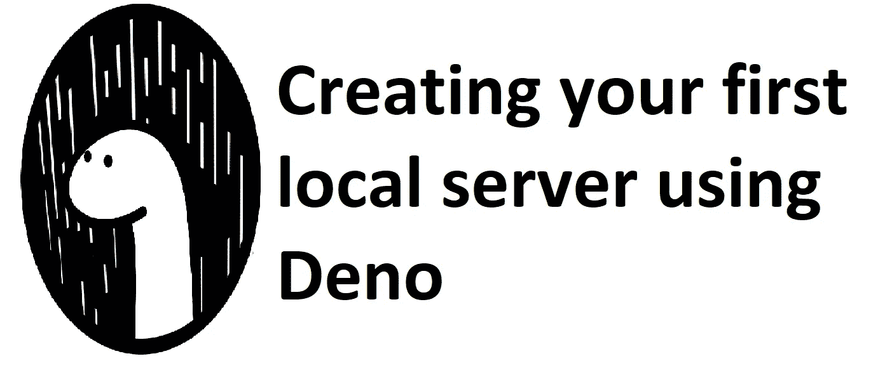
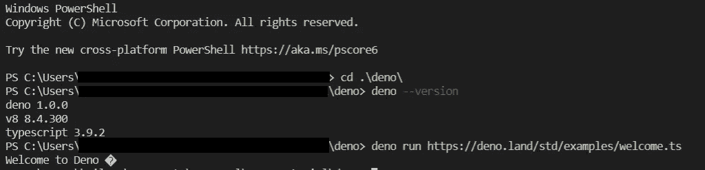
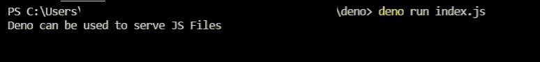
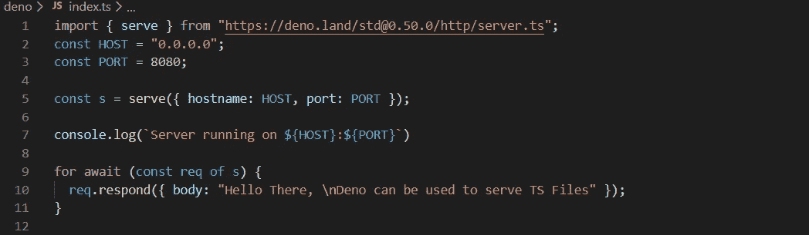
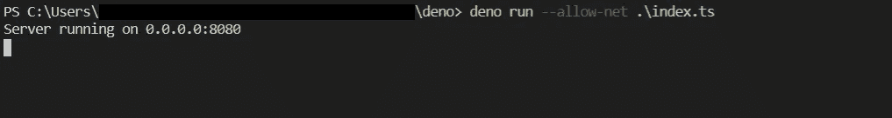
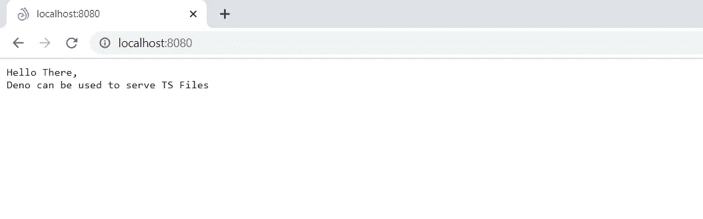
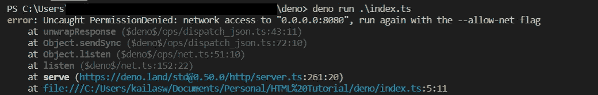

# 使用 Deno 创建第一台本地服务器

> 原文：<https://javascript.plainenglish.io/creating-your-first-local-server-using-deno-a183d129323?source=collection_archive---------9----------------------->

Deno : Overview and Creating your first local server

Deno 是 JavaScript 和 TypeScript 的安全运行时。它旨在为现代程序员提供一个高效安全的脚本环境。它建立在 V8、Rust 和 TypeScript 之上。创建它是为了解决 Node JS 的几个缺点，即，

> 解决设计缺陷。
> 
> 以更好的方式利用承诺。
> 
> 解决安全问题(请记住，在节点程序中，您可以访问系统调用)
> 
> 构建系统的使用— GYP
> 
> 使用 package.json 和 node_modules 来允许存储所有 node_modules 及其子模块，而不是单独绝对导入特定的子模块。

请查看莱恩·达尔的视频，讲述他为什么选择建造德诺以及他是如何建造的，视频中有 [**link1**](https://www.youtube.com/watch?v=M3BM9TB-8yA) 和 [**link2**](https://www.youtube.com/watch?v=1gIiZfSbEAE) **。**

现在，Deno 已于 2020 年 5 月 13 日达到 1.0 状态。我想是时候看看了。下面是使用 Deno 安装运行本地服务器来服务“你好世界”代码的步骤。

# **天龙安装**

*如果您在 windows 上，请在 powershell 中运行以下命令，在您的 windows 机器上安装 deno。*

> **$ iwr**[**https://deno.land/x/install/install.ps1**](https://deno.land/x/install/install.ps1)**-useb | iex**

或者，如果您想使用类似[铲](https://scoop.sh/)和[虫火谷](https://chocolatey.org/packages/deno)的 CLI 工具进行安装，请为相应的 CLI 工具运行以下命令。

> **$勺安装 deno**
> 
> **$choco install deno**

请参阅 [**链接**](https://deno.land/manual@v1.0.0/getting_started/installation) 在其他平台如 Mac 和 Unix 系统上安装 deno。

# 验证安装

*通过键入以下命令检查 Deno 是否安装在您的机器中:*

Verification of Deno Installation

# **使用分母服务 JS 代码**

Deno 可以用来运行你的普通 JavaScript 代码。index.js 文件的内容和输出如下:

index.js code to be run using Deno

output of index.js file run using

# **在本地服务器上使用 Deno 提供 TS 代码**

Deno 可以用来运行可以在网络上提供服务的代码。示例 typescript 代码及其服务方式如下，

Typescript code that will be served on browser using

Serving code on local server using Deno

# 您的 Hello World 计划现在使用 Deno 服务。

Deno local server Example

## **故障排除:**

*   如果您遇到如下所示的错误，可能是因为您没有在运行命令中使用— allow-net 标志。参考 ***“在本地服务器上使用 Deno 提供 TS 代码”*** *步骤查看如何使用标志。*

Usage of — allow-net flag

## **源代码:**

*本文使用的源代码可以在 git 上通过**[***点击这里***](https://github.com/Kailashw/deno-example) *找到。**

***简明英语笔记***

*你知道我们推出了一个 YouTube 频道吗？我们制作的每个视频都旨在教给你一些新的东西。点击此处 查看我们，并确保订阅该频道😎*