# 使用 Deno 创建您的第一个新闻 CLI 应用程序

> 原文：<https://javascript.plainenglish.io/creating-your-first-news-cli-app-using-deno-e1470398c627?source=collection_archive---------3----------------------->


Deno logo. Source: [commons.wikimedia.org](https://commons.wikimedia.org/wiki/File:Deno.svg)

> [Deno](https://deno.land/) 是 JavaScript 和 TypeScript 的安全运行时。

## 自 Deno 首次发布以来，经过 2 年的等待，Deno 的第一个稳定版本终于发布了。

它最初是由 Ryan Dahl 创建的，他也是开发 NodeJS 的人。2020 年 5 月 13 日，Deno 的第一个稳定版本，即 v1.0.0 迎来了曙光。从那以后，它得到了大量的宣传和一堆早期用户。有些人甚至创造了“毁灭节点”或“节点黑仔”的 DENO。

# 什么是德诺？

Deno 是 TypeScript 和 JavaScript 的安全运行时。它由 NodeJS 的创建者创建，旨在解决 NodeJS 中糟糕的设计选择。与 NodeJS 类似，Deno 也运行在 Chrome 的 V8 JavaScript 引擎上。但是和 NodeJS 不同，NodeJS 是用 C++和 JS 写的，Deno 是用 Rust 和 TypeScript 写的。

Deno 的概念是在 JSConf EU 2018 期间首次向世界展示的，Ryan Dahl 在会上发表了“关于 NodeJS 我后悔的 10 件事”的演讲。你可以在这里找到[的演讲录音](https://www.youtube.com/watch?v=M3BM9TB-8yA)。我强烈建议你先去看看这个会议，以便更好地了解 Deno 的目标是解决什么问题以及背后的动机。

## Deno 的特点

1.  默认情况下，安全代码在沙箱中运行
2.  支持无害环境管理进口
3.  现成的类型脚本支持
4.  头等舱等候
5.  旨在实现浏览器兼容性并支持浏览器 API
6.  没有集中的/官方的软件包管理器

如果您还不了解这些特性，也不必不知所措。我们将从开发中转移话题，根据需要讨论特性。它会让你更好地理解这个特性的含义和用法。

# 我们在建造什么？

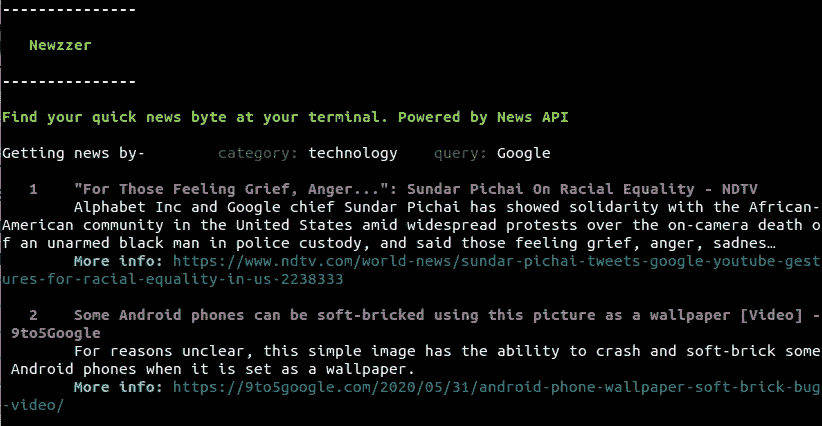

Sneak Peek Alert

在本教程中，我们将开发 **Newzzer** :一个简单的 CLI 应用程序，使用 Deno 向我们展示最新的新闻。本文主要面向具备 JavaScript 和 TypeScript 基础知识的人。在此过程中，我们将学习和使用 Deno 的不同功能。
该应用程序将具有以下两个主要功能:-

1.  通过查询搜索新闻
2.  按类别搜索新闻

## **先决条件**

1.  Deno
    你可以参考 https://deno.land/#installation[的下载说明](https://deno.land/#installation)。对于所有主要平台，安装都非常简单。您可以通过运行`*deno --version*` *来验证安装。在撰写本文时，最新版本是 Deno v1.0.3。您也可以运行`deno --help`来查看其他命令。*
2.  我们将使用 NewsAPI 的 API 服务来获取新闻。我们可以通过在[https://newsapi.org/account](https://newsapi.org/account)上创建一个账户来免费获得 API 密匙
3.  JavaScript/ TypeScript 的基础知识。
4.  Visual Studio 代码(可选，如果您喜欢智能感知和自动完成)

**注意:-** 我将在整篇文章中使用 TypeScript。如果您不习惯使用 TypeScript，可以移除类型并继续操作。

# 入门指南

让我们从官方的“欢迎”计划开始吧。在 Deno 中，我们可以直接从文件 URL 运行程序。只需在您的终端中运行`deno run https://deno.land/std/examples/welcome.ts`。

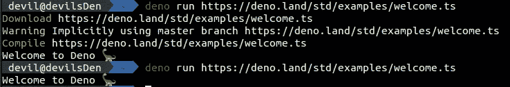

Running Deno Welcome program

太棒了。你刚刚运行了你的第一个 Deno 程序。第一次运行命令时，下载、编译并运行文件。下次运行相同的文件时，既不会下载也不会编译。这是因为 Deno 缓存了依赖项和编译后的文件。

如果我们想刷新缓存并强制它使用新版本呢？`--reload`为了挽救这一局面，您可以使用此标志运行文件来重新加载源代码缓存。

我们去代码[网址](https://deno.land/std/examples/welcome.ts)偷偷看看文件里面是什么。

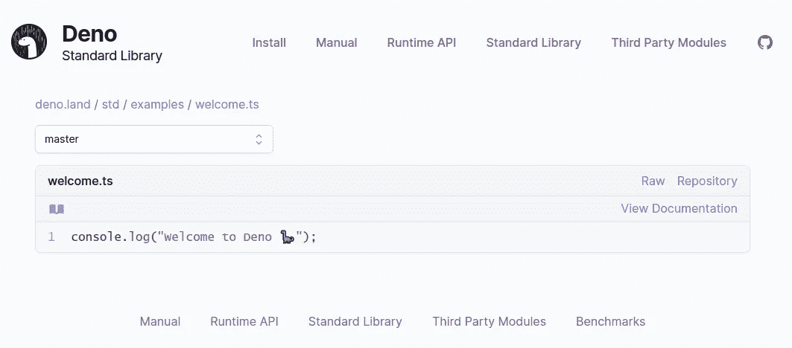

Sneak peek inside welcome.ts

这是一个简单的`console.log`，但是这个页面的风格是什么？Deno 网站可以检测到流量来自 web 浏览器，并以一种风格化的方式呈现文件，但当从非浏览器环境访问时，它会返回原始文档。不相信我？让我们尝试使用`curl`下载文件并检查内容。

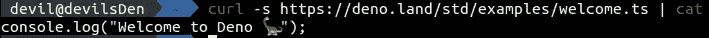

Downloading welcome.ts using curl

## 文件结构

```
newzzer
├── api.ts
├── deps.ts
├── error.ts
├── mod.ts
└── types.d.ts
```

我们将创建如上所述的 5 个文件，每个文件服务于一个特定的目的。

**mod.ts** :这是我们 app 的入口。根据著名 Deno 程序和标准库中的约定，主文件的名称通常是 mod.ts，但它可以被命名为任何名称。

types.d.ts :这个文件将存放我们的自定义接口定义。

**deps.ts** :该文件将存储我们从外部依赖项导入的所有内容，并将作为一个集中存储，从中导入所有依赖项。

**api.ts** :该文件包含与 NewsAPI 交互的逻辑。

error.ts :这个文件将包含我们应用程序中错误处理的逻辑。

如果您来自 NodeJS 背景，您会注意到没有`package.json`文件。

> **Deno 没有集中的/官方的包管理器**

这是 Deno 有意的设计选择。Deno 使用 URL 导入外部模块，就像浏览器一样。因为没有官方的软件包管理器，任何人都可以在互联网上托管他们的模块，并可以从 URL 下载。

**注意:**如果你正在使用 VSCode，我建议你下载[**vs code-deno**](https://marketplace.visualstudio.com/items?itemName=denoland.vscode-deno)**扩展来帮助自动完成、智能感知和格式化。**

****类型定义****

**首先，让我们在`types.d.ts`中定义我们的类型定义。我们将使用其网站上提供的示例作为参考，为 NewsAPI 响应创建类型定义。我们还将为配置文件创建一个接口，该接口将托管访问 NewsAPI 所需的`secret-key`。**

# **获取依赖关系**

**让我们再次明确我们的目标。该应用程序将:-**

1.  **允许我们在配置文件中设置我们的 NewsAPI api-key(使用`--config`标志)**
2.  **显示十大最新新闻**
3.  **应用类别过滤器(使用`--category`或`-c`标志)**
4.  **应用查询过滤器(使用`--query`或`-q`标志)**
5.  **显示帮助文本(使用`--help`或`-h`标志)**

**让我们先定义所有的外部依赖，并把它们去掉:-**

1.  **std/flags:帮助解析命令行参数**
2.  **std/fs:帮助执行文件操作**
3.  **STD/fmt:colored console . log(为我们的输出添加颜色)**

**正如你所看到的，所有的依赖项都在形式`std/*`中，这意味着它们是 Deno 标准模块。Deno 网站维护着`standard`库中所有模块的列表。你可以点击查看完整列表[。](https://deno.land/std/)**

**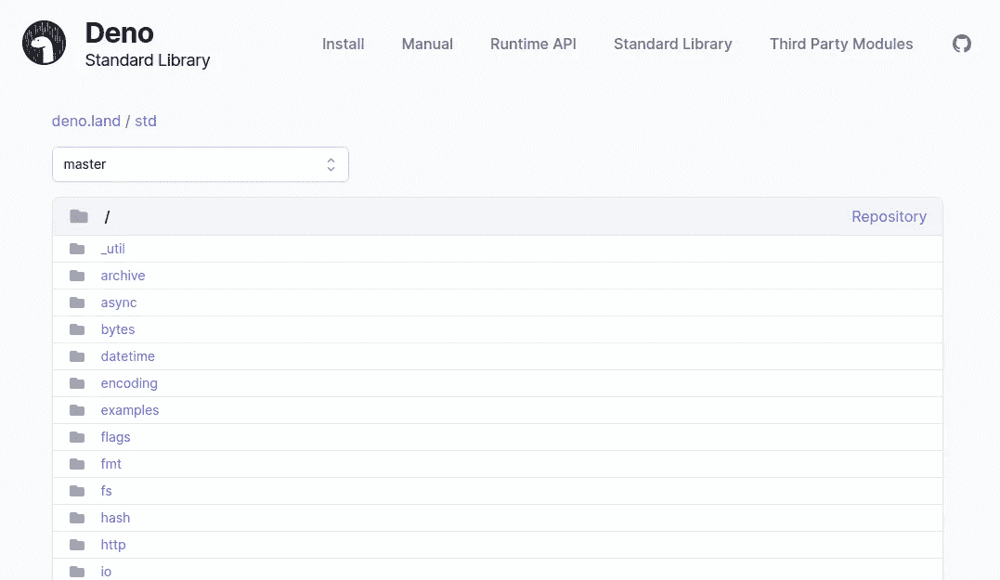**

**Deno standard library**

**您还可以在此查看社区[创建的第三方模块列表。在本教程中，我将把自己限制在标准模块。](https://deno.land/x)**

**让我们导入`deps.ts`中的模块**

****幕后****

**Deno 使用 ECMAScript 模块(ESM)标准。如果你来自 NodeJS，你必须熟悉 CommonJS 模块系统。**

```
// ESM
import abc from "abc";// CommonJS
const abc = require("abc");
```

**当 NodeJS 建立时，没有浏览器模块的标准，NodeJS 决定采用 CommonJS 的方式。后来，ECMAScript 将 ESM 模块标准化为浏览器的模块系统。对 ESM 模块的支持现已内置于主要的现代网络浏览器中。关于 ES 模块的更多信息，请查看 [flaviocope 的文章](https://flaviocopes.com/es-modules/)。**

**Deno 和 ECMAScript 为什么偏离了 CommonJS 的方式？嗯，它有问题——非常复杂的模块分辨率。我会尽力解释的。将 NodeJS 内部的导入视为，`const abc = require("abc")`。
在解析相关性 abc 时，NodeJS 必须检查**

*   **`abc`是标准的 NodeJS 模块吗(类似 fs)**
*   **`abc`是外部 NodeJS 模块吗？(在 node_modules 中检查它)**
*   **`abc`是来自项目的文件吗？(检查项目中的文件/文件夹名称)**
*   **`abc`是指文件 abc.js 还是指文件`abc/index.js`？(请记住，您不必显式指定 index . js。NodeJS 会为您推断出来)**

**这些功能虽然有用，但却使模块解析成为一项复杂的任务。ESM 标准只允许绝对和相对 URL，从而降低了一些复杂性。**

# **基本帮助消息**

**如果没有通过`-h`或`--help`访问的帮助消息，或者当传递了一些无效配置时，每个 CLI 都是不完整的。让我们在`error.ts`中创建基本的帮助信息**

**函数接受字符串错误作为参数。如果错误被通过，它显示错误和帮助信息，否则它只显示帮助信息。帮助消息包含有关支持的标志及其用途的信息。**

**由于我们在`deps.ts`中引入的`std/fmt/colors`标准模块，给日志添加颜色非常简单直接。要创建绿色背景的红色粗体文本，代码很简单**

```
console.log(bgGreen(bold(red("Error"))));
```

**在`displayHelpAndQuit`结束时，我们使用`Deno.exit()`退出 Deno 过程**

**现在我们已经完成了帮助消息部分，让我们将它与我们的入口点，即`mod.ts`集成并测试它。**

**`import.meta.main`检查当前文件是否已经作为主输入执行，而不是导入到另一个文件中执行。它与 python 中的`if __name__ == "__main__"`和 NodeJS 中的`require.main === module`非常相似。
Deno 名称空间中的 args 返回参数向量。`parse`用于解析这些标志，并以类似 Map 的结构返回标志的键值对。**

```
// test.tsimport { parse } from "https://deno.land/std/flags/mod.ts";
const {args} = Deno;
console.log(args);
console.log(parse(args));// deno run test.ts -a --b=123[ "-a", "--b=123" ]
{ _: [], a: true, b: 123 }
```

**现在让我们运行我们的文件并检查输出**

**`deno run mod.ts --help`应该显示帮助信息**

**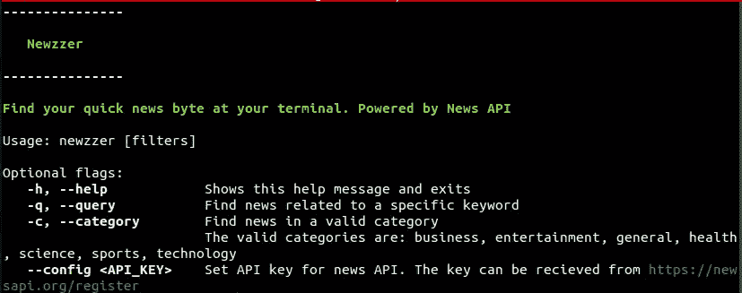**

**现在让我们尝试使用无效标志`deno run mod.ts --blah`**

**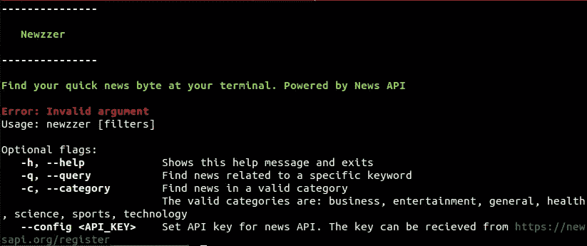**

# **配置 API 密钥**

**我们希望用户从 NewsAPI 配置自己的 API 键来获取新闻。为此，我们将 API 密钥保存在用户主目录的文件`.newzzer.json`中。**

**但是每个操作系统都有不同的主目录，我们如何获得主目录的路径呢？我们可以从终端内部的“HOME”环境变量中获得它。Deno 提供了一个方法`Deno.env.get`来获取环境变量。**

**让我们编辑我们的`mod.ts`并包含逻辑**

**从 NewsAPI 获取 API 密钥，并将其设置到我们的配置文件中。**

**`deno run mod.ts --config "API KEY HERE"`**

**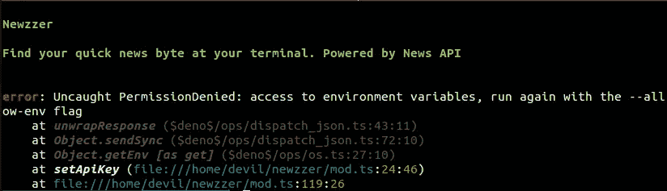**

**似乎有一个错误。我们无法访问环境变量，但是为什么呢？**

****幕后****

**还记得开头提到的 Deno 特性之一吗？**

> ****安全性—默认情况下，代码在沙箱中运行****

**安全性是 Deno 优于 NodeJS 的主要 USP 之一。在 Deno 中，您的代码运行在沙箱中，您无权访问:-**

*   **文件系统**
*   **环境变量**
*   **网络存取**
*   **高分辨率时间测量**
*   **正在加载插件**

**这些权限必须在使用标志运行代码时显式给出。您可以从`deno run --help`中找到所有的标志**

**让我们使用`deno run --allow-read --allow-write --allow-env mod.ts --config "API KEY HERE"`给出许可并设置我们的配置密钥**

**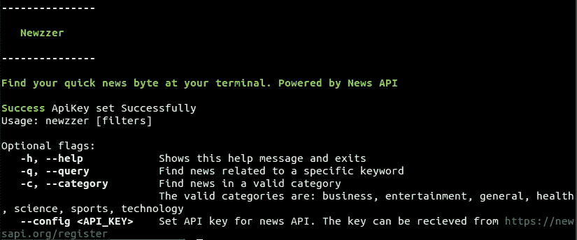**

**我们可以使用`deno run --allow-read --allow-write --allow-env mod.ts`检查是否设置了 API 键**

**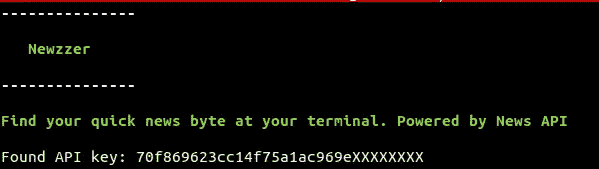**

# **连接 API**

**现在让我们添加有趣的部分。从 API 获取新闻并显示出来。API 的所有逻辑都将嵌套在`app.ts`中**

**Deno 试图尽可能地遵守 W3C 标准。因此，Deno 支持`fetch` API 与 web 服务器交互。**

**现在让我们使用`mod.ts`中的 API。这是最后的文件以及一些错误处理。**

**现在让我们运行我们的应用程序，不要忘记添加`--allow-net`以允许互联网访问。**

```
deno run --allow-net --allow-read --allow-write --allow-env run mod.ts --category technology
```

**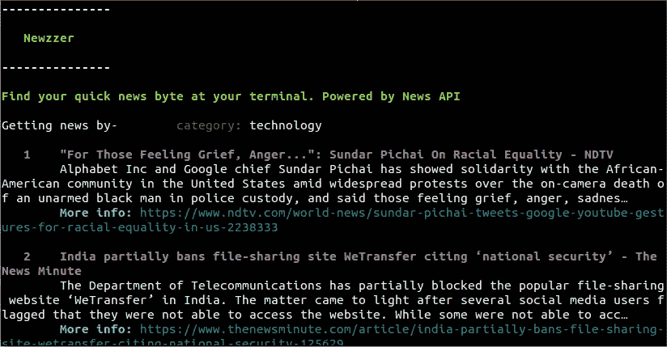**

**Yayyy！我们一起构建了第一个全功能的 CLI 应用程序。**

# **奖金**

**谁不喜欢一点奖金呢？你可能会问，这个应用程序功能齐全，现在还剩下什么呢？**

****让我们的应用程序可以安装****

**我们忘记了让我们的应用程序可安装。同样运行整个命令`deno run --allow-net --allow-env --allow-read --allow-write mod.ts`有点耗时。我们来处理这件事。**

**为了让我们的应用程序可以安装，你只需要添加**

```
*#!/usr/bin/env -S deno --allow-net --allow-read --allow-write --allow-env*
```

**在我们`mod.ts`文件的顶部。这指定了脚本应该使用 Deno 运行，因为我们已经传递了脚本中的所有标志，所以我们不必显式地定义它。现在你可以将文件上传到互联网上的任何地方(我更喜欢 GitHub 或 CDN ),并使用**

```
deno install --allow-net *--allow-read --allow-write --allow-env -n newzzer "route to mod.ts file"*
```

**例如，最终的应用程序存放在我的 GitHub 存储库中。它可以通过以下方式安装**

```
deno install --allow-net --allow-read --allow-write --allow-env -n newzzer [https://github.com/bhumijgupta/Articles/raw/master/newzzer-deno-cli/newzzer/mod.ts](https://github.com/bhumijgupta/Articles/blob/master/newzzer-deno-cli/newzzer/mod.ts)
```

**现在，可以使用`newzzer`和过滤器来运行应用程序。**

****一些额外的命令****

*   **`deno fmt` —使用 Deno 的内置格式化程序格式化你的文件**
*   **`deno bundle` —将所有代码和依赖项编译成一个 javascript 文件**
*   **`deno upgrade` —检查并安装 Deno 的新版本**

**所有的代码和片段都可以在我的 GitHub 资源库中找到:**

**[](https://github.com/bhumijgupta/Articles/tree/master/newzzer-deno-cli/newzzer) [## bhumijgupta/文章

我的文章中使用的大量代码和片段](https://github.com/bhumijgupta/Articles/tree/master/newzzer-deno-cli/newzzer) 

想在应用程序上查看稍微高级的版本吗？查看**新闻-cli** 网址:

[](https://github.com/bhumijgupta/Deno-news-cli) [## bhumijgupta/Deno-news-cli

### 在你的终端上找到你的快速新闻字节。

github.com](https://github.com/bhumijgupta/Deno-news-cli) 

进阶版包含:
1。使用查询词搜索所有新闻，而不仅仅是标题
2。稳健的错误处理
3。更好的用户界面和 UX

# 结论

一切都会结束，第一次探索 Deno 并使用它创建您的第一个 CLI 应用程序的旅程也结束了。以下是我对 Deno 的看法。

随着 JavaScript 生态系统的不断发展，Deno 已经成为 NodeJS 的主要竞争对手。由创建 NodeJS 的人创建，它专注于纠正 NodeJS 的所有缺点。但是在目前的时间点上，我认为还为时过早。版本 1 刚刚发布，有许多错误修复和功能需要实现。多亏了活跃的社区和早期采用者，这些错误得到了报告和修复。Deno 很有潜力，可能在不久的将来超过 Node，但现在预测还为时过早。

**提示-** Deno 是市场上的新产品。当您使用 Deno 开发任何东西时，您可能会面临如何实现功能的问题。由于大部分是新的，你可能无法找到堆栈溢出的答案。我建议你看看 [Deno 运行时 API](https://doc.deno.land/https/github.com/denoland/deno/releases/latest/download/lib.deno.d.ts) 和 [Deno 手册](https://deno.land/manual)。文档写得很好，在大多数时候会对你有帮助。

# **用简单英语写的便条**

你知道我们推出了一个 YouTube 频道吗？我们制作的每个视频都旨在教给你一些新的东西。点击此处 查看我们，并确保订阅该频道😎

# 参考

1.  [NodeJS 让我后悔的 10 件事](https://www.youtube.com/watch?v=M3BM9TB-8yA)
2.  [ES 模块介绍](https://flaviocopes.com/es-modules/)
3.  [Deno 手册](https://www.freecodecamp.org/news/the-deno-handbook/)
4.  [什么是 Deno，它与 NodeJS 有什么不同](https://blog.logrocket.com/what-is-deno/)**