# 如何在你的第一个 React 应用中使用 Props

> 原文：<https://javascript.plainenglish.io/creating-your-first-react-application-db9dfe93b4f5?source=collection_archive---------2----------------------->

## 反应提示

## 使用功能组件构建产品显示器，而不是简单的 Hello World

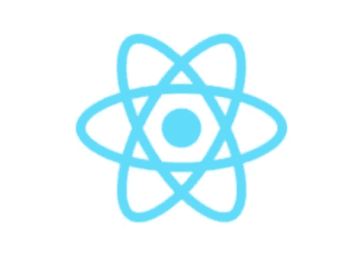

Source: Wikipedia

在这篇教程文章中，我们将构建一个应用程序来显示产品列表，如下所示。**产品**将是我们自己自定义的**组件**。我们将对产品组件进行一次编码，然后重用它。*这不是你好世界教程。*

本教程充满了有用的信息，并不复杂。完成后，您将对 React 有一个很好的感觉，并有一个很好的应用程序来进行实验。 ***所有代码都在这篇文章的最底部。***

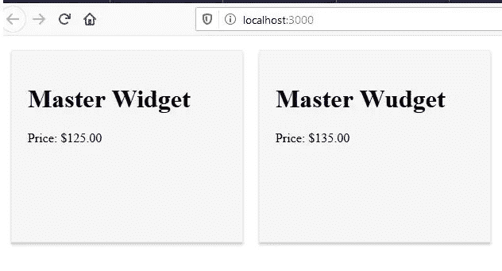

Product Component used twice

## 基于组件的开发

> React JS 是一个 JavaScript 库，用于 web 开发，在网站上构建交互式元素。它是基于组件的开发的几个流行工具之一。

上面的短语**基于组件的**很重要。基于组件的编程在 React、Angular 和 Vue 等几个 JavaScript 库和框架中很流行。

> 这个想法是将网页分成易于更新和重用的 UI 组件。

这个应用程序可以用 HTML、CSS 和普通 JavaScript 来完成，每个产品“卡片”都是一个 HTML

。但是当我们添加产品时，我们必须修改 HTML。你可以用 JavaScript 解决这个问题。但是同样，随着应用程序的增长，这变得很麻烦。

在我们的例子中，我们只是更新一系列产品。虽然使用数组是简单的，并且旨在使本教程简短，但是考虑到**产品可以从数据库**动态读取。

# 你将会学到什么，

*   如何创建一个带有默认工件和文件夹结构的标准 React 项目。
*   主组件( **App** )和核心文件(App.js、index.js、index.html)如何协同工作
*   如何构建用户自定义组件？
*   什么是**道具**物品以及如何使用。

# 工具和设置

我将使用 Visual Studio 代码(VSCode)

你需要安装 [node.js](https://nodejs.org/en/) 。

# 入门指南

## 创建基本的 React 项目结构

1.  创建一个应用程序所在的文件夹。
2.  启动 VSCode 并打开刚刚创建的文件夹。
3.  打开终端窗口。
4.  在终端中键入以下内容来创建我们的项目， **productlister。**

```
npx create-react-app productlister
```

*注:****NPM****create-react-app 不再使用，使用 npx。*

在安装了核心库和文件之后，我们得到了一些有用的 npm 命令。请注意底部的内容，“我们建议您从输入开始

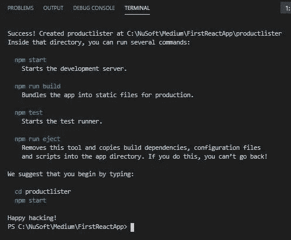

Note the bottom two commands.

5.接下来，在终端中，键入以下内容以进入应用程序的目录。

```
cd productlister
```

6.在终端中，通过键入以下命令启动开发 web 服务器并测试运行默认的 React 应用程序:

```
npm start
```

您应该会看到类似下面的内容。

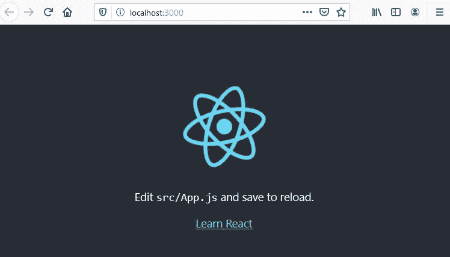

Default display when starting the development web server

从 VSCode(如下)或浏览器中可以看出，默认情况下，它运行在端口 3000 上。

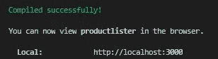

In VSCode Terminal

*需要注意的是，关闭浏览器窗口并不会阻止应用程序在端口 3000 上运行。*

**要停止 web 服务器，在终端使用，CTRL+C 并选择 Y.**

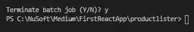

Stop the development web server on Port 3000

使用 **npm start** 随时重启。

## 检查一些重要的文件

在 VSCode 中，如果您展开 **public** 和 **src** 目录，您将看到以下内容:

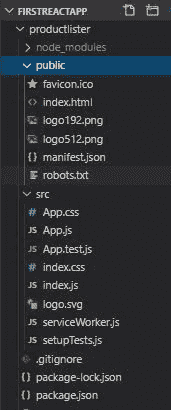

打开以下核心文件，我们将探索并理解它们是如何协同工作的。

*   App.js
*   索引. js
*   index.html

## **index.html**

这是在您启动开发服务器时提供的 HTML 页面。在文件中找到这个

，

```
<div id="root"></div>
```

这是重要的

。这是我们渲染应用程序的地方，主要的应用程序组件。这是如何做到的将很快解释。

## App.js

**App.js** 是定义 **App** 组件的地方。App 是 React *中的主要组件，充当所有其他组件的容器。这定义了在呈现给**index.html**时将显示的内容。App 可以认为是父组件。*

**可选简单示例**

如果您的开发服务器没有运行，在终端类型中，

```
npm start
```

要查看简单的更改，请打开 **App.js** ，在 **Learn React** 文本的位置，键入 **Learn React** *后跟您的姓名*，然后保存。在我的情况下，

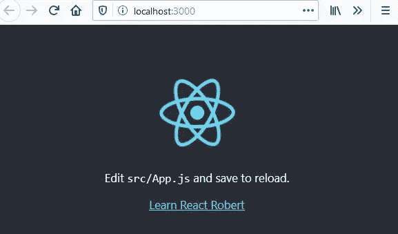

Changing the default Component

这是怎么发生的？

## 索引. js

现在来看看 **index.js** 。我已经删除了一些不需要的项目。

```
import React from 'react';
import ReactDOM from 'react-dom';
import './index.css';
**import App from './App';**ReactDOM.render(
  <React.StrictMode>
   ** <App />**
  </React.StrictMode>,
 ** document.getElementById('root')**
);
```

*   **index.js** 导入主组件， **App** 。
*   它得到了 index.html、**<div id = " root "></div>**的句柄。
*   然后，它使用 **ReactDOM** 的 render 方法(稍后将详细介绍)来呈现主要组件 App。

> 这是基本的 React 应用程序如何工作的核心。

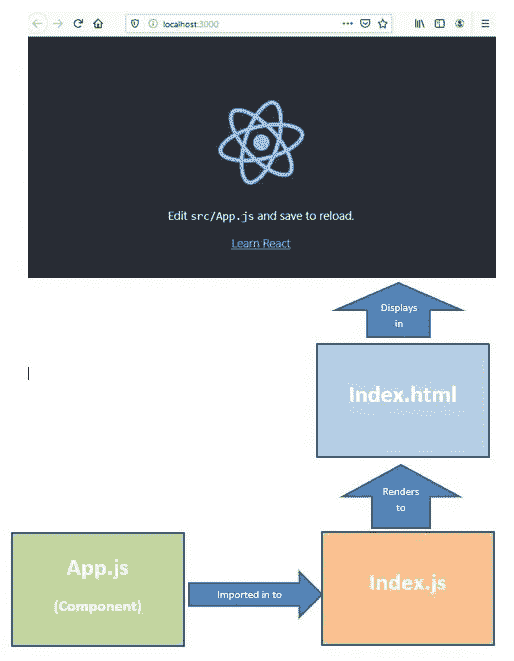

Basic process of React

当然还有其他文件，但是这些文件构成了 React 应用程序的基础。

关于我们的应用程序的说明。我们将*创建我们自己的(单一)产品组件*。这将被导入到应用程序组件中。通过对应用程序组件、index.js 和 index.html 文件进行一些更改，我们的产品将会显示出来。将我们的组件视为 App 父组件的子组件。

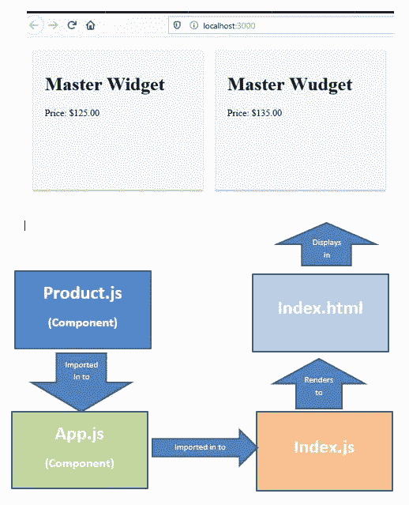

Product Lister

# 显示产品(productlister)

## 设置我们的文件

我们将首先对 index.html、 **App.js** 和 **index.js** 进行一些修改。稍后，我们将在 Product.js 文件中构建我们自己的产品组件。

1.  打开**index.html**。我们只需要保留主<分>即可。*记住，这是应用组件将呈现的地方。*

```
<!DOCTYPE html>
<html lang="en">
<head>
  <meta charset="UTF-8">
  <meta name="viewport" content="width=device-width, initial-scale=1.0">
  <title>Products</title>
</head>
<body>
 ** <div id="root"></div>**
</body>
</html>
```

2.我们现在将最小化**应用**组件。我更喜欢用箭头功能的 App。*请注意导入 App . CSS。App . CSS 位于 src 文件夹中，包含主要的应用程序样式。我们稍后将对此进行修改。*

```
import React from 'react';
import './App.css';const App =()=>{
  return (
  <div>
      Our Product Component will go here</div>
  )};export default App;
```

如果您的开发服务器仍在运行并且您保存了它，

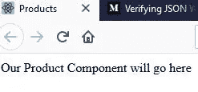

Our minimized App Component

注意 App.js 中的行**import React from ' React '；**

您将在您创建的大多数组件中看到这一点。导入 React 对象很重要。反应使用 [JSX](https://reactjs.org/docs/jsx-in-depth.html) 。简言之，

> **JSX** 是一种类似 XML/HTML 的语法，由 **React** 使用，它扩展了 ECMAScript，因此类似 XML/HTML 的文本可以与 JavaScript/ **React** 代码共存。……与过去不同的是， **JSX** 允许我们将 HTML 放入 JavaScript，而不是将 JavaScript 放入 HTML。

**从‘React’导入 React；告诉我们的组件使用主要的 React 对象，当被编译时，浏览器将理解我们的代码。**

3.我们还将简化我们的 **index.js** 。

```
import React from 'react';
import ReactDOM from 'react-dom';
import App from './App';ReactDOM.render(
    <App/>,
     document.querySelector('#root')
);
```

这里你会注意到，**从‘react-DOM’导入 ReactDOM**

React 使用一个虚拟的[文档对象模型](https://developer.mozilla.org/en-US/docs/Web/API/Document_Object_Model/Introduction) (DOM)。

> **虚拟 DOM** (VDOM)是一个编程概念，其中一个 UI 的理想或"**虚拟**"表示保存在内存中，并通过一个库(如 **ReactDOM** )与"真实" **DOM** 同步。这个过程叫做和解。…它们也可以被认为是 **React** 中的“**虚拟 DOM** ”实现的一部分。

一般来说，对于一个给定的文件，我们将导入我们需要的 React(和其他)库。

*因此，在第 3 步中，我们使用 ReactDOM 渲染我们的应用程序组件，这样它将显示在浏览器中。*

## 创建我们的产品组件

如何组织文件或多或少取决于你自己。通常，用户定义的组件放在您创建的名为组件的文件夹中。为了使我们的应用程序简单，我们将把我们的 **Product.js** 放在 **src** 文件夹中。

1.  点击 **src** 文件夹，添加名为 **Product.js** 的文件。按照惯例，组件以大写字母开头。

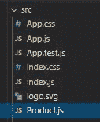

*我们将首先创建一个极简产品，然后对其进行增强。*

2.打开 **Product.js** ，添加以下内容:

```
import React from 'react';const Product=()=> {
    return (
      <div>
        <h1>Master Widget</h1>
        <p>Price: $125.00</p>
      </div>
    );
  }export default Product;
```

当您不保存任何内容时，浏览器会发生变化。为什么？我们需要将我们的组件导入到应用程序组件中并使用它。

3.用下面粗体显示的行修改 **App** 组件。

```
import React from 'react';
import './App.css';
// Tell App that Product exists
**import Product from './Product';**const App =()=>{
  return (
  <div>
  **  <Product/>**
  </div>
  )};export default App;
```

我们导入产品，然后像使用 HTML 元素一样使用它。

当你救人时，你应该看到，

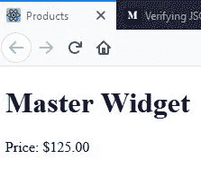

First implementation of our Product Component

接下来，我们将在 **App.css.** 中设置组件的样式

4.打开 **App.css** 并输入以下内容:

```
.product {
  display: inline-block;
  background-color: whitesmoke;
  margin: 10px;
  border: 1px solid #eee;
  box-shadow: 0 3px 3px #ccc;
  width: 250px;
  height: 200px;
  padding: 20px;
}
body{
  background-color:white;
}
```

当你保存时，什么都不会发生。为什么？我们已经导入了 App.css，但是我们还没有告诉我们的产品元素<product>使用 css 产品类。</product>

5.对 **Product.js** 进行一次更改

```
import React from 'react';const Product=()=> {
    return (
    **  <div className='product'>**
        <h1>Master Widget</h1>
        <p>Price: $125.00</p>
      </div>
    );
  }export default Product;
```

注意，通常使用 CSS 类时，我们会指定 class='product '。因为 class 是 React 中的一个关键字，React 让我们使用 **className** 。

保存，你应该看到，

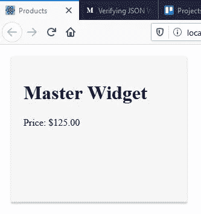

Our styles Product

非常酷，但我们不能就此打住！

我们希望能够在所有产品中使用我们的产品组件。在更长的教程中，我们将从数据库中获取数据。在我们的例子中，我们将把我们的产品放在一个数组中，一个产品对象的数组。然后，我们将通过产品组件输入数组中的每个条目。数组中的每个产品对象都有一个产品名称和价格。

6.打开 **App.js** ，在你的 App()函数上面添加下面的 **prods** 数组。

```
import React from 'react';
import './App.css';
// Tell App that Product exists
import Product from './Product';**const prods=[
  {name: 'Master Widget', price:'$125.00'},
  {name: 'Master Wudget', price:'$135.00'},
  {name: 'Sub Widget', price:'$75.00'},
  {name: 'Sub Wudget', price:'$85.00'}**
]
```

下一部分是告诉我们的产品组件期待这些数据。

## 使用道具对象

为了在 React 中传递数据，React 使用了一个名为 **props** 的对象。

> Props 是传递给 React 组件的参数。

一些需要知道的事情，

*   Props 代表 properties，是 React 中的一个特殊关键字。
*   属性像函数参数一样被传递给组件。
*   道具像 JavaScript 对象一样被访问， *key.value* 。
*   道具只能单向传递给组件(从父级到子级。)

最后一点很重要。我们的父组件 App 拥有数据(数组)，并将它传递给我们的子组件 Product。在我们的例子中，prods 数组中的每个产品对象都具有{name: 'Master Widget '，price:'$125.00'}的形式。关键是**名称**和**价格**。在本例中，值是主小部件和$125.00。

1.  打开 **Product.js** 并进行以下更改。

```
import React from 'react';const Product=(**props**)=> {
    return (
      <div className='product'>
        <h1>**{props.name}**</h1>
        <p>Price: **{props.price}**</p>
      </div>
    );
  }export default Product;
```

注意我们如何将**道具**对象作为参数传递给函数*，然后使用*键/值*对。*

如果你保存，你会得到一个令人失望的结果。这是因为尽管我们告诉 Product 接受道具并使用它，**我们实际上并没有传递道具**。

还要注意花括号。这些都很重要。大括号{ }是 JSX 的特殊语法。它用于在编译期间评估 JavaScript 表达式。JavaScript 表达式可以是变量、函数、对象或任何解析为值的代码。

## 最后一步

最后，我们需要对 App.js 进行更改，并将道具传递给 Product。我们将通过使用 prods 数组( [Array.map](https://www.w3schools.com/jsref/jsref_map.asp) )的 **map()** 方法来实现这一点。)我们也可以使用 Array.forEach 或其他方法。

1.  打开 **App.js** ，修改 App()函数。

```
import React from 'react';
import './App.css';
import Product from './Product';const prods=[
  {name: 'Master Widget', price:'$125.00'},
  {name: 'Master Wudget', price:'$135.00'},
  {name: 'Sub Widget', price:'$75.00'},
  {name: 'Sub Wudget', price:'$85.00'}
]const App =()=>{
  return (
  <div>

   ** {prods.map(prod=>(
      <Product name={prod.name} price={prod.price} />**))}
  </div>
)};
```

我们正在使用数组**的**贴图**方法。map 方法接受一个参数，这个参数是数组的每个元素，并将它传递给一个回调函数(我们使用一个箭头函数。)**

在我们的例子中，数组的每个元素都是一个产品对象，如{name: 'Master Widget '，price:'$125.00'}，因此每个道具看起来都像{name:'product name '，price: 'product price'}

在回调函数中，我们再次使用花括号输出**产品名称**和**产品价格**。还要注意 prod.map 周围的花括号。

保存并获得一个很酷的结果。

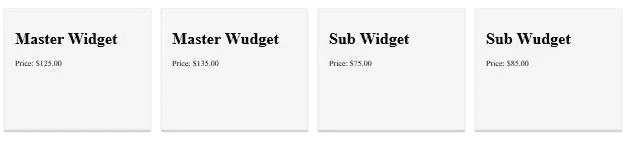

All the products in our Array

干得好！

**重要提示**:完成后，不要忘记在终端窗口中使用 CTRL+C 停止您的开发服务器。

# 结论

我们构建了一个 React 应用程序，它使用了 React 的许多核心组件。我们现在应该对组件的概念以及 React 如何使用它们有所了解。我们还应该知道三个核心文件 App.js、index.js 和 index.html 是如何协同工作来显示我们的应用程序的。

还有什么要学的吗？是啊！现在开始你的旅程，了解更多关于 JSX，巴别塔，反应堆，管理国家和更多。跳到下一级教程。现在，你已经有了一个基础，可以在 React 上对任何 youtube 视频进行编码，并理解正在发生的事情。

使用此应用程序探索。修改并扩展它。那就多造一些。

**感谢您的阅读和快乐编码！**

在 Medium 上阅读所有你想要的文章，并以每月 5 美元的价格成为 Medium 会员，帮助我继续写作。

[](https://bobtomlin-70659.medium.com/membership) [## 通过我的推荐链接加入灵媒——重力井(罗布·汤姆林)

### 作为一个媒体会员，你的会员费的一部分会给你阅读的作家，你可以完全接触到每一个故事…

bobtomlin-70659.medium.com](https://bobtomlin-70659.medium.com/membership) 

## 额外资源

*   [官方反应网站](https://reactjs.org/)
*   [JSX](https://reactjs.org/docs/introducing-jsx.html)
*   [基于类的组件与功能性组件](https://www.freecodecamp.org/news/functional-components-vs-class-components-in-react/)(我们使用了功能性。)

我们没有讨论这些，但它们值得研究。

*   [巴别](https://babeljs.io/)
*   [Webpack](https://webpack.js.org/)

你也可能喜欢读书，

[](https://medium.com/javascript-in-plain-english/using-reacts-useeffect-hook-to-fetch-data-and-periodically-refresh-that-data-2a69b6d44081) [## 使用 React 的 useEffect 挂钩获取数据并定期刷新该数据

### 使用 useEffect 获取功能组件中的数据，并使用 setInterval 根据需要刷新该数据。

medium.com](https://medium.com/javascript-in-plain-english/using-reacts-useeffect-hook-to-fetch-data-and-periodically-refresh-that-data-2a69b6d44081) [](https://medium.com/javascript-in-plain-english/creating-your-second-react-application-d6d50e3e1e91) [## 如何在与 useState Hook 反应时管理状态

### 使用功能组件上的 useState 挂钩管理状态

medium.com](https://medium.com/javascript-in-plain-english/creating-your-second-react-application-d6d50e3e1e91) [](https://medium.com/javascript-in-plain-english/react-router-and-spas-made-easy-19fd1db0d6fc) [## 提高路由器和 SPA 的响应速度

### 使用客户端路由创建单页应用程序

medium.com](https://medium.com/javascript-in-plain-english/react-router-and-spas-made-easy-19fd1db0d6fc) [](https://medium.com/javascript-in-plain-english/understanding-angular-and-creating-your-first-application-4b81b666f7b4) [## 了解 Angular 并创建第一个应用程序

### 第一部分:从 Angular 开始

medium.com](https://medium.com/javascript-in-plain-english/understanding-angular-and-creating-your-first-application-4b81b666f7b4) [](https://medium.com/javascript-in-plain-english/understanding-angular-and-creating-your-second-application-baecdc4ed2e9) [## 了解 Angular 并创建第二个应用程序

### 第二部分-进一步移动与角度

medium.com](https://medium.com/javascript-in-plain-english/understanding-angular-and-creating-your-second-application-baecdc4ed2e9) 

**来自 JavaScript 的简单说明:**我们一直对帮助推广高质量的内容感兴趣。如果你有一篇文章想用简单的英语提交给 JavaScript，请在[submissions@javascriptinplainenglish.com](mailto:submissions@javascriptinplainenglish.com)用你的中号用户名发一封电子邮件给我们，我们会把你作为一个作者加入。

**所有代码**

**App.js**

```
import React from 'react';
import './App.css';
import Product from './Product';const prods=[
  {name: 'Master Widget', price:'$125.00'},
  {name: 'Master Wudget', price:'$135.00'},
  {name: 'Sub Widget', price:'$75.00'},
  {name: 'Sub Wudget', price:'$85.00'}
]const App =()=>{
  return (
  <div>

    {prods.map(prod=>(
      <Product name={prod.name} price={prod.price} />))}
  </div>
  )};export default App;
```

**index.js**

```
import React from 'react';
import ReactDOM from 'react-dom';
import App from './App';ReactDOM.render(
    <App/>,
     document.querySelector('#root')
);
```

**index.html**

```
<!DOCTYPE html>
<html lang="en">
<head>
  <meta charset="UTF-8">
  <meta name="viewport" content="width=device-width, initial-scale=1.0">
  <title>Products</title>
</head>
<body>
  <div id="root"></div>
</body>
</html>
```

**App.css**

```
.product {
  display: inline-block;
  background-color: whitesmoke;
  margin: 10px;
  border: 1px solid #eee;
  box-shadow: 0 3px 3px #ccc;
  width: 250px;
  height: 200px;
  padding: 20px;
}
body{
  background-color:white;
}
```

**Product.js(我们的功能部件。)**

```
import React from 'react';const Product=(props)=> {
    return (
      <div className='product'>
        <h1>{props.name}</h1>
        <p>Price: {props.price}</p>
      </div>
    );
  }export default Product;
```