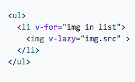
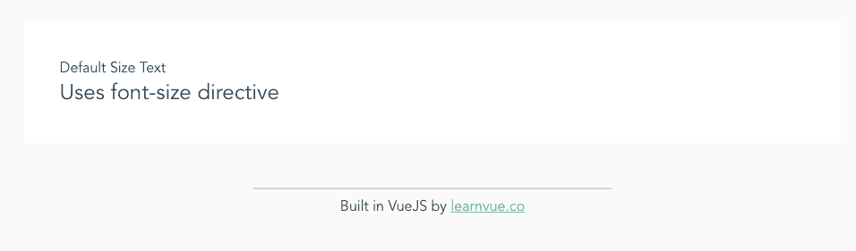
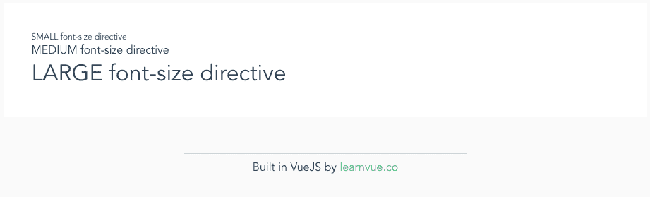

# 创建您的第一个 VueJS 自定义指令

> 原文：<https://javascript.plainenglish.io/creating-your-first-vuejs-custom-directive-8f5616b391fd?source=collection_archive---------6----------------------->


Photo by [Anna Kolosyuk](https://unsplash.com/@anko_?utm_source=medium&utm_medium=referral) on [Unsplash](https://unsplash.com?utm_source=medium&utm_medium=referral)

在 VueJS 中，指令是直接编辑 DOM 的最佳方式之一。

VueJS 中指令的一些例子有 *v-if* 、 *v-show* 、 *v-bind* 等等。如果你在 VueJS 工作过，你肯定对它们很熟悉。

正如你可能猜到的，VueJS 自定义指令是 Vue 让我们为项目构建附加指令的方式。它们是在项目中添加独特功能的绝佳方式。它们允许您操纵元素以及处理 DOM 中的反应。

在本中级教程结束时，您将了解:

*   什么是自定义指令
*   Vue 指令的各种事件挂钩
*   如何创建您自己的自定义指令

我们走吧！

# 什么是自定义指令

在我们讨论如何实现自定义指令之前，让我们先讨论一下它们为什么有用。

本质上，自定义指令允许您使您的项目符合您的需要。如果你使用 Vue 插件，你会注意到他们经常使用自定义指令。



例如，在 [v-lazy 插件](https://github.com/hilongjw/vue-lazyload)中，他们使用 v-lazy 来添加定制功能，使图像加载更加有效。这里使用指令是最好的情况，因为我们想要直接编辑 DOM。

您可能会问，“*我不能只注册 computed 和 watchers 这样的组件选项吗？*”

是的。你可以。但是，尽管组件选项对于抽象和代码重用很有用，自定义指令仍然是直接操作 DOM 元素的最佳方式之一。

# 指令有五个挂钩

VueJS 指令有 5 个触发事件的钩子。像[生命周期钩子](https://learnvue.co/2019/12/a-beginners-guide-to-vuejs-lifecycle-hooks/)一样，它们观察然后运行方法。

*   **bind** —当指令绑定到元素时调用一次
*   **inserted** —当绑定元素被插入其父节点时
*   **更新** —当元素更新时(但是任何子元素还没有更新)
*   **componentUpdated** —在孩子也更新之后
*   **解除绑定** —当指令从元素解除绑定时调用一次

当实现这些钩子时，它们各自都有一些它们接受的参数。

1.  el —指令被绑定到这个元素；允许您修改它
2.  **绑定** —一个对象包含很多属性；我们马上会深入探讨
3.  **虚拟节点** —虚拟节点
4.  **oldNode** —前一个虚拟节点(仅在更新挂钩中可用)

指令的 [VueJS 文档](https://vuejs.org/v2/guide/custom-directive.html#ad)中的一个重要注意事项是，您应该将这些参数(除 el 之外)视为**只读**，并且永远不要修改它们。

# 绑定对象

binding 对象包含几个属性，可以帮助您实际地为钩子添加功能。

*   **名称** —指令的名称(无 v 前缀)
*   **值** —传递给指令的值
*   **oldvalue** —指令的前一个值(仅在更新挂钩中可用)
*   **表达式** —绑定到字符串的表达式(例如`v-direc=”3 * 3″`，表达式= `“3*3”`
*   **arg** —传递给字符串的任何参数(例如`v-direc:blue`，arg = `blue`
*   **修饰符** —作为对象传递的所有修饰符(例如。`v-direc.blue.link`，修饰符= `{blue: true, link: true}`

# 定义您的指令

有两种方法来定义您的指令。

1.  全球范围内——我认为大多数时候这是最好的
2.  本地—使用名为*指令*的组件选项

让我们看看如何在全球范围内添加它们。

在我们的 main.js 文件中——或者任何定义 Vue 实例的地方——我们只需要使用 [Vue.directive](https://vuejs.org/v2/api/#Vue-directive) 方法。

现在，让我们创建一个指令，允许我们操作组件的字体大小。它将被称为 *v 型。*

在 main.js 中，我们将添加一些这样的代码…

```
Vue.directive("font-size", {
  bind: (el, binding, vnode) => {
    el.style.fontSize = 24 + 'px';
  },
  updated: (el, binding, vnode) => {
    el.style.fontSize = 24 + 'px';
  }
})
```

然后，在任何组件文件中，让我们只添加下面两行，这样我们就可以看到我们的组件在运行！每当我们声明一个指令时，我们都可以使用前缀“v-”来访问它。

```
<p>Default Size Text</p>
<p v-font-size>Uses font-size directive</p>
```

还有另一种方法来定义您的 Vue 指令。对于速记，您也可以在 *main.js.* 中使用这个语法

```
Vue.directive("font-size", (el, binding, vnode) => {
  el.style.fontSize = 24 + 'px';
})
```

如果传递的是函数而不是对象，那么它将在绑定和更新挂钩期间运行。

无论您使用哪种方法，结果都应该是这样的。



我们有了第一个自定义指令！现在，让我们把它变得更高级一点。

# 向指令传递参数

有几种方法可以增加对指令的控制。这可以通过传递附加的值、参数或修饰符来实现

在我们的例子中，假设我们想要更好地控制元素中的字体大小。

## 传递的值—用于反应性数据

传递数据最直观的方式是简单地给它一个值。这允许您的指令在值改变时响应性地更新。这也提供了最灵活的控制，因为您可以接受任何值(任何字体大小)。

在您的组件中，声明如下所示…

```
<p v-font-size='64'>Uses font-size directive</p> 
<!-- OR USE A VARIABLE --> 
<p v-font-size='fontSize'>Uses font-size directive</p>
```

在您的指令中，您需要更改您的方法来使用来自绑定对象的值。

```
Vue.directive("font-size", (el, binding, vnode) => {
  el.style.fontSize = binding.value + 'px';
})
```

## 向指令发送参数

如果你真的不需要任何反应，只是想要一种方法为你的指令提供多种选择。争论是一个很好的方法。

我们指令中的代码是这样的。

```
Vue.directive("font-size", (el, binding, vnode) => {
  console.log(binding + " " + vnode);
  var defaultSize = 16;
  switch (binding.arg) {
    case "small":
      defaultSize = 12;
      break;
    case "large":
      defaultSize = 32;
      break;
    default:
      defaultSize = 16;
      break;
  }
  el.style.fontSize = defaultSize + "px";
})
```

然后在我们的模板中。

```
<p v-font-size:small>SMALL font-size directive</p>
<p v-font-size:medium>MEDIUM font-size directive</p>
<p v-font-size:large>LARGE font-size directive</p>
```

# 使用修饰符

修饰语类似于论点，因为它们并不真正适合于反应性。但是当与 args 结合使用时，您可以真正创建一个高度定制系统。

让我们先在指令中实现它们。

```
Vue.directive("font-size", (el, binding, vnode) => {
  console.log(binding + " " + vnode);
  var defaultSize;
  if (binding.modifiers.small) {
    defaultSize = 12;
  } else if (binding.modifiers.large) {
    defaultSize = 32;
  } else {
    defaultSize = 16;
  }
  el.style.fontSize = defaultSize + "px";
})
```

然后我们可以在模板中使用它们

```
<p v-font-size.small>SMALL font-size directive</p> 
<p v-font-size.medium>MEDIUM font-size directive</p>
<p v-font-size.large>LARGE font-size directive</p>
```

输出应该是这样的。



# 结论

恭喜你。

您已经在这里完成了，现在应该对注册您自己的 VueJS 自定义指令有了一些工作知识。

感谢您的关注，我希望这篇文章为您提供了构建一些令人惊叹的工具所需的工具。

编码快乐！

如果你有兴趣了解更多关于 Vue 3 的知识，请下载我的免费 Vue 3 备忘单，里面有一些基本知识，比如合成 API、Vue 3 模板语法和事件处理。

*原载于 2020 年 1 月 10 日*[*【https://learnvue.co】*](https://learnvue.co/2020/01/creating-your-first-vuejs-custom-directive/)*。*