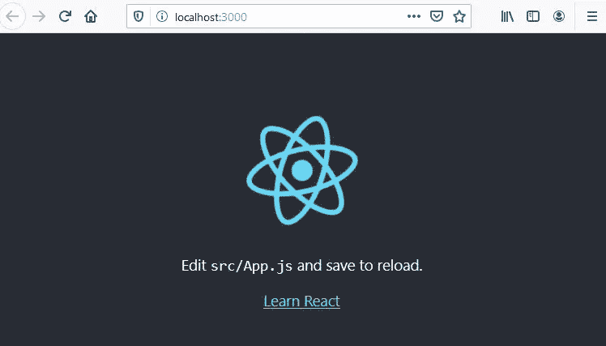

# 如何用 useState 钩子管理 React 中的状态

> 原文：<https://javascript.plainenglish.io/creating-your-second-react-application-d6d50e3e1e91?source=collection_archive---------2----------------------->

## 基于组件的开发入门

## 使用功能组件上的 useState 挂钩管理状态



Source: Author. Screen Shot After Running React Development Server

> 让我们在 React 应用程序中管理状态！

> 应用程序状态基本上是应用程序的存储内存，可以是变量、属性等形式。网络本质上是无状态的。

在我们的上一篇教程文章[创建您的第一个 React 应用程序](https://medium.com/javascript-in-plain-english/creating-your-first-react-application-db9dfe93b4f5)中，我们介绍了 React 并构建了一个漂亮的小应用程序来显示产品。

在这个过程中，我们了解了基于组件的 web 开发，React 应用程序的核心结构和流程；第一个重要概念，**道具**物体。

在这篇教程文章中，我们将使用同一个应用程序，并通过使用 [**useState 钩子**](https://reactjs.org/docs/hooks-state.html) 来学习另一个非常重要的概念**管理状态**。使用 useState 函数还将公开一个函数，它可以根据需要命名，允许我们更新状态。使用 useState 和一个函数来更新状态将为我们提供状态管理。此外，我们将从**事件处理**开始。

# 你将会学到什么，

*   有状态和无状态组件的基础
*   什么是使用状态挂钩。
*   如何使用 useState 钩子？
*   如何使用函数更新状态？
*   如何实现按钮的 onClick 事件处理程序？

## 重要！

我们之前学过的**道具**和现在的**状态，**是 React 中要学习的两个非常重要的首要概念。为什么？因为，

> 如果组件的状态已经改变，重新**渲染**只能被**触发**。状态可以通过 props 更改或直接 setState 更改来更改。组件得到更新的状态，并且**反应**决定是否应该重新**渲染**组件

我们将使用我们在[中构建的 **productlister** 应用程序来创建您的第一个 React 应用程序](https://medium.com/javascript-in-plain-english/creating-your-first-react-application-db9dfe93b4f5)作为起点。

*如果您也阅读并编写了代码，* [*使用 React-Router 创建 SPA*](https://medium.com/javascript-in-plain-english/react-router-and-spas-made-easy-19fd1db0d6fc) *，如果您愿意，您可以使用该应用程序作为起点。*

**在本教程中，我们只需对 App 组件 App.js 进行更改。**

## 我们应用程序的预览

这里是*原始 productlister* 应用程序的屏幕显示。它有一个功能性的**产品**组件，通过**道具**对象接收产品的名称和价格。然而，*数据是静态的。*


Our First React App with a functional Component and Props

在本文中，我们将允许用户输入并应用折扣代码。这将通过使用 [**使用状态**](https://reactjs.org/docs/hooks-state.html) **和我们用来更新状态的函数来触发状态的改变。**

**新应用:在点击“应用折扣”按钮之前。**


Before Apply Discount is clicked

**新应用:点击“应用折扣”按钮后。注意价格。**


After Apply Discount is clicked. The state has changed.

## 什么是有状态和无状态组件？

> 有状态的组件跟踪变化的数据，而无状态的组件打印出通过 props 给它们的东西，或者它们总是呈现同样的东西。

对于需要改变数据的组件，我们将使用 **useState 函数和一个更新状态的函数。**

> *钩子*是 **React 16.8** 中新增的。它们允许您使用状态和其他 React 特性，而无需编写类。

最后一句话很重要，我们将继续只使用功能组件，而不是基于类的组件。

# 我们开始吧

## 从哪里开始

如果您在创建第一个 React 应用程序时构建了 productlister [，请以此为起点。](https://medium.com/javascript-in-plain-english/creating-your-first-react-application-db9dfe93b4f5)

如果您没有，请参考[创建您的第一个 React 应用程序](https://medium.com/javascript-in-plain-english/creating-your-first-react-application-db9dfe93b4f5)，或者按照它进行操作，或者只需*获取文章底部的代码*。

## 管理功能组件中的状态

## 使用状态挂钩(函数)

React 钩子是 React 给你的一组函数，供功能组件使用。

> useState 是用于管理功能组件中的状态的钩子。

由于我们的 **App.js** 是一个功能组件，我们需要通过导入它来告诉它我们想要使用 useState 钩子。

1.  打开 **App.js** ，在顶部修改第一行，使其导入 useState。

```
import React, **{useState}** from 'react';
```

**useState 函数返回一个包含两个元素的数组。**

*   第一个要素是我们当前的状态。
*   第二个是允许我们更新状态的函数。

*我们将使用数组析构，这样我们可以更容易地看到从 setState 返回什么。*

2.通过添加 useState 函数以及我们的初始状态(我们的 prods 数组)来修改您的 **App.js** 。)
添加 **const [currProdState，setProdState]=useState({
)并剪切粘贴产品数据数组，prods。**

```
import React ,**{useState}** from 'react';
import './App.css';
import Product from './Product';const App =()=>{// useState returns an array with two elements
  // The current state and function to update state
  // causing re-render
**const [currProdState,setProdState]=useState({
  prods:[
      {name: 'Master Widget', price:'$125.00'},
      {name: 'Master Wudget', price:'$135.00'},
      {name: 'Sub Widget', price:'$75.00'},
      {name: 'Sub Wudget', price:'$85.00'}
    ]
  });**
```

上面的代码是下面的***App**函数声明和*上面的***返回**。*

在这段代码中，调用了函数 **useState** 。我们把它传递给初始状态。这是我们的数组 prods，它包含我们的产品名称和价格。*(为简单起见，我们使用一组产品数据。通常这将来自数据库。)*

useState 函数返回两个元素，初始状态和您将实现来更改状态的函数。名字 **currProdState** 和 **setProdState** 并不特别，可以是我们想要的任何名字。这里我们以描述性的方式给它们命名。

*   currProdState 将包含原始状态，prods 数组。
*   setProdState 是我们必须实现的一个函数，用来改变或设置状态。

## 我们将如何改变状态

我们将创建一个函数 **applyDiscountHandler** ，它将使用 **setProdState** 函数来更改状态。函数 applyDiscountHandler 将在**单击下一个我们将添加的按钮**时被调用。在前面的屏幕截图中，按钮将是“应用折扣”按钮。单击时，它将调用 applyDiscountHandler，而 applyDiscountHandler 又将调用 setProdState，其中包含一组新的产品价格。

**创建 applyDiscountHandler**

1.  在对 useState 的调用下面，添加 applyDiscountHandler 函数。

```
const applyDiscountHandler= ()=>{}
```

在函数中，我们将调用 setProdState。函数 setProdState 将接收 prods 数组，但对某些产品使用一组新的价格。该调用将导致 DOM 的重新呈现，并且将显示我们的打折产品。我们将对主 Widget 和主 Wudget 打折。

2.将以下内容添加到 applyDiscountHandler。请注意更新后的价格。

```
const applyDiscountHandler= ()=>{
  **setProdState**({ 
      prods:[
       ** {name: 'Master Widget', price:'$95.00'},
        {name: 'Master Wudget', price:'$100.00'},**
        {name: 'Sub Widget', price:'$75.00'},
        {name: 'Sub Wudget', price:'$85.00'}
      ]
  })
  }
```

**创建按钮**

下面的代码将创建一个**按钮**并设置 **onClick** 事件处理程序。您还会注意到我们的 **prods.map** 发生了变化。数据不再仅仅存在于 prods 阵列中。它在从 useState 返回的第一个参数 currProdState 中。如果你还记得，这包含了初始状态。

3.如下修改您的返回中的代码。

```
return (
  <div>

    {**currProdState.prods.map**(prod=>(
      <Product name={prod.name} price={prod.price} />
    ))};
   <p></p>
    Enter Discount Code:<input type='text' name='code' ></input>
    **<button onClick={applyDiscountHandler}>Apply Discount</button>** </div>
  )};
```

您的 **App.js** 应该如下所示:

```
import React ,{useState} from 'react';
import './App.css';
import Product from './Product';const App =()=>{// useState returns an array with two elements
  // The current State and function to update state
  // causing re-render
const [currProdState,setProdState]=useState({
  prods:[
      {name: 'Master Widget', price:'$125.00'},
      {name: 'Master Wudget', price:'$135.00'},
      {name: 'Sub Widget', price:'$75.00'},
      {name: 'Sub Wudget', price:'$85.00'}
    ]
  });const applyDiscountHandler= ()=>{
  setProdState({ 
      prods:[
        {name: 'Master Widget', price:'$95.00'},
        {name: 'Master Wudget', price:'$100.00'},
        {name: 'Sub Widget', price:'$75.00'},
        {name: 'Sub Wudget', price:'$85.00'}
      ]
  })
  }return (
  <div>

    {currProdState.prods.map(prod=>(
      <Product name={prod.name} price={prod.price} />
    ))};
   <p></p>
    Enter Discount Code:<input type='text' name='code' ></input>
    <button onClick={applyDiscountHandler}>Apply Discount</button>
  </div>
  )};export default App;
```

## 它将如何工作

当应用程序运行时，将使用初始状态调用 useState，并将初始状态返回给 currProdState 和一个更新状态的函数。我们将使用 map 通过**道具**将 **currProdState.prods** 传递给我们的产品组件。最后，将显示一个输入(折扣代码)和一个按钮。单击该按钮将调用 applyDiscountHandler，该按钮将调用 setProdState 来触发对 DOM 的更新。参数 currProdState 现在具有更新后的状态。

## 试试看！

请注意，我们没有为 input 元素添加任何逻辑操作，所以您只需单击按钮即可。但是很酷！状态已更新。主 Widget 和主 Wudget 的价格已经更新。


## **重要！**

设置状态时，需要为所有项目提供数据。如果您只提供更新的项目，主 Widget 和主 Wudget，其他两个将会消失。

此外，始终使用为设置状态提供的函数。不要试图在更新状态的函数之外，仅仅通过改变数据本身来改变状态。

# 结论

在本教程中，我们学习了使用功能性 React 组件时管理状态的基础知识。这是通过使用 useState 启动进程和使用函数更新状态来实现的。

我们还学习了如何创建一个按钮对象并使用它的 onClick 事件处理程序。

**感谢您的阅读和编码！**

*想看就看，加入 Medium 帮我继续写作。*

[](https://bobtomlin-70659.medium.com/membership) [## 通过我的推荐链接加入灵媒——重力井(罗伯·汤姆林)

### 作为一个媒体会员，你的会员费的一部分会给你阅读的作家，你可以完全接触到每一个故事…

bobtomlin-70659.medium.com](https://bobtomlin-70659.medium.com/membership) 

**其他资源:**

*   [挂钩](https://reactjs.org/docs/hooks-reference.html)
*   [基于类与功能组件](https://www.freecodecamp.org/news/functional-components-vs-class-components-in-react/)

你也可以享受，

[](https://medium.com/javascript-in-plain-english/react-router-and-spas-made-easy-19fd1db0d6fc) [## 使用 React-Router 创建 SPA

### 使用客户端路由创建单页应用程序

medium.com](https://medium.com/javascript-in-plain-english/react-router-and-spas-made-easy-19fd1db0d6fc) [](https://medium.com/javascript-in-plain-english/using-reacts-useeffect-hook-to-fetch-data-and-periodically-refresh-that-data-2a69b6d44081) [## 使用 React 的 useEffect 钩子获取数据并定期刷新数据

### 使用 useEffect 获取功能组件中的数据，并根据需要使用 setInterval 刷新数据。

medium.com](https://medium.com/javascript-in-plain-english/using-reacts-useeffect-hook-to-fetch-data-and-periodically-refresh-that-data-2a69b6d44081) [](https://medium.com/javascript-in-plain-english/two-ways-of-managing-state-in-a-functional-react-form-ef0929eefe67) [## 在函数式反应表单中管理状态的两种方法

### 在注册表单中，对每个输入使用 useState 挂钩，而不是使用一个用户对象和一个 useState 挂钩。

medium.com](https://medium.com/javascript-in-plain-english/two-ways-of-managing-state-in-a-functional-react-form-ef0929eefe67) [](/manage-form-state-with-react-final-form-bdad07b24509) [## 用 React 最终表单管理表单状态

### 没有 useState()钩子的 React 窗体状态管理。

javascript.plainenglish.io](/manage-form-state-with-react-final-form-bdad07b24509) [](/what-is-next-js-and-server-side-rendering-9e24ea21c144) [## 什么是 Next.js 和服务器端渲染

### Next.js 是由 Vercel 创建的 React 框架。与使用客户端渲染的 React 不同，Next.js 使用服务器端…

javascript.plainenglish.io](/what-is-next-js-and-server-side-rendering-9e24ea21c144) 

# **用简单英语写的便条**

你知道我们有四份出版物和一个 YouTube 频道吗？你可以在我们的主页 [**plainenglish.io**](https://plainenglish.io/) 上找到所有这些——关注我们的出版物并 [**订阅我们的 YouTube 频道**](https://www.youtube.com/channel/UCtipWUghju290NWcn8jhyAw) **来表达你的爱吧！**