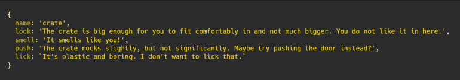
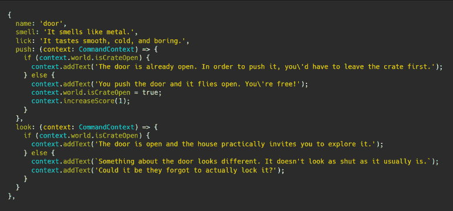
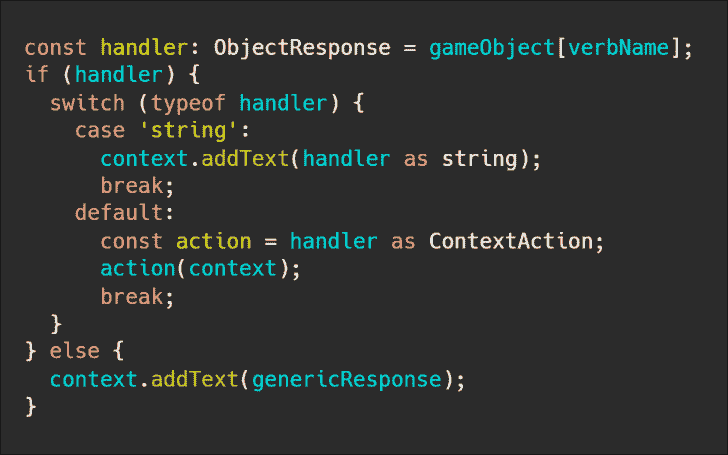

# 打字稿歧视性联合的创造性使用

> 原文：<https://javascript.plainenglish.io/creative-uses-of-typescript-discriminated-unions-bec2c1c63f45?source=collection_archive---------10----------------------->

让我向您展示如何创造性地使用 TypeScript 的[区别联合](https://www.typescriptlang.org/docs/handbook/advanced-types.html#discriminated-unions)、类型别名和函数，可以在您自己的代码中给予您更大程度的灵活性。

我将通过举例说明这些技术是如何解决我试图解决的问题的，然后谈谈如何应用这些技术的一些额外想法。

# 我正在解决的问题

我正在构建一个基于文本的游戏，我将在今年春天做一些演讲。这是一种游戏，游戏引擎描述一些东西，然后玩家输入命令，比如`look at the flowers`或`hit the mushroom with the glowing red hammer`。

为了做到这一点，我需要能够将游戏世界的部分表示为对玩家可以尝试的动词有基本反应的对象。

这很容易用一个简单的对象来表示，其中带有自定义响应的动词被定义为对象的字符串属性(*注意:在我的游戏中玩家是一只狗*):

因此，使用上面的对象，引擎将对未在该对象上定义的动词给出默认响应(例如，吃或捡)。

但是，如果我想让一个动词真正影响游戏世界呢？我需要更灵活一点的东西。

这就是受歧视的工会发挥作用的地方。

# 什么是歧视性工会？

TypeScript 中的区别联合是告诉 TypeScript 某件事将成为固定数量的可能性之一的一种方式。

例如，如果我声明一个参数为`x: string | number | boolean`，我会告诉 TypeScript 它应该期望`x`是`string`、一个`number`或者一个`boolean`。然后，TypeScript 将检查我对`x`的使用，以确保我使用的是每一个都通用的属性，或者进行必要的类型检查/转换。

这很有帮助的原因是，它允许您根据传入的值为事物指定简单的路径和复杂的路径。

# 定义类型

既然我们已经确定了什么是歧视性工会以及为什么它们可能会有所帮助，让我们看看我对`GameObject`的定义。这是游戏世界中玩家可以潜在地与之交互的对象。

首先关注第 4 行的`ObjectResponse`。这是用于表示对象上的动词处理程序的类型。例如，`shoe`如何回应`eat`动词。

我将`ObjectResponse`定义为一个`ContextAction | string`，这意味着它要么是一个简单的字符串，表示要打印的描述，要么是一个由`ContextAction`表示的更复杂的响应。

`ContextAction`是一个自定义类型定义，它表示一个函数，接受一个`CommandContext`对象(一个自定义域对象，表示世界的当前状态和一些基本的响应格式化功能)并返回`void` (nothing)。

这实际上是说，对象上的动词处理程序要么返回一个简单的字符串描述，要么是一个更复杂的函数，接受一个`CommandContext`对象并对其进行处理。

下面是一个实际例子，它使用两个签名在其`push`和`look`动词响应中执行更复杂的逻辑:

# 解释不同类型的价值观

好吧，如果我们面对的是一个受歧视的工会，我们如何有效地与之合作？

看一下这段 TypeScript 片段:

这里我们查询`gameObject`看它是否有一个与`verbName`同名的属性。如果*没有*出现，我们就添加动词的一般反应。

如果响应*是*存在，我们知道它是`string`或`ContextAction`，因此我们可以关闭该值的类型并适当地处理它。

在这里，我们通过将值转换为 string 来响应`string`值，并使用`context`上的方法来添加一条简单的消息。

如果值是*而不是* a `string`，那么我们知道它将是一个`ContextAction`并且将是一个带有签名的函数，它接受一个`CommandContext`并返回`void`。在这种情况下，我们只需调用函数并传入`context`。

# 结束语

希望这说明了有区别的联合和类型别名在处理各种场景中的有用性，并可能为您提供如何简化一些现有逻辑的想法。

当我看到相似数据的模式或大量样板文件或重复代码的可能性时，我个人会考虑有区别的联合和使用函数。

有区别的联合确实增加了代码的复杂性，但是在其他领域的简单性和灵活性方面，这个代价是值得的。最终决定取决于你，并且会根据你试图解决的问题而改变。

*原载于 2020 年 3 月 8 日*[*【https://killalldefects.com】*](https://killalldefects.com/2020/03/08/creative-uses-of-typescript-discriminated-unions/)*。*