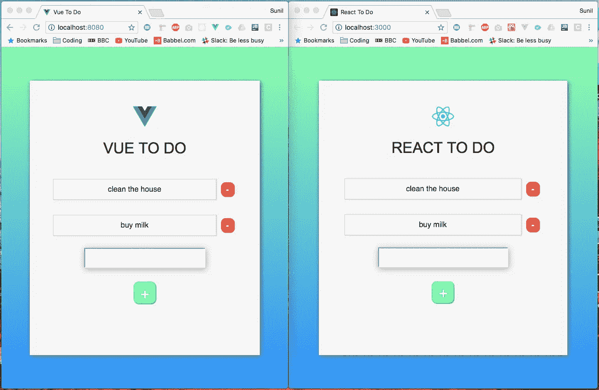
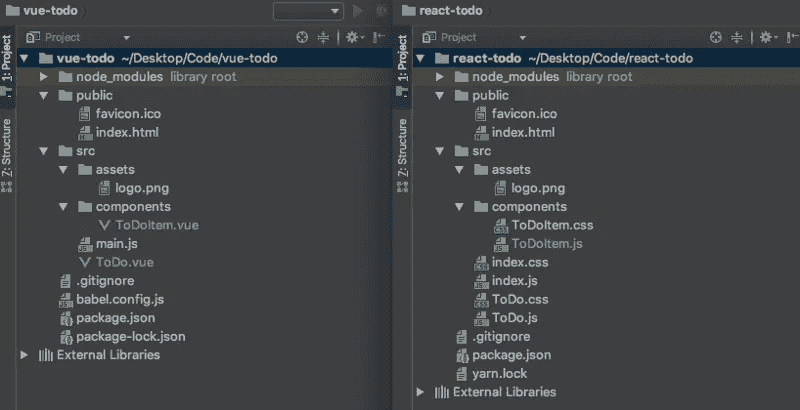
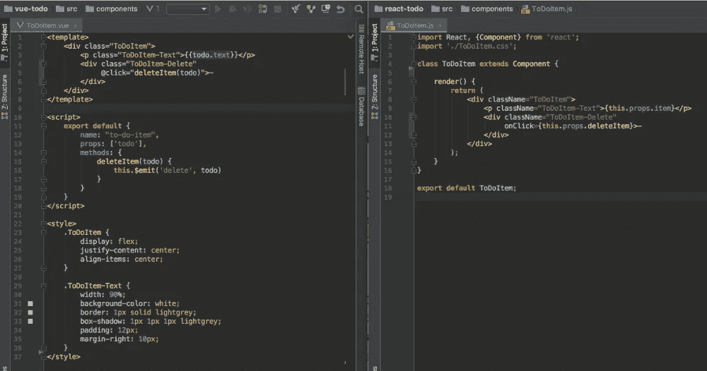
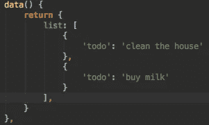
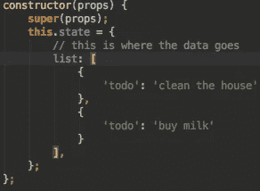

# 我在 React 和 Vue 中创建了相同的应用程序。这就是差异。

> 原文：<https://javascript.plainenglish.io/criei-o-mesmo-app-em-react-e-vue-eis-as-diferen%C3%A7as-2455d86d173c?source=collection_archive---------0----------------------->

## Sunil Sandhu 的原文翻译:“我在 React 和 Vue 中创建了完全相同的应用程序。这里是差异”。

在我目前的工作环境中使用 Vue,我已经对它的工作原理有了很好的了解。然而,我很好奇围栏另一边的草是什么样子的——在这种情况下,草是 React。

> **翻译注释!**与原作者不同,我,马塞尔,主要在使用 React 的团队中工作。我保持了相同的文本语义,只做了一些语言修改和一些技术上的调整。

我阅读了 React 文档并观看了几个教程视频,虽然它们很棒,但我真正想要的是了解 React 与 Vue 的不同之处。通过“不同”,我并不是说它们都有*虚拟 DOM*,或者它们在渲染页面时的样子。我希望有人花时间解释代码并告诉我发生了什么!我想找到一篇解释这些差异的文章,以便 Vue 或 React(或 Web 开发作为一个整体)的新手可以更好地理解两者之间的差异。


Quem se saiu melhor?

我决定尝试并合理地构建一个标准的*“To Do”*(“待办事项列表”)应用程序,允许用户在列表中添加和删除项目。这两个应用程序都是使用它们的标准 CLI 创建的(React 的 `create-react-app` 和 Vue 的 `vue-cli`)。CLI 是 T10 Command Line Interface (T11) 的缩写。是的

# 顺便说一句,这个介绍已经比我预期的要长。因此,让我们先快速浏览一下应用程序的外观:



Vue vs React: A Força Irresistível encontra O Objeto Imóvel

两者的 CSS 代码是完全相同的,但它们的位置存在差异。考虑到这一点,我们接下来看一下文件结构:



Quem se saiu melhor?

你会发现它们的结构也几乎相同。这里唯一的区别是,React 应用程序有三个 CSS 文件,而 Vue 应用程序没有一个。主要原因是因为在`create-react-app`中,React 组件将有一个附带的文件来保存其样式,而在`vue-cli`中,样式在组件文件中声明。

最后,两者都达到了相同的目的,没有什么可说的,除了你可以继续在 React 或 Vue 中以不同的方式构建你的 CSS 之外。这实际上归结为个人偏好——你会听到很多关于如何构建 CSS 的社区讨论。目前,我们只会遵循两个 CLI 定义的结构。

但在我们继续之前,让我们快速了解一下典型的 Vue 和 React 组件:



Vue à esquerda. React à direita.

现在让我们进入详细的细节!

# 我们如何改变数据?

首先,什么是“数据转换”?听起来有点技术性吧?基本上,这意味着只更改我们存储的数据。因此,如果我们想将一个人的名字的值从“John”更改为“Mark”,我们将“改变数据”。所以这里是 React 和 Vue 之间的关键区别。虽然 Vue 本质上创建了一个数据对象,其中数据可以自由更新,但 React 创建了一个状态对象,在该对象中需要更多的手工操作来执行更新。React 实现了这种额外的手臂工作是有充分理由的,我们很快就会到达那里。我们来看看 Vue 的 **data 对象** 和 React 的 **state 对象** :



Objeto data do Vue à esquerda. Objeto state do React à direita.

你可以看到我们在两者中传递了相同的数据,但它们只是命名不同。因此,将初始数据传递给我们的组件的方法非常相似。但是,正如我们之前提到的,我们将在 Vue 和 React 中以不同的方式更改这些数据。

假设我们有一个名为**的数据 name:‘Sunil’**。

在 Vue 中,我们通过调用**this.name**来引用它。我们也可以通过调用**this.name = 'John'** 来更新它。这将改变我的名字约翰。我不知道被称为约翰的感觉如何,但它确实发生了!↓ ↓

> **翻译注释!事实上,我的名字是马塞尔,但是......它发生了!**

在 React 中,我们可以通过调用 **this.state.name** 来引用相同的数据。现在关键的区别是我们不能简单地写成 **this.state.name** = 'John',因为 React 有一些限制来防止这种简单而粗心的突变。因此,在 React 中,我们会写出 **this.setState({ name: 'John' })** 。

虽然这基本上与 Vue 中的相同,但额外的写入存在,因为 Vue 默认每次更新数据的新部分时都会执行自己的`setState`版本。简而言之,React 需要 `setState` 并将更新的数据作为参数传递,而 Vue 假设您希望在更新对象中的值时已经这样做了。那么,为什么 React 关心这一点,为什么 `setState` 是必要的?让我们让[Revanth Kumar](https://medium.com/@revanth0212)解释一下:

> 这是因为 React 想要在生命周期中重新运行某些事件(例如组件即将获得新属性时,是否应该更新,是否应该更新,是否更新),每当状态发生变化时。它知道您在调用 setState 函数时发生了突变。如果你直接更改状态,React 将不得不花费大量的工作来观察这些更改,并决定要调用哪些生命周期步骤。所以为了简单起见,React 使用 setState。


Ele sabia melhor

现在我们已经有了突变,让我们更深入地了解我们如何在两个“ *To Do* ”应用程序的待办事项列表中添加新项目。

# 如何在活动列表中创建新项目?

> **翻译注释!** 代码没有翻译,所以不要将英语表达“to do”(在`*todo*`代码中,粗体或灰色背景,其翻译为“to do”)与葡萄牙语单词“all”(“integer”的同义词)混淆,也不要将“date”(写在代码中,意思是“data”)这个词混为一谈,这是一个假的同源(即,它并不意味着“日期”时间单位)。

## React:

```
createNewToDoItem = () => {
    **this**.setState(oldState => {
        return {
            list: [ ...oldState.list, { oldState.todo } ],
            todo: ''
        };
    });
};
```

## React 是如何到达的?

在 React 中,我们的 *input* 字段有一个 `value` 属性。这个`value`是通过使用一些函数自动更新,这些函数将所有内容组合在一起,以创建一个**双向绑定**(如果你以前从未听说过*双向绑定*,在下面的“Vue 如何做到这一点”部分有更详细的解释)。我们通过一个`onChange`函数创建了这种形式的双向链接,该函数在其值改变时(即用户在其中键入内容)将侦听与此*input*字段关联的事件。让我们快速浏览一下这个领域,看看发生了什么:

```
<input type="text" 
       value={**this**.state.todo} 
       onChange={**this**.handleInput}/>
```

`handleInput`函数在`input`的值改变时执行。这会更新状态对象内的`todo`,将其定义为*input*字段内的任何内容。这个功能将是:

```
handleInput = e => {
  **this**.setState({
    todo: e.target.value
  });
};
```

现在,每当用户在页面上按 + 按钮来添加一个新项目时,函数 **createNewToDoItem** 本质上将通过将匿名函数传递给它来执行`this.setState`。该匿名函数负责更改状态,并接收旧的状态对象(T1),其中包含当前列表(T13) list(T14)和值(T15) all(T16)(由函数(T17) handleInput(T18))更新),然后返回一个新对象,该对象包含以前的整个列表(T20),但这次也包含末尾的 **all(T22)。整个列表是通过 *扩展* 运算符添加的(如果您以前从未见过它,请使用 Google — 这是 ES6 语法)。**

最后,我们将 **all** 定义为空的 *string* ,这会自动更新 **input 元素的 **value** 属性,从而清除该字段。**

## VUE:

```
createNewToDoItem() {
    **this**.list.push(
        {
            'todo': **this**.todo
        }
    );
    **this**.todo = '';
}
```

## Vue 是如何到达这里的?

在 Vue 中,我们的 input 字段有一个名为`v-model`的处理程序。这允许我们进行 *双向绑定* 。让我们快速查看输入字段,然后我们将解释发生了什么:

```
<input type="text" v-model="todo"/>
```

`v-model`将该字段的输入连接到我们在名为`todo`的对象`data`中的键。当页面加载时,我们将`todo`定义为一个空的*string*,例如:**all:''** 。如果它已经有任何数据,如**all:'在此处放置文本'**,我们的输入字段将被加载到字段内已经“在此处放置文本”。无论如何,让我们把它看作是从一个空的*string*开始。我们在 *input* 字段中输入的任何文本都将链接到 **all** 的值。这实际上是双向链接(`input`字段可以更新对象`data`,而`data`可以更新字段`input`)。

然后再次查看 Vue **createNewToDoItem** 中的函数代码块,我们看到我们将来自**all** 的内容添加到*array* **list** 中,然后清除**all** 到空的*string* 。

# 如何从列表中删除?

## React:

```
deleteItem = indexToDelete => {
    **this**.setState(({ list }) => ({
      list: list.filter((toDo, index) => index !== indexToDelete)
    }));
};
```

## React 是如何到达的?

虽然函数`deleteItem`位于**ToDo.js**中,但我可以很容易地在**ToDoItem.js**中引用它,因为我传递了函数**deleteItem**作为属性:

```
<ToDoItem deleteItem={this.deleteItem.bind(this, key)}/>
```

这向前传递方法,使其可供子组件访问。在这里,您将看到我们还“绑定”(给出 `bind`no) **this** 通过将其作为参数传递给**key** 参数,以便以后函数可以区分哪一个**ToDoItem**试图触发删除并触发聚合器组件的更新生命周期。因此,在**ToDoItem**的组件中,我们执行以下操作:

```
<div className=”ToDoItem-Delete” onClick={this.props.deleteItem}>-</div>
```

我所要做的就是将父组件传递的函数引用为 **this.props.deleteItem** 。

## VUE:

```
onDeleteItem(todo){
  **this**.list = **this**.list.filter(item => item !== todo);
}
```

## Vue 是如何到达的?

在 Vue 中需要稍微不同的方法。这个`onDeleteItem`在对象`data`的范围内,我们基本上需要在这里做三件事:

首先,在我们想要调用函数的元素中,我们这样做:

```
<div class=”ToDoItem-Delete” @click=”deleteItem(todo)”>-</div>
```

因此,我们必须在子组件中创建一个发送函数作为方法(在本例中为**ToDoItem.vue**),如下所示:

```
deleteItem(todo) {
    **this**.$emit('delete', todo);
}
```

此外,你会注意到,我们实际上是通过在**ToDo.vue**中添加**ToDoItem.vue**来引用一个函数:

```
<ToDoItem v-for="todo in list" 
          :todo="todo" 
          **@delete="onDeleteItem" //** <-- isso aqui :)
          :key="todo.id" />
```

这被称为“事件侦听器”(或*事件侦听器*)。它会注意发射器被“ *delete* ”中的*string* 触发的任何场合。如果它听到这个,它会触发我们的函数 **onDeleteItem** 。这个函数位于**ToDo.vue**而不是**ToDoItem.vue**中,如上所示,它只会过滤数据对象内的*array* **list**以删除点击的项目。

这里值得注意的是,在 Vue 的例子中,我可以简单地将 **$emit** 部分写入监听器 **@click** ,如下所示:

```
<div class=”ToDoItem-Delete” @click=”$emit(‘delete’, todo)”>-</div>
```

这将把步骤的数量从 3 个减少到 2 个,但这只是个人偏好。

简而言之,React 中的子组件可以通过 **this.props** 访问父组件的函数(只要组件传递 **props** 属性,这是一个相当标准的做法,你会在其他 React 示例中多次遇到这种情况);在 Vue 中,您必须发出通常在父组件中收集的子事件。

# 如何传递事件侦听器?

## React:

对于像点击事件这样的简单事情,我们可以直接进入点。以下是我们如何为一个按钮创建一个单击事件的示例,该事件在`list`中创建一个新的“ *To Do* ”项:

```
<div className=”ToDo-Add” onClick={this.createNewToDoItem}>+</div>
```

这里超级容易,基本上就是我们使用纯 JS 处理`onClick`的方式。只要按下“Enter”键,就可以设置一个*事件侦听器*。这基本上需要一个事件`onKeyPress`来由标签`input`处理,例如:

```
<input type=”text” onKeyPress={this.handleKeyPress}/>
```

这个函数基本上在每次识别 Enter 键时都会触发函数**createNewToDoItem**,就像这样:

```
handleKeyPress = (e) => { if (e.key === ‘Enter’) { this.createNewToDoItem(); }};
```

## VUE:

在 Vue 中,它更直接。我们只需使用 **@** 符号,然后使用我们想要的 *事件侦听器* 类型。因此,例如,要添加 click 事件侦听器,我们可以这样写:

```
<div class=”ToDo-Add” @click=”createNewToDoItem()”>+</div>
```

Note **@click**实际上是**v-on:click**的缩写。Vue 与*事件侦听器*的酷处在于,您可以将它们链接在一起,例如`.once`可以防止该侦听器多次触发。当谈到编写特定按键事件时,还有其他一些缩写。在 Vue 中,我可以简单地写:

```
<input type=”text” v-on:keyup.enter=”createNewToDoItem”/>
```

我注意到在 React 中花了更长的时间。

# 我们如何将数据传递给子组件?

## React:

在 React 中,我们在实例化时将属性对象 `props` 传递给子组件,例如:

```
<ToDoItem key={key} item={todo} />
```

这里我们看到 `props` 的两个成员传递给 **ToDoItem** 组件。从现在开始,我们将通过**this.props**引用子代中的数据。因此,要访问此属性 **all** ,我们只需调用 **this.props.item** 。

## VUE:

在 Vue 中,我们以类似的方式将属性传递给子组件。如在:

```
<ToDoItem v-for="todo in list" 
            :todo="todo"
            :key="todo.id"
            @delete="onDeleteItem" />
```

然后这些可以通过名称在子实例中引用 - 因此,在我们的例子中,**“全部”**。

# 如何将数据发送回父组件?

## React:

首先,我们将函数传递给子函数,使其成为其对象`props`中的一个属性。然后我们以某种方式调用子,例如委派给**onClick**,通过引用**this.props**,就像我们在“如何从列表中删除”一节中看到的那样用**this.props.deleteItem** 。这将触发父组件中声明的函数。

## VUE:

在我们的子组件中,我们只需编写一个函数,该函数将值返回到父函数。在这个父组件中,我们编写了一个函数,该函数在发出该值时会侦听,该值可以在函数调用期间触发。我们在“如何从列表中删除”一节中也看到了一个例子。

# 准备好了!↓

我们已经看到了如何添加,删除和更改数据,将数据从表单传递到属性,从父组件传递到子组件,反之亦然,并使用*事件侦听器*触发突变。当然,React 和 Vue 之间还有其他一些细微差别,但我希望本文的内容有助于为理解两者的工作原理提供更多基础。

> 原文: [https://medium.com/javascript-in-plain-english/i-created-the-exact-same-app-in-react-and-vue-here-are-the-differences-e9a1ae8077fd](https://medium.com/javascript-in-plain-english/i-created-the-exact-same-app-in-react-and-vue-here-are-the-differences-e9a1ae8077fd)