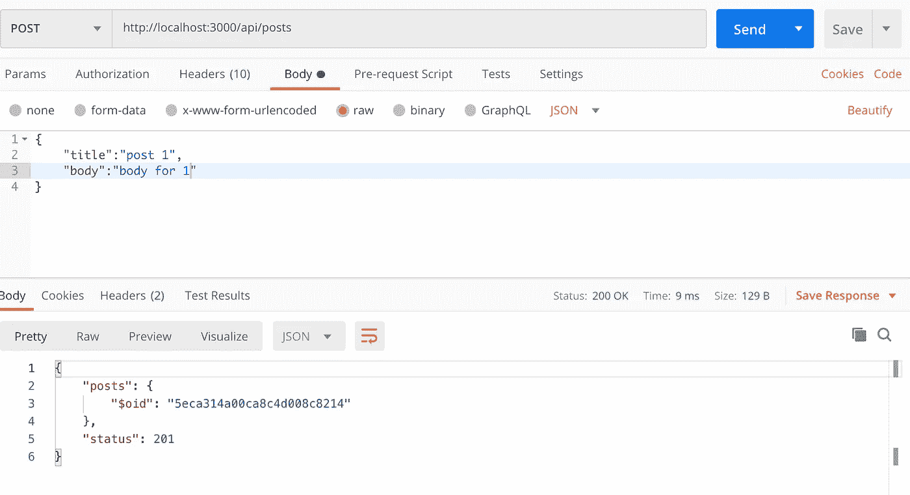
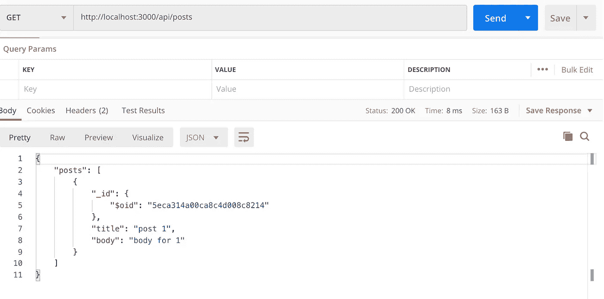
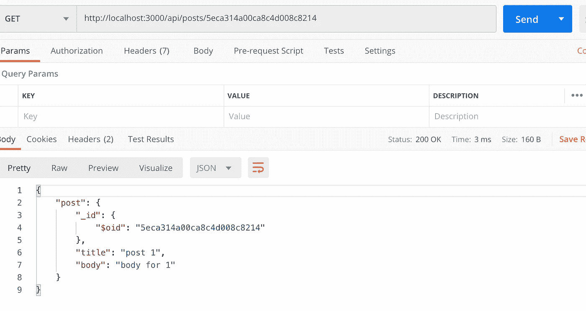
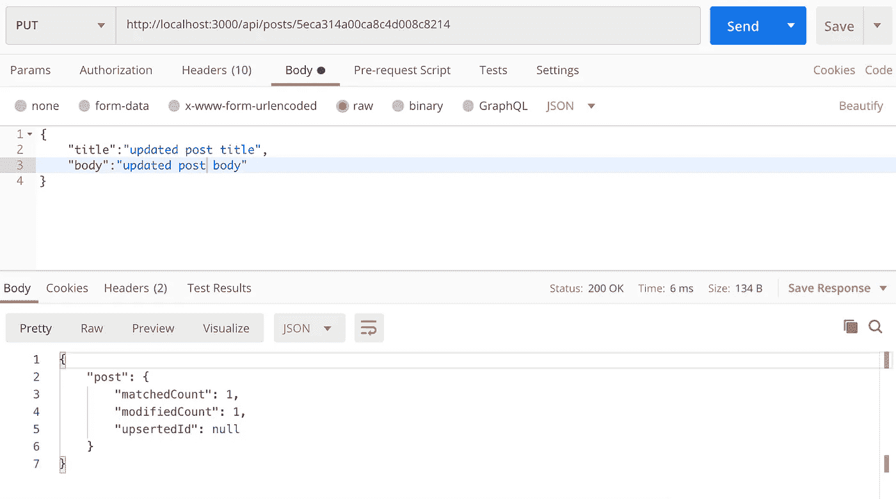
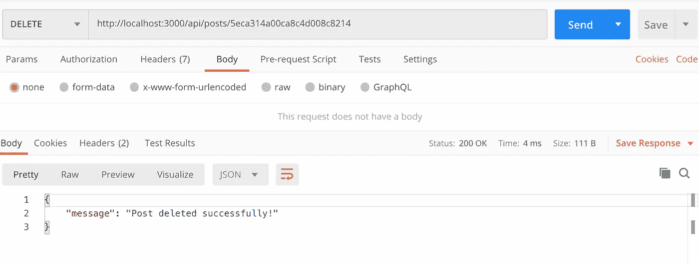

# 使用 MongoDB 的 Deno 中的 CRUD

> 原文：<https://javascript.plainenglish.io/crud-in-deno-with-mongodb-b2fcda8ff4d7?source=collection_archive---------5----------------------->


Deno 是 javascript 和 typescript 的一个安全的 T4 运行时。它是由 NodeJS 的幕后策划者 Ryan Dahl 创建的。我写了一篇关于 Deno 的介绍文章，你可以在这里找到。我强烈建议在这之前查看一下，了解一下 Deno 是如何工作的。

# 介绍

在本帖中，我们将创建基本的 CRUD 来开始使用 Deno。我们还将集成 mongo 来保存我们的数据。

由于 Deno 中不需要 package.json 或任何 npm 包(*它使用被引用为 URL 或文件路径的模块*)，我们将通过创建我们的 **server.ts** 直接开始:

我们从模块 URL 导入了**应用程序**，并用它启动了一个服务器。

运行时使用:`deno run --allow-net server.ts`

默认情况下，它在端口 3000 上启动服务器。您可以导航到 [http://localhost:3000](http://localhost:3000) 来运行您的服务器。

最好将应用程序路由与主服务器文件分开。让我们添加一个 **routes.ts** 文件，我们将在其中定义我们所有的应用程序路线-

现在我们可以将它导入我们的 **server.ts** :

重新启动服务器。导航到 localhost:3000/api/posts，你会看到`hello there` 打印的**。**

目前，每次文件更改时，您都必须重启服务器。如果我们也能在 Deno 中拥有类似 node mon(node . js 中用于重启服务器的包)的东西，那岂不是太棒了。事实证明，实际上有一个名为 denon 的包，它在 Deno 中的作用与 Node.js 中的 nodemon 完全相同。

因此，在继续之前，让我们通过运行以下命令来安装 denon:

```
deno install --allow-read --allow-run --allow-write -f --unstable [https://deno.land/x/denon/denon.ts](https://deno.land/x/denon/denon.ts)
```

现在你可以用`denon run --allow-net server.ts`运行你的服务器，denon 会在任何文件改变时重新启动服务器。

# **MongoDB**

创建一个文件 **db.ts** 并添加以下代码:

这将在本地建立我们的数据库，并创建一个名为 **deno_db** 的数据库。我们稍后将在控制器中导入这个文件。

这个 mongo 包目前有点不稳定，需要某些标志才能工作。因此，在终端中退出您的服务器，并使用以下命令重新启动它:

```
**denon run --allow-net --allow-plugin --unstable --allow-read --allow-write server.ts**
```

## 帖子界面

我们还将为我们的文档使用一个 Post 接口。

# **路线**

让我们定义我们将在 **routes.ts** 中使用的所有路线:

我们将在上面导入的一个单独的文件 **controller.ts** 中为我们的路由定义事件处理程序的逻辑。

# **控制器**

以下是**控制器的代码:**

让我们来分解控制器文件:

*   我们导入了之前创建的数据库实例和 post 接口
*   然后，我们在 **deno_db 中创建了一个集合**帖子**。**
*   之后，我们为不同的路由定义了处理程序。我们使用 mongoDB 特定的命令，如 **find()、findOne()、updateOne()** 等来操作数据库。

# 测试路线

在应用其他操作之前，我们先保存一些帖子。

请在 Postman 客户端中尝试一下:

## 邮政



Post endpoint

## 得到



Get all posts

## 获取(单个帖子)



Get single post

## 放



Update post

## **删除**



Delete a post


这就是全部。我们已经成功地创建了一个具有所有 CRUD 功能的 deno 服务器，并将数据保存在 mongo 中。当然，还有需要改进的地方，比如在路线中增加错误处理，但我会让你们去探索。

这里是代码的 github 链接:[https://github.com/ATakaSKY/denoMongo](https://github.com/ATakaSKY/denoMongo)

# 资源

[](https://deno.land/) [## deno——JavaScript 和 TypeScript 的安全运行时。

### Deno 是一个简单、现代和安全的 JavaScript 和 TypeScript 运行时，它使用 V8 并内置于 Rust 中。

德诺.兰德](https://deno.land/) [](https://github.com/denosaurs/denon) [## 天龙/天龙

### denon 是 nodemon 的 deno 替代品，提供了打包的功能和易于使用的体验。天龙不需要…

github.com](https://github.com/denosaurs/denon) [](https://github.com/manyuanrong/deno_mongo) [## 满园荣/德诺 _ 蒙戈

### deno_mongo 是一个为 deno 开发的 MongoDB 数据库驱动，基于 rust 的官方库包。因为…

github.com](https://github.com/manyuanrong/deno_mongo) 

[https://github.com/Caesar2011/denotrain](https://github.com/Caesar2011/denotrain/tree/master)

## **用简单英语写的便条**

你知道我们有四份出版物和一个 YouTube 频道吗？你可以在我们的主页[**plain English . io**](https://plainenglish.io/)找到所有这些信息——关注我们的出版物并 [**订阅我们的 YouTube 频道**](https://www.youtube.com/channel/UCtipWUghju290NWcn8jhyAw) **来表达你的爱吧！**