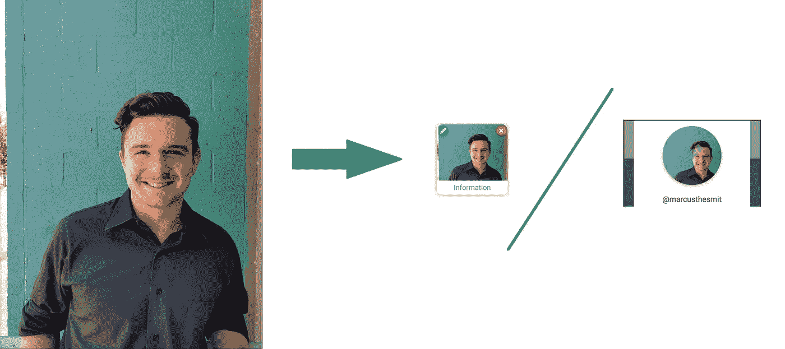

# Vue 的 CSS Flex-Fit 图像容器

> 原文：<https://javascript.plainenglish.io/css-flex-fit-image-container-for-vue-2ea3fdc8ffd7?source=collection_archive---------0----------------------->

## 使用一些 CSS 技巧 img 元素，您可以将任何图标或图像直观地放入您想要的框架中


Photo by [pine watt](https://unsplash.com/@pinewatt?utm_source=unsplash&utm_medium=referral&utm_content=creditCopyText) on [Unsplash](https://unsplash.com/s/photos/sideways-frame?utm_source=unsplash&utm_medium=referral&utm_content=creditCopyText)

TL；DR:
+
+。image-fit { height:100%；宽度:100%；对象适合:封面；}

## 简介:

这是一个短的。我在玩我的网络应用程序的用户图标，不太能决定得到任何图像尺寸(不需要裁剪)的最佳方式，以浏览我给它的任何帧。我希望它简单，干净，只是工作。我相信我最终找到了最干净的解决方案，但是如果你有不同的想法，请在评论中畅所欲言。希望这能节省我花在这上面的时间。

# +:src——注入你的形象

如果你正在使用 Vue，你可能想要使用一个元素来显示你扔给它的任何图像。有几种方法可以将图像放入页面，但是元素是最适合的，也是最直接的。你所需要做的就是通过定义:src 和一个属性、计算值或数据变量来动态设置图像源。大概是这样的:

```
<template>
...

...
</template>
<script>
...
props:{
   imageVal:{type:String, default:"/static/img/default.png"}
}
...
</script>
```

现在，只要你给它一个有效的网址，它就会呈现你的图像。简单到你可能已经知道了。但这是某人的脸或你试图展示的重要图像，你不希望它不成比例，也不希望它周围有任何难看的空白。这就是图像匹配类的用武之地。

# 适合图像的自定义 CSS

如果你去网上冲浪，你会发现所有类型的输入关于如何让图像大小合适。在我所有的寻找中，我从未找到这个解决方法。这一招的关键？使用“对象匹配”来尝试覆盖图像，然后限制高度和宽度，使其尽可能接近框架大小，而不会下降。这也保留了纵横比:

```
.image-fit{
  height: 100%;
  width: 100%;
  object-fit: cover;
}
```

如果 CSS 在你的 img 元素上，就像我上面那样，它将确保你的高分辨率图像适合你给它的任何盒子。当然，这将裁剪掉图像的一部分，但是如果你把一个正方形放到一个圆里，这显然是必要的。这个解决方案可以在 Chrome、Safari 和 Firefox 中正确渲染。这可能看起来不直观，但是浏览器理解这种约束组合正是凡人(我)想要的。

# 结果呢



I give you a bad aspect-ratio photo, you can still work with it

# 这是所有的乡亲

我通常尝试在更复杂的概念上写更多的实质性文章，但是我意识到这个简单的概念仍然是一个症结。随时问我其他类似的解决方案，我可以看看把这些东西放在一起。如果这看起来像是我作品的低质量版本…那是因为它可能是。我想尽快把它写出来，但是我想确定一个截止日期。一如既往地感谢您的兴趣、投入和欣赏。

继续给世界编码；

-马库斯