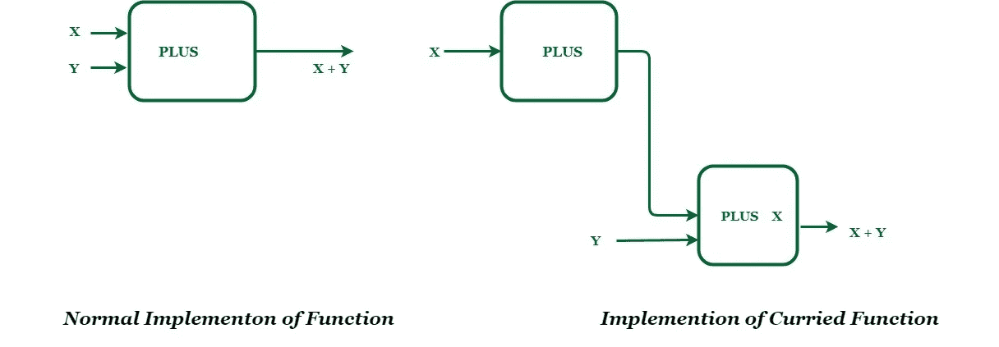

# JavaScript 中的 Currying 指南

> 原文：<https://javascript.plainenglish.io/currying-in-javascript-276308ed8878?source=collection_archive---------6----------------------->

大家好，我又带来了另一篇文章，这次是关于 JavaScript 中的一个概念，叫做 currying。

在我开始这个概念之前，让我们先来看看 currying 的起源。

“溜须拍马”这个名字是由克里斯多佛·斯特雷奇在 1967 年创造的。Currying 背后有很多数学和计算机科学理论。这个概念是以数学家哈斯克尔·库里的名字命名的。

Currying 是函数式编程中使用的一个概念。函数式编程是一种[编程范式](https://en.wikipedia.org/wiki/Programming_paradigm)。建立计算机程序结构和元素的一种方式，将计算视为数学函数的计算，避免改变状态和可变数据。

现在回到主题:什么是 currying？



Currying 是函数式编程中的一个过程，在这个过程中，我们可以将一个具有多个参数的函数转换成一系列嵌套函数。它返回一个新函数，该函数需要内联的下一个参数。

> 简单来说，currying 就是将多个参数的函数化简为一个参数的函数。

现在是时候看看上面的图片用代码描述了什么:-

```
const **sum** = **x** => **y** => **x** + **y**;**sum** (2)(1); // returns the number 3**sum** (2); // returns a function y => 2 + y
```

> 现在给仍然习惯 ES5 语法的人举个例子。

```
var sum = function sum(x) {
  return function (y) {
    return x + y;
  };
};
```

请注意，`**sum** (2)(1);`产生的结果与我们将它定义为`const **sum** = (**x**,**y**) => **x** + **y**;`时得到的结果相同，我们称之为
`**sum** (2, 1);`。

由于 JavaScript 具有一流的函数，上面的代码将会工作得非常好。

# 一流的功能

当一种编程语言中的函数被像对待任何其他变量一样对待时，该语言被称为具有一级函数。例如，函数可以作为参数传递给其他函数，可以由另一个函数返回，也可以作为值赋给变量。

# 结论

你需要一段时间来理解函数式编程和 currying。但是努力是值得的。

为了了解更多，我强烈推荐免费书籍[弗里斯比教授的《函数式编程基本足够指南》](https://drboolean.gitbooks.io/mostly-adequate-guide/content/)或其作者布莱恩·朗斯多夫的任何【T2 演讲】。Kyle Simpson，《你不知道的 T4》JS 系列的作者。

*更多内容请看*[***plain English . io***](http://plainenglish.io/)