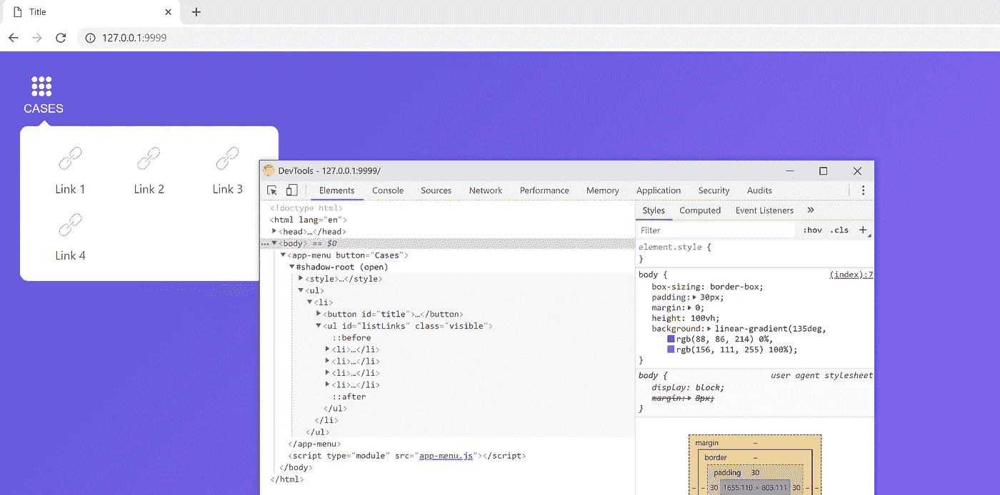
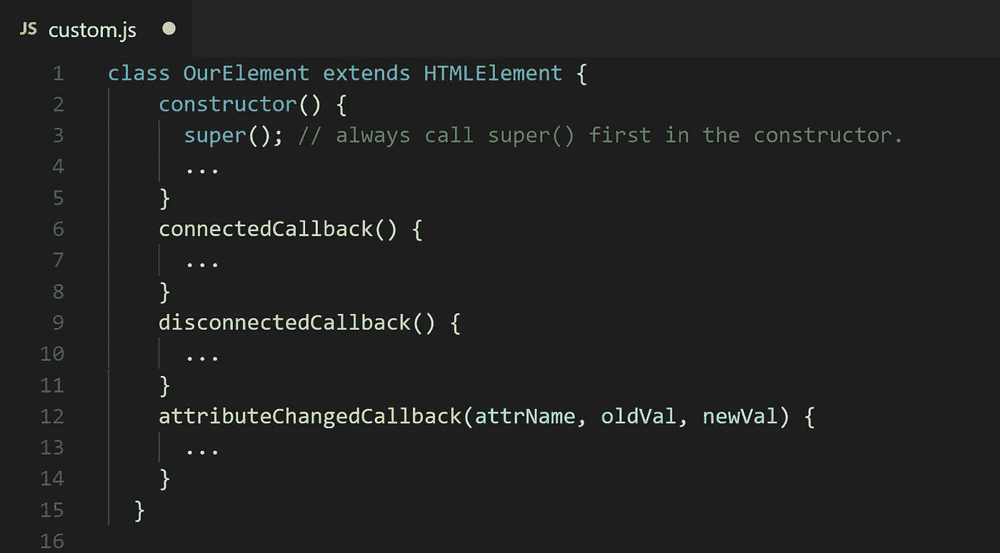
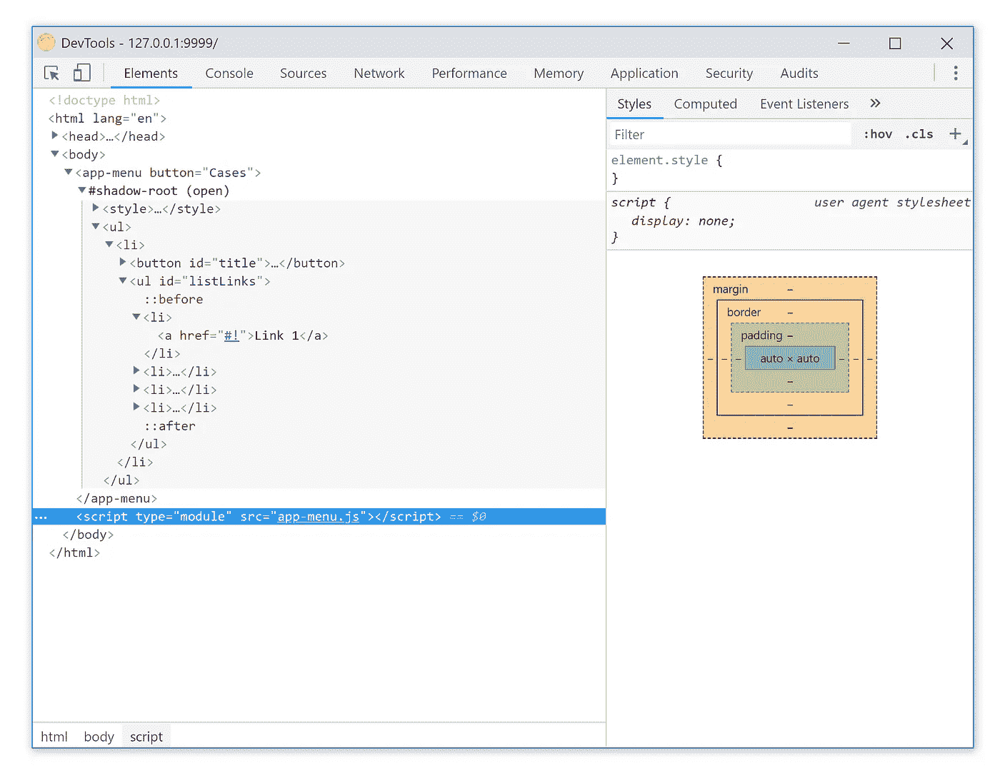

# 定制元素——它们比你想象的更容易创建

> 原文：<https://javascript.plainenglish.io/custom-elements-its-easier-than-you-think-deb20c5474c8?source=collection_archive---------0----------------------->



有了[定制元素](https://html.spec.whatwg.org/multipage/scripting.html#custom-elements)，web 开发者可以**创建新的 HTML 标签**，增强现有的 HTML 标签，或者扩展其他开发者创作的组件。

为了定义一个新的 HTML 元素，我们需要🔥JavaScript 的力量！

# 定义元素的 JavaScript API

使用扩展了`**HTMLElement**`的 ES2015 `**class**` 来定义自定义元素的功能。

扩展`**HTMLElement**` 确保定制元素继承整个 **DOM API** 并意味着你添加到类中的任何**属性/方法**成为元素的 DOM 接口的一部分。

本质上，使用该类为您的标签创建一个**公共 JavaScript API** 。

```
**class OurElement extends HTMLElement {...}**
```

# 定义新元素

`**customElements**` 全局变量用于定义一个自定义元素，并向浏览器教授一个新标签。用您想要创建的标签名和一个 JavaScript `**class**` 调用`**customElements.define()**`来扩展基础`**HTMLElement**`

```
window.customElements.define('our-element', **OurElement**);
```

> 重要的是要记住，使用定制元素与使用`<div>`或任何其他元素没有什么不同。实例可以在页面上声明，在 JavaScript 中动态创建，可以附加事件监听器，等等。

# 生命周期

自定义元素可以定义特殊的生命周期挂钩，用于在其存在的有趣时期运行代码。这些被称为**自定义元素反应**。



✔️ **构造器—** 元素的一个实例被创建或者[被升级](https://developers.google.com/web/fundamentals/web-components/customelements#upgrades)

✔️**connectedcallback**——每次元素插入 DOM 时调用

✔️**disconnected callback**—每次从 DOM 中移除元素时调用。对于运行清理代码很有用。

✔️**attributechangedcallback**—当一个[观察属性](https://developers.google.com/web/fundamentals/web-components/customelements#attrchanges)被添加、删除、更新或替换时调用。当解析器创建一个元素或者[升级](https://developers.google.com/web/fundamentals/web-components/customelements#upgrades)时，也需要初始值。

✔️ **采用回调—** 自定义元素已经被移入一个新的`document`

# 入门指南👍

我们将在一个单独的 JavaScript 文件中创建所有内容，该文件将包含关于自定义元素的所有内容:样式规则、标记、ES6 类定义，最后注册自定义元素。

在我们想要使用自定义元素的 HTML 文件中，**我们所要做的就是包含那个 JavaScript 文件，然后我们就可以开始在我们的页面上使用新的标签了**


下面是我们的自定义元素的类的定义，它应该扩展 **HTMLElement** :

**这里有一些需要注意的事情:**

✔️类构造函数是一个附加影子根并定义其内部 html 的好地方。我们调用实现它的函数(***)render(…)***)。

✔️当一个自定义元素的类有一个构造函数时，你应该总是在其中调用 **super()** 。

✔️阴影根的模式可以是开放的，也可以是封闭的。您可能只会使用 open，因为否则您将无法为它设置任何 innerHTML。

**使用影子 DOM，下面是你的浏览器控制台中的标记外观:**



# 使用🔥

使用我们的定制元素非常简单，只需将脚本文件添加到页面中，然后像使用任何其他常规 HTML 元素一样使用我们的元素。

> 但是请注意，自定义元素应该始终有一个结束标记:


> 请记住，我们的元素还没有做好生产准备。现在，这个元素只能在一些现代浏览器中使用。
> 
> 对于 ES6 类或字符串文字等不被全面支持的 JavaScript 特性，您将希望通过 Babel 等 transpiler 运行代码，并且您将希望对自定义元素和阴影 DOM 使用 polyfills。
> 
> 我们将在另一篇文章中介绍如何使用 Web 组件 polyfills。

M 矿石环节:

[](https://www.webcomponents.org/introduction) [## 简介-webcomponents.org

### Web 组件是一组 web 平台 API，允许您创建新的自定义的、可重用的、封装的 HTML 标记，以…

www.webcomponents.org](https://www.webcomponents.org/introduction) [](https://alligator.io/web-components/your-first-custom-element/) [## 您的第一个自定义元素

### 那么您对学习 Web 组件和创建自己的定制 HTML 标签感兴趣吗？在本帖中，我们将探索…

鳄鱼. io](https://alligator.io/web-components/your-first-custom-element/) [](https://developers.google.com/web/fundamentals/web-components/customelements) [## 定制元素 v1:可重用的 Web 组件| Web 基础| Google 开发者

### 自定义元素允许 web 开发人员定义新的 HTML 标记，扩展现有的标记，并创建可重用的 web 组件。

developers.google.com](https://developers.google.com/web/fundamentals/web-components/customelements) [](https://habr.com/post/210058/) [## 网页组件- будущее网页

### спустяккоевремясталоясно，что основная идея原型вошлавпротиворечиесмиииом。Создатели браузеров ответили…

habr.com](https://habr.com/post/210058/) [](https://learn.javascript.ru/webcomponents) [## Веб-компоненты: взгляд в будущее

### веб-компоненты-" будущего":совокупность，которыепозволяютописыватьновыетипыdom-элементов…

learn.javascript.ru](https://learn.javascript.ru/webcomponents) [](https://www.polymer-project.org/3.0/toolbox/) [## 聚合物应用工具箱-聚合物项目

### 编辑描述

www.polymer-project.org](https://www.polymer-project.org/3.0/toolbox/)