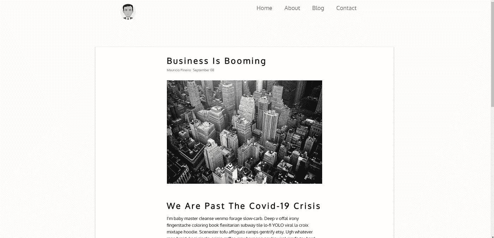
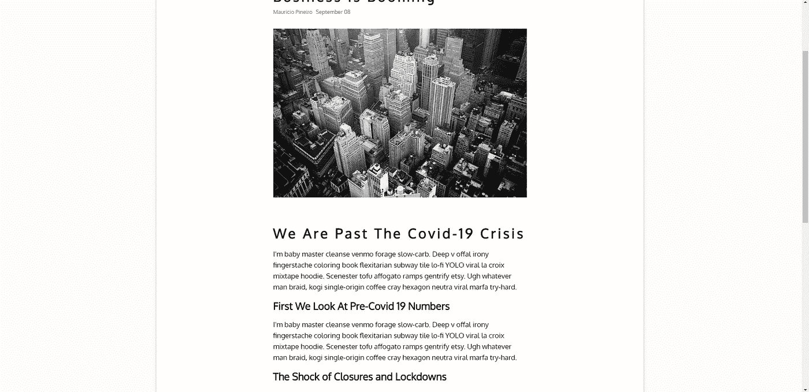
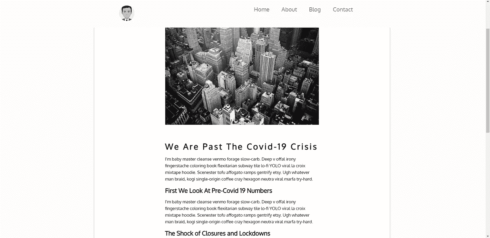

# 自定义滚动方向反应挂钩

> 原文：<https://javascript.plainenglish.io/custom-scrolling-direction-react-hook-f55558206ab6?source=collection_archive---------8----------------------->

## 如何让你网站上的导航条消失在滚动条上

我希望我的投资组合网站的导航栏在向下滚动时消失，在向上滚动时重新出现。



Before Scrolling, navigation bar displayed



Once Scrolled down, navigation bar disappears



Upon scrolling up, navigation reappears

为了实现上面的功能，我使用了 [React Hooks](https://reactjs.org/docs/hooks-intro.html) 来编写一个定制的钩子来决定用户的滚动方向。

导航栏组件使用从挂钩返回的方向值将适当的 Css 样式应用于自身。

如果用户在页面的顶部，导航条显示在顶部，没有应用特殊的 Css 样式。

# 我的 useScrollDirection 挂钩背后的逻辑

为了确定用户的滚动量，我使用了`window.scrollY`。browser window 对象的 scrollY 属性返回文档垂直滚动的像素数。

最初`window.scrollY`是 0，用户向下滚动越多，它就变得越大。

在自定义挂钩中，我有两种状态:

1.  滚动方向，最初为空
2.  从页面顶部开始的前一次滚动量，最初为 0

```
const [scrollDirection, setScrollDirection] = useState(null)
const [prevOffset, setPrevOffset] = useState(0)
```

我还为窗口滚动事件订阅了一个事件监听器。我在效果挂钩的帮助下设置了订阅。

```
useEffect(() => {
    window.addEventListener("scroll", toggleScrollDirection) *return* () => {
        window.removeEventListener("scroll", toggleScrollDirection)
    }
})
```

用户每滚动一次，`toggleScrollDirection`就会被调用。

在函数内部，用户滚动的量由一个变量捕获

```
let scrollY = window.scrollY;
```

然后每次滚动发生时，检查以下条件，以便设置适当的滚动方向状态值。

```
*if* (scrollY === 0) {
    setScrollDirection(null)
}*if* (scrollY > prevOffset){
    setScrollDirection("down")
} *else* *if* (scrollY < prevOffset) {
    setScrollDirection("up")
}setPrevOffset(scrollY);
```

如果用户在页面的顶部，scrollY 将为零，因此我们将滚动方向设置为 null。

如果用户向下滚动，那么 scrollY 值将大于存储在`prevOffset`状态中的最后一个 scrollY 值。

当用户向上滚动时，情况正好相反。在这两种情况下，`scrollDirection`状态将被适当地设置。

最后，`prevOffset`将被设置为这个最后的 scrollY 值，下次用户滚动时将被引用。

整个钩子代码是

```
const useScrollDirection = () => {
    const [scrollDirection, setScrollDirection] = useState(null)
    const [prevOffset, setPrevOffset] = useState(0) const toggleScrollDirection = () => {
       let scrollY = window.scrollY
       *if* (scrollY === 0) {
           setScrollDirection(null)
       }
       *if* (scrollY > prevOffset) {
           setScrollDirection("down")
       } *else* *if* (scrollY < prevOffset) {
           setScrollDirection("up")
       }
       setPrevOffset(scrollY)
    }
    useEffect(() => {
        window.addEventListener("scroll", toggleScrollDirection)
        *return* () => {
            window.removeEventListener("scroll", toggleScrollDirection)
        }
    }) *return* scrollDirection
}
```

# 导航栏组件如何使用这个钩子来切换导航栏的外观

在 Navbar 组件中，我们捕获了从 useScrollDirection 钩子返回的滚动方向值。

```
const scrollDirection = useScrollDirection()
```

然后根据`scrollDirection`，我们将应用适当的 css 样式到导航栏。

导航条的样式可以用许多不同的方法来实现，所以我在本文中不再讨论。

这是我在 Medium 上发表的第一篇文章。原谅我写得不好。我希望随着我写得越来越多而提高！希望你喜欢，觉得有用！

## 简单英语的 JavaScript

喜欢这篇文章吗？如果是这样，通过 [**订阅解码获得更多类似内容，我们的 YouTube 频道**](https://www.youtube.com/channel/UCtipWUghju290NWcn8jhyAw) **！**