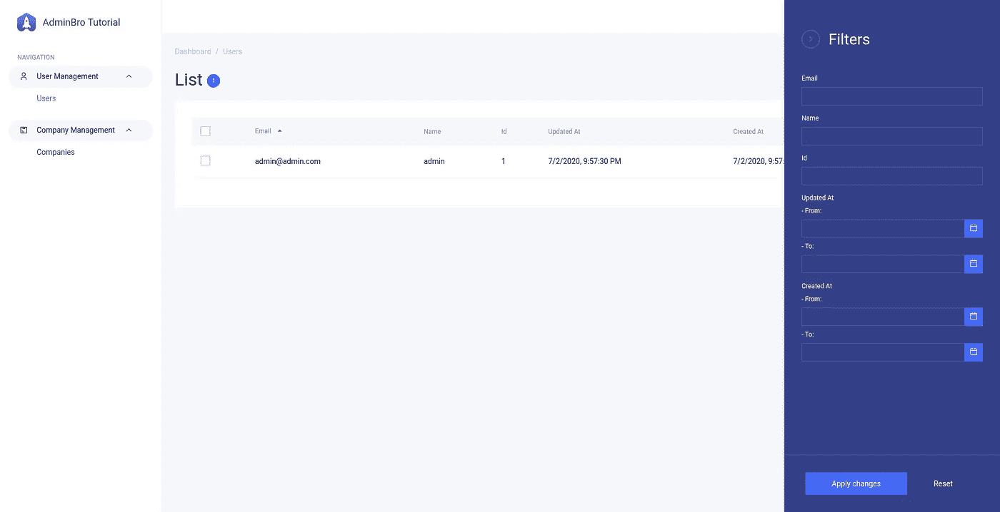
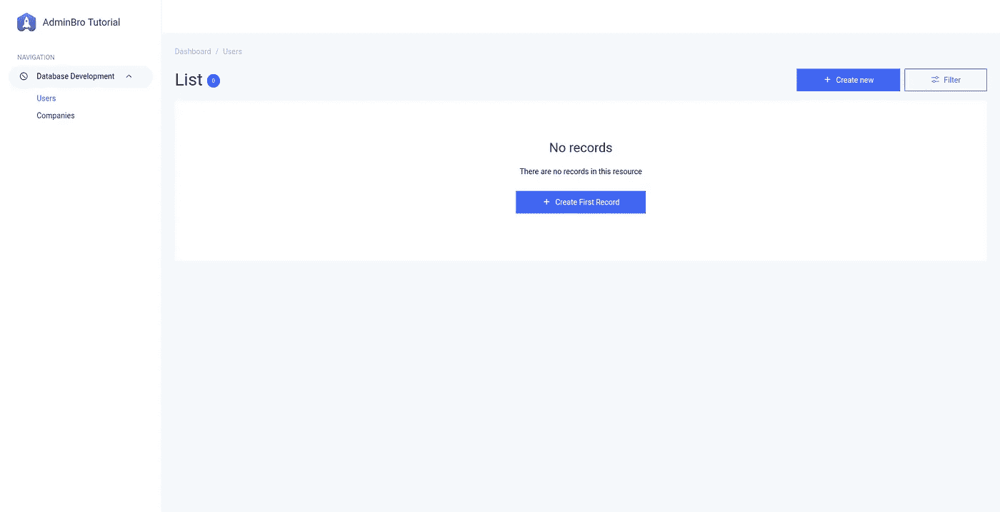
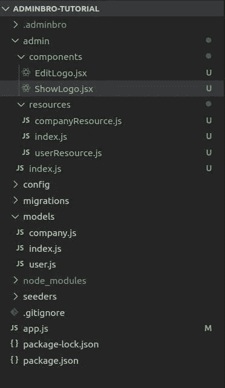
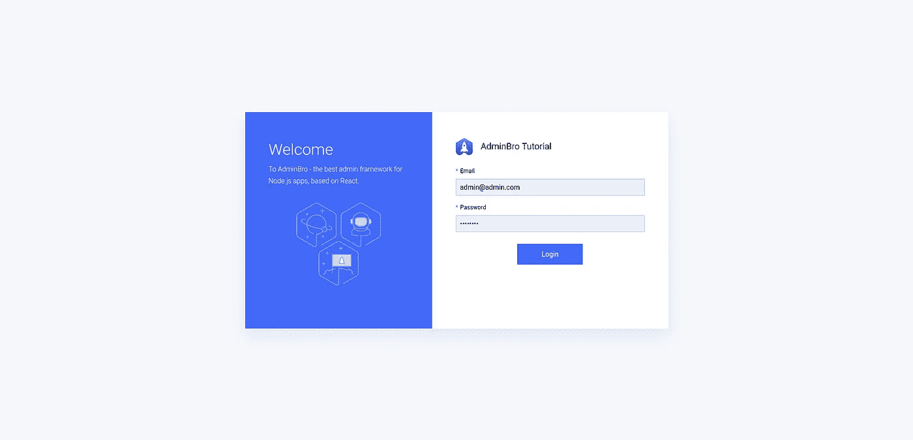

# 用 Node.js 和 React 构建一个管理面板(第 2 部分)

> 原文：<https://javascript.plainenglish.io/customize-adminbro-node-and-react-based-admin-panel-3c0a3e041966?source=collection_archive---------2----------------------->

## 探索 AdminBro 自定义选项



*本教程的第一部分可以在* [*这里找到*](https://medium.com/javascript-in-plain-english/getting-started-with-adminbro-node-admin-panel-with-react-8552e281b55d) *，代码可以在* [*这里找到*](https://github.com/AKNiazi/adminbro-tutorial/tree/part-one) *。*

这是使用 Express、Sequelize 和 AdminBro 从头构建管理面板教程的第二部分。在第一部分[中，我们启动了一个 Express 应用程序，并添加了 Sequelize ORM 来操作我们的用户和公司数据。最后，我们添加了 AdminBro initial dashboard，并在 localhost 上呈现它。第一部分的代码可在](https://medium.com/javascript-in-plain-english/getting-started-with-adminbro-node-admin-panel-with-react-8552e281b55d) [Github](https://github.com/AKNiazi/adminbro-tutorial/tree/part-one) 上获得。在这一部分，我们将自定义我们的管理面板。我们计划添加以下定制。

1.  为用户和公司模型添加 CRUD 操作
2.  检查 AdminBro 中可用的不同 UI 定制选项。
3.  添加管理面板登录页面，并做基本认证。

让我们直接进入代码。为了让 AdminBro 与 Sequelize 一起工作，我们需要向 AdminBro 注册[Sequelize adapter](https://github.com/SoftwareBrothers/admin-bro-sequelizejs)。为此，在我们的 ***app.js*** *中添加以下代码行:*

```
const AdminBroSequelize = require('admin-bro-sequelizejs');
AdminBro.registerAdapter(AdminBroSequelize);
```

让我们创建一个名为 admin 的新目录，并在该目录中创建 ***index.js*** 文件，并将 AdminBro 初始化代码从 ***app.js*** 文件移动到***admin/index . js***文件。现在， ***app.js*** 文件应该是这样的

```
const express = require("express");
const AdminBro = require('admin-bro')
const AdminBroExpress = require('admin-bro-expressjs');
const AdminBroSequelize = require('admin-bro-sequelizejs');
AdminBro.registerAdapter(AdminBroSequelize);
const adminBro = require('./admin');
const PORT = 3000;
const app = express();
const router = AdminBroExpress.buildRouter(adminBro)
app.use(adminBro.options.rootPath, router);
app.listen(PORT, () => {
  console.log(`Server is listening on port: ${PORT}`);
});
```

还有***admin/index . js****文件应该是这样的:*

```
*const AdminBro = require('admin-bro');
const adminBro = new AdminBro({
  rootPath: '/',
});
module.exports = adminBro;*
```

*由于我们已经向 AdminBro 注册了 Sequelize adapter，并将 AdminBro 定制代码移到了一个单独的目录中，所以我们已经准备好进行定制了。AdminBro 提供以下 4 种类型的定制。*

1.  *[应用级别](https://adminbro.com/AdminBroOptions.html)。*
2.  *[资源等级](https://adminbro.com/ResourceOptions.html)。*
3.  *[属性等级](https://adminbro.com/PropertyOptions.html)。*
4.  *[动作等级](https://adminbro.com/Action.html)*

*其中一个应用程序级别的定制选项是根路径，这有助于在 Express 中注册我们管理面板的根路径。我们可以添加的另一个非常重要的选项是一组资源，在我们的例子中是用户和公司。让我们在我们的***admin/index . js****:*中添加这个选项*

```
*const AdminBro = require('admin-bro');
const { User, Company } = require('../models');
const adminBro = new AdminBro({
   rootPath: '/admin',
   loginPath: '/admin/login',
   resources: [User, Company],
   branding: {
     companyName: 'AdminBro Tutorial',
     softwareBrothers: false,
   }
});
module.exports = adminBro;*
```

*现在启动服务器并转到我们的 localhost/admin。我们可以看到，通过只提供资源数组，AdminBro 不仅为用户和公司模型添加了 CRUD 操作，还添加了过滤和导航选项。*

*同样，我们可以更改应用程序的品牌名称，我们已将其更改为“AdminBro Tutorial”。我们应用程序的当前形式是*

**

*太好了！让我们做一些资源级别的定制。正如我们在上面的截图中看到的，在左侧栏中有一个可用资源列表。在本教程中，只有 2 个资源，但在现实世界的应用程序中可能有几十个资源，最好将这些资源分组，以便管理员可以轻松找到它们。*

*幸运的是，AdminBro 提供了对这些资源进行分组的选项。*

```
*const AdminBro = require('admin-bro');
const { User, Company } = require('../models');
const sidebarGroups = {
  user: {
    name: 'User Management',
    icon: 'User',
  },
  company: {
    name: 'Company Management',
    icon: 'Product'
  }
};
const adminBro = new AdminBro({
  rootPath: '/admin',
  loginPath: '/admin/login',
  resources: [{
    resource: User,
    options: {
      parent: sidebarGroups.user,
    }
  }, {
    resource: Company,
    options: {
      parent: sidebarGroups.company,
    }
  }
],
  branding: {
   companyName: 'AdminBro Tutorial',
   softwareBrothers: false,
  }
});
module.exports = adminBro;*
```

*在上面的代码中，resources 数组现在包含带有每个资源的定制选项的对象。我们已经将每个资源与侧边栏中的一个组相关联。侧边栏中的图标取自已经被 AdminBro 支持的 Carbon Design System Icon [库](https://www.carbondesignsystem.com/guidelines/icons/library/)。让我们在管理目录中添加子目录和文件。*

**

*现在移动到 **userResource.js** 文件并粘贴以下代码。*

```
*module.exports = {
  properties: {
    encryptedPassword: {
      isVisible: false,
    },
    password: {
     type: 'password',      
     isVisible: {
        show: false,
        edit: true,
        list: false,
        filter: false
      }
    }
  }
};*
```

*正如您所看到的，我们使用了另一个资源级别选项，properties，它为模型的属性设置属性级别选项。因为我们不希望在任何地方显示加密的密码，所以我们将它的 visiblility 设置为 false。同样，我们希望密码只在编辑屏幕中呈现。虽然我们现在不打算为公司添加任何定制选项，但为了完成，我们将编辑***company resource . js***和***admin/resources/index . js***文件。*

***T21【company resource . js:***

```
*module.exports = {};*
```

****admin/resources/index . js:****

```
*module.exports = {
  UserResource: require('./userResource'),
  CompanyResource: require('./companyResource'),
};*
```

*现在我们将把我们的两个资源都导入到我们的***admin/index . js***文件中:*

```
*const { UserResource, CompanyResource } = require('./resources');
const adminBro = new AdminBro({
  rootPath: '/admin',
  loginPath: '/admin/login'
  resources: [{
    resource: User,
    options: {
      ...UserResource,
      parent: sidebarGroups.user,
    }
   }, {
    resource: Company,
    options: {
      ...CompanyResource,
      parent: sidebarGroups.company,
    }
  }],
  branding: {
    companyName: 'AdminBro Tutorial',
    softwareBrothers: false,
  }
});*
```

*现在转到浏览器，您会注意到加密的密码字段不再可见，类似地，密码仅在编辑表单中可见，其类型为密码。*

*到目前为止，我们的管理面板是不安全的，任何人都可以访问我们的资源。因此，我们应该添加某种身份验证，以便只有拥有 admin 有效凭据的用户才能访问我们的管理面板中的资源。幸运的是，AdminBro 提供了内置的登录屏幕，并允许我们添加自己的身份验证代码。为了启用身份验证，我们需要对代码库进行一些更改。让我们在我们的***package . JSON****文件中添加 [express-session](https://github.com/expressjs/session) 、redis 和 bcrypt npm 模块。AdminBro 使用 express-session 来维护登录的用户会话。尽管 express-session 默认情况下使用 MemoryStore 来存储这些会话，但不建议在生产环境中使用。有许多其他选项可用于存储这些会话，但对于本教程，我们将把它存储在 redis 中。我们将使用 bcrypt 来加密用户密码。**

```
**npm install express-session redis bcrypt connect-redis --save**
```

**现在，我们需要添加一个管理员用户。让我们创建一个种子文件，并将以下代码粘贴到其中。**

```
**yarn sequelize seed:generate --name add-admin-user**
```

**上面的命令将创建一个新的 seeders 目录和一个在其中写入种子代码的文件。打开这个新创建的文件，并将下面的代码粘贴到其中。**

```
**'use strict';
const bcrypt = require('bcrypt');
module.exports = {
  up: (queryInterface, Sequelize) => {
    const testUsers = [];
    testUsers.push({
      name: 'admin',
      email: 'admin@admin.com',
      encryptedPassword: bcrypt.hashSync('password', 10),
      createdAt: new Date(),
      updatedAt: new Date(),
    }); return queryInterface.bulkInsert('Users', testUsers, {});
  }, down: (queryInterface, Sequelize) => {
    return queryInterface.bulkDelete('Users', null, {});
  }
};**
```

**上面的代码在以下命令的帮助下创建了一个虚拟管理员用户**

```
**yarn sequelize db:seed:all**
```

**现在让我们在 admin 目录下创建一个 **util.js** 文件，并将下面的代码粘贴到其中。**

```
**const bcrypt = require('bcrypt');
const { User } = require('../models');
const redis = require('redis');
const session = require('express-session');let RedisStore = require('connect-redis')(session);
let redisClient = redis.createClient();
const sessionStorage = {
  store: new RedisStore({
    client: redisClient
  }),
  secret: 'this is secret',
  resave: false,
};async function authenticate(email, password) {
  const userRecord = await User.findOne({
    where: { email }
  });
  if (userRecord) {
    const matched = await bcrypt.compare(password, userRecord.encryptedPassword);
    if (matched) {
      return userRecord;
    }
  }
  return false;
}
module.exports = {
authenticate,
sessionStorage,
};**
```

**在上面，我们已经编写了一个简单的身份验证函数，我们将在 ***app.js*** 中使用它。该函数接受来自登录表单的电子邮件地址和密码，对其进行加密，并检查加密的密码是否与我们在种子脚本的帮助下创建的管理员存储的加密密码相匹配。类似地，我们在 express session 中添加了 redis 存储作为会话存储。现在我们需要在 out ***app.js*** 中做小改动。**

```
**const express = require("express");
const AdminBro = require('admin-bro')
const AdminBroExpress = require('admin-bro-expressjs');
const AdminBroSequelize = require('admin-bro-sequelizejs');AdminBro.registerAdapter(AdminBroSequelize);
const adminBro = require('./admin');
const { authenticate, sessionStorage } = require('./admin/util');
const PORT = 3000;
const app = express();
const router = AdminBroExpress.buildAuthenticatedRouter(adminBro, {
  cookiePassword: 'admin-panel-tutorial',
  authenticate,
}, null, sessionStorage);
app.use(adminBro.options.rootPath, router);
app.use(adminBro.options.loginPath, router);
app.listen(PORT, () => {
  console.log(`Server is listening on port: ${PORT}`);
});**
```

**如您所见，我们已经用 buildAuthenticatedRouter 替换了 adminbro buildRouter 函数，顾名思义，它为我们的管理面板呈现登录屏幕。您可能已经注意到，我们将 authenticate 函数和会话存储对象作为参数传递给 buildAuthenticatedRouter，以验证和存储登录用户的会话。**

**现在转到您的 localhost:3000/admin，您会注意到浏览器已经将您重定向到 localhost:3000/admin/login，并呈现了 AdminBro 的内置登录屏幕。**

****

**现在登录电子邮件(admin@admin.com)和密码(密码)，你会看到在做了基本的认证后，管理员可以登录，并看到用户和公司列表**

**在这一部分，我们改变了我们的教程管理面板的品牌名称，我们不仅增加了用户和公司的 CRUD 操作，还增加了一些资源和属性级别的定制。最后，我们为我们的管理面板添加了登录屏幕，并为我们的管理员编写了基本认证代码。在下一部分中，我们将编写定制的 React 组件来覆盖编辑表单中的一些字段，并添加完整的定制页面。本教程的代码可从[这里](https://github.com/AKNiazi/adminbro-tutorial/tree/part-two)获得。**

**如果你喜欢这个教程，别忘了给我们提供反馈。**

**[*Devsaxe*](https://devsaxe.com/) *是一家位于巴基斯坦拉合尔的咨询公司。我们为网络和移动应用、自动化测试、物联网解决方案和企业软件开发提供咨询。***