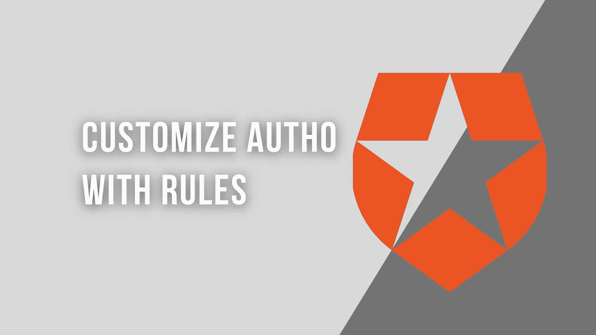
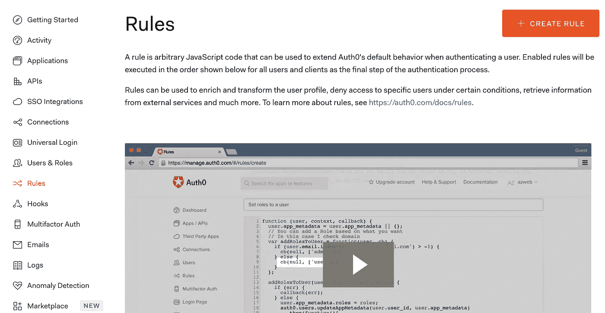
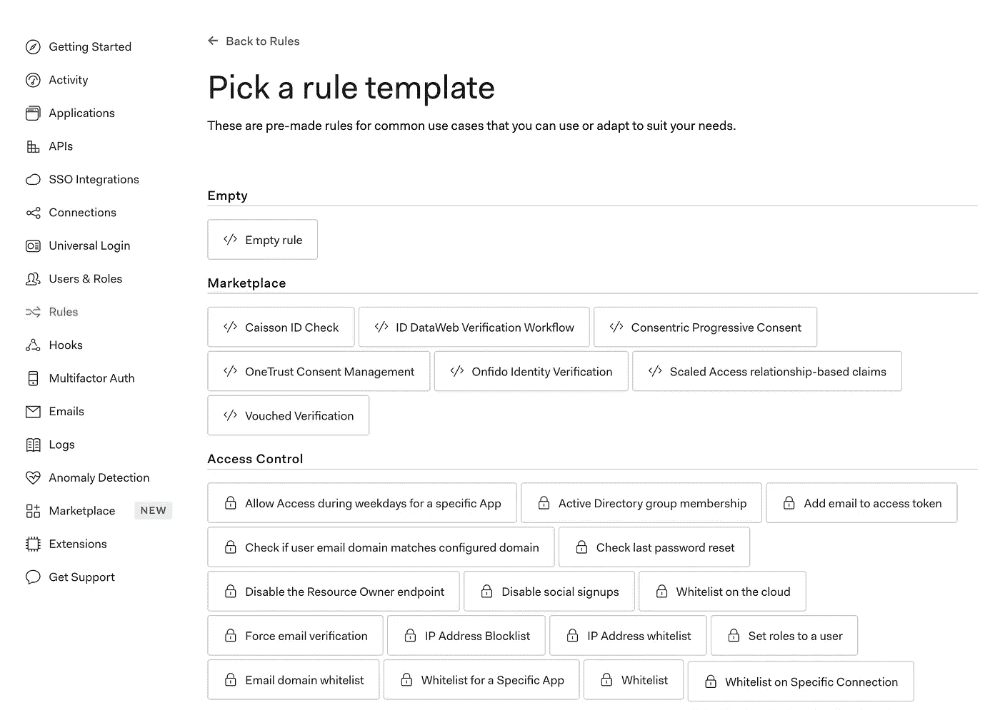
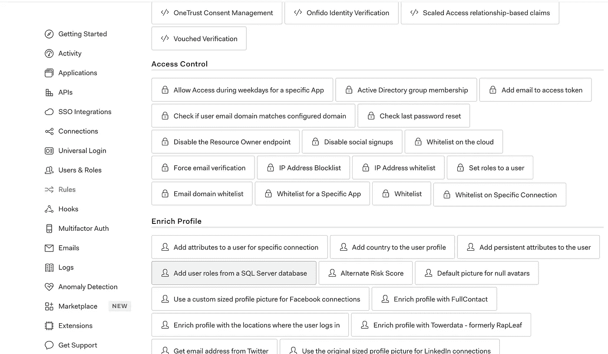
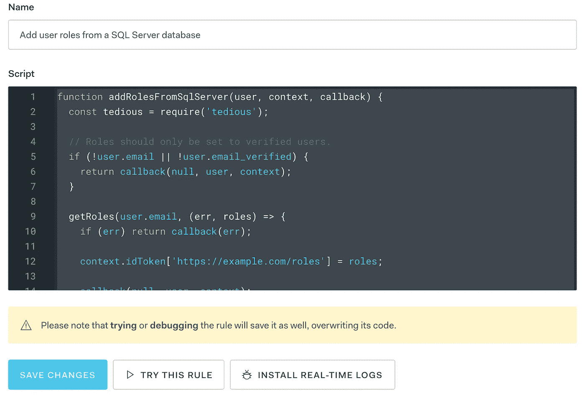

# 使用规则自定义 Auth0

> 原文：<https://javascript.plainenglish.io/customize-auth0-with-rules-cbc1f063d12e?source=collection_archive---------13----------------------->

## 如何使用定制的 JavaScript 规则让 Auth0 为您的应用程序工作

Made by the author in [Canva](https://www.canva.com/)

您对在您的应用程序中使用 Auth0 感兴趣吗？担心它不够灵活，无法满足您的所有需求或要求？这是一个合理的担忧。现成的解决方案通常不够灵活，无法满足每个人的需求。幸运的是，Auth0 提供了一种用 JavaScript 规则添加定制行为的简单方法。

Auth0 的站点为规则提供了以下定义:*“规则是任意的 JavaScript 代码，可用于在对用户进行身份验证时扩展 Auth0 的默认行为。作为身份验证过程的最后一步，将按照下面显示的顺序为所有用户和客户端执行启用的规则。"*

这是一个强大的概念，可以让 Auth0 满足您的需求。我使用 Auth0 来处理身份管理，同时为我工作的初创公司构建技术平台。到目前为止，它已经足够灵活，可以满足出现的每一个需求，并且它非常适合我们的全栈 JavaScript 开发。

在这篇文章中，我将通过一些例子来说明如何使用这些规则，并展示一些可能性。

如果您对 Auth0 的更多介绍或者将 Auth0 集成到 React 应用程序或 NodeJS API 的指南感兴趣，请查看下面链接的我以前的文章。

 [## 使用 Auth0 保护 React 应用程序

### 使用 Auth0 引导新 React 应用程序的指南

medium.com](https://medium.com/javascript-in-plain-english/securing-react-applications-with-auth0-333180f8ea06)  [## 使用 Auth0 保护 Node.js API

### 使用 Auth0 设置 Node.js API 的指南

medium.com](https://medium.com/javascript-in-plain-english/securing-a-node-js-api-with-auth0-7785a8f2c8e3) 

# 这么多规则…

Auth0 提供了一个很长的规则模板列表，您可以使用它作为创建自己的定制规则的起点。列表相当大，其中一些选项包括:

*   从您自己的数据库添加用户角色
*   基于您自己的自定义逻辑动态禁用注册
*   为空头像添加默认图片
*   用来自数据库或另一个提供商的信息丰富用户简档。
*   新注册后向 CRM 添加条目。例如 Hubspot 或 Salesforce。
*   在用户登录或注册时触发 Zapier 中的 Zap。
*   检查用户上次密码重置的日期。
*   阻止或列入白名单的 IP 地址。
*   还有更多！

自己看看他们的模板列表，看看他们提供了多少选项。

# 是时候制定我们自己的规则了…

在 Auth0 admin 控制面板中，我们将需要 rules 部分，以便我们可以开始创建自己的规则。

Screenshot by the author

在这里，我们需要单击右上角的 create rule 按钮。这将把我们带到可以从提供的列表中选择模板的地方。

Screenshot by the author

对于我们的第一个示例，我们希望选择“从 SQL Server 数据库添加用户角色”，如下图中突出显示的那样。

Screenshot by the author

这将把我们带到一个带有脚本编辑器的屏幕，如下所示，默认情况下为该规则模板填充了以下代码。

我发现这个页面上提供的编辑器有时有点难以使用。为了解决这个问题，我通常将正在使用的脚本复制并粘贴到 Visual Studio 代码或其他文本编辑器中，进行我的更改，然后将其复制并粘贴回 Auth0 编辑器中。

Screenshot by author

以下是默认模板:

检查当前用户是否已经验证了他们的电子邮件。如果是，它将查询已配置的 SQL Server 数据库，通过用户的电子邮件获取用户的角色列表。然后，我们将角色列表存储在键`[https://example.com/roles](https://example.com/roles.)`下。请注意，您可能希望更新密钥以匹配您的域。

如果我们使用 SQL Server 作为数据库，那么我们就完成了。只要设置好适当的配置，我们就可以开始了。

但是如果我们不使用 SQL Server 数据库呢？如果我们使用 PostgreSQL 数据库呢？

如果是这样的话，我们需要对这个脚本进行一些定制。与其使用`tedious`包，我们不如使用类似于`pg`的东西来与我们的 PostgreSQL 数据库接口。

让我们更新我们的示例以适应这种变化:

非常相似的想法，只是用 pg 实现来调用 PostgreSQL 数据库而不是 SQL Server 数据库。注意，您可以使用`require`获取任何 npm 依赖项。Auth0 将负责在执行时获取所有正确的依赖项。

我们所要做的就是点击保存按钮，我们的规则就更新了。请注意，当您在生产应用程序中使用它时，您会希望在进行更改之前对此进行测试。只要你点击保存，规则就会被应用，所以你要意识到这一点。

我们完成规则的唯一步骤是为我们的数据库提供配置设置。您会注意到规则页面底部的设置部分。

Screenshot by the author

您需要为上面截图中的 4 个键提供值:

*   `DATABASE_HOSTNAME`
*   `DATABASE_USERNAME`
*   `DATABASE_PASSWORD`
*   `DATABASE_NAME`

这应该包括了我们实现第一个规则所需的一切！Auth0 在管理站点中提供了优秀的测试工具，以确保您的所有规则脚本都如您所期望的那样工作。

*这只是用 Auth0 的规则来描述服务，但我希望这能提供一些洞察力，让人们了解这对于扩展 Auth0 的默认功能有多么强大。感谢您的阅读！*