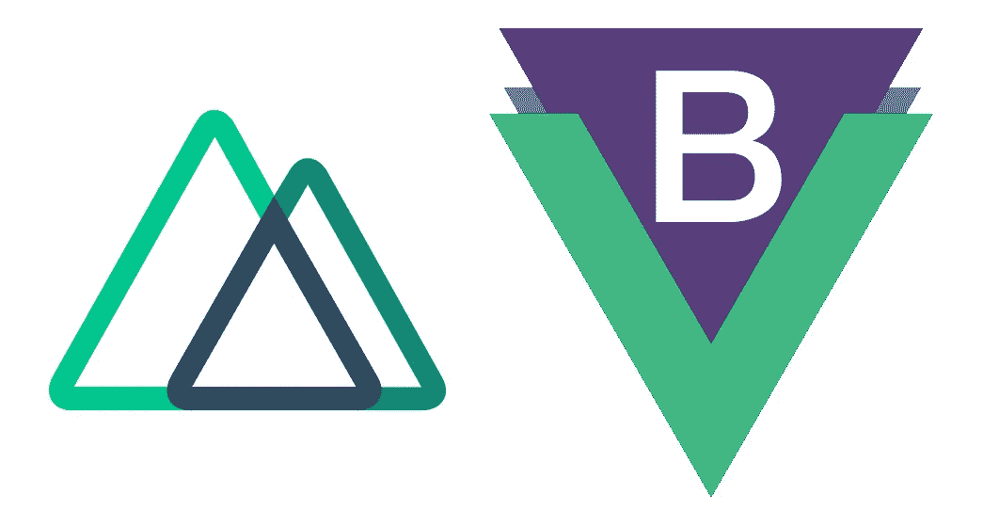

# 在 Nuxt 中自定义引导

> 原文：<https://javascript.plainenglish.io/customize-bootstrap-in-nuxt-3da863703b35?source=collection_archive---------1----------------------->

## 如何在 Nuxt 中添加 Bootstrap 并定制 SCSS……我希望我有一本指南。



Nuxt: [https://nuxtjs.org](https://nuxtjs.org) && Bootstrap-vue: [https://bootstrap-vue.js.org/](https://bootstrap-vue.js.org/)

TL；DR:
+npm 安装 bootstrap-vue
+nuxt.config.js>module . exports = { modules:['**bootstrap-vue/nuxt**']}
+NPM 安装 sass-loader
+npm 安装 node-sass
+将 sass-loader 规则添加到 nuxt.config.js(见下)
+停止 nuxt . config . js 中的 bootstrap 导入(见下)
+添加 css 属性:

# 介绍

我已经开始深入研究一个项目的 NuxtJS，其中一个关键因素是让 Bootstrap 与定制主题相集成。做这件事显然有正确的方法和错误的方法，我想确定最好的方法。我想我找到了，但不是没有一些额外的挖掘和混乱的事情。希望像我这样的其他人会发现这很有用。

# 基础知识:包括引导

这看起来是一个简单的问题，但是它并没有像在 JS 框架中那样灵活多样。我对如何包含 Bootstrap 的建议…将 Nuxt 模块用于 [Bootstrap-Vue](https://bootstrap-vue.js.org/) 。你可以在这里看到关于如何包含该模块的说明，但是当你开始添加自定义 SCSS 时就有点欠缺了。所以我的简写版是:
**安装 bootstrap-vue 依赖**

```
npm install bootstrap-vue
```

**在 nuxt.config.js 中包含 bootstrap 模块** 你的项目的根目录是 nuxt.config.js 文件。这定义了包含和配置信息。在***module . exports = { }***对象中，您需要将 bootstrap-vue 模块添加到 **modules** 数组中(如果您没有看到它，请创建它)，如下所示(…省略号表示其他可能的内容…不要包含它们…):

```
//nuxt.config.jsmodule.exports = {
...
  modules: ['**bootstrap-vue/nuxt**',...]
...
}
```

如果您需要的只是 bootstrap，那么现在您已经拥有了。你应该能够引用任何引导类。如果没有，请尝试重新启动服务器，以确保配置生效。

**如果你很好奇** 你也可以看到配置在哪里导入引用。转到~/。nuxt/app.js，在靠近顶部的地方你应该会看到一行类似于
***import 的内容..\ \ node _ modules \ \ bootstrap…\ \ bootstrap . CSS '*** 由我们包含在配置中的模块自动添加进来。如果那一行不存在，您可能有问题。

# 自定义 SCSS

第一部分非常简单，在 bootstrap-vue 文档中解释得很清楚。但是对于自定义 SCSS 的添加，有几个问题没有被很好地注意到。
**安装 SASS 处理**
开始包括自定义 SCSS，我们需要使用另一个情侣包。确保安装了这些组件:

```
npm install sass-loader
npm install node-sass
```

一旦安装了这些，您还需要包含使用它们的规则。返回到 **nuxt.config.js** 将以下规则插入到模块规则中(如果模块/规则属性不存在，则添加它们):

```
//nuxt.config.jsmodule.exports = {
...
module: {
    rules: [
        **{
           test: /\.s[ac]ss$/i,
           use: ['style-loader','css-loader','sass-loader',],
         },**
         ...    
    ],
},
...
}
```

**替换 CSS**
既然我们能够使用我们自己的 SCSS，我们可以停止由 bootstrap-vue 模块完成的包含。不是通过删除我们之前添加的引用，而是通过在我们的导出中添加另一个属性:

```
//nuxt.config.jsmodule.exports = {
  ...  
  modules: ['bootstrap-vue/nuxt',...],
 **bootstrapVue: {
    bootstrapCSS: false, 
    bootstrapVueCSS: false
  }**
  ...
}
```

我们删除了对编译后的引导 CSS 的引用，这样在编辑完 SCSS 变量后，我们可以用编译后的版本来替换它。在我们包含新版本之前，您可以在 App.js 中看到 Bootstrap 不再包含在内。
我们将把它替换为对自定义 SCSS 文件的引用，该文件在 nuxt.config.js 中用 CSS 属性配置，如下所示:

```
//nuxt.config.jsmodule.exports = {
  ...  
  css: [...,'@/assets/scss/custom.scss'],
  ...
}
```

这将在我们的 App.js 中添加一个导入引用文件的指令(将由 sass-loader 处理)。当然，为了使引用有用，该文件需要存在，并且在其中包含一些内容。因此，在引用的文件结构中创建 custom.scss 之后，应该向其中添加如下内容:

```
*// custom.scss*

*// All of your custom SCSS variables go first* $primary:       #7D61C8 ;
$secondary:     #ffffff ;
$light:         #f1f1f1 ;
$dark:          #000000 ;*//then bootstrap & bootstrap-vue should be added after 
//so that they inherit the custom SCSS variables* @import 'bootstrap/scss/bootstrap.scss';
@import 'bootstrap-vue/src/index.scss';

//all other custom scss files or css should be added here
```

您可以在“{ root } \ node _ modules \ bootstrap \ scss \ _ variables . scss”文件中找到要覆盖的所有不同变量。只要确保所有变量覆盖都在导入 bootstrap 之前。

这就是能够在 Nuxt 中使用 Bootstrap，同时轻松定制 SCSS 变量以满足您的需求所需的全部内容。

希望有帮助，继续编码；马库斯