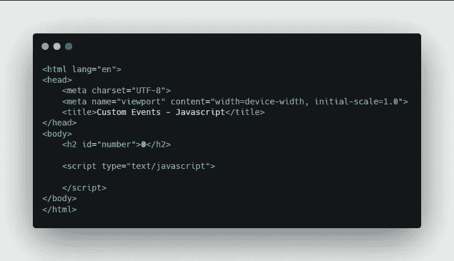
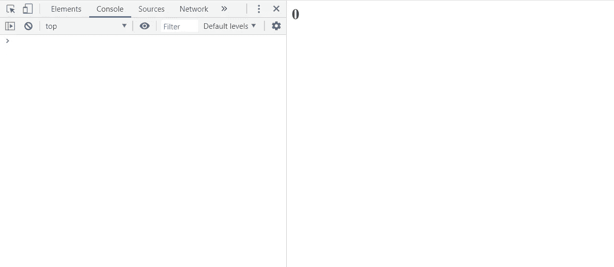
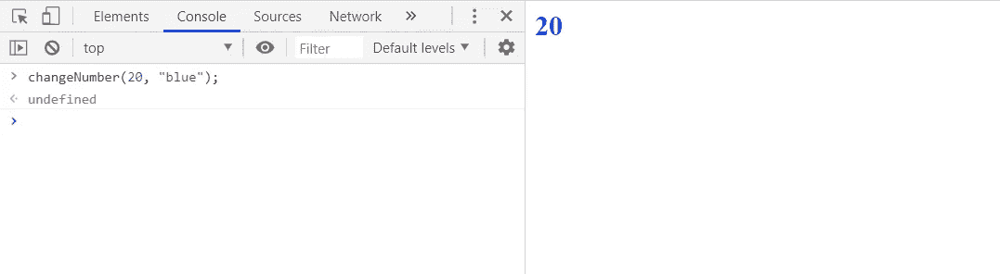
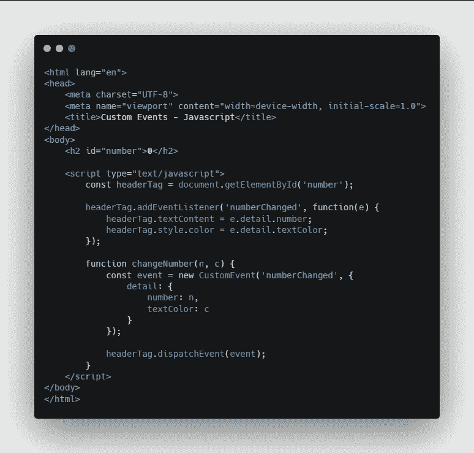

# JavaScript 中的自定义事件

> 原文：<https://javascript.plainenglish.io/customs-events-in-javascript-9189c1c24a8d?source=collection_archive---------8----------------------->

在 JavaScript 中触发您自己的自定义事件



这里我们有一个带有单个`h2` header 标签的网页，标签的 ID 为`number`，标签内有一个数字 0。

我们可以在浏览器中查看一下。



In the web browser

这里我们只能看到数字 0，仅此而已。所以我们要做的实际上是使用一个自定义事件来改变`h2`标题标签中文本的数量和颜色。

# 开始

首先，我们将进入脚本标记，并为 header 标记创建一个新的常量。

```
const headerTag = document.getElementById('number');
```

# 添加事件侦听器

然后，我们将添加事件侦听器— numberChanged。

```
headerTag.addEventListener('numberChanged', function(e) {
   headerTag.textContent = e.detail.number;
   headerTag.style.color = e.detail.textColor;
});
```

`numberChanged`是我们自己定义的自定义活动，我们将很快创建它。对于事件处理程序，我们创建一个函数，将 **e** 作为传入的事件对象。

# 创建事件

接下来，创建一个函数来创建事件并调度它。

```
function changeNumber(n, c) {
   const event = new CustomEvent('numberChanged', {
      detail: {
         number: n,
         textColor: c
      }
   });
   headerTag.dispatchEvent(event);
}
```

我们需要将 **n** 作为要改变的数字，将 **c** 作为颜色。然后，我们创建一个名为**事件**的新常数，它等于新的`CustomEvent`。这是一个真实的 JavaScript 类或对象，事件名为 **numberChanged** 。这将与上面的事件名称相匹配。

然后，我们要传递名为`detail`的事件对象。Detail 是自定义事件类附带的特定属性，它会将属性或额外数据传递给我们的事件处理程序。

这就是**事件**常量的全部内容，我们将调度该事件。

# 在 Web 控制台中测试

现在我们将调用 web 控制台中的函数。



End Result

如你所见，我们已经将文本中的数字改为 20，并将文本的颜色改为蓝色。

# 代码

这是上面演示的全部代码。



## **用简单英语写的 JavaScript 笔记**

我们已经推出了三种新的出版物！请关注我们的新出版物:[**AI in Plain English**](https://medium.com/ai-in-plain-english)[**UX in Plain English**](https://medium.com/ux-in-plain-english)[**Python in Plain English**](https://medium.com/python-in-plain-english)**——谢谢，继续学习！**

**我们也一直有兴趣帮助推广高质量的内容。如果您有一篇文章想要提交给我们的任何出版物，请发送电子邮件至[**submissions @ plain English . io**](mailto:submissions@plainenglish.io)**，使用您的 Medium 用户名，我们会将您添加为作者。另外，请让我们知道您想加入哪个/哪些出版物。****