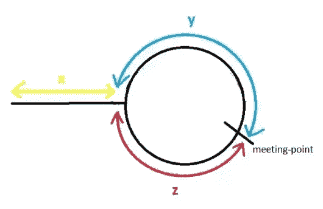
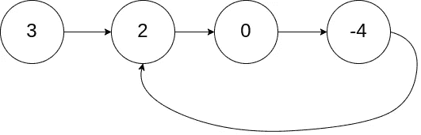
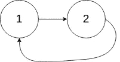
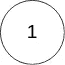

# JavaScript 中链表的循环检测

> 原文：<https://javascript.plainenglish.io/cycle-detection-in-javascrip-5173792a1ded?source=collection_archive---------8----------------------->

循环检测是在迭代函数值序列中寻找循环的算法问题，例如，经典的链表循环检测问题。有不同解决办法。对于下面的 [*Leetcode*](https://leetcode.com/problems/linked-list-cycle/) 例子，我来解释真解。



Example of Floyd’s algorithm

给定一个链表的头`head`，判断该链表中是否有循环。

如果链表中有某个节点可以通过继续跟随`next`指针再次到达，那么链表中就存在循环。在内部，`pos`用来表示 tail 的`next`指针所连接的节点的索引。**注意** `**pos**` **没有作为参数**传递。

如果链表中有循环，则返回`true` *。否则，返回`false`。*

```
**Example 1:** **Input:** head = [3,2,0,-4], pos = 1
**Output:** true
**Explanation:** There is a cycle in the linked list, where the tail connects to the 1st node (0-indexed).
```



Example 1

```
**Example 2:****Input:** head = [1,2], pos = 0
**Output:** true
**Explanation:** There is a cycle in the linked list, where the tail connects to the 0th node.
```



Example 2

```
**Example 3:****Input:** head = [1], pos = -1
**Output:** false
**Explanation:** There is no cycle in the linked list.
```



Example 3

*约束:*

*   列表中的节点数量在范围`[0, 104]`内。
*   `-105 <= Node.val <= 105`
*   `pos`是链表中的`-1`或**有效索引**。

***方案一:哈希***

1.  遍历给定的链表并将节点存储在 Set()对象中以避免重复值
2.  如果出现重复，链表就是一个循环，函数返回`true`
3.  遍历后，如果没有找到重复的节点，函数返回`false`

[https://gist.github.com/GAierken/226126a8998ed219de9921aa5cf0c195](https://gist.github.com/GAierken/226126a8998ed219de9921aa5cf0c195)

时间复杂度: **O(n)。**只需要遍历一次链表。

空间复杂度: **O(n)。n** 是集合()中存储节点所需的空间。

***解法二:弗洛伊德龟兔赛跑算法***

1.  用两个指针遍历给定的列表
2.  慢速指针移动一位，快速指针移动两位
3.  如果两个指针相遇，返回`true`，否则返回`false`

[https://gist.github.com/GAierken/5e66d1fbf3e4c5b7adf367520e46004f](https://gist.github.com/GAierken/5e66d1fbf3e4c5b7adf367520e46004f)

时间复杂度: **O(n)。**只需要遍历一次链表。

空间复杂度: **O(1)。不需要空格，它是常数。**

***资源:***

[](https://leetcode.com/problems/linked-list-cycle/) [## 链表循环- LeetCode

### 给定一个链表，确定其中是否有循环。为了在给定的链表中表示一个循环，我们使用一个…

leetcode.com](https://leetcode.com/problems/linked-list-cycle/) [](https://en.wikipedia.org/wiki/Cycle_detection) [## 循环检测

### 在计算机科学中，循环检测或循环寻找是在一系列循环中寻找循环的算法问题

en.wikipedia.org](https://en.wikipedia.org/wiki/Cycle_detection) [](https://www.geeksforgeeks.org/detect-loop-in-a-linked-list/) [## 检测链表中的循环

### 给定一个链表，检查该链表是否有循环。下图显示了一个带有循环的链表。跟随…

www.geeksforgeeks.org](https://www.geeksforgeeks.org/detect-loop-in-a-linked-list/)